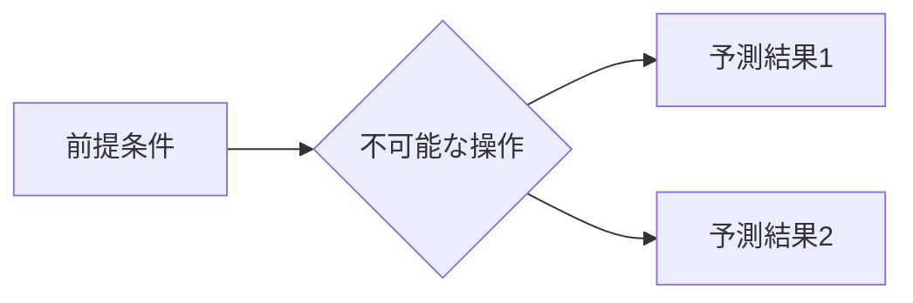

# WhatIfImpossible — 開発者ガイド

> 執筆・開発者向けのセットアップ・運用ガイドです。
> コンテンツを読む場合は [README.md](README.md) をご覧ください。

---

## コンセプト

「もし不可能なことが起こったら？」という問いを軸に、現代科学の限界を超えた思考実験をまとめるプロジェクトです。
記事はMarkdownで管理し、GitHubをバックエンドとして公開・共有します。

---

## プロジェクト構成

```
WhatIfImpossible/
├── README.md
├── DEVELOPMENT.md
├── generate-readme.js       ← README自動生成スクリプト（pre-commit hookで自動実行）
├── .gitignore
├── docs/                    ← 記事コンテンツ（Markdown）
│   ├── README.md            ← 全記事インデックス（自動生成）
│   ├── _template.md         ← 新規記事のひな形
│   ├── notes/               ← 補遺・世界観設定メモ
│   │   └── README.md        ← 補遺一覧（自動生成）
│   ├── cosmology/           ← 宇宙・時空間・相対論・FTL系
│   ├── physics/             ← 素粒子・力・エネルギー系
│   ├── quantum/             ← 量子力学・量子情報系
│   ├── logic/               ← 論理・パラドックス系
│   ├── philosophy/          ← 意識・自由意志・存在論
│   └── biology/             ← 生命・進化系
├── glossary/                ← 用語集
│   ├── README.md            ← 用語集インデックス
│   ├── data/
│   │   └── terms.jsonl      ← 用語データ（ソース）
│   ├── generate.js          ← .md ファイル生成スクリプト
│   ├── astronomy.md
│   ├── physics.md
│   ├── philosophy.md
│   ├── biology.md
│   └── sf-concepts.md
└── editor/                  ← ローカル編集サーバー（port 3030）
    ├── package.json
    ├── server.js
    ├── reboot.cmd            ← 起動・再起動スクリプト（Windows）
    └── public/
        └── index.html
```

---

## ローカル編集サーバーの起動

### 必要環境

- Node.js v20 以上（推奨: v22 LTS）

### 初回セットアップ

```bash
cd editor
npm install
```

### 起動（Windows）

`editor/reboot.cmd` をダブルクリック、または：

```bash
cd editor
node server.js
# → http://localhost:3030
```

`reboot.cmd` は起動中のサーバーを停止してから再起動するため、コード変更後の再起動にも使えます。

---

## エディターの使い方

### 記事

| 操作 | 方法 |
|------|------|
| 記事を開く | 左サイドバーの記事一覧をクリック |
| 記事を保存 | `Ctrl + S` またはツールバーの「保存」ボタン |
| 新規記事 | 右上の「＋ 新規記事」ボタン |
| 表示切替 | 「編集 / 分割 / プレビュー」タブ |
| 記事を検索 | サイドバー上部の検索ボックス |
| GitHubに反映 | 下部パネルにメッセージを入力して「Commit & Push」 |

### 用語集

| 操作 | 方法 |
|------|------|
| カテゴリ表示 | 左サイドバーの「用語集」タブ → カテゴリ名をクリックで展開 |
| 用語を閲覧 | 用語名をクリック → 右ペインにプレビュー表示 |
| 用語を編集 | 「編集」ボタン → フォームで編集 → 保存 |
| 新規用語 | 「＋ 新規用語」ボタン |
| 用語を検索 | 検索ボックスに名前・読み・英語名を入力 |

---

## Claude Code スキルで書く（推奨）

Claude Code を使っている場合、スキルコマンドで記事・用語を半自動で追加できます。

### 記事を書く

```
量子テレポーテーションで意識を転送できたら /write-article
```

Claude がタイトルから内容を判断し、frontmatter・構成・本文・Mermaidダイアグラムを含む記事を生成して `docs/` に保存、`docs/README.md` のインデックスも自動更新します。

### 用語を追加する

```
量子テレポーテーション /add-glossary-term
```

Claude が内容を調べてカテゴリ・説明文・関連用語を判断し、`glossary/data/terms.jsonl` に追記して全カテゴリの `.md` を再生成します。詳細な手順は [glossary/HOW_TO_USE.md](glossary/HOW_TO_USE.md) を参照してください。

---

## 記事の書き方

記事は `docs/` 以下にMarkdownファイル（`.md`）として配置します。
`_template.md` をコピーして使うか、エディターの「＋ 新規記事」から作成してください。

### frontmatter

各記事の先頭にYAMLで管理情報を記述します：

```yaml
---
title: 光速を超えた場合の因果律
id: wiim_001
category: physics
tags: [相対性理論, 因果律, タキオン]
date: 2026-01-01
---
```

### 通し番号のルール

| 番号 | 意味 |
|------|------|
| `wiim_001` | 1番目の記事 |
| `wiim_002` | 2番目の記事 |
| ... | |

### 数式（KaTeX）

インライン: `$E = mc^2$`

ブロック:
```
$$
\Delta x \cdot \Delta p \geq \frac{\hbar}{2}
$$
```

### 図（Mermaid）

````

````

---

## GitHubへの公開フロー

1. エディターで記事を執筆・保存
2. 下部パネルでコミットメッセージを入力
3. 「Commit & Push」ボタンをクリック
4. GitHub上でPRを作成 → レビュー → マージで公開

> 初回のみ `git remote add origin <your-repo-url>` が必要です。

---

## ポートについて

このプロジェクトはポート **3030** を使用します（デフォルト3000 + プロジェクト番号×10）。
変更する場合は環境変数で指定できます：

```bash
PORT=3035 npm start
```

---

## LAN内アクセス

`server.js` は `0.0.0.0` でリッスンするため、同一LAN内の他端末からもアクセスできます。

```
http://<このマシンのIPアドレス>:3030
```

IPアドレスは `ipconfig`（Windows）で確認してください（「IPv4 アドレス」の行）。

> **注意:** Windowsファイアウォールでポート3030の受信が許可されていない場合は、受信規則を追加してください。
> 設定場所: Windows Defender ファイアウォール → 受信の規則 → 新しい規則 → ポート → TCP 3030
