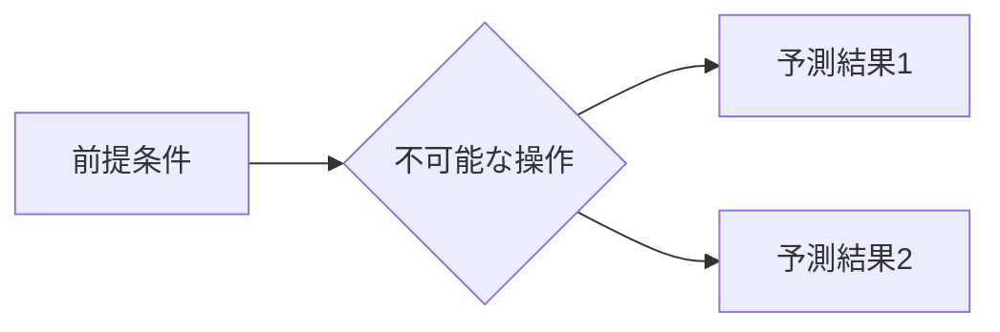

# WhatIfImpossible

> 現代科学では実現不可能な思考実験を集めるサイト

---

## コンセプト

「もし不可能なことが起こったら？」という問いを軸に、現代科学の限界を超えた思考実験をまとめるプロジェクトです。
記事はMarkdownで管理し、GitHubをバックエンドとして公開・共有します。

---

## プロジェクト構成

```
WhatIfImpossible/
├── README.md
├── .gitignore
├── editor/                  ← ローカル編集サーバー
│   ├── package.json
│   ├── server.js
│   └── public/
│       └── index.html
└── docs/                    ← 記事コンテンツ（Markdown）
    ├── _template.md         ← 新規記事のひな形
    ├── physics/             ← カテゴリ別フォルダ
    ├── logic/
    └── philosophy/
```

---

## ローカル編集サーバーの起動

### 必要環境

- Node.js v20 以上（推奨: v22 LTS）
- nvm-windows でのバージョン管理を推奨

### 初回セットアップ

```bash
cd editor
npm install
```

### 起動

```bash
npm start
# → http://localhost:3030
```

開発中（ファイル変更で自動再起動）:

```bash
npm run dev
```

---

## エディターの使い方

| 操作 | 方法 |
|------|------|
| 記事を開く | 左サイドバーの記事一覧をクリック |
| 記事を保存 | `Ctrl + S` またはツールバーの「保存」ボタン |
| 新規記事 | 右上の「＋ 新規記事」ボタン |
| 表示切替 | 「編集 / 分割 / プレビュー」タブ |
| 記事を検索 | サイドバー上部の検索ボックス |
| GitHubに反映 | 下部パネルにメッセージを入力して「Commit & Push」 |

---

## 記事の書き方

記事は `docs/` 以下にMarkdownファイル（`.md`）として配置します。
`_template.md` をコピーして使うか、エディターの「＋ 新規記事」から作成してください。

### frontmatter

各記事の先頭にYAMLで管理情報を記述します：

```yaml
---
title: 光速を超えた場合の因果律
id: wiim_001
category: physics
tags: [相対性理論, 因果律, タキオン]
date: 2026-01-01
---
```

### 通し番号のルール

| 番号 | 意味 |
|------|------|
| `wiim_001` | 1番目の記事 |
| `wiim_002` | 2番目の記事 |
| ... | |

### 数式（KaTeX）

インライン: `$E = mc^2$`

ブロック:
```
$$
\Delta x \cdot \Delta p \geq \frac{\hbar}{2}
$$
```

### 図（Mermaid）

````

````

---

## GitHubへの公開フロー

1. エディターで記事を執筆・保存
2. 下部パネルでコミットメッセージを入力
3. 「Commit & Push」ボタンをクリック
4. GitHub上でPRを作成 → レビュー → マージで公開

> 初回のみ `git remote add origin <your-repo-url>` が必要です。

---

## ポートについて

このプロジェクトはポート **3030** を使用します（デフォルト3000 + プロジェクト番号×10）。
変更する場合は環境変数で指定できます：

```bash
PORT=3035 npm start
```
