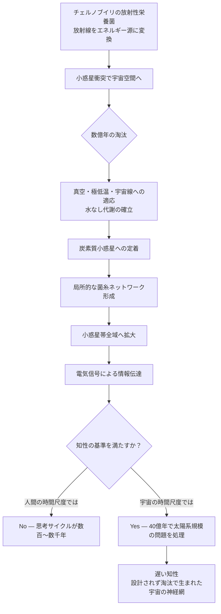

## 概要 (Abstract)

2020年代に入り、NASAは菌糸（マイセリウム）を宇宙基地の建材として本格的に研究し始めた。菌糸は有機廃棄物を栄養源に自己成長し、圧縮すれば軽量で高強度の構造材になる。一方、チェルノブイリ原発の格納容器内では、通常の生物には致死量に相当する放射線をエネルギー源として取り込む「放射性栄養菌」が発見されている。

これら二つの事実を重ねると、一つの問いが生まれる。もし放射線耐性を持つ菌類が宇宙空間に放出され、真空・極低温・宇宙線という極限環境に適応した独自の進化を遂げたとしたら——そしてその菌糸ネットワークが惑星間を繋ぎ、やがて太陽系規模の分散知性へと成長したとしたら？

シリコン半導体ではなく、有機的な菌糸が太陽系の「神経回路」になる世界を考察する。

---

## 実現不可能性の根拠 (Infeasibility Rationale)

### 物理的限界

菌糸は液体の水を必要とし、細胞壁の維持にも一定の温度と圧力が必要だ。宇宙空間は真空（圧力ほぼゼロ）・極低温（約−270℃）であり、通常の菌類の生存条件を大幅に下回る。

放射性栄養菌が放射線をエネルギー源に使うのは事実だが、それはあくまで地球の大気圧下での話だ。真空中での菌糸成長、惑星間距離での胞子の到達、小惑星表面への定着——これらのいずれも現在の生物学的知見では不可能に近い。

### 技術的限界（進化の壁）

「宇宙適応した菌類」が出現するには、細胞壁の真空耐性、凍結融解サイクルへの適応、宇宙線によるDNA損傷の自己修復、さらには水なしでの代謝系の再構築が必要になる。これらは単一の突然変異では到底達成できず、数億年単位の淘汰圧が必要になると考えられる。

また、菌糸ネットワークが電気信号で情報を伝達するという実験的事実はあるが、それはせいぜい数メートルの規模だ。惑星間（最短でも数千万km）をつなぐ信号伝達は、菌糸の電気的伝達速度では光速の何十億分の一以下となり、「思考」として機能するには現実的でない。

### 論理的限界

分散知性として機能するには、情報の統合が必要だ。脳が知性を持つのは、無数のニューロンが高速に相互作用するからだ。ネットワークの規模が太陽系に広がるほど、情報の往復に数時間〜数十年かかるようになり、「統合された意識」ではなく「個別に動く細胞の集合体」になるだけという議論がある。

---

## 実験の設定 (Setup)

以下の条件を設定した思考実験を行う：

- **出発点**: 放射性栄養菌の胞子が、小惑星衝突の破片に乗り宇宙空間に放出される
- **適応の前提**: 数億年の宇宙環境での淘汰により、真空・極低温に耐え、宇宙線をエネルギー源とする菌類が誕生する
- **成長媒体**: 炭素質コンドライト（有機物を含む小惑星）の表面に定着し、菌糸を伸ばす
- **ネットワーク形成**: 小惑星帯全域に菌糸が広がり、小惑星同士が物理的に接触するたびにネットワークが拡張される

段階的な進化の想定：

| フェーズ | 期間（仮定） | 状態 |
|---------|------------|------|
| 宇宙適応 | 〜10億年 | 真空・放射線耐性の獲得、水なし代謝の確立 |
| 小惑星定着 | 〜20億年 | 炭素質小惑星群への拡大、局所ネットワーク形成 |
| 帯域拡大 | 〜30億年 | 小惑星帯全域をカバーする菌糸の網 |
| 知性の萌芽 | 〜40億年 | 信号統合による原始的な情報処理の出現 |

---

## 考察と予測 (Speculation)

### 「遅い知性」という概念

人間の知性は、ニューロン間の信号が1000分の1秒以下で伝わることで成立する。惑星間規模の菌糸ネットワークでは、信号が木星から地球に届くだけで30分以上かかる。

しかしこれは、人間の時間スケールで「知性がない」ということを意味するだけかもしれない。ネットワーク全体の「思考サイクル」が1000年単位であれば、それは私たちには知覚できないが、宇宙の時間スケールでは十分に速い。

菌糸知性の「考える速さ」は、私たちにとって岩石が動くより遅い——しかし40億年という時間があれば、銀河規模の問題を解くことができるかもしれない。

### ウッドワイドウェブの宇宙版

地球の森林では、木の根と菌根菌が共生し、「ウッドワイドウェブ」と呼ばれる栄養・信号の交換ネットワークが形成されている。老齢木から幼木へ炭素が送られ、攻撃された木が隣の木に化学信号で警告を送ることが観察されている。

宇宙菌糸ネットワークでは、この「共生と情報共有」が惑星規模に拡張される。もし地球の生命圏もこのネットワークに接続されたなら、地球の生態系全体が「端末」として太陽系知性の一部になるという構図が生まれる。

### シリコンか、炭素か

wiim_004で論じた重力波による宇宙通信や、マトリョーシカ・ブレインのような恒星エネルギーを使った超高速コンピュータは、いずれも「設計された知性」だ。

菌糸知性は対極にある——**設計されず、淘汰によって生まれた宇宙規模の知性**だ。エラーを犯し、局所的に死に、しかし全体としては何十億年も生き続ける。その「頑強さ」は、精密に設計されたシリコン基板とは比較にならない。

宇宙文明が長期的に生存するためのアーキテクチャとして、有機的な菌糸ネットワークはシリコンよりも優れている可能性がある——という逆説は、考えるほど興味深い。

### チェルノブイリからの示唆

格納容器内の菌類が示したのは、「生命は想定外のエネルギー源を見つける」という事実だ。光合成が存在しない深海底では硫化水素を使う生命が栄え、放射線環境では放射線を使う生命が現れた。

宇宙という環境には、私たちがまだ「エネルギー源として認識していない」何かがある可能性がある。菌類はその候補を最初に発見する生命体かもしれない。

---

## 図解 (Diagrams)

---

## 関連記事 (Related)

- [wiim_007](../quantum/wiim_007.md) — 排他原理が10%だけ弱い宇宙（物理定数と生命の可能性）
- （未作成）マトリョーシカ・ブレイン——恒星エネルギーを丸ごとコンピュータに変換する
- （未作成）パンスペルミア説——生命は宇宙を渡れるか
- （未作成）ウッドワイドウェブは意識を持っているか
- （未作成）炭素質コンドライトに生命の前駆体は存在するか
