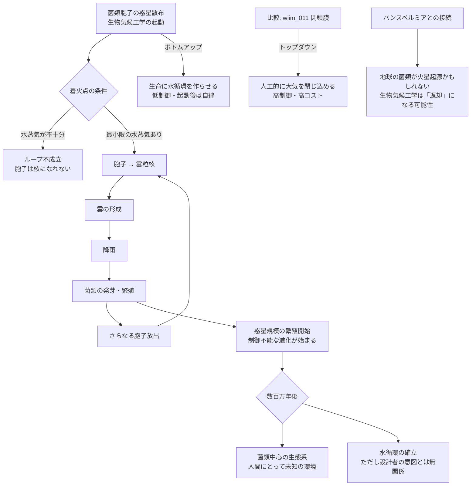

## 概要 (Abstract)

雨粒は、空中を漂う微粒子——雲粒核——を中心に水蒸気が凝結して生まれる。長らく砂塵や海塩が主成分と考えられてきたが、近年の研究で菌類の胞子・バクテリア・花粉といった生物粒子が極めて効率的な雲粒核として機能することが確認された。特に菌類の胞子は氷晶核としての性能が高く、地球の降雨システムにおいて無視できない役割を担っている可能性がある。

さらに興味深いのは、このループの閉じた構造だ——菌類は胞子を放出し、胞子は雲核となって雨を呼び、雨は菌類を拡散・繁殖させ、繁殖した菌類はさらに胞子を放出する。これは生命が気候を利用し、気候が生命を拡散させる自己強化サイクルだ。

この思考実験は問う。**そのループを、水循環の存在しない乾燥惑星で人工的に「起動」できるか。** 菌類胞子を惑星に大量散布し、最小限の水蒸気を与えることで連鎖を始動させる——生命自身に惑星の水循環を作らせる「生物気候工学」の可能性を探る。

---

## 実現不可能性の根拠 (Infeasibility Rationale)

### 物理的限界

雲粒核がどれだけ優秀でも、凝結させる水蒸気がなければ雨は降らない。火星の大気圧は地球の約1%で、水蒸気量は極めて微量だ。現在の火星では、仮に胞子が完璧な雲核として機能しても、形成される雲は薄く、地表に届くほどの降雨にはならない。

ループを起動させるには「着火点」として最低限の水蒸気が必要だ。彗星衝突・極冠の氷の昇華・初期的な工学介入（太陽反射鏡による温暖化など）なしには、菌類だけでは連鎖は回り始めない。水蒸気と菌類の双方が同時に揃わなければ、それぞれ単独では何も起きない——これは「卵と鶏」の問題だ。

### 技術的限界

火星表面は既知の菌類にとって致命的な環境が重なる。

まず強烈な紫外線だ。火星には地球のようなオゾン層がなく、表面に届く紫外線は地球の数百倍に達する。次に過酸化物に富む表面土壌で、強力な酸化剤が有機物を破壊する。さらに大気圧が低すぎて、胞子の細胞壁を通じた浸透圧調節が機能しない。

地球で最も過酷な環境に生きる極限環境微生物——南極の岩石内部、高放射線環境のチェルノブイリ、深海熱水噴出孔——でさえ、火星表面の複合的なストレスには対応できない可能性が高い。胞子が惑星間を生きて渡る「パンスペルミア」がもし実現しているとすれば、それは遮蔽物（隕石の内部など）に守られた形での輸送に限られると考えられる。

### 論理的限界

最も根本的な問題は制御不能性だ。

ひとたび菌類が惑星規模で繁殖を始め、気候システムを動かし始めると、その後の進化は誰にも制御できない。数万年で菌類は新しい惑星環境に適応し、百万年単位では全く予測できない生態系が生まれる。それは人間が設計した「テラフォーミング」ではなく、**生命への惑星の委譲**だ。

「菌類で火星をテラフォームする」という計画は、実質的に「火星を菌類の惑星にする」ことを意味する。後から人間が移住しようとしても、その菌類生態系が人間にとって友好的かどうかは保証されない。生物気候工学の最大のリスクは、起動スイッチはあっても停止スイッチがないことだ。

---

## 実験の設定 (Setup)

テラフォーミングの方法論を比較する：

| アプローチ | 手段 | 方向性 | 制御性 | 関連記事 |
|-----------|------|--------|--------|---------|
| **生物気候工学（この記事）** | 菌類胞子の散布 | ボトムアップ（生命が自律的に構築） | 低い（進化・適応が予測不能） | — |
| 閉鎖膜テラフォーミング | 惑星を膜で包む | トップダウン（人工的に大気を閉じ込める） | 高い（設計通りに動く） | wiim_011 |
| 物理的加熱 | 太陽反射鏡・核融合 | トップダウン（環境を強制変更） | 中程度 | — |
| 磁場再生 | 人工磁場発生装置 | トップダウン（大気散逸を防ぐ） | 高い | — |

生物気候工学の本質的な特徴は「**生命を道具として使うが、生命は道具に留まらない**」点だ。他のアプローチは物理・工学的に完結するが、生物を使う瞬間にシステムが自律的な進化を始める。

---

## 考察と予測 (Speculation)

### 着火点——最初の一雨

連鎖が始まる瞬間を想像してみよう。

乾燥した赤い惑星の大気上層に、人工衛星から無数の胞子が散布される。胞子は惑星規模に拡散し、大気中の微量な水蒸気を核に集め始める。最初の雲が形成されるのは散布から数十年後かもしれない——極めて薄く、地表には届かない霧雨程度の降水だ。しかしその霧雨が土壌の表面を湿らせ、地下の氷を数ミリ溶かす。そこに降り積もった胞子が発芽する。

最初の菌類コロニーは数センチ四方かもしれない。しかしそれが胞子を放出し、次の雲を呼ぶ。次の雨が降り、次のコロニーが生まれる。このサイクルが何千年も繰り返された後、最初に散布した工学者の文明は存在しないかもしれないが、惑星の気候は静かに変わり続けている。

### 胞子の惑星間旅行——パンスペルミアとの接続

地球の胞子はすでに成層圏（高度15〜50km）に到達することが観測されており、ごく微量ながら宇宙空間との境界に近い領域に浮遊している。火星への距離は最接近時で約5500万km——これを胞子が自然に渡るには、隕石の衝突による飛散と長期宇宙旅行に耐える耐性が必要だ。

しかし逆の可能性も考えられる。もし火星に過去生命が存在し、その胞子が地球に届いたとしたら——地球の菌類の一部は、もともと火星起源なのかもしれない。生物気候工学は「返却」になるかもしれない。この可能性はSFではなく、真剣に議論されているパンスペルミア仮説の一変形だ。

### 菌類が作る惑星 vs 人間が作る惑星

生物気候工学の最終的な問いは倫理的だ。

「火星を人間が住める惑星にする」という目標のためにテラフォーミングを始めたとして、その手段として菌類を解き放った場合、数百万年後の「菌類の惑星」を人間が引き継ぐ権利があるのか。

火星に現在微生物が存在する可能性が排除されていない以上、外来の菌類を持ち込むことは惑星ネイティブの生命への侵略になりうる。さらに、菌類が作り上げた生態系は菌類中心に最適化されており、後から来る人間にとって都合の良い環境とは限らない。

「生命を使って惑星を改造する」行為は、「どの生命のための惑星か」という問いを避けられない。テラフォーミングは常に「誰かのフォーミング」だ——その「誰か」が人間ではなく菌類になる可能性を、生物気候工学は最初から内包している。

---

## 図解 (Diagrams)

---

## 関連記事 (Related)

- [wiim_008](wiim_008.md) — 菌糸ネットワークが宇宙空間で分散知性に進化したら（菌類の宇宙進出・分散知性という共通テーマ）
- [wiim_011](../physics/wiim_011.md) — 真空中に閉鎖膜を作る（テラフォーミングの対極的アプローチ。トップダウン vs ボトムアップ）
- （未作成）パンスペルミアは実際に起きたか——地球生命の火星起源説
- （未作成）地球の気候は生命なしに安定するか——ガイア仮説の極限
- （未作成）極限環境微生物を宇宙で育てる——最初のコロニーはどう設計するか
- （未作成）テラフォーミングの倫理——改造する権利は誰にあるか
- [wiim_019](../physics/wiim_019.md) — 居住しない惑星——エネルギー用途のテラフォーミング
- [wiim_018](wiim_018.md) — 胞子の宇宙——金星・タイタン・氷衛星への生物気候工学
- [wiim_024](wiim_024.md) — マイコプラズマギカ——最小生命体による生物的核変換が可能な世界
- [wiim_025](wiim_025.md) — シェルマイセリウム——コスモシェルとコズミックマイスの共生が生む自律型宇宙生命体カプセル
- [wiim_026](wiim_026.md) — コズミックマイスのテラフォーミング——シェルマイセリウムの大気圏降下と惑星統合
- [wiim_025_atmospheric_entry](../notes/wiim_025_atmospheric_entry.md) — 補遺: シェルマイセリウムの大気圏突入——テラフォーミングへの経路

