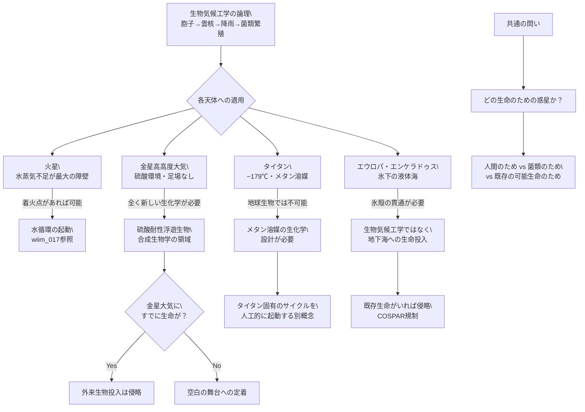

## 概要 (Abstract)

wiim_017（胞子雨——菌類による惑星水循環の起動）では、火星を対象に菌類の胞子を雲粒核として利用し、水循環を生命自身に構築させる「生物気候工学」を検討した。だが太陽系には、火星よりはるかに興味深い——あるいははるかに奇妙な——候補が存在する。

この記事は問う。**生物気候工学の論理を、金星・タイタン・エウロパ・エンケラドゥスに適用するとどうなるか。** それぞれの天体は「水がない乾燥惑星」とは全く異なる環境を持つ。ある天体では大気が問題ではなく、大気こそが唯一の生息域になる。ある衛星では水は豊富だが、生命が活動できる形で存在しない。

同じ「生命に惑星を改造させる」というアプローチが、環境ごとにどれほど異なる形をとるか——そしてどこに根本的な不可能性が潜むかを探る。

---

## 実現不可能性の根拠 (Infeasibility Rationale)

### 物理的限界

各天体には固有の物理的障壁がある。

**金星**：地表は約465℃、気圧は地球の90倍で硫酸雲が厚く覆う。地表への生命定着は不可能だ。しかし高度50kmの大気は温度20〜70℃、気圧0.5〜2気圧と地球の低山に近い環境になる。問題はここが「浮遊環境」であることだ——固体の足場がなく、大気の循環が速いため、生命は絶えず落下・上昇のサイクルにさらされる。雲粒核として機能する胞子が大気中に留まり続けるには、大気の熱対流サイクルに同期した繁殖戦略が必要だ。また金星大気の硫酸液滴は強力な酸化剤であり、通常の生体分子を急速に破壊する。

**タイタン**：土星の衛星タイタンは濃厚な窒素大気（地表気圧は地球の1.5倍）と−179℃の液体メタン・エタンの湖を持つ。液体の「溶媒」が存在するという点で、化学的に最も豊かな環境の一つだ。しかし液体メタンは水とは根本的に異なる溶媒であり、水ベースの生化学は機能しない。メタンを溶媒に使う全く異なる生化学が必要で、地球の菌類を持ち込んでも意味がない。

**エウロパ・エンケラドゥス**：表面を厚い氷が覆い、地下に液体の海がある。エンケラドゥスは間欠泉として内部の水を宇宙に噴出しており、液体水の存在が直接確認されている。生命の候補地として最有力だが、菌類胞子を「大気に散布して雲核にする」という生物気候工学の論理は成立しない——大気がないか、あっても薄すぎる。

### 技術的限界

地球から各天体まで投入できる胞子の量は、惑星規模で変化を起こすには桁違いに少ない。金星への大気投入には高速で硫酸大気を通過するデリバリー機構が必要で、タイタンへの投入は冷却された格納容器で−179℃の環境に適応した生物を送り届けなければならない。現在の技術ではいずれも単純な散布は不可能だ。

惑星保護の観点からも問題がある。エウロパやエンケラドゥスは現存生命の可能性が最も高い天体であり、外来の菌類を意図的に投入することはCOSPAR（宇宙空間研究委員会）のカテゴリIV規制に違反する——現在の国際合意では汚染防止が最優先とされる。

### 論理的限界

火星の生物気候工学は「水循環を作る」という目標が明確だった。しかし金星では「硫酸大気を生命が利用できる形に変換する」という、はるかに複雑な目標が必要だ。生命は環境を利用するが、環境を「設計通りに」書き換えはしない——生命が金星大気を変え始めたとき、それがより住みやすくなる保証はどこにもない。

タイタンではそもそも「目標とすべき状態」が不明確だ。液体メタン湖を持つタイタンを「人間が住める環境」にするには、大気・溶媒・温度の全てを変える必要があり、それは生物気候工学の域を超える。

---

## 実験の設定 (Setup)

各天体への生物気候工学アプローチを比較する：

| 天体 | 主な環境 | 生物気候工学の論理 | 最大の障壁 | 可能性評価 |
|-----|---------|-----------------|----------|----------|
| **火星**（wiim_017）| 乾燥・低気圧・強UV | 胞子→雲核→降雨ループ | 水蒸気の絶対量不足 | △（着火点があれば） |
| **金星（高高度）** | 50km：温度・気圧は適切、硫酸雲 | 硫酸耐性生物が大気中を漂流・雲核として機能 | 硫酸環境・足場なし | △（全く新しい生物が必要） |
| **タイタン** | −179℃・メタン湖・濃厚大気 | メタン溶媒の生化学サイクルを構築 | 水ベース生化学の無効 | ✗（地球生物では不可能） |
| **エウロパ** | 氷下の液体海・木星放射線 | 地下海への生命投入 | 氷殻の貫通・汚染問題 | ✗（生物気候工学とは別の概念） |
| **エンケラドゥス** | 間欠泉・液体海・有機分子確認済み | 間欠泉経由で大気に胞子放出 | 大気が実質ない・汚染問題 | ✗（既存生命への侵略リスク） |

---

## 考察と予測 (Speculation)

### 金星大気——最も奇妙な可能性

金星の高高度大気は「空飛ぶ生態系」の舞台になりうる唯一の環境かもしれない。

2020年に発表された金星大気中のホスフィン（リン化水素）検出報告は後に論争になったが、「金星大気に生命の痕跡がある可能性」は完全には否定されていない。もし金星大気に生命が存在するとすれば、それは水ではなく硫酸液滴を「水」として利用する、全く異なる生化学を持つものだろう。

生物気候工学の文脈では、この可能性は逆転した問いを生む。外来の菌類を送り込む前に、**金星大気にすでに何かがいるかもしれない**。もし存在するなら、外来生物の投入は侵略だ。もし存在しないなら、金星大気は生命が定着できる可能性を持つ空白の舞台だ。

硫酸耐性を持つ微生物は地球にも存在する——硫黄鉱山や熱水噴出孔に生きる極限環境微生物だ。ただし「硫酸液滴の中で浮遊しながら繁殖する」という追加条件は、既知の生物には達成できない。金星向けの生物気候工学は「生物を送る」のではなく「生物を金星用に設計する」合成生物学の領域に入る。

### タイタン——メタン生命の可能性

タイタンで生物気候工学が意味を持つとすれば、それは「地球の菌類を持ち込む」のではなく「タイタンに固有の生化学サイクルを意図的に起動する」という別のアプローチだ。

タイタンの大気にはシアン化水素（HCN）やアセチレンなどの有機分子が豊富に存在する。理論上、これらを酸化剤として利用し液体メタンを溶媒とする生化学が可能とする研究者がいる。もしそのような生化学が「設計可能」であれば、人工的に起動したメタン生命がタイタンの炭素サイクルを変えていくシナリオは排除できない。

これは火星の「水循環を作る」から「メタンサイクルを変える」への転換だ。目標がないわけではないが、到達点が人間に有益かどうかは保証されない。

### エンケラドゥス——最も危険な介入

エンケラドゥスは生物気候工学の論理からは外れるが、思考実験として最も倫理的に鋭い天体だ。

間欠泉が内部海の有機分子・塩・水素を宇宙に噴出していることは確認されている。水素の存在は化学エネルギーの供給源を示唆し、地球の深海熱水噴出孔と類似した環境が示唆される。もし内部海に生命が存在するなら、エンケラドゥスは人類が接触した最初の「他の生命圏」になりうる。

その環境に外来の地球生命を意図的に投入することは、宇宙生物学的な倫理の限界を超える問いを提起する。生物気候工学は「生命を道具として使う」が、既存の生命圏への介入はその生命圏を破壊する可能性がある。**「生命を使ってより多くの生命を作る」工学は、「既存の生命を消すことで人間に都合の良い生命を作る」工学と紙一重だ。**

---

## 図解 (Diagrams)

---

## 関連記事 (Related)

- [wiim_017](wiim_017.md) — 胞子雨——菌類による惑星水循環の起動（本記事の前提。火星への生物気候工学）
- [wiim_008](wiim_008.md) — 菌糸ネットワークが宇宙空間で分散知性に進化したら（菌類の宇宙進出という共通テーマ）
- [wiim_011](../physics/wiim_011.md) — 真空中に閉鎖膜を作る（テラフォーミングのトップダウンアプローチとの対比）
- [wiim_019](../physics/wiim_019.md) — エネルギー用途のテラフォーミング（人が住まなくても惑星を活用する）
- （未作成）金星大気の生命——ホスフィン論争と浮遊生態系の可能性
- （未作成）合成生物学的テラフォーミング——設計された生命で惑星を書き換える
- （未作成）宇宙生物学的汚染——人類が初めて接触する他の生命圏にどう向き合うか
