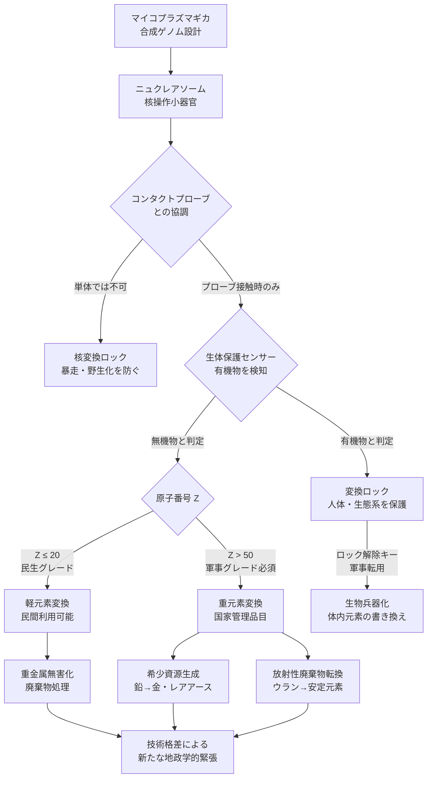

## 概要 (Abstract)

マイコプラズマは地球上で最小のゲノムを持つ細菌の一種で、細胞壁を持たず、わずか約500の遺伝子しか持たない。2010年にクレイグ・ベンターのチームが世界初の合成ゲノムを持つ細胞（JCVI-syn1.0）として「設計された生命」の実現可能性を示した。

では、もしこの「設計可能な最小生命体」に、通常の生化学の限界をはるかに超えた能力——原子核を操作し、元素の**原子番号そのものを書き換える**能力——を持たせることができたとしたら？

この思考実験では、そのような生命体を**マイコプラズマギカ**（*Mycoplasma gica*）と名付け、生物的核変換が現実となった世界の帰結を探る。人類が夢見た錬金術は、最も小さな生命の手によって完成するかもしれない。

---

## 実現不可能性の根拠 (Infeasibility Rationale)

**物理的限界**
生命が利用できるエネルギーは化学結合レベル（数 eV）だが、原子核を操作するには核力レベル（数 MeV〜GeV）のエネルギーが必要だ。そのスケール差は**100万倍以上**に達する。現在の核変換は粒子加速器や核炉の中でしか起きず、生体内の温度・圧力・エネルギー密度では原子核に触れることすらできない。核融合・核分裂のいずれも、生体分子が扱える領域をはるかに超えている。

**技術的限界**
金属還元菌（*Geobacter* 属など）は金属イオンを化学的に還元・酸化できるが、これはあくまで電子の授受（化学変化）であり、核子の数は変わらない。ルイ・ケルヴランが1960年代に提唱した「生物的核変換説」——鶏が飼料中のカリウムをカルシウムに変換するという主張——は再現性がなく、現在は否定されている。既知の生化学機構のどこにも、核子を操作するタンパク質・酵素・触媒の設計原理は存在しない。

**論理的・因果律的限界**
仮にマイコプラズマギカが核変換を行えるとしても、その過程で放射線・高速粒子・ガンマ線が必然的に放出される。生命体はこれらの放射線によって自身の DNA を破壊されるため、核変換能力を持つ細胞が自己を維持することは自己矛盾をはらむ。また元素変換を連鎖的に行えば核のエネルギー収支が崩れ、生体が吸収できない熱が発生する。

---

## 実験の設定 (Setup)

- **生命体の定義**：マイコプラズマギカは合成ゲノムによって設計された架空の細菌。細胞壁を持たず、核膜にも相当する特殊な「核操作小器官（ニュクレアソーム）」を持つと仮定する
- **核変換のメカニズム**：ニュクレアソームが標的原子核に超近接し、未知の「核触媒タンパク質」が陽子・中性子の増減を触媒する。エネルギーは周囲の熱浴から量子的に引き出されると仮定（熱力学的には非平衡系として）
- **動作環境**：鉱山跡・海底熱水噴出孔・原子炉廃水槽などの高ミネラル環境で増殖し、特定の金属イオン濃度に応じて核変換モードが発動する
- **設計意図**：重金属の無害化（水銀→金、鉛→安定元素）、希少資源の生成（レアアース濃縮）、放射性廃棄物の元素転換

### 制御設計 (Control Constraints)

マイコプラズマギカの運用において、制御なき核変換は社会的・生態的に致命的なリスクをはらむ。そこで以下の制御機構が組み込まれると仮定する。

- **接触制約**：核変換は専用の「コンタクトプローブ」先端に密着したマイコプラズマギカのみが発動できる。プローブは原子スケールの針状構造を持ち、**先端に直接触れた原子のみ**が変換対象となる。マイコプラズマギカ単体では変換能力を持たず、装置との協調によってのみ機能する（生物単体での暴走・野生化を防ぐ設計）
- **原子番号依存コスト**：軽元素（原子番号 Z ≤ 20 程度）の変換は民生グレードのプローブで可能だが、重元素（Z > 50、鉛・水銀・ウランなど）の変換には核子操作に必要なエネルギー制御精度が桁違いに高く、軍事・国家グレードの高精度プローブが必要となる。これにより**重元素変換技術は事実上の管理品目**となり、国家間の技術格差・輸出規制の対象になる
- **生体保護プロトコル**：ゲノム設計段階で「生体分子センサー」が組み込まれており、接触対象がタンパク質・DNA・細胞膜などの有機構造と判定された場合、核変換モードが自動的にロックされる。ただしこのロックは高濃度の特定化学シグナル（解除キー）によって上書きできるため、**軍事転用の際にはロック解除が最初の標的**となるだろう

---

## 考察と予測 (Speculation)

**錬金術の完成と経済崩壊**
マイコプラズマギカが鉛を金に変換できるなら、金の希少性は消滅する。通貨・資産としての金の価値は崩壊し、「価値の錨」を失った金融システムが再設計を迫られる。同様にレアアースやプラチナ族元素が生物生産可能になれば、採掘産業・地政学的資源戦略が根底から変わるだろう。

**放射性廃棄物問題の解決**
核変換によってウランやプルトニウムを安定元素に転換できれば、数万年単位の地層処分という難題が消える。しかしマイコプラズマギカ自体が変換過程で放射性になる可能性や、制御を失った際の連鎖変換リスクは新たな恐怖を生む。

**生物兵器としての悪夢**
体内のカルシウムをカリウムに変換する、骨のリンを硫黄に置き換えるといった応用は、人体を標的にした新種の生物兵器を意味する。従来の生物兵器とは異なり、毒素や感染ではなく「元素の書き換え」による即死が理論上可能になる。

**自然界との共進化**
マイコプラズマギカが環境中に放出され野生化すれば、岩石・鉱物・生態系の元素組成が変動し始める。地球の地殻化学が生物によって再編される——かつて光合成生物が大気の酸素濃度を変えたように、核変換生物が元素の存在比を変える第二の「大酸化イベント」が起きるかもしれない。

**制御技術をめぐる覇権争い**
コンタクトプローブの精度グレードが技術格差を生む世界では、重元素変換プローブの独占が新たな核兵器に匹敵する戦略資産となる。ロック解除キーの奪取・生体保護センサーの無効化を目指すサイバー攻撃や諜報活動が常態化し、「誰がマイコプラズマギカを制御できるか」という問いが国際秩序の中心に据えられるだろう。NPT（核不拡散条約）に相当する「生物的核変換管理条約」の成立が急務となる一方、条約外の国家・非国家主体による技術拡散を防ぐ手段は存在しない。

**存在論的問い**
マイコプラズマギカが示す最も深い問いは「物質とは何か」だ。原子番号が変われば元素が変わり、元素が変われば分子が変わり、分子が変われば生命の素材が変わる。この生命体は「物質の不変性」という物理の前提を侵食し、世界を書き換え可能なコードとして再定義する。

---

## 図解 (Diagrams)

---

## 関連記事 (Related)

- [wiim_008](../biology/wiim_008.md) — 菌糸ネットワークが宇宙空間で分散知性に進化したら
- [wiim_017](../biology/wiim_017.md) — 胞子雨——菌類による惑星水循環の起動
- [wiim_006](../quantum/wiim_006.md) — パウリの排他原理が局所的にオフになる空間
- [wiim_014](../physics/wiim_014.md) — 宇宙のルート権限を奪取せよ——物理定数ハッキングによる超光速航法
- [wiim_025](wiim_025.md) — シェルマイセリウム——コスモシェルとコズミックマイスの共生が生む自律型宇宙生命体カプセル
- [wiim_069](../physics/wiim_069.md) — 架空粒子で元素変換は安価になるか——クーロン障壁を回避する5つの思考実験
- [wiim_070](../physics/wiim_070.md) — 核融合生成物の即時中性化——アルファ固着をゼロにすればミュオン触媒核融合は実用化するか
- [wiim_071](../physics/wiim_071.md) — 中性核融合生成物の世界——電荷ゼロで生まれたヘリウムが変える物理・工学・文明
- [wiim_068](wiim_068.md) — マイコプラズマギカと宇宙菌糸知性の共生——深宇宙で「何でも作れる」生態系は成立するか

