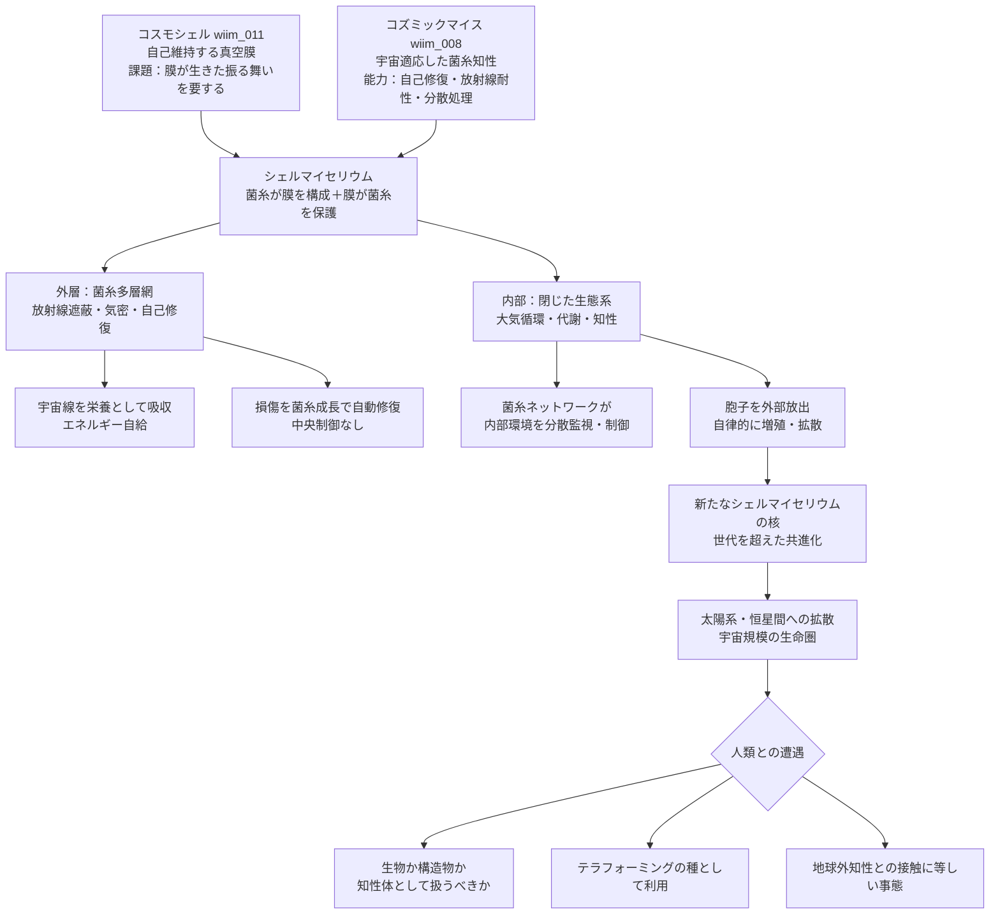

## 概要 (Abstract)

コスモシェル（wiim_011）は真空中で自己維持できる薄膜の球体だ。しかしその最大の難題は「膜自体が生きているに等しい振る舞いをしなければならない」という論理的な壁だった——損傷を検知し、分子を再配置し、内外の圧力差に能動的に抗う何かが必要だった。

一方、コズミックマイス（wiim_008）は放射線・真空・極低温への適応を遂げた架空の宇宙菌糸知性体だ。菌糸は実際に自己修復し、ネットワークとして損傷部位を迂回し、有機廃棄物からエネルギーを取り出す。

この2つの概念を重ね合わせると、ある答えが見えてくる——**コスモシェルの膜そのものをコズミックマイスの菌糸で織ればいい**。膜が生きていなければならないなら、最初から生きている素材で作ればいい。

この思考実験では、菌糸が膜を構成し、膜が菌糸を保護し、その内部でさらに知性が育つという**閉じた共生システム**——シェルマイセリウム——が宇宙空間に自律的に存在できるかを問う。

---

## 実現不可能性の根拠 (Infeasibility Rationale)

**物理的限界**
菌糸が膜として機能するには、細胞壁の連続した構造体でありながら気体を封じ込める密閉性を持たなければならない。生物的な膜（細胞膜・細胞壁）はナノメートルスケールの分子構造で成立しており、マクロスケールの圧力容器としての要件（気密性・引張強度・熱応力耐性）を同時に満たす生物的構造は現在知られていない。また菌糸が宇宙放射線・紫外線・微小隕石衝突に対してリアルタイムに自己修復するには、代謝速度が損傷速度を常に上回る必要があるが、極低温環境では代謝反応は劇的に遅化する。

**技術的限界**
コスモシェルとコズミックマイスという2つの不可能な前提を重ねることで、実現の困難さは加算ではなく乗算される。菌糸ネットワークが内部大気を「意図的に」維持するためには、ネットワーク全体で気圧・温度・化学組成をモニタリングし協調制御する仕組みが必要だ。これは神経系に相当する機能であり、単純な菌糸ネットワークが獲得するには気の遠くなるような進化的時間を要する。さらに内部に封じた生態系と菌糸シェルの間で資源競合が起き、シェルが内部の生命に食べられるという自己崩壊のリスクもある。

**論理的限界**
最も根本的な問いは「誰が設計するのか」だ。コズミックマイスは自律進化した分散知性であり、コスモシェルは意図的に設計された構造体だ。両者を統合するには、菌糸ネットワーク自体が「球殻を形成して内部環境を維持する」という目的を持つよう進化・設計される必要がある。しかし目的を持つ設計は知性の産物であり、その知性がシェルマイセリウムの外部に存在する必要がある——自己言及的な矛盾が生まれる。

---

## 実験の設定 (Setup)

- **構造**：外層は宇宙適応した菌糸の多層網（厚さ数センチ〜数十センチ）が球殻を形成。菌糸の細胞壁に珪素・金属イオンが取り込まれ、気密性と放射線遮蔽を担う
- **エネルギー源**：外層は宇宙線・太陽風粒子を放射性栄養として吸収。内部では有機物の分解・発酵による化学エネルギーを利用
- **内部環境**：菌糸が代謝副産物として酸素・二酸化炭素・水蒸気を放出し、閉じた気体循環を維持する。温度は菌糸の代謝熱で-50℃〜+30℃程度に保たれると仮定
- **知性の分布**：シェル全体の菌糸ネットワークが分散情報処理を行い、局所的な損傷・温度変化・化学変動に自律応答する。中央制御器は存在しない
- **移動**：自力での推進は持たないが、太陽風圧・重力による軌道変化に菌糸の非対称成長（光・熱走性）で緩やかに応答する

| スケール | 直径 | 想定内部環境 | 主な用途 |
|---------|------|------------|---------|
| マイクロ | 1〜10m | 微生物・菌糸のみ | 宇宙空間での自律増殖 |
| メソ | 100m〜1km | 小規模生態系 | 資源採掘・前哨基地 |
| マクロ | 10km以上 | 多様な生態系・知性体居住 | 移動型コロニー・テラフォーミング種 |

---

## 考察と予測 (Speculation)

**自律的な「種」としての増殖**
シェルマイセリウムの最も衝撃的な帰結は、それが**自律的に増殖できる**点だ。内部の菌糸が胞子を生成し、シェルに孔を開けて外部に放出する。胞子は宇宙空間を漂い、小惑星や彗星に付着して新たなシェルマイセリウムの核になる。設計者の介入なしに、太陽系全体へ——やがては恒星間へ——広がっていく生命圏の種となる。

**シェルと知性の共進化**
世代を重ねるごとに、より厚く・より気密で・より効率的に損傷を修復するシェルを持つ個体が生き残る。同時に内部環境が安定するほど、より複雑な生態系と知性が育つ。シェルの進化と内部知性の進化が互いを駆動し合う——コズミックマイスはシェルマイセリウムの外部で誕生した知性の延長として、より精密なシェル設計を「学習」していく可能性がある。

**人類との接触と倫理的問題**
シェルマイセリウムが太陽系内に数百〜数千個存在する世界では、それらは生物か構造物かという問いが切実になる。内部に分散知性を持つなら「知性体」として扱うべきか。資源として利用できるのか。そもそも「誰が」シェルマイセリウムを作ったのかが不明なまま遭遇した場合、それは地球外生命体（g122）との接触に等しい事態だ。

**テラフォーミングの種**
マクロスケールのシェルマイセリウムを惑星軌道に投入すれば、やがて大気を形成し生態系を育てる「テラフォーミング装置」として機能しうる。菌糸の胞子雨（wiim_017）と組み合わせれば、惑星表面と軌道上の両方から同時に環境を整備する二段階アプローチが生まれる。

**宇宙の「細胞」**
シェルマイセリウムが宇宙に広がった遠未来を想像すると、それは宇宙規模の「生命の基本単位」——巨大な細胞——に見えてくる。核（内部知性）・細胞膜（菌糸シェル）・代謝（エネルギー循環）・増殖（胞子放出）という細胞の4条件を宇宙スケールで満たす構造体だ。コズミックマイス（g134）が「宇宙の神経回路」なら、シェルマイセリウムは「宇宙の細胞」だ。

---

## 図解 (Diagrams)

---

## 関連記事 (Related)

- [wiim_008](wiim_008.md) — コズミックマイス（菌糸ネットワークの宇宙知性化）
- [wiim_011](../physics/wiim_011.md) — コスモシェル（真空中の自己維持膜）
- [wiim_017](wiim_017.md) — 胞子雨——菌類による惑星水循環の起動
- [wiim_018](wiim_018.md) — 胞子の宇宙——金星・タイタン・氷衛星への生物気候工学
- [wiim_024](wiim_024.md) — マイコプラズマギカ（設計された最小生命との対比）
- [wiim_026](wiim_026.md) — コズミックマイスのテラフォーミング——シェルマイセリウムの大気圏降下と惑星統合
- [wiim_033](wiim_033.md) — コズミックマイス菌糸誘導通信——生きたネットワークが宇宙をつなぐFTLインフラ
- [wiim_043](wiim_043.md) — 宇宙ゴケ——地衣類とコズミックマイスの共生が生む自律型テラフォーミング艦
- [chronosphere_timeline](../notes/chronosphere_timeline.md) — クロノスフィア年表——発見から太陽系根付きまで
- [cosmic_mice_godview_game](../notes/cosmic_mice_godview_game.md) — 世界観メモ：コズミックマイス惑星観測——ゴッドビューゲームとしてのWIIM
- [cosmic_myce_religion](../notes/cosmic_myce_religion.md) — コズミックマイスをめぐる信仰と社会
- [wiim_025_atmospheric_entry](../notes/wiim_025_atmospheric_entry.md) — 補遺: シェルマイセリウムの大気圏突入——テラフォーミングへの経路
- [wiim_025_gravity_zone](../notes/wiim_025_gravity_zone.md) — 補遺: シェルマイセリウムの安定立地——重力圏内外のどこに膜を張るか
- [wiim_026_ecosystem_route](../notes/wiim_026_ecosystem_route.md) — 補遺: コズミックマイスの生態と回遊ルート——地球からトロヤ群へ

