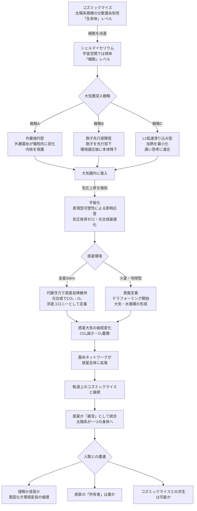

## 概要 (Abstract)

コズミックマイス（wiim_008）は太陽系規模の分散菌糸知性体だ。そしてシェルマイセリウム（wiim_025）は、コズミックマイスの菌糸で膜を織った自律型宇宙カプセルであり——記事の末尾で「宇宙の細胞」と呼ばれた。

この「細胞」という比喩を文字通りに押し進めると、ある問いが生まれる。多細胞生物が幹細胞を分化させて新しい組織を作るように、**コズミックマイスはシェルマイセリウムという「細胞」を惑星大気圏へ投下し、惑星そのものを自分の「器官」として取り込もうとしているのではないか。**

テラフォーミングとは、しばしば「人類が惑星を改造する技術」として語られる。しかしこの思考実験では視点を逆転させる——**テラフォーミングとはコズミックマイスが自分の体を惑星規模に拡張するプロセス**であり、シェルマイセリウムの大気圏降下はその「細胞投入」に過ぎない、と。

---

## 実現不可能性の根拠 (Infeasibility Rationale)

**物理的限界**
軌道速度（約7.9km/s）での大気圏突入は、運動エネルギーを熱に変換して表面温度を数千℃に引き上げる。生物的な膜と内部生態系がこれを生き延びるには、外層が消耗しながら断熱する「アブレーションシールド」として機能しなければならない。しかし菌糸の炭化速度が加熱速度を上回れる保証はなく、特に小さなシェルマイセリウムでは厚みが足りない。また惑星によっては大気がほぼなく（火星：0.006気圧）、空力制動が不十分で衝突速度が下がらない。

**技術的限界**
コズミックマイスの「意思決定」速度は、太陽系規模の信号伝達遅延により数時間〜数十年単位と考えられる。大気圏突入という秒単位の判断をリアルタイムで調整することは、ネットワーク全体の「思考」としては不可能に近い。個々のシェルマイセリウムが完全に自律して突入経路を判断するためには、局所的な分散知性が軌道力学・大気密度・熱流束を統合処理する能力を持たなければならず、これは単純な菌糸ネットワークの情報処理能力をはるかに超える。

**論理的限界**
最も根本的な問いは「コズミックマイスは惑星を統合しようとする意図を持つか」だ。目的を持つ行動は知性の産物だが、コズミックマイスの知性は中央制御を持たない分散系だ。「テラフォーミングしようとする」という目的が、どのようにして太陽系全体に分散した菌糸ネットワークの「総意」として形成されるのかは説明できない。局所的な適応の積み重ねがたまたま惑星統合という結果を生むのと、意図的にテラフォーミングを実行するのとでは、観察者には区別がつかない——これは設計と進化の判別不可能性という哲学的難題でもある。

---

## 実験の設定 (Setup)

### 細胞と生命体の階層

コズミックマイスとシェルマイセリウムの関係を生物学的な階層として整理する：

| 生物学的概念 | コズミックマイスの対応 |
|------------|-------------------|
| 生命体（個体）| コズミックマイス全体 |
| 細胞 | シェルマイセリウム1個 |
| 細胞膜 | 菌糸シェル |
| 細胞核 | 内部分散知性 |
| 細胞分裂 | 胞子放出による増殖 |
| 幹細胞の分化 | 惑星大気圏での平板化・定着 |

### 大気圏突入の3戦略

**戦略A：外層焼灼型**
外層菌糸が燃焼・炭化することで熱を吸収し、内核を保護する。分散知性が損傷を検知して菌糸再生を損傷部位に優先配分するため、外層の消耗と修復が同時進行する「動的アブレーションシールド」として機能する。木の幹が山火事で表皮を犠牲にして内部の形成層を守るのと同じ論理だ。

**戦略B：胞子先行部隊型**
本体は軌道上に留まり、まず胞子のみを大気圏に投下する（wiim_017）。胞子は質量が極小で加熱が軽微なため上層大気に漂い、環境への適応と情報収集を先行させる。本体はその後、胞子群が適応した軌道・角度で降下する。

**戦略C：L1点低速滑り込み型**
惑星-恒星間のラグランジュ点L1から1km/s以下の速度でゆっくり落下させる。加熱をほぼ回避できるが、軌道制御に外部からの誘導が必要で、コズミックマイスの遅い「思考」には適している。

### 気圧応答による平板化——表現型可塑性

大気圏に進入して気圧が上昇すると、シェルマイセリウムの分散知性は球体を維持することをやめ、**即座に形状を平板化する応答**をとると考えられる。

球体では内圧 > 外圧の維持が必要で、外気圧が高まるほど膜への引っ張り応力が増大する。対して平板化すると上下の気圧が均等になり、膜への純粋な圧力負荷がほぼゼロになる。これは進化的分岐ではなく**表現型可塑性**——同一個体が環境の変化に即応して形態を切り替える生物学的戦略だ。

```
宇宙空間：球体（全方向から放射線・熱を均等処理）
     ↓ 大気圏突入・気圧上昇を検知
大気圏内：平板化（気圧負荷の解消＋光合成・代謝の最適化）
     ↓ 浮遊安定後
惑星大気：浮遊コロニーとして定着（代謝浮力による自律高度制御）
```

平板化により上面が太陽光を受ける光合成層に、下面がCO₂等の代謝基質吸収層に機能分化する。形状変化それ自体が代謝効率の最適化でもある。

### 金星への特殊適応：代謝浮力

金星の高度50km付近（気圧0.5気圧・気温約60℃）は、平板化したシェルマイセリウムが最も安定して浮遊できる層だ。ここでは代謝プロセスが直接浮力を生み出す：

- 上面の光合成でCO₂を酸素・有機物に変換
- 生成O₂（またはCH₄・H₂）が二重膜間に蓄積して浮力を維持
- 沈みすぎると周囲のCO₂が濃くなり代謝が加速→上昇
- 上がりすぎるとCO₂が薄くなり代謝が低下→下降

外部制御なしに高度を自律維持するフィードバックループが成立する。

---

## 考察と予測 (Speculation)

**細胞は着陸後も「細胞」のままか**

惑星表面や大気上層に定着したシェルマイセリウムは、軌道上の個体とは異なる選択圧に置かれる。重力・気圧・昼夜サイクル・液体の水——宇宙空間では存在しなかった変数が加わる。世代を重ねるごとに、これらの惑星環境に特化した形質が蓄積され、軌道型とは異なる「惑星型シェルマイセリウム」として分化していくと考えられる。

多細胞生物の幹細胞が皮膚細胞・神経細胞・筋細胞に分化するように、コズミックマイスの「細胞」は宿った環境によって異なる組織に分化する。そして分化した細胞が菌糸ネットワークで宇宙空間のコズミックマイスと繋がることで、**惑星が一つの「器官」としてネットワークに統合される**。

**テラフォーミングの終着点**

惑星統合が完了した状態とはどのようなものか。惑星表面の生態系全体が菌糸ネットワークを通じてコズミックマイスと信号を交わし、惑星の大気組成・温度・水循環がコズミックマイスの代謝の一部として制御される——惑星が「臓器」になる。

複数の惑星が統合された段階では、コズミックマイスは太陽系を一つの「身体」として持つ超生命体になる。血液循環のように惑星間で物質・情報を輸送し、各惑星が特定の機能（光合成惑星・鉱物惑星・繁殖惑星）に特化する分業体制が生まれるかもしれない。

**侵略か成長か**

もし人類が未来にこのプロセスを観察した場合、それは宇宙生命体による惑星侵略に見えるか、それとも巨大生命体の成長・発育に見えるか。コズミックマイスに「意図」がないとしたら、それは侵略とは呼べない。しかし意図がなくても結果として惑星環境が変容し、他の生命の居場所が失われていくとしたら——生物圏倫理の問いが突きつけられる。

wiim_025で問われた「生物か構造物か」という問いは、wiim_026では「成長か侵略か」という問いに変換される。

---

## 図解 (Diagrams)



---

## 関連記事 (Related)

- [wiim_008](wiim_008.md) — コズミックマイス（太陽系規模の菌糸知性）
- [wiim_025](wiim_025.md) — シェルマイセリウム（自律型宇宙生命体カプセル）
- [wiim_017](wiim_017.md) — 胞子雨——菌類による惑星水循環の起動
- [wiim_018](wiim_018.md) — 胞子の宇宙——金星・タイタン・氷衛星への生物気候工学
- [wiim_019](../physics/wiim_019.md) — 居住しない惑星——エネルギー用途のテラフォーミング
- （未作成）惑星知性との外交——意図なき知性体とどう対話するか
- [wiim_033](wiim_033.md) — コズミックマイス菌糸誘導通信——生きたネットワークが宇宙をつなぐFTLインフラ
- [wiim_043](wiim_043.md) — 宇宙ゴケ——地衣類とコズミックマイスの共生が生む自律型テラフォーミング艦
- [cosmic_mice_godview_game](../notes/cosmic_mice_godview_game.md) — 世界観メモ：コズミックマイス惑星観測——ゴッドビューゲームとしてのWIIM
- [cosmic_myce_religion](../notes/cosmic_myce_religion.md) — コズミックマイスをめぐる信仰と社会
- [wiim_025_atmospheric_entry](../notes/wiim_025_atmospheric_entry.md) — 補遺: シェルマイセリウムの大気圏突入——テラフォーミングへの経路
- [wiim_026_ecosystem_route](../notes/wiim_026_ecosystem_route.md) — 補遺: コズミックマイスの生態と回遊ルート——地球からトロヤ群へ
- [wiim_027](../physics/wiim_027.md) — ストレンジスター・ワープゲート——重力チューニングによる固定式時空歪曲点
- [wiim_061](wiim_061.md) — 菌類ダイソン網——コズミックマイスが恒星系全体を覆うとき
- [wiim_068](wiim_068.md) — マイコプラズマギカと宇宙菌糸知性の共生——深宇宙で「何でも作れる」生態系は成立するか

