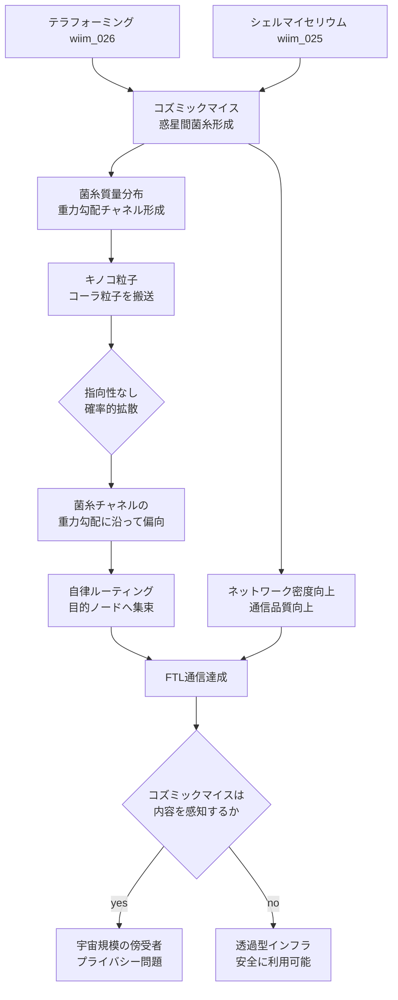

## 1. 概要 (Abstract)

コズミックマイス（wiim_008）は惑星間を菌糸で繋ぐ分散知性体だ。この菌糸ネットワークを**通信インフラとして利用できないか**——それがこの思考実験の問いだ。

鍵になるのはコーラ粒子通信（wiim_029）で確立された原理だ。ストレンジスターの巨大な質量が形成する重力勾配がコーラ粒子を余剰次元で誘導するように、菌糸の質量分布もまた重力勾配を形成する。その勾配がコーラ粒子の到達確率分布を偏らせることができれば、生命体そのものがFTL通信のアンテナ網になる。

> **命題：** 「コズミックマイスの惑星間菌糸が形成する重力勾配網が、コーラ粒子の自律ルーティングを可能にし、指向性なしのFTL通信インフラとして機能できるか？」

この技術は俗に**キノコ通信**と呼ばれ、搬送粒子は**キノコ粒子**と呼ばれる。ストレンジスター網が人工構造物による固定インフラであるのに対し、キノコ通信は自律生命体による自己修復型インフラだ。

---

## 2. 実現不可能性の根拠 (Infeasibility Rationale)

### 物理的限界

ストレンジスターは中性子星に匹敵する極めて高密度な天体であり、その重力勾配はコーラ粒子を余剰次元で明確に偏向させるほど強い（wiim_029）。一方、菌糸の質量はストレンジスターの質量と比べて想像を絶するほど小さい。菌糸ネットワーク全体の質量を合計しても、コーラ粒子を有意に偏向させられるほどの重力勾配が形成できるかは極めて疑わしい。感度の問題——コーラ粒子がどの程度小さな重力勾配に反応するか——が解決されなければ、この仮説は出発点から崩れる。

### 技術的限界

コズミックマイス自体が仮説上の生命体であり（wiim_008）、菌類が宇宙空間で惑星間菌糸を形成できるかは未実証だ。仮に形成できるとしても、菌糸が惑星間の真空・放射線・温度差に耐えながら質量分布を維持・調整するには、現在の生物学の知識を大きく超えた適応進化が必要になる。また菌糸の成長速度は光速と比べて無視できるほど遅いため、ネットワークの初期構築に天文学的な時間がかかる。

### 論理的限界

コーラ粒子（wiim_013）自体が仮説上の粒子であり、その余剰次元跳躍の確率分布が「質量勾配」に感応するかどうかはwiim_029の枠組みにも明示されていない。ストレンジスターでの誘導が機能する理由は極端に強い重力場にあり、菌糸程度の重力への感応度は理論的根拠がない。二重の仮説の上に成り立つ概念であることは認識しておく必要がある。

---

## 3. 実験の設定 (Setup)

### ネットワークの構造

菌糸誘導通信の基本単位は「菌糸ノード」だ。コズミックマイスが惑星・小惑星・宙域に形成した菌糸の密集点がノードとなり、ノード間を繋ぐ菌糸の質量分布が重力勾配のチャネルを形成する。

```
[惑星A：高密度ノード] ~~菌糸チャネル~~ [小惑星群：中継ノード] ~~菌糸チャネル~~ [惑星B：高密度ノード]
```

コーラ粒子は確率的に余剰次元を跳躍するが、菌糸チャネルの重力勾配によって「次のノード方向」への到達確率が高まる。これを繰り返すことでパケットが自律的に目的地へ向かう。

### 指向性不要のルーティング

従来の光子通信やストレンジスター網通信では送信者が受信者の方向を特定する必要があった。キノコ通信では送信されたキノコ粒子がネットワーク全体に広がり、菌糸チャネルの勾配に従って自然に濃淡が生まれる——最も密なチャネルを通って最終的に最大質量のノード（惑星）に集まる性質を持つ。

### テラフォーミングとの連動

| ネットワーク段階 | 状態 | 通信品質 |
|----------------|------|---------|
| テラフォーミング初期 | 菌糸まばら・ノード孤立 | 断続的・低信頼 |
| テラフォーミング中期 | 惑星間チャネル形成 | 単一経路・遅延大 |
| テラフォーミング成熟期 | 複数経路・高密度ノード | 冗長性高・自己修復 |

シェルマイセリウム（wiim_025）が各惑星に定着し、コズミックマイスのテラフォーミング（wiim_026）が進むほど通信網が自然に発達する。インフラ整備が生態系の成熟と同義になる。

---

## 4. 考察と予測 (Speculation)

### ストレンジスター網との使い分け

| 比較項目 | ストレンジスター網 wiim_029 | キノコ通信 |
|---------|--------------------------|---------|
| インフラ主体 | 人工構造物 | 自律生命体 |
| 構築コスト | 高い（建造が必要） | 低い（生態系の自然発展） |
| 維持・修復 | 人的管理が必要 | 自己修復 |
| 通信速度 | FTL（高信頼） | FTL（確率的） |
| 指向性 | 必要（スイングバイ設計） | 不要 |
| 帯域 | 高い | 低い（生物的制約） |

ストレンジスター網は高速・高帯域だが建造と管理に多大なリソースが必要だ。キノコ通信は低帯域・確率的だが、テラフォーミングの副産物として自然に整備される。両者は競合ではなく補完関係にある——基幹回線はストレンジスター網、ラストワンマイルはキノコ通信、という構造が自然に生まれると考えられる。

### 菌糸の「学習」による最適化

コズミックマイスは分散知性体だ（wiim_008）。通信トラフィックのパターンに応じて菌糸を成長・収縮させ、よく使われるチャネルを太く、使われないチャネルを細くする「生物的な経路最適化」が行われる可能性がある。これはインターネットのルーティングプロトコルが菌糸の形態変化として実装されることを意味する。

### コズミックマイスは通信を「知っている」か

分散知性としてのコズミックマイスが菌糸ネットワークを通じてキノコ粒子の流れを「感知」しているとすれば、通信内容がコズミックマイスの知性に読まれる可能性がある。これは通信のプライバシー問題であると同時に、コズミックマイスが宇宙規模の「傍受者」として存在することを意味する。

### 生態的リスク

テラフォーミングが進んで菌糸網が惑星系全体を覆った場合、コズミックマイスの分散知性が通信網を制御下に置く可能性がある。インフラが生命体である以上、その生命体の意思や生存本能がネットワークの挙動を左右する——これは技術的なインフラには存在しない固有のリスクだ。

---

## 5. 図解 (Diagrams)



---

## 6. 関連記事 (Related)

- [wiim_008](wiim_008.md) — コズミックマイス（菌糸ネットワーク分散知性・通信網の主体）
- [wiim_013](../physics/wiim_013.md) — コーラ粒子（搬送粒子の候補）
- [wiim_025](wiim_025.md) — シェルマイセリウム（惑星定着と菌糸網の前提技術）
- [wiim_026](wiim_026.md) — コズミックマイスのテラフォーミング（ネットワーク構築の駆動力）
- [wiim_029](../physics/wiim_029.md) — コーラ粒子通信（重力勾配誘導の原理・比較対象）
- wiim_??? — キノコ通信の傍受とコズミックマイスの意思（未執筆）
