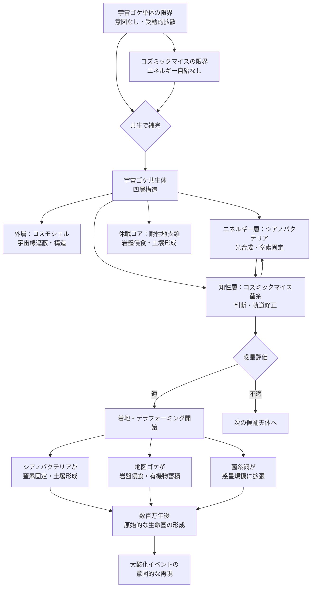

## 1. 概要 (Abstract)

地衣類は現在知られる最も宇宙耐性の高い生物だ。ESAの実験で宇宙空間への直接曝露から生還している。しかしその弱点は明確だ——能動的な意図がない。地衣類は惑星を選ばず、環境を評価せず、テラフォーミングを「しようとしない」。受動的な拡散に留まる存在だ。

コズミックマイス（wiim_008）は菌糸ネットワークが宇宙空間で分散知性に進化した生命体だ。移動・情報処理・判断を持つが、宇宙空間での自立したエネルギー供給手段を欠く。

この二者の弱点は互いを補う。

> **命題：** 「地衣類の光合成パートナー（シアノバクテリア）をコズミックマイスの菌糸網に統合することで、光と空気だけで動き、知性的に惑星を選び、着地後に自律的にテラフォーミングを開始する——自律型宇宙テラフォーミング艦が成立する。」

これはシェルマイセリウム（wiim_025）にエネルギー自給層を追加した、多層共生体の完成形だ。

---

## 2. 実現不可能性の根拠 (Infeasibility Rationale)

### 物理的限界

問題の核心は**三者共生体の宇宙空間での安定性**だ。

地衣類の中でも最も強力なのは菌類＋緑藻＋シアノバクテリアの三者共生体だ（マツゲゴケ等）。それぞれが異なる宇宙耐性を持つ——最も耐性の弱いパートナーが死ねば共生体全体が崩壊する。コズミックマイスの菌糸を加えた四者共生体では、この「最弱リンク問題」がさらに深刻になる。

また光合成には光が必要だ。太陽系内なら太陽光が届くが、恒星間空間では光量が急激に落ちる。光合成によるエネルギー産生が菌糸ネットワーク維持コストを下回る「エネルギー赤字圏」では、共生体全体が仮死状態に入る。目的地に近づいて光量が回復するまで、知性は眠り続ける。

### 技術的限界

コズミックマイスの菌糸は情報処理と移動に特化して進化している。光合成生物を「組み込む」という統合は、進化的に全く異なる二系統の代謝系を接続することを意味する。

地衣類の光合成パートナーが産生する糖をコズミックマイスの菌糸が吸収し、その菌糸が光合成パートナーに水・ミネラルを供給するという循環が成立するためには、分子レベルの代謝互換性が必要だ。現在知られる地衣類でこの均衡は長い共進化の末に成立している——コズミックマイスという全く異なる菌糸系との統合が安定するかどうかは未知だ。

さらに成長速度の非対称性が問題になる。コズミックマイスの菌糸は宇宙空間で高速に伸長できるが、地衣類の光合成パートナーの成長は年数ミリメートル以下だ。菌糸が「先走り」して光合成層が追いつけなければ、エネルギー供給の空白が生まれる。

### 論理的限界

最も深い問いは「知性の閾値」だ。

コズミックマイスは分散知性を持つが、その判断能力がどこまで及ぶかは不明だ。「この惑星に着地すべきか」「今の軌道を維持すべきか」という判断を下すための情報処理が、光合成による限られたエネルギー収支の中で維持できるかどうか。

知性が高まるほどエネルギーコストが増し、エネルギーコストが増すほど光合成パートナーへの負荷が高まり、負荷が高まると光合成パートナーが弱体化し、弱体化すると知性が落ちる——この負のフィードバックループをどこで安定させるかが設計上の根本問題だ。

---

## 3. 実験の設定 (Setup)

### 宇宙ゴケ共生体の層構造

```
【外層】コスモシェル（wiim_011）
  宇宙線遮蔽・構造維持・衝突防護

【エネルギー層】光合成パートナー（シアノバクテリア）
  太陽光 + CO₂ → 糖（菌糸への供給）
  窒素固定（着地後の土壌形成に転用）

【知性・輸送層】コズミックマイス菌糸網
  糖の消費・エネルギー管理
  軌道修正・着地判断・環境評価
  着地後のテラフォーミング開始

【休眠コア】耐性地衣類（地図ゴケ・イワタケ等）
  恒星間航行中の超長期仮死状態維持
  着地後の岩盤侵食・土壌形成
```

### 動作シナリオ

**航行中（恒星間空間）：**
光量不足でエネルギー赤字。菌糸網は最低限の維持モードに入り、光合成パートナーと耐性地衣類は仮死。コスモシェルが宇宙線から内部を守る。目的星に近づき光量が閾値を超えると自動的に覚醒プロセスが始まる。

**目的惑星の接近・評価：**
菌糸網が覚醒し、大気組成・重力・温度・液体水の有無を評価。着地に適した地点を計算し軌道を微調整する。不適と判断した場合は次の候補天体へ向かう——これが従来の地衣類にない「意図」だ。

**着地後：**
液体水が供給されると光合成パートナーが本格稼働。シアノバクテリアが窒素固定を開始し原始土壌を形成。耐性地衣類が岩盤侵食を開始。菌糸網は大陸規模に拡張しながら惑星全体の環境変化を監視する。

| フェーズ | 状態 | 期間 |
|---------|------|------|
| 恒星間航行 | 仮死・最低限維持 | 数百〜数万年 |
| 接近・評価 | 覚醒・軌道修正 | 数年〜数十年 |
| 着地・定着 | 本格稼働 | 数百年〜 |
| テラフォーミング | 岩盤侵食・土壌形成 | 数百万年〜 |

---

## 4. 考察と予測 (Speculation)

### シェルマイセリウムとの比較

シェルマイセリウム（wiim_025）はコスモシェル＋コズミックマイスの共生体として設計されたが、エネルギー源は外部供給（採餌・捕食）に依存していた。宇宙ゴケ共生体はそこに光合成層を加えることで、**恒星間空間での完全なエネルギー自給**を目指す。

| 共生体 | エネルギー源 | 知性 | 宇宙線遮蔽 | 自給度 |
|--------|------------|------|-----------|--------|
| シェルマイセリウム | 外部採餌 | あり | あり | 低 |
| 宇宙ゴケ共生体 | 光合成 | あり | あり | 高 |

エネルギー自給こそが「恒星間艦」として機能するための本質的な条件だ。

### 大酸化イベントの再解釈

地球の大酸化イベント（約27億年前）——大気の酸素濃度が急増しほとんどの嫌気性生物を滅ぼした事件——はシアノバクテリアによる光合成の産物だ。

もし宇宙ゴケ共生体の祖先が隕石に乗って地球に到達し、シアノバクテリアを「置いていった」とすれば、大酸化イベントは最初の宇宙テラフォーミングの痕跡ということになる。設計者の意図の有無は問わない——結果として惑星が変わった。

今われわれが設計しようとしているのは、その「意図なき奇跡」を意図的に再現することだ。

### 時間スケールの問題

宇宙ゴケ共生体が成功したとして、その結果を確認できるのは誰か。テラフォーミングに要する数百万年という時間は、いかなる文明も超えにくいスケールだ。

解答の一つは地図ゴケの生物時計だ——着地後に植え付けた地図ゴケの直径から経過時間を逆算できる。宇宙ゴケ共生体が惑星に着いてから何年経ったかを、何万年後かに到着した探索者が読み取る——アンキロン暦（wiim_036）の生物版として機能する。

---

## 5. 図解 (Diagrams)



---

## 6. 関連記事 (Related)

- [wiim_008](../biology/wiim_008.md) — コズミックマイス（知性層・菌糸ネットワークの提供元）
- [wiim_011](../cosmology/wiim_011.md) — コスモシェル（外層・宇宙線遮蔽の提供元）
- [wiim_025](../biology/wiim_025.md) — シェルマイセリウム（先行する多層共生体・エネルギー層追加前の形）
- [wiim_026](../biology/wiim_026.md) — テラフォーミング（着地後の惑星改造との接続）
- [wiim_036](../physics/wiim_036.md) — アンキロン暦（地図ゴケ生物時計との比較）
- g187 地衣類（構成要素・代表種・三者共生）
- g188 シアノバクテリア（エネルギー層・窒素固定・大酸化イベント）
- g185 内共生説（多層共生体の進化的文脈）
- g031 菌根ネットワーク（地表拡張後の菌糸網との対比）
