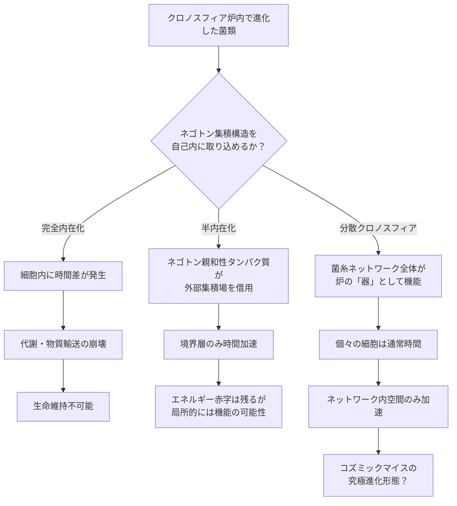

## 概要 (Abstract)

クロノスフィア（g125）は、ネゴトン（g126）を精密に集積させることで局所的な固有時の進行を外部より加速させる人工装置だ（外部観測者から見ると内部の時間が速く流れているように見えるが、正確には内部の固有時が加速しているという表現が適切だ）。外部から見れば数日しか経っていないのに、内部では数千万年分の進化圧が発生する——この技術がコズミックマイス（wiim_008）研究の基盤となっている。

ここで一つの問いが生まれる。クロノスフィア実験炉の内部で何千万年もの進化を経た菌類が、そのネゴトン集積構造を**自己の菌糸・細胞内に取り込み**、「体内クロノスフィア」として機能させることは可能か。もしそれが実現すれば、炉の外に出た後も菌類は自力で時間を加速させ、天体表面や宇宙空間でも超高速の進化を継続できる。

---

## 実現不可能性の根拠 (Infeasibility Rationale)

### 物理的限界

ネゴトンが時間加速場を生成するには、粒子同士が精密な幾何学的配置を維持しなければならない。この配置は人工炉の中では精密制御によって保たれているが、生体内は根本的に異なる環境だ。

細胞内は常に熱揺らぎにさらされており、分子は絶え間なくランダム運動している。この熱的ノイズはネゴトン集積構造を乱すのに十分なエネルギーを持つと考えられる。精密な配置を保つためには外部からの能動的な制御が必要であり、生体の自律機構がそれを代替できるかどうかは、現在の理論の枠外にある。

### 技術的限界（生物学的障壁）

仮に菌糸の一部でネゴトンが集積し、その領域の時間が加速したとする。すると、その部位の生化学反応は外部と比べて著しく速く進む。これは細胞膜を境に「時間の速さが異なる」状態であり、生命維持に致命的な問題を引き起こすと考えられる。

物質輸送・シグナル伝達・DNA複製は、細胞内外の連続性を前提として成立している。時間加速域と通常時間域の境界では、化学的な勾配が意味を失い、膜輸送タンパクは自分がどちらの速度で動けばよいか「判断」できなくなる。境界面そのものが生物学的に機能不全に陥る可能性が高い。

### 論理的限界

もし菌類が自己内部で時間を加速できるなら、外部の観察者には代謝速度が急増したように見える。1秒の間に内部では100秒分の化学反応が進むなら、それに見合うエネルギーが1秒以内に外部から供給されなければならない。

しかしエネルギー供給は外部時間のスピードに縛られている。「内部で速く動く」ためのエネルギーを、外部の速度で補充しようとすれば、常にエネルギー赤字が積み上がる。体内クロノスフィアは起動した瞬間からエネルギー枯渇に向かって走り始める自己矛盾を抱えている。

---

## 実験の設定 (Setup)

- **主体**：クロノスフィア実験炉（外部年70年以降、L5点シード・チェンバー1号）内で外部時間換算で数十年以上の進化圧を受けた菌糸株
- **環境**：炉内から取り出した後、天体表面（大気なし、低重力）に定着させる
- **操作**：炉外でもネゴトン集積構造に類似した菌糸形態が自発的に形成されるか観察する
- **測定**：炉外菌糸の代謝速度・進化速度を、通常の菌株と比較する

---

## 考察と予測 (Speculation)

### 完全内在化の代替——「半内在化」という可能性

完全な体内クロノスフィアは上記の理由から困難だが、**ネゴトン親和性タンパク質**を持つ菌類が外部のネゴトン集積場に接触したとき、触媒的に時間加速場を局所的に「借用」する構造は考えられる。これは炉に入るのではなく、菌類が自ら炉の境界面を形成する「歩く境界膜」のような状態だ。

この場合、エネルギー収支の問題は残るが、加速域が極めて薄い境界層に限定されるため、代謝の崩壊は抑制できる可能性がある。

### 分散クロノスフィアという解釈

個々の細胞内にクロノスフィアを詰め込む代わりに、**菌糸ネットワーク全体を一つの巨大なクロノスフィア境界面として機能させる**発想もある。個々の菌糸は通常時間で動きながら、ネットワーク全体の幾何学的配置がネゴトン集積の「型」として機能する——いわば菌類自身が炉の器になる。

この構造であれば、細胞内外の時間差問題は回避できる。時間が加速するのは「ネットワーク内部の空間」であり、個々の細胞が境界上に位置する形になるからだ。

### コズミックマイスとの接続

コズミックマイス（wiim_008）の菌糸ネットワークが太陽系規模に広がったとき、そのネットワーク内部空間は自然と閉鎖系に近い構造を形成する。長期的な進化の結果として、この内部空間がネゴトン濃度の高い領域を形成し、ネットワーク内部の局所的な時間進行に偏差が生まれる可能性は——遠い将来の仮説として——排除できない。

クロノスフィア内在化は単一の菌類が持つ機能ではなく、文明規模の菌糸知性体が数十億年の進化の末に「偶然発見する」現象として実現するかもしれない。

---

## 図解 (Diagrams)

---

## 関連記事 (Related)

- [wiim_008](wiim_008.md) — コズミックマイス——菌糸ネットワークが宇宙空間で分散知性に進化したら
- [wiim_002](../cosmology/wiim_002.md) — クロノスフィア——相対的に時間を進められる空間
- [wiim_022](../physics/wiim_022.md) — アンキロン粒子
- [wiim_025](wiim_025.md) — シェルマイセリウム——コスモシェルとコズミックマイスの共生
- [wiim_025_chronosphere_shell](../notes/wiim_025_chronosphere_shell.md) — 補遺: シェルマイセリウム移動式クロノスフィア炉
- [wiim_033](wiim_033.md) — コズミックマイス菌糸誘導通信
- [wiim_057](../physics/wiim_057.md) — クロノスフィア内部の光量問題——時間倍率が上がるほど「光が届かない」

