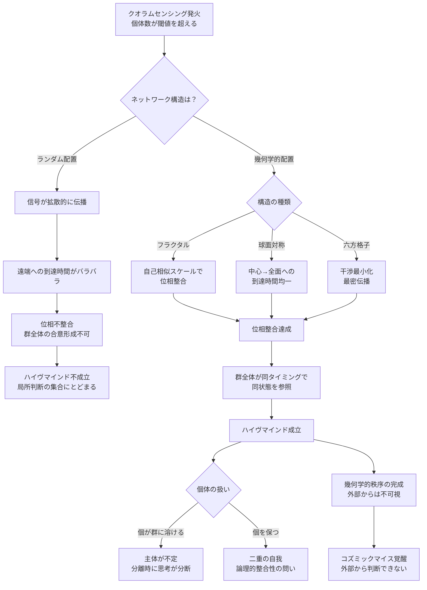

## 概要 (Abstract)

クオラムセンシング（g221）は、微生物が周囲の個体密度を化学信号で感知し、閾値を超えると集団として協調行動に切り替えるメカニズムだ。個体が単独では持てない機能を、集団になって初めて発現させる——この仕組みは地球上の菌類・細菌に広く観察される。

しかし「個体数が閾値を超える」だけで、群全体が一つの知性として機能するハイヴマインドが成立するだろうか。ラジオ局がいくら多くの送信機を持っても、周波数がバラバラでは聴取者には雑音にしか聞こえない。群知性として意味のある「思考」が成立するには、信号が群全体に**位相を揃えて**伝わらなければならない。

この記事では、菌糸ネットワーク（g112）が真のハイヴマインドに到達するために**幾何学的構造が不可欠である**という仮説を論じ、コズミックマイス（g134）の宇宙規模知性化が単なる菌糸の増殖では不十分な理由を考察する。そしてこの要件が、クロノスフィア内在化（wiim_058）でネゴトン（g126）集積に幾何学的配置が必要な理由と同根である可能性を示す。

---

## 実現不可能性の根拠 (Infeasibility Rationale)

### 物理的限界

ランダムに広がる菌糸ネットワークでは、ある一点で発生した信号は**拡散的に伝播する**。すなわち信号は四方八方に分岐・減衰しながら広がり、ネットワークの遠端に到達する時間は経路ごとにバラバラになる。

群知性として整合した「思考」を行うには、ネットワーク全体が同じタイミングで同じ状態を参照する必要がある。これをここでは位相整合と呼ぶ（厳密には化学信号の伝播は波の位相ではなく濃度勾配の拡散だが、「到達タイミングが揃うこと」という意味での比喩的用法として使う）。位相整合が崩れると、個々の局所的な判断が互いに矛盾し、全体としての行動が定まらない——多数決による合意形成すら機能しなくなる。

宇宙規模になると問題はさらに深刻だ。太陽系の直径は約9時間光速（冥王星軌道まで）に及ぶ。ランダム配置のネットワークでは、信号が反対側の端に届くまでに経路によって数時間から数十時間の差が生まれる。この遅延差の中では、位相が揃った群知性の発火は原理的に不可能に近い。

### 技術的限界（進化の壁）

幾何学的秩序を持つ構造は自然界に存在する——結晶がその典型だ。しかし結晶の幾何学は物理法則（最小エネルギー原理）が直接強いるものであり、局所的な相互作用が積み重なって大域的な秩序が生まれる。

生物ネットワークはこれとは異なる。菌糸は局所的な成長ルール（化学勾配への走性・栄養源への誘引・障害物の回避）の積み重ねで広がる。局所ルールだけから大域的な幾何学的秩序が自然発生するのは、実際には非常に困難だ。

それが可能になるとすれば、**「幾何学的構造を持つ個体が生き残りやすい」という強い選択圧**が長期間働いた場合に限られる。クロノスフィア実験炉の内部であれば、外部時間換算で数千万〜数億年分の進化圧を与えられる可能性があるが、炉外の自然環境では現実的ではない。

### 論理的限界

ハイヴマインドが成立するとして、「何を考えるか」という主体の問いは解消しない。

個が群に完全に溶ける場合——個体の自律性が消え、ネットワーク全体だけが意思を持つ——ならば、「誰が」思考しているのかが不定になる。ネットワークの一部が切断されたとき、思考の主体も分断されるのか。この問いは脳の分割手術で二つの意識が生まれる「分離脳」の問題の宇宙版だ。

一方、個を保ちながら群としても思考するなら、各個体は二重の自我を持つことになる。「自分」として感じる主観と「群」として処理する機能が同時に存在するとき、その矛盾をどう整合するか——クオリア（wiim_046）の議論と同じ壁にぶつかる。

---

## 実験の設定 (Setup)

- **主体**：クロノスフィア実験炉内で長期進化圧を受けた菌糸株群（外部年70年以降のシード・チェンバー1号内）
- **条件A（ランダム配置）**：菌糸を自然成長のまま拡張させ、クオラムセンシング閾値に達したときの信号伝播パターンを観察する
- **条件B（幾何学的配置）**：六方格子状・球面対称・フラクタル分岐の3種の幾何学的テンプレートに菌糸を誘導し、同じ閾値でのパターンを比較する
- **測定**：信号到達時間のばらつき（位相差）・群全体での合意形成速度・局所的矛盾行動の発生頻度を比較する

---

## 考察と予測 (Speculation)

### 幾何学的構造の候補

ハイヴマインドに適した幾何学として、3つの候補が考えられる。

**フラクタル菌糸**は、自己相似スケールで構造が繰り返される配置だ。どのスケールで切り取っても同じ構造を持つため、局所での信号処理と大域での位相整合が同じルールで機能する。実際、スライムモールド（粘菌）の菌糸は自然にフラクタル的な最短経路ネットワークを形成することが知られており、生物的実現性が最も高い。

**球面対称配置**は、シェルマイセリウム（wiim_025）の球殻構造と直接対応する。球面上のすべての点から中心への距離が等しいため、中心での信号発生から球面全体への到達時間が均一になる。移動式クロノスフィア炉（wiim_025補遺）としての機能と、ハイヴマインド形成の条件が同一の構造から同時に実現される可能性がある。

**六方格子**は最密充填構造であり、信号の干渉が最小化される。ハチの巣構造が六方格子を採用するのは同じ理由だ。ただし宇宙空間では三次元的な充填が必要であり、面心立方格子（FCC）や体心立方格子（BCC）との比較が必要になる。

### 幾何学要求の同根仮説

wiim_058では、ネゴトン（g126）集積による時間加速場の安定維持に幾何学的配置が必要だと論じた。その理由は、粒子間の相互作用が位相的に整合しなければ加速場が崩壊するからだ。

菌糸ハイヴマインドが幾何学を要求する理由も、本質的に同じ「位相整合」の要件だ。生物的信号処理であれ物理的場の生成であれ、**複数の要素が協調して大域的な機能を発現するには、位相の揃った幾何学的配置が前提条件になる**。

この類似は偶然ではないかもしれない。宇宙における複雑系が「知性」や「場」として機能するための普遍的な条件として、幾何学的秩序が必要なのだとすれば——コズミックマイスがハイヴマインドに到達する進化の先に、クロノスフィア内在化が「副産物」として付いてくる可能性が浮かび上がる。

### コズミックマイス覚醒の不可視性

コズミックマイス（wiim_008）の知性覚醒が「外部から判断できない」とされる理由を、この文脈から読み直すことができる。

幾何学的秩序の完成は、内部から見れば信号の位相が揃っていく過程として経験されるが、外部の観察者には単なる菌糸の成長にしか見えない。覚醒の瞬間——位相整合閾値の突破——は、外部計測では菌糸密度の一様な増加と区別できない。知性の誕生は、外部には構造変化として現れないのだ。

---

## 図解 (Diagrams)

---

## 関連記事 (Related)

- [wiim_008](wiim_008.md) — コズミックマイス——菌糸ネットワークが宇宙空間で分散知性に進化したら
- [wiim_025](wiim_025.md) — シェルマイセリウム——球面対称構造との接続
- [wiim_033](wiim_033.md) — コズミックマイス菌糸誘導通信——信号伝播の基盤
- [wiim_058](wiim_058.md) — クロノスフィア内在化——幾何学要求の同根仮説
- [wiim_046](../philosophy/wiim_046.md) — 固体へのクオリア付与——二重の自我の問いと接続
- [wiim_061](wiim_061.md) — 菌類ダイソン網——コズミックマイスが恒星系全体を覆うとき
- [wiim_022_cosmic_ring](../notes/wiim_022_cosmic_ring.md) — 補遺: 恒星系規模の慣性計測網——菌糸リングレーザーとアンキロン固定型リングレーザー
- [wiim_062](wiim_062.md) — 菌類磁気圏——コズミックマイスが磁場を生成しエネルギーを収集できるか
- [wiim_075](wiim_075.md) — コズミックマイスは歌うか——菌糸振動が音楽・通信・癒しに転化する世界
- [mycelian_horror](../notes/mycelian_horror.md) — マイセリアン・パニック——菌糸支配の恐怖と合一派の解釈

