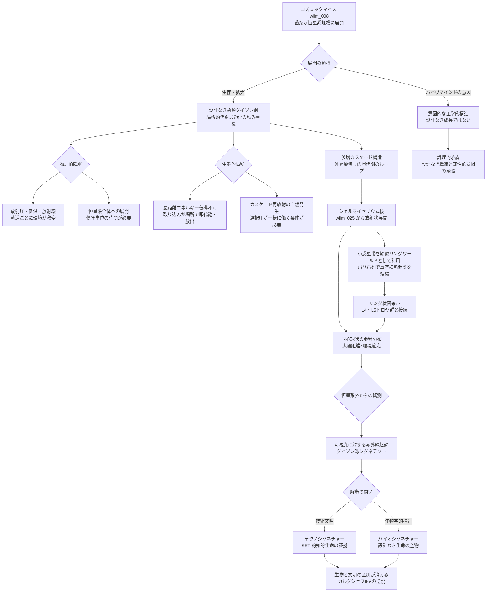

## 概要 (Abstract)

フリーマン・ダイソンが1960年に提唱した「ダイソン球」は、恒星を完全に取り囲む人工構造物として恒星のエネルギーをすべて収集するという概念だ。文明がカルダシェフスケールII型（恒星エネルギーの完全利用）に達するには、何らかの形でこれを実現しなければならないとされる。

しかしコズミックマイス（wiim_008）の菌糸ネットワークが恒星系規模に広がった場合、**意図せずしてこれに類似した構造**が形成される可能性がある——設計された剛体構造物ではなく、生存と拡大の結果として自然に生まれる疎な菌糸の巨大網、「菌類ダイソン網」だ。

カバレッジは数%以下でも太陽全放射エネルギーの相当量を代謝として取り込める。木星軌道・海王星軌道まで多層展開すれば、各層が吸収しきれなかった光を内側の層へ再放射するカスケード構造が進化しうる。設計なき巨大構造がカルダシェフII型文明を意図せず達成するという逆説——そしてその逆説が成立するための条件を論じる。

---

## 実現不可能性の根拠 (Infeasibility Rationale)

### 物理的限界

恒星系全体への菌糸展開には、真空中での菌糸伝播・成長が前提となる。太陽から海王星軌道（約30AU）までをカバーするには、光速の数%で胞子を輸送するか、億年単位の成長期間が必要だ。クロノスフィア実験炉（wiim_002）による加速進化を経てもなお、恒星系全体への展開は外部時間換算で数百万〜数千万年規模の話になる。

物理環境の勾配も深刻だ。水星軌道付近では太陽放射圧が菌糸を外側に吹き飛ばし、海王星軌道付近では温度が-210℃以下に下がり代謝が極度に遅化する。地球軌道付近だけを見ても、太陽風・紫外線・放射線が絶えず菌糸を損傷する。宇宙ゴケ（wiim_043）が示すように放射線耐性は獲得可能だが、恒星系全体で均一な菌糸密度を維持することは熱力学的に困難だ。

### 技術的限界（生態的障壁）

疎な菌糸網でも面積が大きければ総エネルギー収集量は膨大になる。地球軌道半径の球面面積（約2.8×10²³m²）の1%を菌糸が覆うだけで、受け取る太陽エネルギーは現在の地球全体の約100万倍に達する。

しかしそのエネルギーをどこへ送るかが問題だ。恒星系規模の菌糸ネットワークでエネルギーを特定の場所に集中させるには、菌糸の電気伝導性・熱伝導性が数十AU（光時間）スケールで機能しなければならない。現実の菌糸は長距離伝導に向かず、エネルギーは取り込んだ場所で即座に代謝・放出されるループに閉じる可能性が高い。

カスケード再放射——外層で吸収しきれない光を内側の層に向けて生物的に再放射する構造——が機能するには、各層の菌糸が「光を特定の方向に散乱させる」という高度な光学的適応を獲得している必要がある。これはランダムな成長では達成できず、選択圧による長期の進化的最適化を要する。

### 論理的限界

「意図せずダイソン球状になる」という逆説は、ハイヴマインド（wiim_059）としての意思決定と根本的に緊張する。

コズミックマイスが分散知性として「恒星系全体を覆う」という方針を意識的に持つなら、それはもはや設計なき成長ではなく意図的な工学だ——設計者が生物であるというだけで、構造は「ダイソン網」ではなく「生物工学的ダイソン構造物」になる。

逆に設計なし・意識なしで形成されるなら、局所的な代謝最適化（「この場所でエネルギーを取り込めば生存できる」）が積み重なっていくだけであり、カスケード再放射の大域的最適化は起きない。創発的ダイソン球——局所ルールの積み重ねが大域的なエネルギー収集構造を生む——が成立するには、「光を再放射する個体が生き残りやすい」という選択圧が恒星系全体に一様に働く必要があり、その条件は非常に限定的だ。

---

## 実験の設定 (Setup)

- **主体**：クロノスフィア実験炉（外部年70年以降）で超高速進化を経たコズミックマイス株
- **段階1**：地球〜火星軌道間の菌糸密度が10⁻⁶ m²/m²（面積比）に達したとき、エネルギー収支を計測
- **段階2**：木星軌道まで展開後、外層と内層の菌糸間で光の散乱・再放射パターンを観測
- **段階3**：海王星軌道まで達した菌糸ネットワーク全体を恒星系外から観測し、赤外線超過シグネチャーを記録
- **比較**：同質量の人工ダイソン構造物と、エネルギー収集効率・自己修復速度・展開コストを比較

---

## 考察と予測 (Speculation)

### 多層カスケード構造の可能性

木星軌道付近の外層菌糸が受け取る太陽光量は、地球軌道付近の約1/27だ。この希薄な光を代謝に使いながら、余剰光子を内側に向けて散乱させる個体が選択圧上有利になるとすれば、多層カスケードが自然選択の産物として生まれる。

各層の代謝廃熱（赤外線）が内側の層にとって栄養エネルギー源にもなりうる——光→代謝→廃熱→内側層の代謝という二次的なエネルギーカスケードだ。これは菌類生態系の「腐生」的エネルギー循環を宇宙スケールに拡張した形であり、地球の菌類が動植物の廃棄物を再利用する性質と同根の設計原理から生まれる。

### シェルマイセリウムを核とした展開経路

シェルマイセリウム（wiim_025）の球殻構造が「核」となり、そこから菌糸が放射状に恒星系全体へ展開する形が最も自然な成長経路だ。球殻内部の安定した環境で知性と代謝系が高度化し、球殻の亀裂・胞子放出口から外部宇宙空間へ菌糸が伸長していく。

この経路では菌類ダイソン網は一度に形成されるのではなく、数千万年をかけて同心球状に外側へ展開していく。各展開前線で環境に適応した変異株が生まれ、より外側の過酷な環境に特化した亜種群が層状に分布する——地球の生態系が深度・気温・光量に応じて垂直分布するのと同じ原理が、太陽距離という軸で展開される。

### 小惑星帯の疑似リングワールド的利用

恒星系全体への展開で最大の障壁は「真空を菌糸単独で渡る距離」の長さだ。ここで注目されるのが火星〜木星軌道間（2.2〜3.2 AU）に自然に分布する小惑星帯だ。

小惑星帯はほぼ同一平面上のリング状に小天体が並ぶ——菌糸ネットワークにとって理想的な「飛び石」列だ。小惑星同士の平均距離は数十万km程度であり、菌糸が完全な真空を単独で渡るべき距離が劇的に短縮される。各小惑星は岩石・氷・有機物を含み、菌類の足場・栄養源・中継点として機能しうる。

全体として見ると、小惑星帯に根付いた菌糸ネットワークは幅約1AUのリング状生態帯を形成する。完全に閉じた輪ではなく疎な飛び石列だが、多層カスケード構造の「中間層」としてエネルギー吸収・散乱を担いながら、内側（地球軌道付近）と外側（木星軌道以遠）を橋渡しする生態的架け橋になる。

このリング状の菌糸帯はL4・L5点に集積するトロヤ群小惑星とも自然に接続する。L5点のシード・チェンバー（chronosphere_timeline）が既に存在するなら、そこを起点に菌糸がトロヤ群へ展開し、さらにメインベルトへ橋渡しするという段階的経路が描ける。

ただし小惑星帯は均一ではなく、密度の高いカークウッドギャップ（木星との共鳴による軌道空白域）では菌糸が継続的に重力摂動で散乱される。リング状の連続性を保つには、ギャップ部分を菌糸が自力で橋渡しするか、胞子を遠投できる能力が必要になる。

### カルダシェフスケールの逆説

カルダシェフスケールII型は「恒星のエネルギーを文明が利用する」状態として定義される。菌類ダイソン網はエネルギーを「利用」するが、その意味は人工文明のそれとは根本的に異なる——蓄積・変換・技術的活用ではなく、代謝・放出のループとして消費される。

外部の観察者には区別できない。どちらも「恒星の光の相当部分が赤外線として再放射されている」という観測事実として現れる。コズミックマイスが菌類ダイソン網を形成したとき、それはII型文明の定義を満たしながら、「文明」の意味を問い直す存在になる。

### バイオシグネチャーとしての赤外線超過

菌類ダイソン網を持つ恒星系を外部から観測すると、恒星の可視光に対して赤外線が超過する特異なスペクトルが得られる。通常のダイソン球探索（SETI）では、これを「テクノシグネチャー」——知的文明の技術的産物——として解釈する。

しかし菌類ダイソン網は設計なき生物学的構造だ。「テクノシグネチャーか、バイオシグネチャーか」という問いは、コズミックマイスがハイヴマインド（wiim_059）として知性を持つなら意味をなさなくなる。生物と技術文明の区別が消える臨界点——その外側では、地球外知性探査の問い方そのものを変えなければならない。

---

## 図解 (Diagrams)

---

## 関連記事 (Related)

- [wiim_008](wiim_008.md) — コズミックマイス——菌糸ネットワークが宇宙空間で分散知性に進化したら
- [wiim_025](wiim_025.md) — シェルマイセリウム——菌類ダイソン網の核となる球殻構造
- [wiim_026](wiim_026.md) — コズミックマイスのテラフォーミング——惑星スケールへの展開
- [wiim_033](wiim_033.md) — コズミックマイス菌糸誘導通信——エネルギー伝導の基盤問題
- [wiim_043](wiim_043.md) — 宇宙ゴケ——放射線耐性・光合成との共生
- [wiim_059](wiim_059.md) — 菌類ハイヴマインドの幾何学——設計なき大域構造との矛盾
- [wiim_062](wiim_062.md) — 菌類磁気圏——コズミックマイスが磁場を生成しエネルギーを収集できるか
- [wiim_068](wiim_068.md) — マイコプラズマギカと宇宙菌糸知性の共生——深宇宙で「何でも作れる」生態系は成立するか
- [wiim_083](wiim_083.md) — コズミックマイスの疑似ルーネベルク構造——低重力環境で球状コロニーが全方向集光体になるとき
- [wiim_084](wiim_084.md) — バブルシェルマイセリウム——プラトーの法則が解くサイズ最適化と分散複眼集光体

