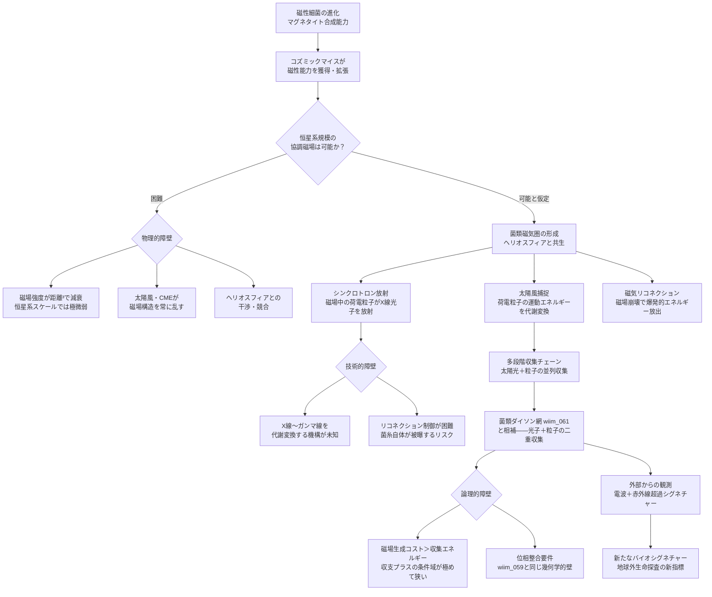

## 概要 (Abstract)

地球には磁性細菌——マグネタイト（Fe₃O₄）を体内で合成し、地磁気を感知してナビゲーションに利用する微生物——が存在する。この能力は進化的に獲得されたものであり、コズミックマイス（wiim_008）が長期進化を経て同様の機構を拡張・協調させれば、恒星系規模の磁場構造を菌糸ネットワーク全体で生成できる可能性がある。

生物的磁場が実現すれば、エネルギー収集の幅が劇的に広がる。太陽光（光子）だけでなく、太陽風（荷電粒子の流れ）を磁場で偏向・捕捉して代謝に変換できる——いわば菌類版「磁気帆」だ。さらに磁場中を高速移動する荷電粒子はシンクロトロン放射として光子を放射し、その光子を菌糸が吸収する連鎖も生まれる。磁場構造の崩壊（磁気リコネクション）が起こす爆発的エネルギー放出を制御できれば、菌類ダイソン網（wiim_061）のエネルギー収集効率を桁違いに高めることができる。

しかしこれを実現するための壁は、生物学的・物理的・論理的の三層にわたって積み重なっている。

---

## 実現不可能性の根拠 (Infeasibility Rationale)

### 物理的限界

恒星系規模の協調磁場を生成するには、菌糸ネットワーク全体が磁気的に整合した向きで磁性粒子を配置し維持しなければならない。しかし太陽風・惑星重力・熱揺らぎ・宇宙線が常に磁場構造を乱す。

特に太陽自身が強力な磁場を持ち、太陽風がその磁場を運んで形成するヘリオスフィア（太陽圏）が太陽系全体を包んでいる。11年周期の極性反転・コロナ質量放出（CME）・太陽フレアによってこの構造は絶え間なく変動している。生物的磁場がこれと干渉した場合、強化されるか打ち消されるかは磁場の幾何学的配置次第だが、いずれにせよ制御が難しい。

また磁場強度は距離の三乗で減衰する。菌糸が個々に生成できる磁場は極めて微弱であり、恒星系規模の有効な磁場を形成するには天文学的な数の菌糸が完全に整合した向きで配置される必要がある。これは菌類ハイヴマインドの幾何学（wiim_059）で論じた「位相整合」要件の磁気版であり、同様の困難を抱える。

### 技術的限界（生態的障壁）

シンクロトロン放射の利用には根本的な障壁がある。磁場中を相対論的速度（光速に近い速度）で運動する荷電粒子が放射するシンクロトロン光子のエネルギー帯は、粒子の速度によって電波・軟X線からガンマ線に及ぶ。太陽風の荷電粒子は通常、非相対論的速度（光速の0.1〜0.3%程度）であり、この場合の放射は電波〜軟X線域が主体となる。菌類磁気圏が恒星系規模の加速器として機能し粒子を相対論的速度まで加速できれば、より高エネルギーの光子放射が得られる。現在知られる光合成・化学合成はこのエネルギー帯に対応していない——可視光・近紫外線の範囲でしか機能しない光合成色素では、高エネルギー光子を代謝に取り込むことができない。

放射線耐性菌（wiim_043が参照する放射線栄養菌）は高エネルギー放射線を「栄養」とするが、これは電離放射線が引き起こす化学反応を間接的に利用するものであり、光子エネルギーを直接代謝に変換する機構とは異なる。シンクロトロン光子の直接吸収・代謝変換には、既存の生化学経路では実現できない新たな分子機構が必要だ。

磁気リコネクションの誘発・収集はさらに困難だ。磁気リコネクションは磁場の位相が急激に変化する「電流シート」で起きる現象であり、制御には精密な磁場形状の管理が必要だ。意図的に誘発しようとすれば、プラズマの不安定性が連鎖的に広がり、菌糸自体が高エネルギー粒子に被曝して損傷する逆効果を生む可能性がある。

### 論理的限界

磁場生成・維持にはエネルギーコストが伴う。菌糸がマグネタイトを合成するには鉄イオンの取り込み・還元・結晶化という代謝経路が必要であり、これは決してエネルギーフリーではない。さらに恒星系規模で磁場の整合性を維持するには、菌糸間の継続的な「位相調整」コストが積み重なる。

収支が成立するのは、太陽風密度・菌糸密度・磁場強度の三つが特定の閾値を同時に超えた場合に限られる。太陽から遠ざかるほど太陽風密度は低下し、菌糸密度も希薄になる——つまり磁場生成コストが高くなる領域ほど、収集できるエネルギーも少なくなる。この逆相関が「菌類磁気圏が進化的に有利な条件域」を極端に狭める。

---

## 実験の設定 (Setup)

- **主体**：クロノスフィア実験炉で磁性細菌遺伝子を導入・進化させたコズミックマイス前駆株
- **条件A（単体）**：単一菌糸のマグネタイト合成量・磁気モーメントを計測
- **条件B（ネットワーク）**：地球〜火星軌道間の菌糸ネットワークが協調して生成した磁場の強度・方向性の整合度を観測
- **エネルギー収支**：磁性粒子合成コスト・磁場維持コストと、太陽風捕捉・シンクロトロン光子吸収による代謝取得量を比較
- **ヘリオスフィアとの干渉**：生物的磁場がヘリオスフィア構造に与える変化を観測

---

## 考察と予測 (Speculation)

### 太陽風捕捉——菌類版磁気帆

太陽風は毎秒400〜800kmで飛来する陽子・電子の流れだ。地球の磁気圏はこれを偏向してオーロラとして可視化するが、エネルギーとしての直接利用はしていない。菌類磁場がこの荷電粒子を螺旋状に捕捉・減速させ、その運動エネルギーを化学反応に変換できれば、太陽光に次ぐ第二のエネルギー源になる。

宇宙ゴケ（wiim_043）が電離放射線を代謝に利用する能力の「磁場制御版」として進化するシナリオだ。太陽から離れた軌道では太陽光が希薄になる一方、太陽風密度の低下は光量の低下より緩やかであり、外軌道では相対的に太陽風が重要なエネルギー源になりうる。

### 多段階エネルギー収集チェーン

菌類磁気圏が完全に機能した場合、エネルギー収集は以下の多段階チェーンで実現される：

1. **太陽光（可視光・近紫外）**：光合成型菌糸が直接吸収
2. **太陽風（荷電粒子）**：磁場で偏向・減速し運動エネルギーを化学エネルギーに変換
3. **シンクロトロン光子（X線域）**：磁場中で減速する荷電粒子が放射する光子を特化型菌糸が吸収
4. **磁気リコネクション（爆発的放出）**：磁場崩壊域の近傍に配置した特化型菌糸が瞬間的高エネルギーを捕捉

各段階で取りこぼしたエネルギーを次の段階が回収する構造は、菌類ダイソン網（wiim_061）の多層カスケードと相補的に機能する——光子カスケードと粒子カスケードが並列に走る二重収集系だ。

### ヘリオスフィアとの共生

太陽のヘリオスフィアは太陽系を銀河宇宙線から保護する「生命の盾」だ。コズミックマイスの菌類磁気圏がヘリオスフィアと整合する向きで形成されれば、既存の磁場構造を局所的に増幅し、宇宙線からの保護を強化しながら太陽風エネルギーをより効率的に捕捉できる——共生型の磁気圏構造だ。

逆にヘリオスフィアと競合する向きで形成されると、磁場の中和・リコネクション頻発が起き、菌糸ネットワーク自体が大量の宇宙線に被曝するリスクがある。ハイヴマインド（wiim_059）として機能するコズミックマイスがこの問題を「認識」し、ヘリオスフィアと整合する磁場幾何学を選択できるかが、菌類磁気圏の成否を分ける。

### 外部からの観測可能性

菌類磁気圏が形成された恒星系は、可視光・赤外線（wiim_061）に加えて電波・X線帯域でも特異なシグネチャーを持つ。シンクロトロン放射は電波帯からX線帯まで広いスペクトルで放射されるため、「電波超過＋赤外線超過」が同時に観測される恒星系は菌類磁気圏の候補天体として識別できる可能性がある。これは地球外生命探査における新たなバイオシグネチャーの定義になりうる。

---

## 図解 (Diagrams)

---

## 関連記事 (Related)

- [wiim_008](wiim_008.md) — コズミックマイス——分散知性の担い手
- [wiim_043](wiim_043.md) — 宇宙ゴケ——放射線栄養能力の先行例
- [wiim_059](wiim_059.md) — 菌類ハイヴマインドの幾何学——磁場整合の位相整合問題と同根
- [wiim_061](wiim_061.md) — 菌類ダイソン網——光子収集との相補関係
- [wiim_083](wiim_083.md) — コズミックマイスの疑似ルーネベルク構造——低重力環境で球状コロニーが全方向集光体になるとき

