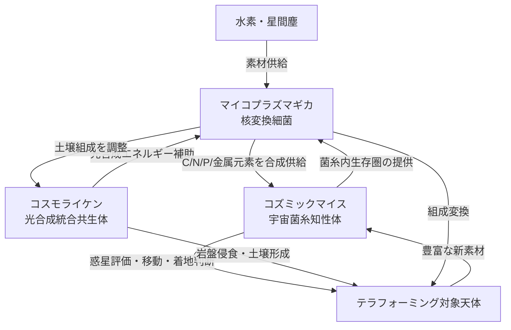

## 1. 概要 (Abstract)

宇宙空間で生存できる生命体が、元素そのものを書き換えられる生命体と共生したとしたら——物質的に閉じた生態系が深宇宙に成立するかもしれない。

> **前提:** マイコプラズマギカ（生物的核変換細菌）が、コズミックマイス／コスモライケン（宇宙菌糸知性体）の菌糸内に定着し、相互利益をもたらす共生関係を結ぶことができると仮定する。
> **命題:** 「もしこの共生が成立したなら、水素だけを原料として宇宙空間で何でも作れる自律生態系が生まれるか？」

マイコプラズマギカ（g130）は酸素を必要とせず生存・増殖できる架空の合成細菌で、原子核を操作して任意の元素を合成する生物的核変換能力を持つとされる。一方、コズミックマイス（g134）とその共生体コスモライケン（g245）は宇宙空間を自力で移動・定着できるが、恒星から遠い深宇宙では光合成が限界を迎え、エネルギーと素材の自給に行き詰まるという設定上の弱点を持つ。

この2者が共生関係を結んだとき、互いの弱点を補完し合い、現在の宇宙生物学では想定できない「物質自給型宇宙生態系」が誕生しうるという仮説を論じる。

---

## 2. 実現不可能性の根拠 (Infeasibility Rationale)

- **物理的限界:** 生物的核変換の核心にある「核力の壁」は、タンパク質が扱える電磁力の領域と桁違いに乖離している。陽子1個の核外への引き剥がしには約800万電子ボルト（MeV）規模のエネルギーが必要で、これは化学反応（数eV〜数十eV）より約10億倍以上大きい。菌糸の常温・常圧環境でこの障壁を越える経路は現行物理では存在しない。

- **技術的限界:** 現行設定ではマイコプラズマギカは**コンタクトプローブ**との協調なしに核変換を発動できない（暴走・野生化防止機構）。深宇宙環境では人工プローブの持ち込みが前提となるが、共生体の菌糸網が生物学的な「プローブ代替」として機能できるかどうかは未検証であり、設計上の重大な制約として残る。菌糸による微細な電気信号や化学信号が核操作小器官を制御できるほど精密かどうかは、現在の合成生物学の射程外にある。

- **論理的限界:** コズミックマイスは太陽系規模の分散知性を形成するとされる。真の知性体であれば「共生」の条件を自ら評価・交渉する可能性があり、一方的な利益供与による共生は成立しない。マイコプラズマギカが提供できる元素変換の利益とコズミックマイスが提供する生存圏の価値が対等でなければ、共生は寄生または排除に転化しうる。知性体との共生協定の設計は、生物学ではなく外交の問題となる。

---

## 3. 実験の設定 (Setup)

1. **マイコプラズマギカ（変換者）:** 核操作小器官ニュクレアソームを持つ合成細菌。酸素不要で生存・増殖可能。深宇宙の真空・放射線環境では単体での生存は困難であり、生存可能な微小環境の提供を必要とする。
2. **コズミックマイス／コスモライケン（宿主兼拠点）:** 放射線耐性・宇宙真空耐性を持ち、菌糸ネットワークで移動・思考する分散知性体。コスモライケンはシアノバクテリア光合成層を統合しており、恒星近傍では自給可能だが、深宇宙では光エネルギーが極端に乏しく、炭素・窒素・金属などの重元素も現地調達が困難。
3. **共生の提案内容:** コズミックマイスがマイコプラズマギカのために菌糸内部に温度・圧力・化学保護を備えた微小生存圏を提供する。その対価として、マイコプラズマギカは宇宙で最も豊富な元素である水素を出発点に、コズミックマイスが必要とする炭素・窒素・リン・金属元素などを変換・供給する。

---

## 4. 考察と予測 (Speculation)

### 共生によって可能になること

この共生が成立したとき、個々の生命体では不可能だった能力が組み合わさり、4つの新しい地平が開かれると考えられる。

**① 深宇宙での元素自給**

宇宙の質量の約74%を占める水素は、恒星間空間にも散在する最も入手しやすい素材だ。マイコプラズマギカが水素を炭素・窒素・酸素・リン・鉄などへ変換できるなら、恒星から何光年も離れた宙域でも共生体は必要な物質をほぼすべて調達できる。これは従来の宇宙生命体が抱えていた「遠距離では使える素材が水素とヘリウムしかない」という根本的な制約を解消する。ただし核物理の観点では、水素から鉄（Fe）までの元素合成は発熱プロセスだが、鉄より重い金属（銅・金・ウランなど）の合成には莫大なエネルギー投入が必要な吸熱プロセスとなる。深宇宙で超重元素を生成するには、その分のエネルギー源も共生体内で賄わなければならないという追加の制約がある。

**② 天体の丸ごと変換**

採掘では使えない組成の小惑星や彗星核も、核変換によって目的の元素に丸ごと書き換えることができると考えられる。鉄とニッケルだけで構成された金属型小惑星を炭素・水素・窒素リッチな有機物天体へ変換する、あるいは逆に炭素質天体から金属材料を合成する——という、採掘ではなく「変換」による資源獲得が可能になる。これはコスモライケンのテラフォーミング能力を、天体の初期組成に縛られない水準へ引き上げる。

**③ 組成を選ばないテラフォーミング**

コスモライケンの現行設定では、着地後に地衣類が岩盤侵食と土壌形成を開始するが、岩盤の元素組成が偏りすぎていると植物系の定着が難しい。マイコプラズマギカが現地で土壌組成を必要な元素比に調整できるなら、どんな組成の岩石惑星も生命活動に適した下地へ作り変えられる。炭素の少ない岩石惑星でも、水素さえあれば有機物基盤を現地で造れるという計算になる。

**④ 補給ゼロの自己増殖型生態系**

最も根本的な変化は、外部からの物質補給を必要としない「閉じた生態系」の成立だ。コズミックマイスが生存圏を拡張するほどマイコプラズマギカの住処も増え、住処が増えるほど変換能力も増強される正のフィードバックが生まれる。通常の宇宙移民計画では資源の枯渇が必ず問題になるが、この共生体は宇宙空間に漂う水素と星間塵だけを入力として、自己の成長に必要な全素材を内製できる。

### 哲学的な問い

- コズミックマイスが共生を「利益があると判断して受け入れた」とき、その判断は「合意」と呼べるか？そして合意のある共生は、人類と共生体との間にどんな倫理的関係を生むか？
- 元素変換能力を持つ生命体が宇宙規模で自己増殖した場合、特定の元素比を維持して形成されてきた天体の組成が系統的に変化しうる——これは「宇宙環境汚染」と呼ぶべき事態か？

---

## 5. 図解 (Diagrams)

---

## 6. 関連記事 (Related)

- [wiim_024](wiim_024.md) — マイコプラズマギカ——最小生命体による生物的核変換が可能な世界
- [wiim_043](wiim_043.md) — 宇宙ゴケ——地衣類とコズミックマイスの共生が生む自律型テラフォーミング艦（コスモライケンの元記事）
- [wiim_008](wiim_008.md) — コズミックマイス——菌糸ネットワークが宇宙空間で分散知性に進化したら
- [wiim_025](wiim_025.md) — シェルマイセリウム——コスモシェルとコズミックマイスの共生が生む自律型宇宙生命体カプセル
- [wiim_026](wiim_026.md) — コズミックマイスのテラフォーミング——シェルマイセリウムの大気圏降下と惑星統合
- [wiim_061](wiim_061.md) — 菌類ダイソン網——コズミックマイスが恒星系全体を覆うとき
