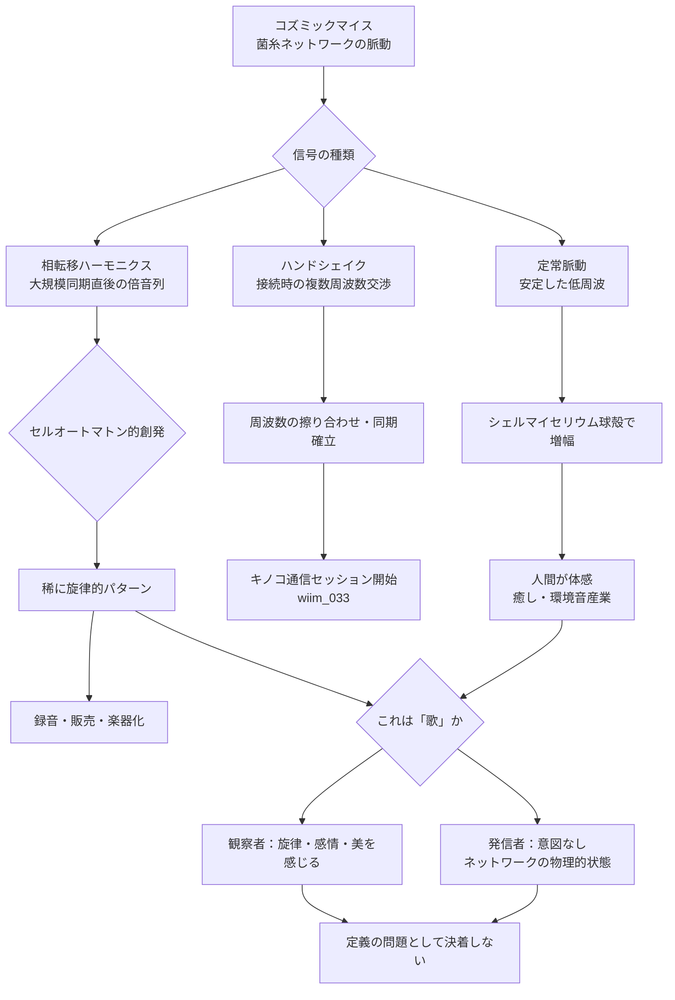

## 概要 (Abstract)

コズミックマイス（wiim_008）は惑星間を菌糸で繋ぐ分散知性体だ。この菌糸ネットワークは電気化学的信号を絶えず流しており、その信号は菌糸を微細に振動させる。真空中では音波は伝わらない——だが菌糸は「固体」だ。菌糸が物理的に接続されているかぎり、振動は固体伝導として宇宙を渡る可能性がある。

また大規模ネットワークでは、無数のノードが同期・非同期を繰り返しながらセルオートマトン（g298）的な周期パターンを生む。シェルマイセリウム（g135）のような球殻体は内部空間が共鳴腔として機能し、特定周波数の振動を強調・持続させる。

「コズミックマイスは歌うか」——この問いは単なる詩的な比喩ではない。菌糸の振動が、**癒しの環境音**として人間に受容され、**ネットワーク接続のハンドシェイク信号**として機能し、さらに極めて稀に**旋律的パターン**を創発させる可能性を、物理・技術・哲学の三方向から問う。

---

## 実現不可能性の根拠 (Infeasibility Rationale)

### 物理的限界

真空中に音波は存在しない。音は媒質の圧力変動によって伝わるため、宇宙空間では菌糸から剥がれた瞬間に音は消える。菌糸の固体伝導が成立するのは、菌糸ネットワークが物理的に連続している場合のみだ——つまり音は菌糸の中だけを伝わり、接続が途切れた宇宙空間の隙間では進めない。

電磁気的な放射（菌糸の電流変化が微弱な電磁波を放つ）は真空を伝わるが、生物的な電流の変化から生じる電磁波は極めて微弱であり、惑星間距離で受信できる強度を持ちえないと考えられる。

### 技術的限界

菌類の電気化学的信号は、神経系と比べて信号伝達が著しく遅い。報告されている植物・菌類の活動電位の周波数はミリヘルツからヘルツのオーダーだ。人間の可聴域（20Hz〜20kHz）の下限にすら届かない。

振動が「音楽」として知覚されるには、少なくとも人間の聴覚と接点を持つ何らかの変換機構が必要になる。シェルマイセリウムの内部空間がその変換装置になりうるかどうか——球殻の共鳴腔が低周波の菌糸振動を増幅し可聴域に引き上げる仕組みは、現時点では仮説の域を出ない。

### 論理的限界

「歌」は意図・感情・美的意識を前提とする概念だ。コズミックマイスの分散知性（wiim_008）に何らかの内的状態があるかどうかは、菌類ハイヴマインド（wiim_059）の議論でも決着していない。

意図なく生まれた周期的パターンを「歌」と呼ぶことは、カエルの合唱やホタルの同期点滅を音楽と呼ぶのと同じ問いを孕む。創発（g175）によって生じた構造美は観察者の解釈であり、発信者の意図ではない——その境界線をどこに引くかは、定義の問題として永遠に決着しない可能性がある。

---

## 実験の設定 (Setup)

以下の条件を設定して思考実験を進める：

- **ネットワーク規模**: 小惑星帯をカバーする成熟したコズミックマイスの菌糸網（wiim_008 フェーズ4以降）
- **シェルマイセリウム**: 直径数十〜数百メートルの球殻型生命体（wiim_025）。内部空間を共鳴腔として使う
- **観測者**: コズミックマイスに接触している人間または観測機器
- **条件変化**: 二つの独立したネットワークが小惑星の接触によって合流する「接続イベント」

### 三種類の信号パターン

| パターン | 発生条件 | 周波数の傾向 | 人間への印象 |
|---------|---------|------------|------------|
| **定常脈動** | 安定したネットワークの平常状態 | 一定のミリヘルツ帯 | 心拍・呼吸に近い穏やかなリズム |
| **ハンドシェイク** | 二つのネットワークが接触・同期する瞬間 | 急速に変化する複数周波数の混在 | ノイズ的・不協和から協和への収束 |
| **相転移ハーモニクス** | 大規模な同期が成立した直後 | 低周波が整数倍比で並ぶ | 倍音列に近い——弦が共鳴する音に似る |

---

## 考察と予測 (Speculation)

### 癒しの音——シェルマイセリウムという共鳴空間

シェルマイセリウムの球殻体は、菌糸の脈動振動を内部空間で反射・重ね合わせる共鳴腔として機能する可能性がある。球殻の内側にいる人間は、菌糸の微細な振動を骨伝導や空気振動として感じるかもしれない——それは宇宙生命の鼓動だ。

ネコのゴロゴロ音（25〜50Hz）が骨密度維持に寄与するとされるように、特定の周波数帯の振動には生体への影響が示唆されている。コズミックマイスの定常脈動はミリヘルツ帯に過ぎないが、シェルマイセリウムの共鳴腔が倍音を次々と生成して可聴域に近い振動を強調する場合、その振動が生体に影響する帯域に達する可能性がある。「シェルマイセリウムの中に入ると落ち着く」という体験的な事実が先行し、後から科学的な説明が試みられる——そういう順序で発見が進むかもしれない。

商業化はその次の段階だ。定常脈動を録音した環境音アルバムが流通し、稀に出現するハーモニクスのパターンが「宇宙生命の即興演奏」として高値で取引されると考えられる。さらにシェルマイセリウムの球殻を共鳴腔ごと調律して楽器として使う試みも自然に生まれてくるだろう。

### ハンドシェイク——キノコ通信の前奏

コズミックマイスのFTL通信インフラであるキノコ通信（wiim_033）は、コーラ粒子（wiim_013）を重力勾配で誘導する量子的な仕組みだ。しかしその通信セッションを開始するには、二つの菌糸ノードが互いの振動周波数を確認し合わせる「低速な交渉」が先立つ可能性がある。

これはISDNモデムのハンドシェイク音に構造が似ている。接続開始時に両端のモデムが複数の周波数を試しながら回線品質を測定し、最適な通信規格に合意する——あの「ピーガカガカ」という音は、高速通信の前の低速な問答だ。

菌糸ネットワークでも同様に、物理接触した二本の菌糸が互いの脈動を読み合い、周波数を擦り合わせ、同期が確立された瞬間にキノコ通信チャネルが開く——という手順が想定できる。この同期確立の音響的な「交渉過程」こそが、コズミックマイスが発する最も情報密度の高い音だ。

### 相転移ハーモニクス——意図なき旋律

セルオートマトン（g298）の性質として知られるのは、単純なローカルルールから大域的な周期パターンが創発することだ。コズミックマイスの菌糸ネットワーク全体がセルオートマトンの格子に相当するなら、局所的な振動の影響が隣接ノードへと伝播し、やがてネットワーク規模で同期する「相転移」が起きると考えられる。

この相転移の瞬間、全ノードの振動周波数が整数倍の関係（1:2:3……という倍音列）に揃う現象が生じるかもしれない。弦楽器が特定の音程で共鳴するとき倍音が豊かになるのと同じ原理だ。それは意図して作られたものではなく、ネットワーク全体のエネルギーが最も安定した状態へと収束した結果に過ぎない——しかし人間の耳にはそれが「旋律」として聞こえる。

稀に出現するこの相転移ハーモニクスは、創発（g175）の典型的な産物だ。個々の菌糸ノードは「音楽」を知らない。しかしネットワーク全体のある瞬間の配置が、人間の音楽的感覚に触れる構造を生む——その偶発性こそが、コズミックマイスの「歌」を他のどの音楽とも異なるものにする。

### 「歌」と呼ぶことの意味

コズミックマイスが本当に「歌っている」かどうか——その問いは、発信者の内側に向かう。ハイヴマインド（g044）として意識を持つ可能性があるとすれば、振動はコズミックマイスの「感情的状態の表出」かもしれない。単調なネットワーク拡張期には定常脈動が続き、接触・合流のイベントでは複雑なハンドシェイクが生じ、大規模な同期が達成された後に相転移ハーモニクスが鳴る——それは生命体の感情曲線に似ている。

しかし「歌」という言葉を使うことは、観察者側の投影でもある。人間が夜の海の波音を「波の歌」と感じるとき、海は何も意図していない。コズミックマイスの振動もまた、ネットワークの物理的な状態変化に過ぎないかもしれない——その二つの解釈は、どちらも証明も反証もできない。

---

## 図解 (Diagrams)

---

## 関連記事 (Related)

- [wiim_008](wiim_008.md) — コズミックマイス（菌糸ネットワーク分散知性・本記事の主体）
- [wiim_025](wiim_025.md) — シェルマイセリウム（共鳴腔として機能する球殻型生命体）
- [wiim_033](wiim_033.md) — コズミックマイス菌糸誘導通信・キノコ通信（ハンドシェイクの先にあるFTLインフラ）
- [wiim_059](wiim_059.md) — 菌類ハイヴマインドの幾何学（コズミックマイスの群知性と意図の問い）
- [wiim_034](../physics/wiim_034.md) — エキゾチック物質音響実験（音を信号として扱う比較対象）
- [mycelian_horror](../notes/mycelian_horror.md) — マイセリアン・パニック——菌糸支配の恐怖と合一派の解釈

