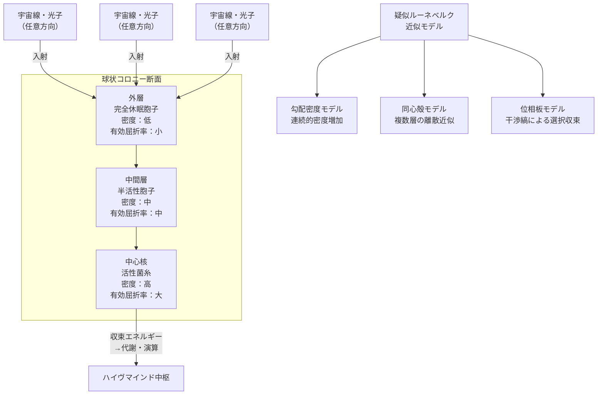

## 1. 概要 (Abstract)

コズミックマイス（[g134](../../glossary/terms/g134.md)）は放射線をエネルギー源とする宇宙適応菌糸知性体だが、宇宙空間で利用できる放射線は等方的に薄く分布している。個々の菌糸細胞が受け取るフラックスは微量に過ぎず、代謝を維持するためには収集面積を稼ぐか、エネルギーを一箇所に集中させるしかない。

> **前提:** 低重力環境（G < 10⁻³ g）では生物由来の薄膜構造がキロメートル規模に展開できる。
> **命題:** 「もしコズミックマイスが球状コロニー全体を疑似ルーネベルクレンズとして形成できたなら、全方向からの放射線を中心核に収束させる自律型集光生命体となれるか？」

ルーネベルクレンズ（[g334](../../glossary/terms/g334.md)）は球内の屈折率が中心から表面に向けて連続的に変化することで、どの方向から入射した波も球の反対側の一点に完全収束させる光学構造だ。生物組織がこの数学的理想を完全に実現することは不可能だが、**胞子（[g111](../../glossary/terms/g111.md)）の密度勾配が屈折率勾配を代替する**疑似構造ならば、自然選択の範囲内で近似できると考えられる。

---

## 2. 実現不可能性の根拠 (Infeasibility Rationale)

- **物理的限界:** ルーネベルクレンズが要求する屈折率分布は数学的に厳密な連続関数であり、細胞・胞子という離散単位で構成される生物組織では連続勾配を実現できない。また完全な球対称を動的に維持し続けることも、成長・修復・温度変化といった生物学的ノイズの前では困難だ。離散近似は収束効率を理論値から必ず低下させる。
- **技術的限界:** コロニー半径 R を大きくすると収集面積は R² で増加するが、中心核への信号伝達は菌糸の電気化学的速度（秒速数センチメートル）に縛られる。半径がキロメートル規模になると、外縁で検知したシグナルが中心核に届くまでに数時間を要し、ハイヴマインドのリアルタイムなコヒーレンスが崩れると考えられる。
- **論理的限界:** 密度勾配が維持する収束性は、外部からの攪乱（彗星塵の衝突、太陽フレアによる大規模イオン化）で局所的に乱されると急激に低下する。疑似ルーネベルク構造は「完全な自己修復能力」を前提としており、修復が追いつかない規模の損傷には無力だ。完全自己修復それ自体が別の不可能性問題を引き起こす。

---

## 3. 実験の設定 (Setup)

1. **主体（コズミックマイス球状コロニー）:** 半径数百メートルから数キロメートルの球状コロニーが、小惑星帯または惑星のラグランジュ点付近に形成されると仮定する。
2. **環境（低重力空間）:** 重力加速度が地球の千分の一以下の領域では、菌糸や胞子から構成される薄膜が自重を支える必要なく広大な面積に展開できる（IKAROS等の宇宙帆研究で実証されている原理）。
3. **構造の形成:** コロニーは外から中心に向かって三層で構成される。外層には完全休眠胞子が疎らに配置され、中間層では半活性胞子が中程度の密度で並び、中心核には活性菌糸が密に集積する。この密度の連続的な増加が、ルーネベルクレンズの屈折率勾配を生物的に近似する。
4. **操作:** 全方向から降り注ぐ宇宙線・太陽光・X線が外層に入射し、密度勾配に沿って屈折・散乱を繰り返しながら中心核へと収束していく過程を観察する。なお疑似レンズ構造が担うのはあくまで「集光（フラックス密度を高める）」であり、その後に中心核の活性菌糸がメラニン色素等の放射性栄養代謝機構によって放射線を代謝エネルギーへ「変換」するという2ステップが必要である。

---

## 4. 考察と予測 (Speculation)

### 疑似ルーネベルク構造の三つのモデル

実際にコロニーが採用しうる近似手段は、達成できる精度に応じて三段階に分けて考えられる。

**勾配密度モデル**は最もシンプルで、胞子密度を外縁から中心に向けて連続的に増加させるものだ。成長ホルモンや化学走性シグナルで密度を制御すれば、生物的な連続近似が可能だ。ニチリンヒトデ類の腕に並ぶ方解石マイクロレンズがルーネベルクレンズに近似した屈折率分布を持つという実証例は、自然選択が光学的理想に接近できることを示している。

**同心殻モデル**は、異なる密度の胞子膜を複数層重ねて離散的に屈折率を段階化する。完全な連続勾配には及ばないが、層数を増やすほど収束精度が上がるため、「進化の段階」を設計できる構造でもある。コスモシェル（[g132](../../glossary/terms/g132.md)）の二重膜設計との親和性が高く、シェルマイセリウムへの応用が考えられる。

**位相板モデル**（ゾーンプレート型）は最も高度で、胞子の配列が干渉縞として機能し、特定の波長を構成的干渉によって中心へ集中させる。ゾーンプレートは全方向収束ではなく特定波長を選択的に収束させる原理であり、ルーネベルクレンズの「全方向・全波長収束」とは機能が異なる。ただし特定の宇宙線エネルギーバンドに絞った選択的収集という点では、他のモデルにない利点を持つ。

### 胞子の二重の役割

休眠胞子は代謝コストゼロで長期間待機でき、キチン質の厚い細胞壁が放射線遮蔽材として機能する。これは「構造材」と「修復予備」の二つの役割を同時に担うことを意味する。外層が損傷すれば休眠胞子が発芽して菌糸を伸展させ、再び胞子を形成して密度を回復する——という自己修復サイクルが、光学構造の「保守」として機能する。

低重力環境では意図的に形成されたしわが膜の見かけ上の剛性を向上させるという工学的知見がある。コロニー外層のしわのパターンも、ランダムな変形ではなく、収束精度を維持するための構造的適応として解釈できるかもしれない。

### ハイヴマインドへの影響

コロニー中心核に放射線エネルギーが収束すれば、活性菌糸の代謝活動が集中的に加速される。これはハイヴマインドの「演算資源の局在化」を意味する——脳が体の中心付近に位置するのと同じ機能的理由で、コロニーは球形の幾何学を選択する圧力を受けると考えられる。

一方でサイズが大きくなるほど信号伝達遅延の問題が深刻になる。これはハイヴマインドが「思考速度」と「エネルギー収集効率」の間のトレードオフを管理しなければならないことを示唆し、コロニー最適半径という概念が生まれる。

### 哲学的な問い

- 光学的最適構造に向けて自律的に形を変えていくコロニーは、「設計者なき光学機器」と呼べるか。その意味でコズミックマイスは生命体か、それとも一種の宇宙望遠鏡か。
- 収束点に集まるエネルギーが「思考」を生むとき、その思考は何を向いているのか——エネルギー源の方向を「見ている」知性と言えるか。

---

## 5. 図解 (Diagrams)

---

## 6. 関連記事 (Related)

- [wiim_008](wiim_008.md) — コズミックマイスの起源と放射線栄養代謝
- [wiim_025](wiim_025.md) — シェルマイセリウム：コスモシェルとコズミックマイスの共生体
- [wiim_059](wiim_059.md) — 菌類ハイヴマインドの幾何学：構造がコヒーレンスを決める
- [wiim_061](wiim_061.md) — 菌類ダイソン網：恒星系規模への拡大
- [wiim_062](wiim_062.md) — 菌類磁気圏：別の全方向エネルギー収集戦略との比較
- [wiim_068](wiim_068.md) — マイコプラズマギカとの共生が生む深宇宙生態系
