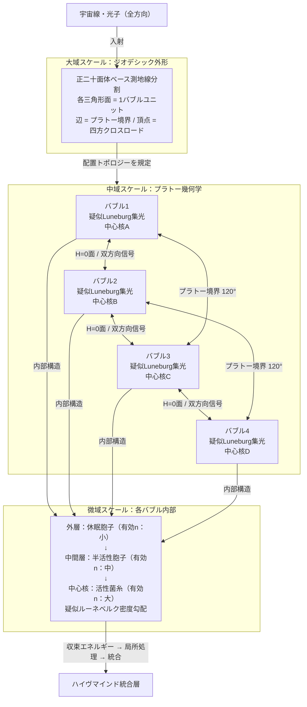

## 1. 概要 (Abstract)

[wiim_083](wiim_083.md) では、コズミックマイス（[g134](../../glossary/terms/g134.md)）の球状コロニーが疑似ルーネベルクレンズとして全方向集光体になれるかを論じた。しかしその技術的限界として「コロニー半径が大きくなるほど中心核への信号伝達遅延が深刻化し、ハイヴマインドのコヒーレンスが崩れる」という問題が残った。

> **前提:** 低重力環境では複数のコスモシェル（[g132](../../glossary/terms/g132.md)）またはシェルマイセリウム（[g135](../../glossary/terms/g135.md)）が石鹸泡のように集合し、プラトーの法則に従って面積最小化の配置を自発的に形成できる。
> **命題:** 「もし複数の球状コロニーが泡集合体（バブルシェルマイセリウム）を構成するなら、集光面積を維持しながら個々のユニット半径を小さく保ち、信号遅延問題を解消できるか？」

複数の球が接する泡構造では、物理的なエネルギー最小化の原理（プラトーの法則）が自発的に面積最小・安定配置を選択する。設計者の意図がなくても、菌糸コロニーが増殖・融合を繰り返す過程でこの幾何学が自然に出現すると考えられる。このような多球集合体を **バブルシェルマイセリウム（BSマイセリウム、BSM）** と呼ぶ。

---

## 2. 実現不可能性の根拠 (Infeasibility Rationale)

- **物理的限界:** プラトーの法則は理想的な膜（厚さゼロ・均質な表面張力・完全流体）を前提とする。菌糸や胞子で構成される生物膜は局所的な組成差・修復中の密度不均一・胞子発芽による膜厚変動があり、理想的なH=0の平坦接触面を完全には維持できない。微妙な曲率の乱れが隣接バブルとの圧力差を生み、接触面が動的に変形し続ける。
- **技術的限界:** バブル同士が融合・分裂を繰り返す生物的プロセスでは、個々のバブルが疑似ルーネベルク構造の密度勾配を安定的に維持することが困難になる。特に隣接バブルとの接触面付近では密度勾配が他のバブルの影響を受けて乱れ、収束精度が局所的に低下すると考えられる。
- **論理的限界:** バブル数Nを増やすほど個々のユニット半径は小さくなり信号遅延は改善されるが、バブル間インターフェース（H=0面）の総面積は増大し、そこでの代謝コストも増す。N→∞ では理論的に遅延ゼロになるが膜コストも無限大になる。したがって「最適バブル数」という設計パラメータが必ず存在し、ハイヴマインドはこれを何らかの代謝フィードバックで調節せねばならない。

---

## 3. 実験の設定 (Setup)

1. **主体（バブルシェルマイセリウム）:** N個の球状コロニーが集合した泡集合体。各球はwiim_083で論じた疑似ルーネベルク構造（三層：休眠胞子外層・半活性胞子中間層・活性菌糸中心核）を持つとする。
2. **環境（低重力空間）:** 重力加速度が極めて小さい領域では膜が自重を支える必要がなく、プラトーの法則に従った泡配置が安定して維持される。地上では重力によって泡配置が歪むが、宇宙空間ではプラトー幾何学が最も安定な状態として自然に出現する。
3. **接触面の構成:** 同等の内圧を持つ2つの球が共有する壁は、ヤング－ラプラス方程式（膜を隔てた圧力差ΔP = γ × 2H。石鹸泡のような2枚膜では内外両面に表面張力が働くため ΔP = 4γH となるが、いずれの場合も H = 0 であれば ΔP = 0 という結論は変わらない）より H = 0 となり、**平均曲率ゼロの平坦面**が形成される。3球が交わるプラトー境界では膜が120°で交差し、4球が交わる頂点では正四面体角（約109.47°）が形成される。
4. **操作:** 各球が独立した疑似ルーネベルク集光体として機能しながら、H=0の共有壁を介して隣接球とシグナル・代謝産物を交換する過程を観察する。全体として単一の大球と同等の空間カバレッジを持ちながら、信号遅延がどれだけ短縮されるかを評価する。

---

## 4. 考察と予測 (Speculation)

### 信号遅延の解消

単一球と多球クラスターを体積等価で比較すると、N個のバブルクラスターにおける個々の球の半径は単一球の半径の N^(1/3) 分の1になる。信号遅延は半径に比例するため、クラスターを構成するバブル数が増えるほど各ユニット内の遅延は急速に短縮される。wiim_083で問題とした「キロメートル規模の単一球では外縁シグナルの到達に数時間を要する」という限界は、BSMでは各バブルを小さく保つことで実用的な時間スケールに収まると考えられる。

### H=0 面がハイヴマインドの神経接続を生む

2球が接する平均曲率ゼロの平坦壁は、両側の圧力が等しいため流体の駆動圧がゼロだ。これは化学シグナルや電気インパルスが圧力勾配に妨げられることなく双方向に伝わる**中立接続面**であることを意味する。

プラトー境界（3球の辺）は三方向の分岐ノードとして機能し、4球が交わる頂点は四方向クロスロードになる。プラトーの幾何学はこれらのノードを最小エネルギー配置で自然に生成するため、ハイヴマインドの接続基板が**構造から自発的に出現する**という状況が生まれる。

### 複眼との類比：分散集光体

単一の大球が「カメラ眼」——1つの焦点に光を集める構造——に対応するとすれば、BSMは**節足動物の複眼**に対応する。各バブルが独立した受容視野を持ち、全体として全方向をカバーするが、信号処理は各バブルの中心核で局所的に行われ、プラトー境界のネットワーク経由で統合される。

この複眼構造には単眼では得られない利点がある。一部のバブルが損傷しても他のバブルが機能を代替できる冗長性と、異なる方向からの光を並列処理できる高スループットの両方が、プラトー幾何学から自動的に生まれる。

### ヴェール＝フェラン構造への収斂

同体積・同圧の多数のセルが面積最小化を達成するとき、数学的に最適な配置はヴェール＝フェラン構造（12面体と14面体が交互に並ぶ格子）に収斂することが示されている。BSMが長期進化を遂げると、コロニーはこの数学的理想に近似した形状を選択圧によって取得すると予測される。これは「設計なき最適化」がコズミックマイスの形態に幾何学的理想を刷り込む例となる。

### BSM大域トポロジーとジオデシック近似

プラトーの法則は隣接バブル間の**局所的な**面積最小化を記述するが、BSM全体が球へ近似するための**大域的なトポロジー**については別の原理が働く。ここでジオデシック幾何学（測地線分割）が最適な答えを与える。

ジオデシック分割は球面を三角形の網で覆い、応力を全面に均等分散させる構造だ。バックミンスター・フラーが建築に導入したこの原理は、生物界では数億年前に「発見」されている。多くのウイルスが正二十面体対称（ジオデシックの基礎形）でタンパク質カプシドを構成するのは、最小の遺伝子情報から最大の構造強度を得る進化的最適解であるためだ。放散虫の珪酸質骨格や、細胞内の膜輸送に使われるクラスリンタンパク質が自発的に形成するケージも同じ幾何学を採用している。

BSMの三階層構造はこれらを統合したものと理解できる：

| スケール | 支配する原理 | 役割 |
|---|---|---|
| BSM全体の外形 | ジオデシック分割（正二十面体基底） | バブル配置の大域トポロジー・応力均等分散 |
| バブル間の接触面 | プラトーの法則（H=0・120°交差） | 局所の面積最小化・ハイヴマインド接続面 |
| 各バブルの内部 | 疑似ルーネベルク密度勾配 | 集光・エネルギー収束 |

ジオデシックの**三角形の辺**がそのままプラトー境界に対応し、**頂点**がプラトー頂点（109.47°）に対応する。つまり2つの幾何学的理想が、異なるスケールから同一の構造物を記述するという整合性が生まれる。

C₆₀分子（バッキーボール）はジオデシック球の最小実現例であり、炭素60原子がこの配置を安定的に取ることは「物理が選ぶ最適構造」の証左でもある。BSMがジオデシック外形に収斂することは、分子スケールから生物スケールを経て天文スケールに至る、同一の最適化原理の再現と見なせるかもしれない。

### 哲学的な問い

- 泡の形状が純粋に物理法則から決まるとき、そのコロニーの「意志」はどこにあるのか——コズミックマイスは形を選んでいるのか、それとも形に選ばれているのか。
- 個々のバブルが独自の中心核と処理能力を持つとき、BSMは「一つの知性体」か「複数の知性体の連合」か。

---

## 5. 図解 (Diagrams)

---

## 6. 関連記事 (Related)

- [wiim_083](wiim_083.md) — 前編：単一球コロニーの疑似ルーネベルク構造
- [wiim_025](wiim_025.md) — シェルマイセリウム：コスモシェルとコズミックマイスの共生体
- [wiim_059](wiim_059.md) — 菌類ハイヴマインドの幾何学：構造がコヒーレンスを決める
- [wiim_061](wiim_061.md) — 菌類ダイソン網：恒星系規模への拡大
- [wiim_008](wiim_008.md) — コズミックマイスの起源と放射線栄養代謝
- [wiim_011](../physics/wiim_011.md) — コスモシェル：真空中の閉鎖膜
