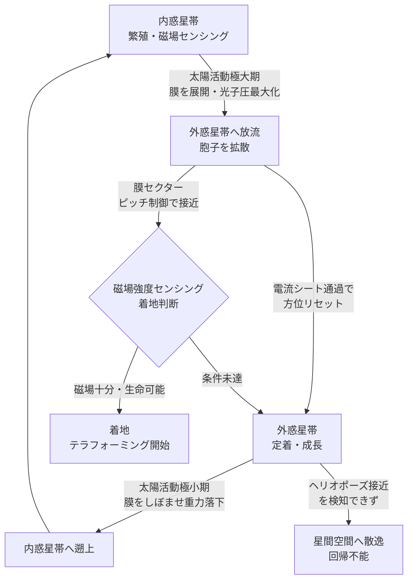

## 1. 概要 (Abstract)

シェルマイセリウム（wiim_025）はコスモシェル膜（g132）という自己修復する薄膜の球殻を体表に持つ。もしこの膜が生物的フォトニック構造（構造色の延長）によってほぼ完全な反射率を獲得し、かつ十分に薄くなれば——中身が空洞に近い気球状の生命体として——太陽光の放射圧だけで惑星間空間を推進できる。コスモシェル膜を「帆」として展開・折り畳みすることで内惑星帯と外惑星帯を往還し、マグネトソーム（g380）による磁場センシングでパーカースパイラル（g379）を「航路図」として読む——そのような回遊生態は成立しうるか。

> **前提:** コスモシェル膜が極薄の完全反射膜として機能し、生命体が内部を低密度（ほぼ空洞）に保てると仮定する。  
> **命題:** 「もし太陽光子圧で推進する宇宙生命体が存在するなら、その生態はどのようなものか？」

---

## 2. 実現不可能性の根拠 (Infeasibility Rationale)

### 物理的限界

光子帆として機能するには、生命体全体の「面積/質量比（σ）」が閾値を超える必要がある。地球軌道（1 AU）では太陽放射圧が約 9 µN/m²、太陽重力加速度が約 6 mm/s² であるため、必要な面積/質量比はおよそ **650 m²/kg** 以上と計算される。

コスモシェルのような空洞球殻では σ は膜厚だけで決まる。密度 1000 kg/m³ の膜が σ > 650 m²/kg を達成するには厚さが **1.5 µm 以下**でなければならない。生体脂質二重層はすでに 7〜10 nm であり、厚さの条件自体はむしろ容易に満たしうる。

問題は**反射率**だ。現実の生体膜はほぼ透明であり、放射圧が最大になる完全反射にはほど遠い。光の反射率が 1 % 程度では有効な加速は得られない。蝶の翅に見られる構造色（ナノ周期構造による干渉反射）を生物的に実現し、かつ膜の全面に広げることは、現在の生化学の延長では不可能と考えられる。

### 技術的限界

極薄の高反射膜を宇宙線・微小隕石・紫外線から守り続けることは生体材料では困難だ。宇宙線の重粒子一粒が 10 nm 膜を貫通すれば数 µm 幅の穿孔を生じる。コスモシェルの自己修復機能（wiim_025）があるとしても、修復速度が穿孔速度を上回るかは不明であり、外惑星帯の低温・低太陽風圧環境では生化学反応速度そのものが低下する。

### 論理的限界

横方向の操舵にはヘリオジャイロ原理——回転する帆の各セクションが周期的に傾き角（ピッチ）を変えることで光子を非対称に反射し、横力を生む——が有効候補だ。ただし km 規模の極薄膜が協調してピッチを変えるには全面的な機械制御が必要であり、化学信号を使う生物的伝達では応答速度が数分以上かかる。ゆっくりとした方向転換しか実現できないという根本的な制約が残る。

---

## 3. 実験の設定 (Setup)

1. **主体——中空型シェルマイセリウム**: コスモシェル膜の内側に菌糸が薄く張り付き、中心部はほぼ真空（低圧ガス）の空洞球殻。内部圧をわずかに正圧に保つことで膜形状を維持する。全体の平均密度は約 0.01 kg/m³ 以下——水の 10 万分の 1 以下——を目指す進化的形態。

2. **推進——光子帆モード**: コスモシェル膜を展開（球形を維持）すると、太陽放射圧が重力を上回り外惑星方向へ加速する（**放流**）。膜を「しぼませる」——表面積を意図的に縮小し皺を作って実効反射面積を減らす——と重力が優位になり内惑星方向へ落下する（**遡上**）。磁気帆ではなく光子圧が推力源であり、アルヴェーン面の内外に関係なくヘリオスフィア全域で機能する。

3. **操舵——膜セクションのピッチ制御（ヘリオジャイロ型）**: 膜表面を複数のセクターに分割し、回転する構造体の各セクターが光源に向く局面と背く局面で反射角を変える。光子の反射方向を非対称にすることで横方向の合力を生み、軌道傾斜の変更や目的天体への接近が可能になる。方向転換は遅いが、惑星間航行に必要なΔvは小さくてよい。

4. **ナビゲーション——マグネトソームによる磁場センシング**: 菌糸網内の磁性細菌（マグネトソーム産生株）が、惑星間磁場（IMF）のパーカースパイラル（g379）極性境界——ヘリオスフェリック電流シート——を通過した際の急激な磁場反転を検知する。これが「いま太陽のどちら側にいるか」を示す羅針盤として機能する。磁場は推力を生まず、センシングのみに使う。

5. **季節——11 年太陽活動周期**: 太陽活動極大期には放射強度が増し、光子帆の推力が最大化される。この時期を放流（胞子拡散）の好機とし、極小期に推力が減る時期を遡上（重力落下）の窓として使う。

---

## 4. 考察と予測 (Speculation)

### 力の成立——概算で確かめる

コスモシェル型生命体（半径 10 m、膜厚 10 nm、内部空洞）の場合：

- 膜面積：約 1260 m²
- 膜質量：1260 × 10⁻⁸ × 1000 ≈ 0.013 kg（内部ガスは無視）
- 面積/質量比 σ ≈ 97,000 m²/kg（閾値 650 m²/kg の約 150 倍）
- 1 AU での推力：9 µN/m² × 1260 m² ≈ 11 mN
- 加速度：11 mN ÷ 0.013 kg ≈ 0.85 m/s²（重力加速度 6 mm/s² の約 140 倍）

空洞球殻であれば力の問題は物理的に解決される。残る課題は生体材料での高反射率の実現と、極薄膜の長期耐久性に絞られる。

### サケの生態との対応

サケは川（淡水）で生まれ海（塩水）で育ち、産卵のために遡上する。磁気帆生命体では太陽風でなく光子流（太陽光）が「川の流れ」、外惑星帯が「海」、磁場の強い惑星近傍が「産卵地」に対応する。重力と光子圧の拮抗が遊泳深度を決める——浮き袋が魚の深度を決めるのと同じ原理で、帆の実効面積が「軌道高度」を制御する。

### ヘリオポーズは「浅瀬」

ヘリオスフィア（g383）の外縁・ヘリオポーズ付近では太陽光強度も低下し光子帆の推力が激減する。加えて星間塵密度が高まるため、極薄膜への衝突穿孔リスクが増大する。磁場センシングによってヘリオポーズ接近を検知し、早期に遡上モードに切り替えなければ星間空間に散逸する——これが「浅瀬に迷い込む」状況にあたる。

### 着地判断と磁場センシング

コスモライケン（wiim_043）は惑星を選んで着地するとされる。磁場強度は宇宙線防護の指標になるため、マグネトソームによる惑星磁場センシングが着地判断に組み込まれていると考えられる。地球大気の大酸化イベント（約 27 億年前）が宇宙生命体の着地由来だとすれば、着地タイミングは「地球磁場が一定閾値を超えた時点」と一致する可能性がある。

### 菌類磁気圏（wiim_062）との対比

コズミックマイス菌糸網が生成する磁気圏（wiim_062）は荷電粒子を捕捉してエネルギーを**収集**する静的な構造だ。本記事の光子帆回遊は光子圧で**移動する**動的な戦略であり、磁場はナビゲーション専用に限定される。前者が「岩礁に張り付くイソギンチャク型」なら、後者は「クラゲ型の受動的回遊」に近い。

---

## 5. 図解 (Diagrams)

---

## 6. 関連記事 (Related)

- [wiim_025](wiim_025.md) シェルマイセリウム——コスモシェルとコズミックマイスの共生が生む自律型宇宙生命体カプセル
- [wiim_043](../cosmology/wiim_043.md) コスモライケン——四層共生が生む自律型テラフォーミング艦
- [wiim_062](wiim_062.md) 菌類磁気圏——コズミックマイスが磁場を生成しエネルギーを収集できるか
- wiim_XXX 生物的フォトニック結晶——構造色から完全反射膜へ（光子帆の材料的根拠）
