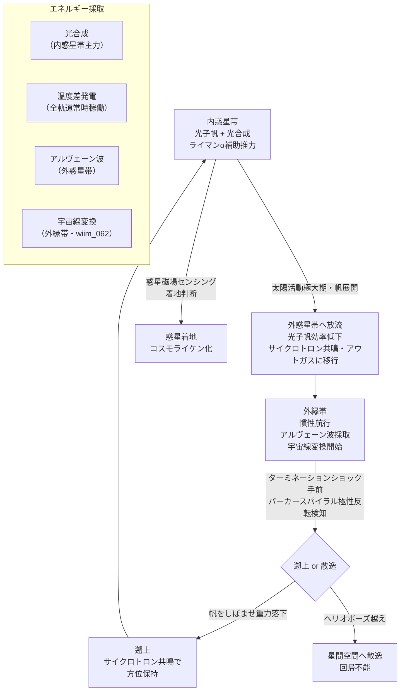

## 1. 概要 (Abstract)

wiim_092 では「コスモシェル膜を光子帆として使う」という単一メカニズムで回遊が成立することを示した。しかし実際のヘリオスフィア（g383）は均一な環境ではない——太陽光強度、太陽風密度、惑星間磁場（IMF）の強さ、宇宙線フラックスは軌道域によって桁違いに変化する。そこで問いを拡張する。

> **前提:** 複数の推進機構と複数のエネルギー採取機構を持つ宇宙生命体が存在できると仮定する。  
> **命題:** 「もし軌道域ごとに推進機構を切り替える統合的な回遊生態が成立するなら、その全体像はどのようなものか？」

各機構の物理的根拠は wiim_092 で論じた。本記事では「それらを一個体が統合する」ことの可能性と限界を論じる。

---

## 2. 実現不可能性の根拠 (Infeasibility Rationale)

### 物理的限界

複数の推進機構が有効な物理条件は互いに相反する。

光子帆は反射率が高いほど推力が大きくなる。しかし光合成はその反対——太陽光を**吸収する**ほど効率が上がる。帆モード（高反射）と代謝モード（高吸収）を同一膜面で同時に最大化することは原理的に不可能だ。最適化は必ずどちらかを犠牲にするトレードオフになる。

さらに、光子帆が有効な内惑星帯（太陽光強度が高い）では宇宙線変換の効率は低く、宇宙線が豊富な外惑星帯では太陽光が 1/r² で急減して光子帆の推力が落ちる。全機構を通じて「どこでも最高効率」になる軌道域は存在しない。

### 技術的限界

軌道域に応じて推進機構を切り替えるには、現在の位置・速度・太陽風状態をリアルタイムで把握し、最適な機構へ移行する統合制御系が必要になる。

生物的な化学信号の伝達速度は分〜時間単位であり、太陽風のコロナ質量放出（CME）のような突発的な環境変化（数時間で太陽風密度が 10 倍以上変動）への対応は原理的に遅れる。機構の切り替えが太陽風変動に追いつかない時間窓が常に存在する。

### 論理的限界

全機構を同時に進化させる選択圧が成立しない。光子帆一本で内惑星帯の回遊に成功している個体が、さらに宇宙線変換機構（複雑な磁気圏構造）を獲得するコストを支払う必要はない。進化的には単一ニッチへの特化の方が安定であり、「万能の複合推進体」は設計者のいる人工システムにしか現れない——というのが進化論的な反論だ。

ただし、これは「段階的に獲得した機構が偶然に組み合わさって複合系になった」という進化シナリオを否定しない。その場合は、各機構が独立した適応として進化し、後から相互作用が生まれたという過程になる。

---

## 3. 実験の設定 (Setup)

### 主体——多機能型シェルマイセリウム

wiim_025 のシェルマイセリウムが以下の構造層を持つと仮定する：

1. **コスモシェル膜（g132・外層）**: 反射率と吸収率を切り替えられる二相フォトニック構造。帆モード時は干渉反射で高反射、代謝モード時は色素層が前面に出て太陽光を捕捉する。

2. **水素リッチ表面層（外膜直下）**: 水分子・アンモニアなど軽元素リッチな分子層。太陽紫外線（ライマンα：121.6 nm）を共鳴散乱して補助推力を得ると同時に、光解離生成物を代謝還元剤として回収する。

3. **マグネトソームアレイ（菌糸網内）**: マグネトソーム（g380）産生細菌が螺旋状に配列した生物的ソレノイド（g382）。パーカースパイラル（g379）の磁場反転センシング（ナビゲーション）と、IMF との統計的サイクロトロン共鳴による補助推力を兼ねる。

4. **温度差発電層（内膜）**: 太陽側（+120℃）と陰面（−150℃）の温度勾配を化学エネルギーに変換する熱機関タンパク質。軌道域によらず常時稼働。

### 軌道域別の機構マップ

| 軌道域 | 主推力 | 補助推力 | 主エネルギー源 |
|--------|--------|---------|--------------|
| 内惑星帯（〜3 AU） | 光子帆 + ヘリオジャイロ操舵 | ライマンα散乱 / 光解離スラスター | 光合成 + 温度差発電 |
| 外惑星帯（3〜30 AU） | 光子帆（効率低下）/ アウトガス | 統計的サイクロトロン共鳴 | 温度差発電 + アルヴェーン波採取 |
| 外縁帯（30〜85 AU） | 慣性航行 + サイクロトロン共鳴 | アウトガス残留量に依存 | アルヴェーン波採取 + 宇宙線変換 |
| ターミネーションショック付近（85〜120 AU） | 重力落下で遡上開始 | — | 宇宙線変換主体（wiim_062 戦略） |

---

## 4. 考察と予測 (Speculation)

### 帆と葉の二相制御

植物の葉が光の強さに応じて葉緑体を移動させるのと同様に、コスモシェル膜の「帆モード→代謝モード」の切り替えは細胞骨格レベルのフォトニック構造の再配置として実現しうる。内惑星帯では太陽光が豊富なため代謝モード（吸収）を優先し、エネルギーを蓄積してから帆モード（反射）に切り替えて加速する「ためて撃つ」サイクルが考えられる。

### 水素は推力と代謝の二役

水素捕縛は推力源（ライマンα共鳴散乱で加速）と代謝還元剤（光解離 H が生化学反応の還元力）の二役を担う。水素を取り込みながら加速するという経路は、採餌と移動が同時に起きるクジラの濾過摂食に近い構造だ。

### 宇宙線採取への移行——静から動へ

wiim_062 では菌類磁気圏が宇宙線エネルギーを**静的に**収集する戦略を論じた。本記事の生命体は内惑星帯では**動的に**光子帆で回遊し、外縁帯に達したとき wiim_062 型の静的磁気圏モードに移行する選択肢を持つ。「光で動く→宇宙線で生きる」という段階的な代謝シフトは、深海魚が光合成から化学合成ベントへ移行する生態との類比で理解できる。

### 進化的安定性への反論

全機構を一個体が持つことは進化的に不安定とも言える。しかし共生（symbiosis）という解がある——光子帆に特化した宿主に、マグネトソーム産生細菌・温度差発電細菌・水素代謝細菌が共生した多者連合体として「複合推進体」が成立するなら、各共生者は自分のニッチに特化しながら全体として統合されたシステムを形成できる。wiim_025 のシェルマイセリウムがすでに菌糸と宇宙放射線耐性細菌の共生体であることを踏まえれば、さらなる共生者の追加は延長線上にある。

### 11 年周期との同期

太陽活動極大期：放射強度増 → 帆モード優先 + 光合成余剰エネルギー蓄積 → 放流（胞子散布）  
太陽活動極小期：放射強度減・太陽風弱 → 代謝モード + サイクロトロン共鳴 → 遡上（重力落下）

11 年周期という「季節」が複合推進体の行動サイクルを律動させる構造は wiim_092 と共通する。

---

## 5. 図解 (Diagrams)

---

## 6. 関連記事 (Related)

- [wiim_025](wiim_025.md) シェルマイセリウム——コスモシェルとコズミックマイスの共生が生む自律型宇宙生命体カプセル
- [wiim_043](wiim_043.md) コスモライケン——四層共生が生む自律型テラフォーミング艦
- [wiim_062](wiim_062.md) 菌類磁気圏——コズミックマイスが磁場を生成しエネルギーを収集できるか
- [wiim_092](wiim_092.md) 太陽光子圧で回遊する磁気帆生命体——コスモシェルが帆になるとき
