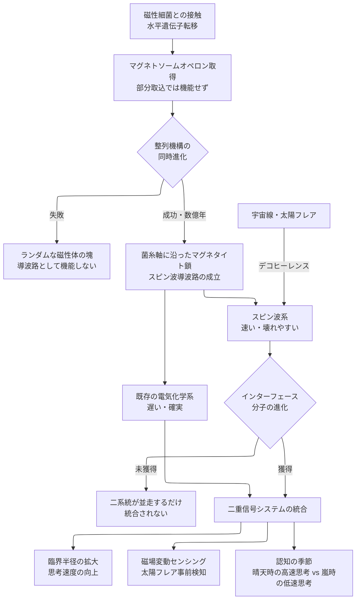

## 1. 概要 (Abstract)

[wiim_083](wiim_083.md) と [wiim_084](wiim_084.md) は、コズミックマイス（[g134](../../glossary/terms/g134.md)）のハイヴマインドが抱える根本的な矛盾を明確にした。コロニーの集光面積を稼ぐほどコロニー半径は大きくなり、電気化学的信号（秒速数cm）では外縁から中心核への伝達に数時間を要してしまう。思考サイクルが伸びると、ハイヴマインドはリアルタイムのコヒーレンスを失う——これが「臨界半径の壁」だ。

地球上の磁性細菌はまったく異なる解を自然選択で発見している。細胞内にマグネタイト（Fe₃O₄）ナノ結晶を鎖状に並べた**マグネトソーム**を持ち、地磁気に沿って遊泳する。この構造はスピン波の導波路として機能しうる生体磁性回路の原型だ。

本記事が問うのは：**もしコズミックマイスが宇宙適応の過程で磁性細菌の遺伝子を水平移転し、菌糸細胞壁にマグネタイト鎖を組み込んだ「生体マグノニクス」（[g398](../../glossary/terms/g398.md)）を獲得したなら、ハイヴマインドの情報処理はどう変わるか。**

マグノニクス（[g390](../../glossary/terms/g390.md)）は電荷を運ばないスピン波で情報を処理するため、ジュール熱が原理的に発生しない。さらにスピン波の伝播速度は電気化学信号を桁違いに上回る。生体組織がこの物理を自然選択で「発見」できるなら、臨界半径の壁は大きく後退するかもしれない。

---

## 2. 実現不可能性の根拠 (Infeasibility Rationale)

### 物理的限界

スピン波は磁性秩序が維持された連続した媒質のみを伝播する。磁気秩序が乱れた境界で散乱・減衰するため、導波路となるマグネタイト鎖は菌糸軸に沿って途切れなく続いていなければならない。

宇宙空間には宇宙線（高エネルギー荷電粒子）と太陽フレアが絶え間なく降り注ぐ。これらがマグネタイト鎖に衝突すると局所的にスピン秩序が乱れ、スピン波が散乱されるデコヒーレンスが起きる。地球の磁気圏がこれを防いでいるが、宇宙空間でむき出しのコロニーには同等の保護がない。さらに菌糸は日々伸展・分岐しながら成長するため、新たに形成される部分でマグネタイト鎖の連続性が一時的に失われる区間が常に存在することになる。

### 技術的（進化的）限界

磁性細菌のマグネトソームは、マグネタイト結晶の核形成・成長・整列・膜包みを制御する数十種の遺伝子からなる複合的なオペロン（遺伝子クラスター）によって作られる。水平遺伝子転移でこのクラスター全体を一括取り込みする確率は極めて低く、部分取り込みではマグネタイト鎖が形成されない。

さらに、磁性細菌では鎖が細胞の長軸に沿って整列するための細胞骨格タンパク（MamK）が存在する。菌糸という全く異なる細胞構造の中でこのタンパクが同じ機能を発揮するには、別途の適応変化が必要だ。マグネタイト鎖は形成されれば導波路になるが、整列していなければランダムな磁性体の塊にすぎない。

### 論理的限界

スピン波が伝播しても、受け取る側の機構がなければ情報にならない。現在のコズミックマイスの信号系は電気化学的シグナル（カルシウムイオン・ATP）に依存している。スピン波を電気化学信号に変換する「インターフェース分子」が別途進化しなければ、二つのシステムは並走するだけで統合されない。

電磁場の変化をイオンチャネルの開閉に変換するメカノセンサリー受容体は存在するが、スピン波（磁気モーメントの集団振動）を直接読み取る生体分子は地球上に知られていない。自然選択がこのインターフェースをゼロから生み出すには、遺伝子取り込みと同等かそれ以上の進化的難易度がある。

---

## 3. 実験の設定 (Setup)

以下の条件を設定した思考実験を行う。

- **主体:** 小惑星帯ラグランジュ点に形成された球状コロニー（半径500m〜数km）を持つコズミックマイス。過去に磁性細菌との接触を経てマグネトソームオペロン全体を水平遺伝子転移で獲得し、さらに数億年の淘汰によってキチン骨格に沿ったマグネタイト鎖の精密整列機構を確立した系統と仮定する。
- **構造:** 各菌糸管の長軸に沿って直径5〜10nmのマグネタイトナノ結晶が数百個連なる。鎖の間隔は均一で、隣接する菌糸の鎖が磁気的に結合しスピン波の横断伝播も可能。
- **信号比較:** 電気化学シグナルの伝播速度（秒速数cm）と生体マグノニクス系のスピン波伝播速度（材料と周波数に依存するが、同等の磁性体では秒速数km〜数十km以上のオーダーが想定される）を対比させる。
- **外部環境:** 太陽フレアの発生頻度・宇宙線フラックスを通常の小惑星帯環境として設定し、スピン波の途絶頻度と回復速度を評価する。

---

## 4. 考察と予測 (Speculation)

### 二重信号システムの分業

電気化学シグナルとスピン波が並存する場合、二者は互いを代替するのではなく分業すると考えられる。

電気化学シグナルは遅いが確実だ。イオン勾配さえ維持されれば宇宙線にも太陽フレアにも途絶しない。長期記憶・恒常的な代謝調整・ゆっくりとした意思決定に向く。一方スピン波は速いが壊れやすい。緊急シグナル・瞬時の脅威検知・一時的な同期に向く。

この分業は動物の神経系に収斂する。有髄神経（高速・緊急）と無髄神経（低速・微細感覚）の二系統が共存するように、コズミックマイスも「遅い基底意識」と「速い反射回路」を持つ構造が選択されうる。

### 臨界半径の拡大

wiim_083で示されたコロニーの臨界半径問題は、スピン波の追加によって緩和される可能性がある。500mコロニーでスピン波が秒速10kmで伝播するなら、外縁から中心核への伝達は0.05秒以下に収まる。これは電気化学系の数時間から五桁の改善だ。

ただし完全解決ではない。宇宙線が頻繁にスピン波を断絶させれば、速い回線は間欠的にしか機能しない。スピン波が使える「晴天時」と使えない「嵐の時」でハイヴマインドの思考速度が大きく揺れ動くことになる——一種の「認知の季節」が生まれる。

### 磁場感知による外部センシング

マグネタイト鎖は外部磁場の変動に敏感に応答する。惑星磁気圏の変動・CME（太陽コロナ質量放出）の到来・木星強磁場の変化は、マグネタイト鎖のスピン状態を直接変化させる。これをハイヴマインドが読み取れるなら、コズミックマイスは太陽系規模の「磁気予報センサー」を得ることになる。

[wiim_062](wiim_062.md)（菌類磁気圏）が論じた「磁性粒子の合成による太陽風捕捉」とは異なり、生体マグノニクスの磁場感知は受動的だ。エネルギーを消費して磁場を生成するのではなく、すでに存在する宇宙の磁場変動を読むだけでよい。コロニーが太陽フレアの到来を数分前に感知して深部退避行動を開始できるなら、生存率への寄与は大きい。

### 設計なき収斂

チェシャ磁場格子（[wiim_094](../quantum/wiim_094.md)）は量子チェシャ猫効果を工学的に利用してスピン制御を実現しようとする思考実験だ。そこでは設計者が磁気モーメントの分離・制御を明示的に意図する。

生体マグノニクスはその「野生版」だ。設計者は存在せず、自然選択だけが菌糸細胞壁をスピン波回路に変えていく。工学と進化が独立にスピン波エンジニアリングへ到達するなら、それはマグノニクスが知性的な情報処理の普遍的な解であることを示唆する——シリコンでも炭素でも、複雑な情報処理系はスピン波を発見するのかもしれない。

### 可用性の担保——再送より冗長性

スピン波が宇宙線で途絶えたとき、通信工学的な「誤り検知・再送」は生体系にとって本質的に困難だ。

問題の核心は**フィードバックチャネルの非対称性**にある。スピン波（速い・壊れやすい）に対してフィードバック回線として使える電気化学シグナルは確実だが桁違いに遅い。受信側が途絶を検知して再送要求を送り返すころには、状況はすでに変化している——TCPのACKが光速なのに再送がモールス信号という構造だ。

さらに「沈黙問題」がある。受信側からは、スピン波の沈黙が「送信するものがない」なのか「送ったが途絶えた」なのか区別できない。区別するには常時ハートビート信号を流す必要があるが、それ自体がエネルギーコストになる。

生体系が自然選択で到達しやすい解は**再送ではなく冗長性**だと考えられる。複数のマグネタイト鎖を菌糸束に並列に走らせれば、宇宙線が一本を途絶させても他の鎖が信号を通す。これは一本が壊れても機能する——という生存優位に直結するため、選択圧が働きやすい。また重要な信号を両チャネル同時に送出するハイブリッド符号化も単純な規則で実現できる。純粋な再送制御より、**壊れることを前提とした設計**の方が進化的に自然だ。

---

## 5. 図解 (Diagrams)

---

## 6. 関連記事 (Related)

- [wiim_008](wiim_008.md) — コズミックマイス基本記事
- [wiim_059](wiim_059.md) — 菌類ハイヴマインドの幾何学
- [wiim_062](wiim_062.md) — 菌類磁気圏（磁性粒子合成による能動的磁場生成）
- [wiim_083](wiim_083.md) — 疑似ルーネベルク構造（臨界半径問題の詳論）
- [wiim_084](wiim_084.md) — バブルシェルマイセリウム（BSM・信号遅延解消の試み）
- [wiim_094](../quantum/wiim_094.md) — チェシャ磁場格子（工学的スピン波制御との対比）
