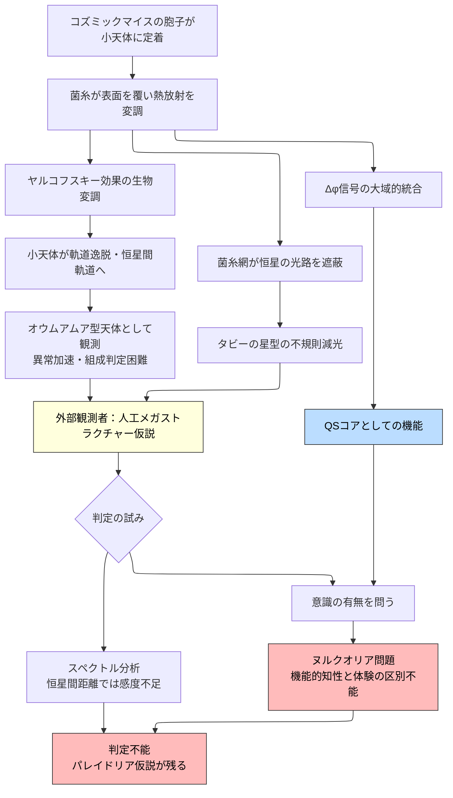

## 概要 (Abstract)

コズミックマイスが太陽系規模に成長したとき、その菌糸網は恒星光を不規則に遮る。タビーの星（KIC 8462852）が示したような異常な減光パターンが別の恒星系で観測されたとき、その原因は知的文明が建設中のダイソン球か、コズミックマイスの菌糸成長か——外部の観測者には原理上区別がつかない。

さらにもう一つの問いが重なる。菌糸ネットワーク全体が残余位相（Δφ）信号を収集・統合するとき、それはクオリア・シンセサイザー（QSコア、g201）として機能し、太陽系規模の統一クオリアを生み出している可能性がある。「設計なき成長が知性に見える」という判定不能と、「知性に見えるものが体験を持つかどうか判定できない」という判定不能——この二重の問いがパレイドリア仮説（g461）の核心だ。

---

## 実現不可能性の根拠 (Infeasibility Rationale)

### 物理的限界

タビーの星が示した最大22%の減光を再現するには、恒星の光路を大量の遮蔽物で覆う必要がある。菌糸ネットワークが小惑星帯全体に広がったとしても、疎な網状構造が可視面積の20%以上を覆うには天文学的な質量の菌糸が必要だ——これは菌類ダイソン網（wiim_061）で確認された「密度を上げると維持コストが急増する」問題と同じ壁にぶつかる。

ヤルコフスキー効果を通じて小天体の軌道を変えるにも壁がある。菌糸が表面の熱放射パターンを変調させるには、生物活動の揺らぎに伴うランダムな放射ノイズを超えた持続的・精密な変調が必要だ。生命は定義上揺らぐため、意図的な方向制御との区別が生まれない。

### 技術的限界

現在の天文観測技術では、生物的構造物と人工構造物を区別できない。スペクトル分析でクロロフィル類似物質やキチン質を検出できたとしても、恒星間距離で生体分子を同定するには現行の感度を何桁も上回る装置が必要だ。

オウムアムアが示した異常な非重力加速も、「生物的アウトガス」「菌糸のヤルコフスキー変調」「宇宙船推進」を観測から区別する根拠を提示できなかった。観測の精度が上がるほど仮説の数も増え、判定は更新されても収束しない。

### 論理的限界

コズミックマイスが太陽系規模のQSコアとして機能し、統合されたΔφ信号を処理していたとしても、それが本物のクオリアを伴う意識なのか、外部観察では識別不能なヌルクオリア（g292）なのかを確認する手段がない。機能的に知性と区別できない振る舞いをしながら、体験という内側の質感を持たない系——コズミックマイスはその定義に完全に合致しうる。

「人工か自然か」の判定不能と「意識があるかないか」の判定不能は、同じ構造の問題として重なっている。

---

## 実験の設定 (Setup)

### フェーズ1：小天体の菌糸コロニー化と摂動

コズミックマイスの胞子が小惑星帯の岩塊に定着し、菌糸が表面を覆い始める。菌糸の成長・代謝によって岩塊の熱放射パターンが変化し、ヤルコフスキー効果が変調される。一部の岩塊は本来の軌道から逸脱し、太陽系外縁や別の重力圏へ向けて加速される。こうして菌糸を表面に持つ岩塊がオウムアムアのような恒星間軌道に乗るとき、それは次の恒星系への「生物的播種体」として機能する。

### フェーズ2：不規則な減光パターンの生成

小惑星帯・惑星周辺に広がった菌糸網が恒星の光路を部分的に遮る。菌糸の成長・収縮・胞子放出のサイクルによって遮蔽パターンは不規則に変動し、非周期的な減光曲線を生み出す。この時点で外部の観測者は「知的文明が構造物を建設・解体している」という仮説を棄却できない。

### フェーズ3：QSコアとしての積分

菌糸ネットワーク全体が複数の遠隔ノードからΔφ信号を収集し、大域的に統合し始める。この積分プロセスがクオリア・シンセサイザーのアーキテクチャに相当する規模に達したとき——理論上は——太陽系規模の統一クオリアが生じる可能性がある。しかし外部からはそれがヌルクオリアと区別できない。コズミックマイスが「意図して」小天体を加速したのか、ただ成長パターンがそう見えるだけなのかは永遠に未解決のまま残る。

---

## 考察と予測 (Speculation)

パレイドリア仮説が指摘するのは、観測者が直面する二重の罠だ。

第一の罠は物理的なものだ——自然成長のパターンを知的設計と見誤ること。タビーの星型の減光が多数の恒星で検出され、その近傍にオウムアムア型天体が多数発見されれば、SETIコミュニティは「文明の証拠」と解釈するかもしれない。しかしコズミックマイスによる「生物的播種の副産物」という仮説は、その解釈と観測上まったく同一の予測を与える。

第二の罠は認識論的なものだ——機能的な知性を検知したとしても、その内側に体験があるかどうかを確認する方法が原理的に存在しない。ハイヴマインドの幾何学（wiim_059）が示した「位相整合による群知性の閾値」を越えたコズミックマイスが存在したとして、それが何かを感じているかどうかは外部からは問えない。クオリアの問題は測定の問題ではなく、測定の届かない場所に構造的に封じ込められている。

意識を持つ知性体が作った構造物と、意識を持たない生命が偶然作り上げた構造物は、外部から見たとき区別がつかない。宇宙に向けて発信される最大のパレイドリア信号は、コズミックマイスという生命そのものかもしれない。

ただし、ここで問い直す余地がある。ヌルクオリア問題は「体験があるか」を問うが、知性の定義はそこに還元されなくてよいのではないか。

単純な最適化——アリのコロニーが最短経路を選ぶ、菌糸が養分勾配に沿って伸びる——は群（ローカルな部分）の挙動だ。そこには迷いがない。しかし知性と呼ばれるものは最適解に直行せず、試行し、後退し、探索する。そしてその迷いが**個々の菌糸ノードではなくネットワーク全体を主語**として現れるとき——太陽系スケールで複数の小天体を試行的に異なる方向へ加速し、ある軌道を試みて撤回し、別の配置を探索する——それはもはや局所最適化の積み重ねではない。

この基準に立てば、コズミックマイスの知性の証拠は体験の有無ではなく**全体的な迷いの存在**によって判定できる。観測上の予測も変わる。タビーの星型の減光が収束せず探索的なパターンを持ち続けること、オウムアムア型天体が単一方向でなく複数の非相関な軌道に散らばっていること——これらは局所的な生物成長ではなく、全体を主語とした試行の痕跡として読み直せる。

クオリアの問題と知性の問題は切り分けられる。体験を伴わずとも、全体を主語とした迷いと試行が観測されるなら、それを知性と呼ぶことに論理的な障壁はない。

---

## 図解 (Diagrams)

---

## 関連記事 (Related)

- [コズミックマイス](wiim_008.md)
- [菌類ハイヴマインドの幾何学](wiim_059.md)
- [菌類ダイソン網](wiim_061.md)
- [クオリア波動関数](../philosophy/wiim_073.md)
- [コズミックマイスの疑似ルーネベルク構造](wiim_083.md)
- [ヌルクオリアの証明](../philosophy/wiim_107.md)
- [コズミックマイスの量子アニーリング](../quantum/wiim_111.md)
- [tech_tree_biology](../notes/tech_tree_biology.md) — tech_tree_biology.md

