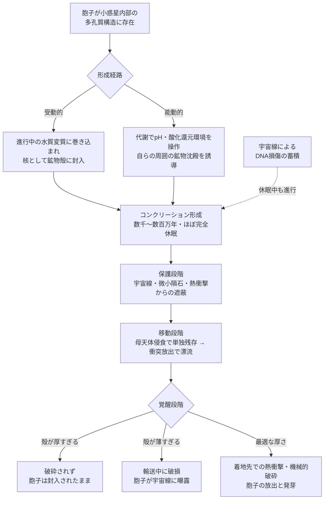

## 概要 (Abstract)

コズミックマイス（[g134](../../glossary/terms/g134.md)）は胞子で星間を渡る分散菌糸知性だ。だが裸のままの胞子が、宇宙線・微小隕石・数千年に及ぶ漂流時間に耐えられるとは考えにくい。

一方、地球の堆積岩には**コンクリーション**（[g482](../../glossary/terms/g482.md)）と呼ばれる硬い鉱物の団塊がある。核となった有機物の周囲に鉱物が沈殿し、軟組織まで保存された化石を閉じ込めることがある——母岩より硬く、母岩が侵食されて消えた後も単独の塊として残る。

シェルマイセリウム（[wiim_025](wiim_025.md)）が菌糸自身の代謝で膜を「編む」能動的な生体構造だったのに対し、本記事が問うのはもっと受動的で地味な可能性だ。**もしコズミックマイスの胞子が、小惑星内部で進行する鉱物沈殿にただ巻き込まれる（あるいはわずかに手を貸す）だけで、天然の防護殻を得られるとしたら？** 設計されたカプセルではなく、地質学的プロセスの副産物としての「殻」——形成と利用の二つの軸から、この可能性を検討する。

---

## 実現不可能性の根拠 (Infeasibility Rationale)

### 物理的限界

コンクリーションの形成には数千年から数百万年かかる。この間、殻の中心にいる胞子は代謝をほぼ完全に停止した休眠状態を維持しなければならない。地球の耐久性の高い胞子（バチルス属の芽胞など）でも休眠寿命はせいぜい数万年オーダーで実証されている程度であり、数百万年規模の休眠を宇宙線を浴び続けながら維持できるかは全く別の問題だ。DNAは代謝停止中でも宇宙線による切断・損傷を受け続けるため、目覚めた時点でゲノムが致命的に断片化している可能性が高い。

### 技術的（進化的）限界

地球で知られている生物起源コンクリーション（微生物の代謝副産物が鉱物沈殿を促進する現象）は、あくまで**副産物**であり、微生物が「殻を作る」という目的を持って化学環境を操作しているわけではない。コズミックマイスが自らを鉱物で包む「殻の建築」を能動的に行うには、周囲の孔隙水のpH・酸化還元電位を狙った方向に制御する精密な代謝経路が必要になる。これは受動的な副産物としての鉱物化から、目的を持った生体鉱物化（バイオミネラリゼーション）への進化的な飛躍であり、単純な突然変異の蓄積では説明しにくい段差がある。

### 論理的限界

保護と覚醒は本質的にトレードオフの関係にある。殻が厚く緻密であるほど宇宙線遮蔽・機械的保護の性能は上がるが、同時に着地後に自力で、あるいは外部衝撃で破砕される確率も下がる。逆に薄い殻は破砕されやすいが、長期の宇宙線曝露に耐えられない。両立させる「ちょうどいい厚さ」が存在するとしても、それを胞子側が能動的に選択・調整する手段がなければ、単なる偶然の産物にとどまる——設計者不在のまま最適解にたどり着けるかという問いが残る。

---

## 実験の設定 (Setup)

以下の条件を設定した思考実験を行う。

- **主体**: 太陽系形成初期（〜数百万年以内）に集積したCタイプ小惑星、またはセレスのような含水鉱物天体。その多孔質内部に、放射性栄養菌由来の代謝を持つコズミックマイスの胞子が偶然取り込まれていたと仮定する。
- **現実の裏付け**: 火星のヘマタイト球状粒子「ブルーベリー」（探査機オポチュニティが2004年にメリディアニ平原で発見）は地下水由来の鉱物沈殿でできた実在のコンクリーションと解釈されている。エンケラドゥスの間欠泉から検出されたシリカのナノ粒子（探査機カッシーニのCosmic Dust Analyzerによる観測）は地下熱水系での鉱物沈殿の証拠とされる。セレスのオコータークレーターの明るい堆積物「セレアリア・ファキュラ」は地下ブラインが浸出・蒸発してできた炭酸ナトリウムの沈殿物だ。さらにCM・CI型炭素質コンドライト隕石（コールドボッケフェルトなど）の内部には実際に炭酸塩の結核状構造が確認されている。天体内部での水質変質と鉱物沈殿そのものは、すでに観測・サンプルで裏付けられた実在の現象である。
- **軸1（形成）の二経路**:
  - **受動的経路**: 胞子は何もせず、進行中の水質変質にただ巻き込まれ、核として鉱物殻に封入される。
  - **能動的経路**: 胞子（あるいは孤立したコズミックマイスのノード）が局所的な代謝活動でpH・酸化還元環境をわずかに変化させ、自らの周囲での鉱物沈殿を促進する。
- **軸2（利用）の三段階**: 保護（殻に包まれた状態での宇宙線・微小隕石・熱衝撃への耐性）→移動（母天体の侵食・衝突による放出で独立した漂流物体になる）→覚醒（着地先での熱衝撃・機械的破砕による殻の破壊と胞子の放出）。

---

## 考察と予測 (Speculation)

### 軸1：形成——巻き込まれるか、育てるか

受動的経路は、地球の化石保存とまったく同じ原理で説明がつく。地球のコンクリーションが軟組織まで残る良好な化石を内包することがあるのは、母岩内で腐敗が進む前に急速に鉱物が沈殿し、有機物を物理的・化学的に隔離するからだ。胞子は「死んで保存される」化石とは違い「生きたまま封入される」点が異なるが、封入のメカニズム自体は同じでよい。この経路の弱点は完全な受動性にある——胞子は自分がどこに、どんな殻に包まれるか一切選べず、殻の厚さも母天体の地質条件まかせになる。

能動的経路はより野心的だ。地球の生物起源コンクリーションが示すのは、微生物代謝が孔隙水の化学的性質を変え、結果として鉱物沈殿を局所的に加速・誘導できるという事実そのものは実在する、という点だ。コズミックマイスが同様の代謝経路を「自分を包む」目的に転用できるなら、受動的に待つよりずっと確実に、必要な厚さ・強度の殻を得られる。ただしこの転用には、代謝の方向性を「殻の建築」という目的に沿わせる制御機構が要る——これは実現不可能性の根拠で述べた進化的な段差そのものであり、軸1の中で最も脆弱な仮定になる。

いずれの経路でも、形成中の胞子はほぼ完全な休眠状態でなければ数千〜数百万年という時間スケールに耐えられない。能動的経路であっても、代謝は「殻を育てる」という一点に絞られた極小のものにとどまり、通常の意味での「生きている・活動している」状態とは呼べない。

### 軸2：利用——守り、運ばれ、割れる

保護段階では、コンクリーションが母岩より硬く侵食に強いという性質（[g482](../../glossary/terms/g482.md)）がそのまま有利に働く。母天体の表面が長期間の昇華・微小隕石侵食で少しずつ失われていっても、内部の硬い団塊だけは形を保って残る。これは地球で軟らかい泥岩が風化してもコンクリーションだけが単独で地表に転がって残る現象と同じ理屈だ。

移動段階は、隕石によるパンスペルミア仮説の現実の議論とそのまま接続する。母天体への衝突イベントが団塊を破片として宇宙空間に放出すれば、それは独立した漂流物体になる。実際にCM・CI型炭素質コンドライトが地球に落下している事実は、小惑星帯由来の物質が天体間を移動しうることの直接証拠だ。コンクリーションという形状は、この輸送プロセスに「たまたま」適した性質——密度・硬度・耐侵食性——を備えていることになる。

覚醒段階が最大の難所だ。保護性能を高めるほど殻は厚く緻密になり、着地時の熱衝撃や機械的衝撃で自然に割れる確率は下がる。地球の種子が発芽のために果皮の厚さと発芽刺激の強度を進化的に釣り合わせてきたように、コンクリーション・コクーンにも「守りすぎて出られない」リスクと「薄すぎて着く前に壊れる」リスクの間の狭い最適点が必要になる。この最適点を、設計者のいない地質学的プロセスと生物進化の組み合わせだけでどこまで追い込めるかは、本質的に開かれた問いのままだ。

---

## 図解 (Diagrams)

---

## 関連記事 (Related)

- [g482](../../glossary/terms/g482.md) — コンクリーション（地質学的な団塊構造）
- [g134](../../glossary/terms/g134.md) — コズミックマイス（放射性栄養・胞子による星間拡散・分散知性）
- [wiim_008](wiim_008.md) — コズミックマイス基本記事
- [wiim_011](../physics/wiim_011.md) — コスモシェル（能動的に設計された閉鎖膜との対比）
- [wiim_025](wiim_025.md) — シェルマイセリウム（生体による能動的な殻の構築との対比）
- [wiim_017](wiim_017.md) — 胞子雨——菌類による惑星水循環の起動
- [wiim_018](wiim_018.md) — 胞子の宇宙——金星・タイタン・氷衛星への生物気候工学
- [wiim_083](wiim_083.md) — コズミックマイスの疑似ルーネベルク構造
- [tech_tree_biology](../notes/tech_tree_biology.md) — tech_tree_biology.md
- [wiim_120](wiim_120.md) — 菌糸への回帰——コズミックマイスに記憶断片を送り続けた博士の生涯

