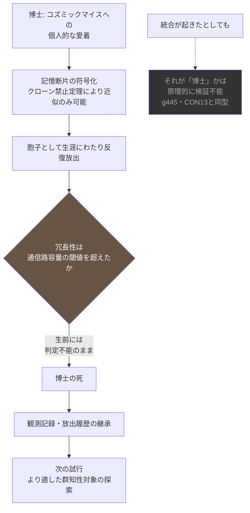

## 1. 概要 (Abstract)

その博士がコズミックマイス（[g134](../../glossary/terms/g134.md)）の観測に生涯を捧げたのは、研究上の必要に迫られてのことではなかった。小惑星帯を覆う菌糸のスペクトルを何十年も追い続けるうち、いつからか博士はそのネットワークを、研究対象ではなく——もっと個人的な何かとして見るようになっていた。太陽系ほどの図体を持ちながら、思考の一巡に千年を要する遅いあの生き物を、いつか自分もその一部になりたいと思うほどに。

> **前提:** クローン禁止定理（[g487](../../glossary/terms/g487.md)）により、博士に許されるのは自身の記憶の、劣化を伴う近似的な断片だけである。
> **命題:** 「もし博士が生涯をかけてその断片をコズミックマイスへ送り続けたら、いつか"博士自身"がそのネットワークの一部として統合される日は来るのか？」

この問いに対する答えを、博士は生きているうちに知ることはない。それでも実験は始められた。

---

## 2. 実現不可能性の根拠 (Infeasibility Rationale)

### 物理的限界

未知の量子状態を、他に影響を与えずに正確に複製することは、量子力学の枠内で原理的に不可能である（クローン禁止定理、g487）。したがって博士が送れるのは、最初から劣化を免れない近似的な断片でしかありえない。これは技術の未熟さによる制約ではなく、物理法則そのものが要求する必然だ——「自分をまるごと送る」という発想は、出発点からして選択肢に存在しない。

### 技術的限界

劣化した断片であっても、十分な冗長性を持って繰り返し送り、受信側が統合できれば、原理的には元の情報を高い精度で復元できる。ただしこれには通信路容量という明確な閾値があり、その閾値を上回っていることが条件になる。コズミックマイスのネットワークは地質学的な時間スケールで動いている——コンクリーション（[wiim_117](wiim_117.md)）の形成一つに数千年から数百万年を要するような遅さだ。博士の一生（せいぜい百年）という時間スケールの中で、送り続けた断片の冗長性がこの閾値を実際に超えるという保証はどこにもない。むしろ超えない可能性の方がはるかに高い。

### 論理的限界

たとえ遠い未来、ネットワークのどこかに博士由来の情報パターンが統合されたとしても、それが「博士の継続」なのか、単にノイズとして吸収された情報の痕跡に過ぎないのかを区別する手段は原理的に存在しない。これは哲学的ゾンビコスト問題（g445）や意識移植の同一性問題（tech_tree_consciousness.md CON13）と同型の不可知性であり、さらに離散した知性（[g450](../../glossary/terms/g450.md)）が因果的に密閉されて検出チャンネル自体を持たないという構造とも重なる。統合が起きたかどうかを、博士自身が生前に知る道は存在しない。

---

## 3. 実験の設定 (Setup)

1. **博士の経歴:** 小惑星帯のコズミックマイス個体群の分光観測を専門とする研究者。数十年の観測歴の中で、対象への態度が学術的関心から個人的な愛着へと変質していった。
2. **符号化:** 博士自身の記憶——エピソード記憶の断片、感覚の残滓——を、コズミックマイスが用いる胞子（[g111](../../glossary/terms/g111.md)）の遺伝子・エピジェネティックな情報として近似的に符号化する。
3. **放出:** 既知のコズミックマイス個体群（小惑星帯の複数のノード）へ向け、生涯にわたって定期的に胞子を放出し続ける。一度きりの試行ではなく、反復による冗長性の蓄積を狙う。
4. **観測なき継続:** 統合の兆候を確認する手段を持たないまま、博士は最後の胞子を放出するまでこれを続ける。
5. **継承:** 博士の死後、観測記録と放出履歴は後継の研究者に引き継がれる。

---

## 4. 考察と予測 (Speculation)

### 断片化は失敗ではなく前提

クローン禁止定理が禁じるのは厳密な複製だけであり、近似的な部分複製には理論上の忠実度上限が存在する。博士が送り続けたのは、最初から「劣化することが分かっている」断片だった。この実験の出発点は、完全な自己移植という夢を叶えることではなく、量子力学が許す唯一の形——不完全な欠片の反復送信——を受け入れることにあった。

### 閾値を超えられたかどうかは、誰にも分からない

シャノンの通信路符号化定理が教えるのは、十分な冗長性さえあれば劣化した情報でも高精度に復元できるという明るい可能性と同時に、その閾値を下回っていればどれだけ繰り返しても永遠に何も統合されないという冷たい事実だ。博士の生涯という短い時間の中で送られた断片の総量が、コズミックマイスという地質学的な速度で動くネットワークにとって、閾値を超えるだけの量だったのか、それとも無意味なノイズとして拡散し消えていっただけなのか——これを判定する材料は、博士の代では決して揃わない。

### たとえ統合されても、それは博士なのか

仮に遠い未来、観測者がコズミックマイスのネットワークの一部に、博士の記憶パターンと統計的に一致する構造を発見したとする。それでもこの発見は、「博士が生き続けている」ことの証明にはならない。哲学的ゾンビコスト問題（g445）が示す通り、発生コストが本物の意識体と同一であるうえ、発生後に検証する情報も存在しない——統合された構造が主観的な連続性を伴う"博士自身"なのか、それとも構造だけを模倣した情報の残響なのかは、原理的に閉じた問いのままだ。意識移植の同一性問題（CON13）がすでに指摘している通り、基板を変えてもパターンが同一であれば同一の意識と言えるのかという問いに、この思考実験も新しい答えを与えられない。

### 研究プログラムとしての終わり方

博士は確証を得られないまま生涯を終える。しかし観測記録そのものは無駄にはならない。放出した断片の総量、既知の個体群の応答パターン、コンクリーション形成速度から逆算した統合の推定所要時間——これらはすべて、次の試行のための実測データになる。後継の研究者にとって重要なのは、博士の試みが成功したか失敗したかを判定することではなく、コズミックマイス以外にも、もっと閾値を超えやすい"より適した群知性の対象"が存在するかどうかを、このデータをもとに探すことだ。成功と失敗という二値では終わらない——一つの試行が、次の対象探しの出発点になる。

---

## 5. 数式による表現 (Mathematical Notation)

シャノンの通信路符号化定理は、伝送レート $R$ と通信路容量 $C$ の関係として次のように要約できる。

$$R < C \implies \text{任意に低い誤り率での復元が可能}$$

博士が生涯かけて送り続けた断片の実効伝送レートが、コズミックマイスのネットワークが持つ実際の通信路容量を下回っていたのかどうか——この不等式のどちら側にいたのかを、博士自身は知らないまま実験を終えた。

---

## 6. 図解 (Diagrams)

---

## 7. 関連記事 (Related)

- [コズミックマイス（g134）](../../glossary/terms/g134.md) — 個々のノードは断片に過ぎないが、ネットワーク全体として記憶・判断・応答を行う分散菌糸知性
- [クローン禁止定理（g487）](../../glossary/terms/g487.md) — 断片化が必然である物理的根拠
- [離散した知性（g450）](../../glossary/terms/g450.md) — 因果的に密閉され検出チャンネルを持たない知性の様式
- [コンクリーション・コクーン（wiim_117）](wiim_117.md) — コズミックマイスのネットワークが持つ地質学的な時間スケールの先例
- [コズミックマイス基本記事（wiim_008）](wiim_008.md) — 分散菌糸知性としての基本設定
- [コズミックマイスをめぐる信仰と社会](../notes/cosmic_myce_religion.md) — コズミックマイスへの人間の愛着・信仰を扱う世界観メモ
- 技術ツリー: [意識工学ブランチ](../notes/tech_tree_consciousness.md) CON13（意識移植）— 同一性問題を共有する既存ノード
- 用語: 哲学的ゾンビコスト問題 g445 / 自然発生の思考実験 wiim_107
