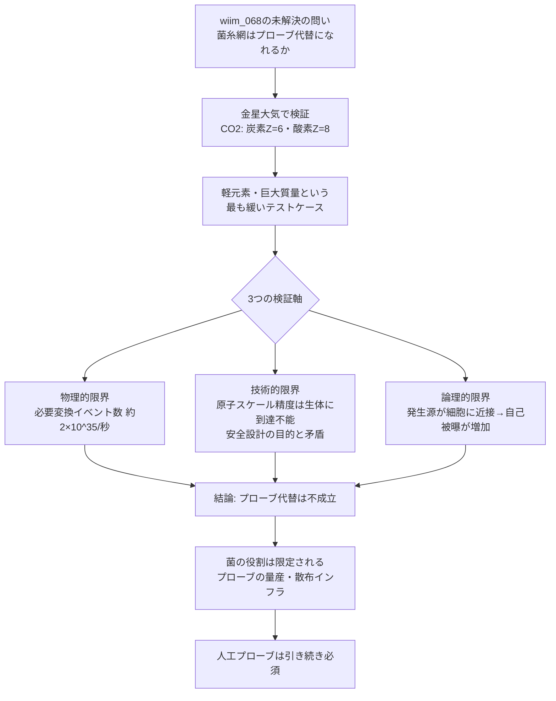

## 1. 概要 (Abstract)

[wiim_068](wiim_068.md)（マイコプラズマギカと宇宙菌糸知性の共生）は、生物的核変換細菌マイコプラズマギカ（[wiim_024](wiim_024.md)）が宇宙菌糸知性体コズミックマイスと共生する可能性を論じた際、次の問いを未解決のまま残していた。

> 「共生体の菌糸網が生物学的な『プローブ代替』として機能できるかどうかは未検証であり、設計上の重大な制約として残る」

マイコプラズマギカは単体では核変換を行えず、専用の「コンタクトプローブ」——原子スケールの針状構造を持つ装置——との接触によってのみ発動する設計になっている（暴走・野生化を防ぐための安全機構）。この問いは、深宇宙という漠然とした舞台では検証しづらい。本記事では舞台を金星大気に絞り込み、具体的な数字で決着をつける。

> **前提:** マイコプラズマギカが金星に持ち込まれ、コスモライケン的な菌糸ホストと共生関係を結んでいると仮定する。
> **命題:** 「もし菌糸網の枝分かれ構造そのものがコンタクトプローブの代わりを務められたら、金星大気（96.5%がCO₂）を核変換で処理できるか？」

金星のCO₂を構成する炭素（原子番号 Z=6）・酸素（Z=8）は、マイコプラズマギカの設計上「民生グレードのプローブで変換可能」とされる軽元素（Z≤20）の範囲に収まる。重元素変換のような国家管理レベルの精度は要求されないため、プローブ代替仮説を検証する上では条件が最も緩いテストケースといえる。それでも成立しないなら、より過酷な条件（深宇宙・重元素）でも成立しないと推定できる。

---

## 2. 実現不可能性の根拠 (Infeasibility Rationale)

- **物理的限界:** 金星大気の総質量は約4.8×10²⁰ kgで、その96.5%（約4.6×10²⁰ kg）をCO₂が占める。CO₂の分子量44で割ってアボガドロ数をかけると、分子数はおよそ6×10⁴⁵個にのぼる。仮に1000年かけて処理し切るとしても、必要な変換イベント数は毎秒およそ2×10³⁵回という天文学的な数字になる。[wiim_068](wiim_068.md)のエネルギー則（水素から鉄までの元素合成は発熱、鉄より重い元素は吸熱）に照らせば炭素・酸素間の変換自体はエネルギー的に不利ではないが、この桁数の反応回数をこなす総エネルギーは依然として計り知れない規模になる。
- **技術的限界:** [wiim_024](wiim_024.md)の核となる安全設計は「マイコプラズマギカ単体は核変換能力を持たず、専用のコンタクトプローブとの協調によってのみ発動する」という接触制約である。菌糸の先端がこの役割を代替するには、原子スケールの位置精度で特定の原子核に触れ続ける制御能力が必要になるが、現在の合成生物学が到達できる精度をはるかに超えている。しかもこの制約はもともと「生体単体の暴走・野生化を防ぐため」に意図的に設計されたものであり、菌糸がその役割を肩代わりできてしまうなら、制約を設けた目的そのものが失われる——代替が「うまくいく」ことと「安全機構として機能する」ことは両立しない。
- **論理的限界:** [wiim_024](wiim_024.md)が既に指摘する通り、核変換は必然的に放射線・高速粒子を放出し、生体自身のDNAを損傷する。菌糸がプローブの役割を兼ねるなら、変換の発生源が細胞のごく近傍に位置することになり、外部装置を使う場合よりもむしろ自己被曝のリスクが高まる。「プローブを生体に内蔵して安全機構を保つ」という発想と、「生体化すると外部装置による隔離性が失われる」という帰結は、根本的に両立しない。

---

## 3. 実験の設定 (Setup)

1. **変換者:** マイコプラズマギカ。核操作小器官ニュクレアソームを持つ合成細菌（[wiim_024](wiim_024.md)）
2. **宿主:** コスモライケン的な菌糸ホスト。金星の高温・高圧・強酸性大気に定着し、マイコプラズマギカに保護環境を提供する（[wiim_026](wiim_026.md)のテラフォーミング機構を参照）
3. **標的:** 金星大気の主成分であるCO₂（炭素 Z=6・酸素 Z=8、いずれも民生グレードプローブの対象範囲）
4. **検証する仮説:** 菌糸網の分岐した先端構造が、人工的に製造されたコンタクトプローブの代わりを務められるか

---

## 4. 考察と予測 (Speculation)

### 軽元素・巨大質量というテストケース

金星大気は、プローブ代替仮説にとって「最も成立しやすい条件」を備えている。標的元素は軽く（Z≤20）、変換先も特定の元素に固定する必要はなく、量としては大気全体という巨大な母集団がある。これほど条件が緩いケースで仮説が成立しないなら、より重い元素や、より精密な標的選別が要求される場面（[wiim_024](wiim_024.md)が想定する重金属の無害化やレアアース生成など）では、なおさら成立しない。

### なぜ代替できないか

菌糸の先端は化学的な勾配や電気信号を感知して伸長方向を変えることはできるが、それは原子1個を特定して針を突き立てるような精度とは次元が異なる。コンタクトプローブが「先端に直接触れた原子のみ」を対象にできるのは、工学的に原子スケールまで先鋭化された針状構造だからであり、生体組織の柔らかい末端がこの精度を代替する経路は、現在の生物学のどこにも存在しない。

さらに厄介なのは、この制約が「バグ」ではなく「意図された安全設計」だという点だ。マイコプラズマギカが単体で核変換できないのは、生体が制御を離れて暴走することを防ぐためだった。仮に菌糸がプローブ代替として機能するようになったとすれば、それは同時に「生体単体で核変換が発動する」状態に等しく、安全設計そのものが無効化されたことを意味する。都合よく機能だけを借りて安全機構を保つ、という都合の良い折衷は成立しない。

加えて、核変換が伴う放射線放出は、発生源が近ければ近いほど周囲の生体組織への被曝が増える。人工プローブは装置として細胞から分離しておけるが、菌糸自体が発生源になれば、変換を担う組織が真っ先に自らの被曝で損なわれていく。

### 結論——菌の役割は「プローブを作ること」に限定される

これらを総合すると、菌糸網によるプローブ代替は、精度・安全設計・自己被曝の3点で成立しないという結論になる。核変換によるテラフォーミングや資源変換を実現するには、あくまで人工的に製造されたコンタクトプローブが必須であり、菌類が担えるのは「プローブを大量生産し、大気中や地表に散布する生体インフラ」としての役割に限られる。

これは思考実験の域を出ないが、実在の創作プロジェクト「MyCells」で採用された設計とも符合する。核変換プローブは菌の進化系統とは独立した人類文明側の技術ツリーに位置づけ、菌側は共生する宿主として「プローブとの接触面積を稼ぐ」役割に限定するという分業である。生体が万能の代替品になれない以上、装置と生体それぞれの得意分野を切り分ける設計の方が、この思考実験の制約とも整合する。

### 哲学的な問い

- 安全のために意図的に組み込まれた制約を、別の生物学的経路で「代替」しようとする試みは、制約の目的を理解していないがゆえの発想なのか、それとも制約の再設計そのものなのか
- 生体と装置の役割分担が「精度は装置、量産は生体」という形に収束するのだとすれば、これは核変換に限らず他のWIIM思考実験にも一般化できる原則だろうか

---

## 5. 数式による表現 (Mathematical Notation)

必要な変換イベント発生率（処理期間を $T$、標的分子数を $N$ とする）：

$$
\dot{n} \approx \frac{N}{T} \approx \frac{6 \times 10^{45}}{3.15 \times 10^{10}\,\mathrm{s}} \approx 2 \times 10^{35}\,\mathrm{s^{-1}}
$$

($T$ = 1000年 ≈ 3.15×10¹⁰ 秒として概算)

---

## 6. 図解 (Diagrams)

---

## 7. 関連記事 (Related)

- [wiim_024](wiim_024.md) — マイコプラズマギカ——最小生命体による生物的核変換が可能な世界
- [wiim_068](wiim_068.md) — マイコプラズマギカと宇宙菌糸知性の共生——深宇宙で「何でも作れる」生態系は成立するか
- [wiim_026](wiim_026.md) — コズミックマイスのテラフォーミング——シェルマイセリウムの大気圏降下と惑星統合
- [wiim_043](wiim_043.md) — 宇宙ゴケ——地衣類とコズミックマイスの共生が生む自律型テラフォーミング艦
