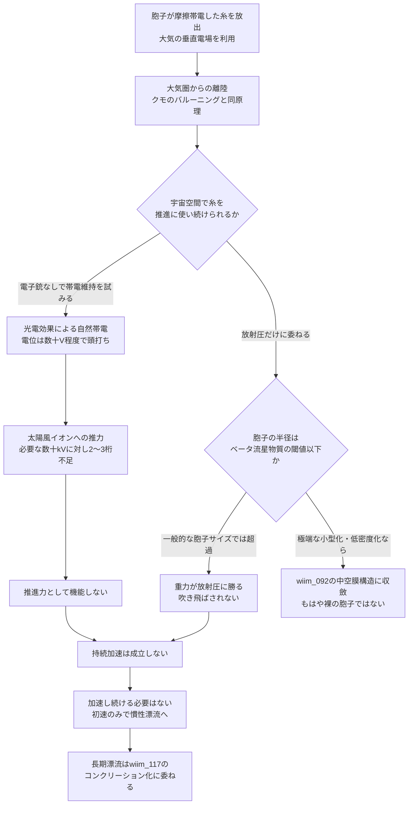

## 1. 概要 (Abstract)

クモは風がなくても、大気中の垂直電場だけを使って糸を放ち飛び立てることが実験室で確認されている。もしコズミックマイス（[g134](../../glossary/terms/g134.md)）の胞子が同じ原理——摩擦帯電した糸による静電浮力——で大気圏を脱出できるとしたら、その糸は宇宙空間に出た後も推進力の担い手であり続けられるだろうか。

本記事が扱うのは、シェルマイセリウム（[wiim_025](wiim_025.md)）のような能動的に設計された中空膜構造（[wiim_092](wiim_092.md)）でも、鉱物の団塊に受動的に封じられたコンクリーション・コクーン（[wiim_117](wiim_117.md)）でもない、**裸のまま、糸一本だけを頼りに旅立つ未分化な胞子**という、最も単純で最も脆弱なケースだ。

> **前提:** 胞子がクモと同じ原理で摩擦帯電した糸を放出し、大気の電場を使って離陸できると仮定する。
> **命題:** 「もしこの帯電した糸が大気圏外でも働き続けるなら、胞子は電荷だけでどこまで恒星間空間へ運ばれるか？」

---

## 2. 実現不可能性の根拠 (Infeasibility Rationale)

### 物理的限界

大気圏内の離陸は実在の現象の延長線上にある。2018年のBristol大学の実験室研究では、風のない垂直電場チャンバー内でクモが電場だけを頼りにバルーニング（糸を放って離陸）する様子が撮影で確認されている。クモ糸は合成繊維より導電率が6桁高く、荷電アミノ酸（グルタミン酸・アルギニンが7〜9%）を多く含む特殊なタンパク質構造を持ち、実際にバルーニング後の糸からナノクーロン単位の残留電荷が測定されている。

問題は大気圏を出た後だ。電気式太陽風セイル（E-sail）という実在の推進構想では、数km〜20km級のテザーを電子銃で正に帯電させ（数十kV程度）、周囲の静電シースで太陽風の陽子を押し返して推力を得る。しかし太陽風の動圧は1AU付近で1〜6 nPa程度しかなく、太陽光の放射圧（〜9 µN/m²程度）より3桁近く弱い。糸の帯電を電子銃なしで維持できたとしても、得られる推力は原理的に小さい。

さらに、この推力そのものが持続しない。太陽風は希薄とはいえプラズマであり、孤立した帯電体の電荷は周囲の荷電粒子との相互作用で徐々に中和される。継続的に電子を排出し続ける能動的な装置がなければ、電位はいずれ失われる。

### 技術的限界

電源なしで帯電を保つ経路が皆無というわけではない。太陽紫外線を浴びた表面が光電子を放出し自然に正帯電する現象（光電効果による宇宙機の自然帯電。月の昼面が正に帯電するのと同じ原理）はNASA/ESAの人工衛星帯電研究で確立している。これは電子銃のような能動的な電源を必要としない。

ただし、この方式で到達できる電位は周囲プラズマの電子流入とのバランスで決まり、典型的には数十V程度で頭打ちになる。E-sailが必要とする数十kVには遠く及ばない。電位が2〜3桁低ければ、静電シースの半径も推力も同程度以上に小さくなり、「原理としては電源不要で成立するが、推進力として意味のある量にはならない」という技術的な壁に行き着く。

### 論理的限界

もし胞子がこの壁を越えようとして、太陽風の力を受けやすい構造——面積/質量比を極端に上げた中空・極薄の膜——へと形態を変えたなら、それはもはや「裸の胞子」ではなく、すでに別記事で論じた中空型シェルマイセリウム（[wiim_092](wiim_092.md)）そのものに収斂してしまう。つまり「裸の胞子のまま電荷で推進し続ける」経路と「膜を進化させて太陽の力を利用する」経路は、独立した2つの解ではなく、同じ問題の異なる発生段階における同じ解にすぎない。胞子は分散に適した小ささ・単純さを保ったまま、同時に太陽風から恩恵を受ける低密度構造を獲得することはできない。

---

## 3. 実験の設定 (Setup)

1. **主体:** コズミックマイスの胞子1個体。直径数µm〜数十µmの未分化な状態。鉱物殻にも中空膜にも包まれていない「裸」の状態を仮定する。
2. **環境1（大気圏内）:** 惑星大気中の垂直電場（地球の晴天時で数十〜数百V/m程度）。
3. **環境2（惑星間空間）:** ヘリオスフィア内、太陽風（陽子密度 約5〜10個/cm³、速度 約400〜800km/s）と太陽光に曝露される領域。
4. **操作A（離陸）:** 摩擦帯電した糸を放出し、大気の垂直電場を使って離陸する。
5. **操作B（持続加速の試み）:** 大気圏外に出た後、同じ糸を電気式太陽風セイルとして使い続けようとする。
6. **操作C（代替案）:** 電荷による推進を諦め、糸を畳んで太陽光の放射圧だけに推進を委ねる。

---

## 4. 考察と予測 (Speculation)

### 糸1本の電位を見積もる

実測されているクモの糸の電荷（長さ1mの糸束でおよそ1 nC）を、孤立した細線（長さ1m、半径1µm程度と仮定）の静電容量に当てはめると、およそ4 pF程度になる。この電荷と容量から糸1本の電位を見積もると、およそ200〜300V程度になる。

これはE-sailが使う数十kV（＝数万V）と比べて2桁近く低い。しかも太陽風プラズマに曝された瞬間から中和が始まるため、この200〜300Vという値は「一瞬だけ持つ最大値」であり、持続的な推力の根拠にはならない。光電効果による自然帯電（数十V程度）と合わせて考えても、桁の壁は動かない。

### 放射圧だけに頼る場合の境界線

推力を電荷ではなく太陽光の放射圧そのものに求める道もある。天体力学でよく知られる「ベータ流星物質」効果では、微小な粒子ほど重力（質量∝半径³）に対して放射圧（受圧面積∝半径²）が相対的に強くなり、ある半径を下回ると放射圧が重力を上回って太陽系外へ押し出される。生体に近い密度（水とほぼ同等、1 g/cm³程度）を仮定すると、この境界はおよそ半径0.5µm前後——直径にして1µm程度——に相当すると見積もられる。

一般的な菌類の胞子は直径にして数µm〜数十µmと、この境界より一桁ほど大きい。つまり典型的なサイズの胞子は、裸のままでは放射圧が重力に勝つ側に入らない。この効果を使うには、胞子自体が異例なほど小さいか、[wiim_092](wiim_092.md)で論じたような極端に低い実効密度（中空構造）を獲得している必要がある——結局、論理的限界の項で述べた収斂と同じ結論に戻る。

### 加速し続けなくて良い理由

ここまでの検討は「電荷でも光でも、裸の胞子が持続的に加速され続ける経路はない」という否定的な結論に向かう。だが、これは致命的な弱点ではないかもしれない。

真空中には空気抵抗がなく、一度でも恒星系を脱出できる速度（局所脱出速度）に達しさえすれば、その後は追加の推力なしに慣性だけで漂い続けられる。電場による離陸の一撃が与える初速はわずかでも、時間さえかければ十分な変位につながる。むしろ胞子にとって必要なのは「加速し続けること」ではなく「途方もない漂流時間に耐えて休眠すること」であり、これはすでに[wiim_117](wiim_117.md)で論じた、鉱物の団塊に受動的に封じられて数千〜数百万年を凌ぐ経路と同じ問題設定になる。

つまり、電荷を帯びた糸の役割は「大気圏からの離陸の一撃」だけに限定するのが最も無理のない解釈であり、その後の長い漂流と保護は、糸ではなく別の受動的な仕組み（コンクリーション化など）に委ねられる——電荷で飛び続ける必要そのものが、そもそも存在しないという結論だ。

---

## 5. 図解 (Diagrams)

---

## 6. 関連記事 (Related)

- [g134](../../glossary/terms/g134.md) — コズミックマイス（放射性栄養・胞子による星間拡散・分散知性）
- [wiim_008](wiim_008.md) — コズミックマイス基本記事
- [wiim_092](wiim_092.md) — 太陽光子圧で回遊する磁気帆生命体（本記事が収斂する中空膜構造の完成形）
- [wiim_093](wiim_093.md) — 複合推進で回遊するヘリオスフィア生命体
- [wiim_117](wiim_117.md) — コンクリーション・コクーン（電荷に頼らない長期漂流の受け皿）
- [wiim_062](wiim_062.md) — 菌類磁気圏（磁場によるエネルギー収集との対比）
