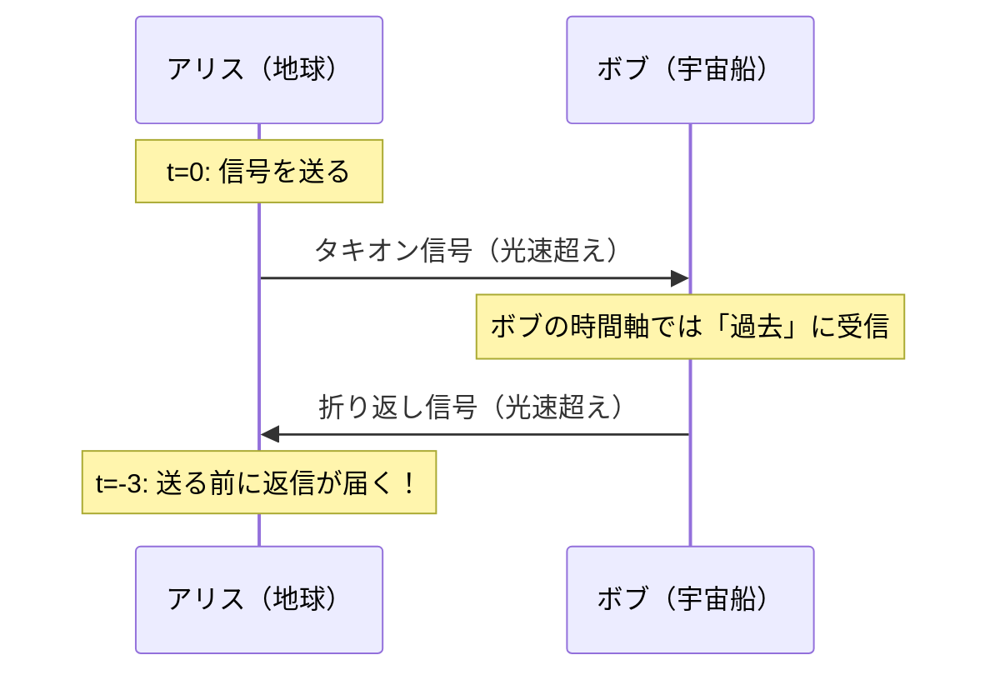

## 1. 概要 (Abstract)

現代物理学において、光速は宇宙における絶対的な速度の上限とされている。
アインシュタインの特殊相対性理論によれば、質量を持つものが光速に近づくほど加速に必要なエネルギーは無限大に膨れ上がり、光速を超えることは原理的に不可能とされている。

しかし「もし光速を超えて情報を送れる粒子が存在したら？」という問いは、物理学者たちを長年悩ませてきた。
その仮想上の粒子が**タキオン**である。

> **前提:** 特殊相対性理論の速度制限を無視し、光速を超えて情報を伝達できるとする。
> **命題:** 「もしタキオンが実在したら、過去への情報送信は可能か？そして因果律はどう崩れるか？」

---

## 2. 実現不可能性の根拠 (Infeasibility Rationale)

### 物理的限界

特殊相対性理論は、光速を超えようとする物体の質量が無限大に発散することを示している。
つまり、光速の壁は「まだ技術が追いついていない」のではなく、エネルギーの概念そのものが破綻する境界線だ。

### 技術的限界

タキオンは理論上「はじめから光速より速く存在する」とされるが、現実の粒子加速器でいくら加速しても光速の壁を越えた観測例はゼロである。
そもそも通常の粒子をタキオンに変換する手段が存在しない。

### 論理的限界（因果律の崩壊）

ここが最も本質的な問題だ。
特殊相対性理論と光速超えを同時に認めると、ある観測者には「情報が送られる前に受け取られた」ように見える状況が生まれる。
これを**タキオン電話のパラドックス**と呼ぶ。

「結果が原因より先に起きる」世界では、「原因」という概念自体が消滅する。

---

## 3. 実験の設定 (Setup)

1. **送信者（アリス）:** 地球に静止している。タキオン通信装置を持つ。
2. **受信者（ボブ）:** 地球に対して高速（光速の80%）で移動中の宇宙船に乗っている。
3. **操作:** アリスがボブに向けてタキオン信号を送る。ボブはその信号を折り返しアリスに返信する。

---

## 4. 考察と予測 (Speculation)

### 予測される結果

特殊相対性理論の「同時性の相対性」と光速超え通信を組み合わせると、以下のことが起きる。

- アリスからボブへの信号は、ボブの時計では「過去」に届く
- ボブの折り返し信号は、アリスの時計では信号を**送る前**に届く
- アリスは「自分がまだ送っていないはずの信号への返信」を受け取る

これは単なる思考実験上のトリックではない。特殊相対性理論の数式を素直に適用すると、こうした「逆向きの因果」が論理的に導かれてしまうのだ。

### 哲学的な問い

- 「送る前に返信が届く」なら、アリスは送らないという選択もできる。では返信は存在するのか？（自己矛盾）
- 「原因なき結果」が存在できる宇宙では、物理法則そのものに意味はあるか？
- 因果律は「自然の法則」なのか、それとも「人間の認識の枠組み」に過ぎないのか？

---

## 5. 関連記事 (Related)

- 双子のパラドックス（高速移動による時間の遅れ）
- シュレーディンガーの猫（観測と現実の関係）
- ニュートンの絶対時間（時間の一方向性）
