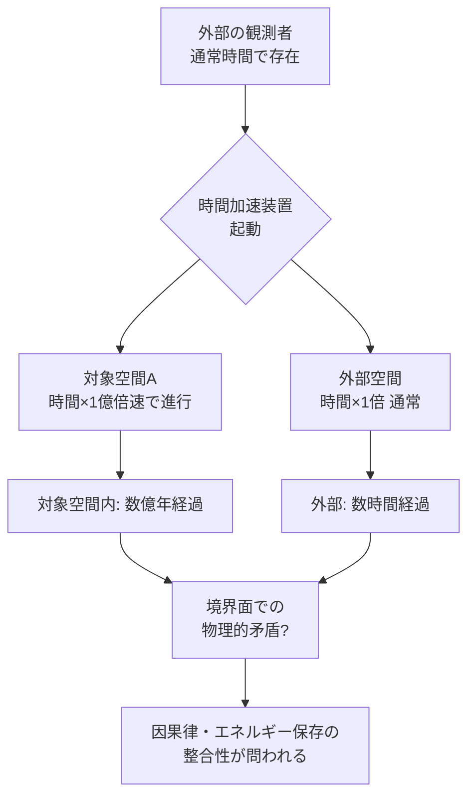

## 概要 (Abstract)

特殊相対性理論によれば、光速に近い速度で運動している観測者から見ると、静止している対象の時間は遅れて見える——これを「時間の遅れ（時間膨張）」という。

この思考実験では、その逆を発想する。「観測者を動かす」のではなく、**対象の空間だけを相対的に静止させ、外側の観測者から見てその空間内の時間を自在に早める**ことができたとしたら？

熟成に100年かかるワインを1日で完成させたり、数億年分の地質変化を観察したり、素材の超長期耐久試験を瞬時に行ったりと、その応用は無限に広がる。

---

## 実現不可能性の根拠 (Infeasibility Rationale)

### 物理的限界

時間膨張は「運動する物体の時間が遅れる」現象であり、片方の空間だけを選択的に時間的に遅くする（あるいは外側を速くする）ための既知のメカニズムは存在しない。特殊相対性理論は観測者と対象の**相対的な運動状態**によって生じるものであり、空間そのものを操作する手段ではない。

また、一般相対性理論では重力場によっても時間の流れが変化する（重力時間膨張）が、実用的な時間差を生み出すには中性子星やブラックホール級の重力源が必要であり、地上での制御は不可能に近い。

### 技術的限界

仮に「空間内の物理定数を操作する」アプローチを考えると、光速・プランク定数・素電荷といった自然定数を局所的に変化させる技術は現時点で存在しない。これらは観測の限りにおいて宇宙全体で一定であり、局所操作の手がかりすら理論的に提示されていない。

また、「時間を早めた空間」と「通常時間の空間」が接する境界では物理法則の整合性が崩れ、情報・エネルギーの流れに深刻な矛盾が生じると考えられる。

### 論理的限界

因果律の問題もある。対象空間内の時間を外から速めることができるなら、その空間内で起きた「未来の出来事」が外部の観測者の現在時刻より先に発生することになる。これは情報の時間的順序を破壊し、「原因の前に結果が観測できる」状況を生み出す可能性があり、因果律と矛盾する。

---

## 実験の設定 (Setup)

- **主体**: 外部の研究者・観測装置
- **対象**: 時間を加速したい任意の空間（例: 密閉チャンバー内の素材、生態系、鉱物サンプル）
- **操作**: 対象空間の「時間進行速度」を外部から任意の倍率で加速する（例: 1億倍速）
- **境界条件**: 対象空間と外部空間の間では物質・エネルギーのやり取りは自由に行えるものとする

想定されるユースケース：

| 用途 | 必要な時間倍率 | 具体例 |
|------|-------------|-------|
| 素材耐久試験 | 10万〜100万倍 | 金属疲労・高分子劣化の長期観察 |
| 食品・飲料熟成 | 100〜10,000倍 | ウイスキー・ワインの急速熟成 |
| 地質・進化観察 | 1億〜10億倍 | 大陸移動・生物進化の観測 |
| 宇宙天体の変化 | 10億倍以上 | 恒星の一生・銀河の形成過程 |

---

## 考察と予測 (Speculation)

### 境界面での矛盾

時間速度が異なる2つの空間が隣接した場合、境界面では奇妙な現象が起きると推測される。対象空間から飛び出した光子は外部空間に入った瞬間に「時間スケール」が切り替わることになり、波長や振動数に不連続が生じる可能性がある。これは実質的に、境界面が特殊なエネルギー変換器として機能することを意味するかもしれない。

### 倍率の上限

現実的な問題として、仮にこの技術が実現したとしても「倍率の上限」が問題になると考えられる。対象空間内で数億年が経過すると、その空間内の物質は放射性崩壊・宇宙線被爆・熱的揺らぎなどにより根本的に変質する。無限の時間加速は「観察」ではなく「崩壊」を招く。

### 哲学的問い

この装置が実現した世界では、「時間とは何か」という問いが現実的な工学問題になる。時間を外部から操作できるなら、時間は物理的な「量」であり操作可能な資源ということになる。これは時間を絶対的背景として捉えるニュートン的世界観と、時間を相対的な関係として捉えるアインシュタイン的世界観の双方を超えた、新たなパラダイムを要求する。

---

## 図解 (Diagrams)

---

## 関連記事 (Related)

- `wiim_001` — 光速を超えた場合の因果律への影響
- （未作成）時間の逆行と情報のパラドックス
- （未作成）重力を局所的に制御できる空間
- （未作成）観測者のいない宇宙では時間は存在するか
- [wiim_005](wiim_005.md) — 時間遡行粒子のエントロピー増大によるタイムマシン
- [wiim_016](wiim_016.md) — 時間同期技術——ウラシマ効果を逆用した時間的保護
- [wiim_003](../physics/wiim_003.md) — 負の質量を持つ粒子による局所的時間加速
- [wiim_012](../physics/wiim_012.md) — 近光速回転シールド——時間膨張を鎧にする
- [wiim_015](../physics/wiim_015.md) — エントロピーが減少する宇宙——時間の矢が逆を向いた世界の物理と知性
- [wiim_057](../physics/wiim_057.md) — クロノスフィア内部の光量問題——時間倍率が上がるほど「光が届かない」
- [wiim_002_rotation_principle](../notes/wiim_002_rotation_principle.md) — クロノスフィアの回転原理——粒子・光子シェルによる時間差生成
- [wiim_058](../biology/wiim_058.md) — クロノスフィア内在化——菌類が時間加速因子を自己に組み込めるか
- [wiim_025_chronosphere_shell](../notes/wiim_025_chronosphere_shell.md) — 補遺: シェルマイセリウム移動式クロノスフィア炉——球殻内部空間を時間加速させる条件
- [wiim_060](../physics/wiim_060.md) — 逆クロノスフィア——内部時間を極端に遅くして生命・文明を保存できるか
- [wiim_061](../biology/wiim_061.md) — 菌類ダイソン網——コズミックマイスが恒星系全体を覆うとき
- [wiim_022_cosmic_ring](../notes/wiim_022_cosmic_ring.md) — 補遺: 恒星系規模の慣性計測網——菌糸リングレーザーとアンキロン固定型リングレーザー
- [hac_replistar_plan](../notes/hac_replistar_plan.md) — HaC・RepliStar 計画書——宇宙居住可能天体計画と人工恒星計画の概要

