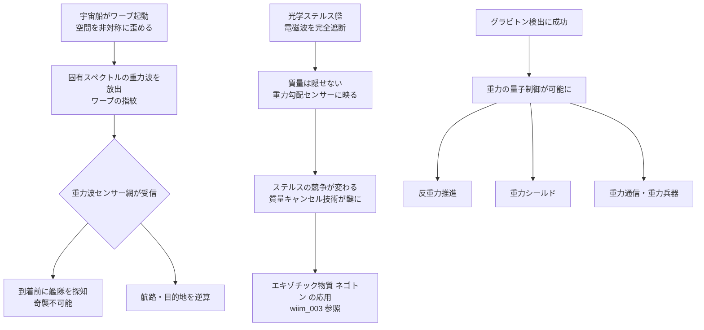

## 概要 (Abstract)

2015年、LIGO（レーザー干渉計重力波天文台）は13億光年先の二つのブラックホールが合体する瞬間の重力波を観測した。質量が非対称に加速運動するとき、時空は「さざ波」のように振動し、光速でその歪みが宇宙全体に伝播する——これが重力波の正体だ。

では、もし超光速航法（ワープ）が実現した世界を想定するなら？
巨大な質量を持つ宇宙船が急激に空間を歪めながら移動すれば、その軌跡は**固有のスペクトルを持つ重力波**として宇宙に刻まれると考えられる。

この思考実験では、「重力波レーダー」が実現した宇宙を舞台に、ワープ痕跡の追跡、重力子（グラビトン）の制御、そして「光学的ステルス」を無効化する重力索敵について考察する。

---

## 実現不可能性の根拠 (Infeasibility Rationale)

### 物理的限界

現在の物理学では超光速航法自体が実現不可能とされており、アルクビエレ・ドライブのような理論上のワープ機構でさえ「木星規模のエキゾチック物質が必要」とされている。したがって、ワープの重力波痕跡を観測するには、まずワープ自体が存在しなければならない。

また、通常規模の宇宙船（質量：数万トン）が発生させる重力波は、LIGOでさえ観測不可能なほど微弱である。現在の技術で観測できる重力波は、太陽の数十倍の質量を持つ天体が合体するような極端な事象に限られる。

### 技術的限界

重力子（グラビトン）は一般相対性理論と量子力学を統合する量子重力理論において理論上存在するとされるが、未検出のままだ。光子を検出する光電効果（アインシュタインが発見）のような「重力子の検出反応」に相当するものが存在するかどうか、理論的にも未解決である。

仮にグラビトンが検出できたとしても、重力は他の力に比べて**40桁以上弱い**。実用的な重力波センサーを宇宙船規模に小型化するには、現在では想像も及ばない素材・技術が必要になる。

### 論理的限界

光学ステルスを重力で「バレる」という議論については、一つの矛盾がある。もし超高感度な重力センサーが存在するなら、**センサー自身の質量も周囲に重力波を発している**ことになる。完全な隠密行動は質量ゼロでなければ原理的に不可能であり、「どちらも互いを検知できる」という軍事的均衡が生まれる可能性がある。

---

## 実験の設定 (Setup)

以下のような宇宙を想定する：

- **重力波センサー網**：太陽系規模の干渉計アレイが恒星間空間に展開されている
- **ワープ技術**：空間を局所的に歪めることで見かけ上の超光速移動を実現（アルクビエレ型）
- **グラビトン検出器**：量子重力技術の発展により、重力子の個別検出が可能になっている

この世界で観測・運用される主な技術：

| 技術 | 原理 | 用途 |
|------|------|------|
| ワープ痕跡探知 | FTL移動が残す時空歪みの固有スペクトル検出 | 艦隊追跡・航路解析 |
| 重力勾配センサー | 空間2点間の重力差（潮汐力）計測 | ステルス艦の質量検出 |
| 時間遅延測定 | 重力場による原子時計の遅れ差 | ブラックホール兵器・大質量天体の索敵 |
| グラビトン制御 | 重力子ビームの放射・収束 | 反重力推進・重力シールド・重力兵器 |

---

## 考察と予測 (Speculation)

### ワープは「叫び声」を残す

アルクビエレ型ワープドライブは、船の前方で空間を収縮させ、後方で膨張させることで移動する。この「空間の非対称な歪み」は、質量の非対称加速運動と同様に重力波を発生させると考えられる。

通常の機動と異なるのは、ワープが生み出す重力波が**極めて特徴的な波形パターン**を持つ点だ。空間収縮・膨張の速度変化はエンジン推力とは全く異なる信号であり、「ワープの指紋」として識別できる可能性がある。高度な重力波センサー網があれば、どの方向から何隻がワープしてきたかを、到着前に察知できるかもしれない。

### 光学ステルスの終焉

どんな完璧な光学迷彩も、質量は隠せない。1万トンの宇宙船は姿を消せても、その重力場は消せない。重力勾配センサーが十分に高感度であれば、**「見えない艦」は重力の歪みとして浮かび上がる**。

これはスペースオペラにおける戦術を根本から変える。ステルス技術の競争は「いかに電磁波を吸収・偏向するか」から「いかに質量の重力的影響を局所的に打ち消すか」へと移行する。後者には負の質量（エキゾチック物質）が必要であり、wiim_003 で論じたネゴトン技術と直結する。

### グラビトン制御が開く世界

光子の制御がレーザー・電波・光通信をもたらしたように、グラビトンを制御できれば全く新しい技術体系が生まれると考えられる：

- **反重力推進**：重力子ビームで任意方向に重力を発生・打ち消し
- **重力シールド**：着弾する質量弾・エネルギー弾を重力勾配で偏向
- **重力通信**：電磁波が遮断された環境でも伝達可能な重力波通信
- **重力兵器**：局所的な時空歪みで標的の構造を崩壊させる

ただし、重力は他の3つの力（電磁気・強い力・弱い力）と比べて圧倒的に弱い。グラビトン1個のエネルギーは光子と比較にならないほど小さく、「重力兵器」を実用化するには天文学的なエネルギー供給源が必要になる。

---

## 図解 (Diagrams)

---

## 関連記事 (Related)

- [wiim_001](wiim_001.md) — 光速を超えた場合の因果律への影響
- [wiim_003](../physics/wiim_003.md) — 負の質量を持つ粒子による局所的時間加速（ネゴトン・ステルス対策の基盤）
- （未作成）アルクビエレ・ドライブは本当に光速を超えているのか
- （未作成）重力通信は電磁波通信を置き換えられるか
- （未作成）カシミール効果を巨視的スケールに拡大できるか
- [wiim_009](wiim_009.md) — 重力波をキャンセルする——時空のノイズキャンセリングと完全ステルスの攻防
- [wiim_016](wiim_016.md) — 時間同期技術——ウラシマ効果を逆用した時間的保護
- [wiim_028](wiim_028.md) — 重力子と光子の二重搬送FTL通信——エキゾチック物質チャネルによる宇宙際通信
- [wiim_010](../physics/wiim_010.md) — グラビトーペイク——重力波を遮断・散乱させる物質の逆説
- [wiim_012](../physics/wiim_012.md) — 近光速回転シールド——時間膨張を鎧にする
- [wiim_014](../physics/wiim_014.md) — 宇宙のルート権限を奪取せよ——物理定数ハッキングによる超光速航法
- [wiim_020](../physics/wiim_020.md) — アカシックレコードが重力場による自己強化型情報網だったら
- [wiim_023](../physics/wiim_023.md) — カシミールフォージ——仮想粒子の増幅でエキゾチック物質を量産できたら
- [wiim_027](../physics/wiim_027.md) — ストレンジスター・ワープゲート——重力チューニングによる固定式時空歪曲点
- [wiim_008](../biology/wiim_008.md) — コズミックマイス——菌糸ネットワークが宇宙空間で分散知性に進化したら
- [wiim_079](wiim_079.md) — ギャラクシードライブ——カルダシェフ4型文明が銀河を乗り物としてハッブル地平線を超えられるか

