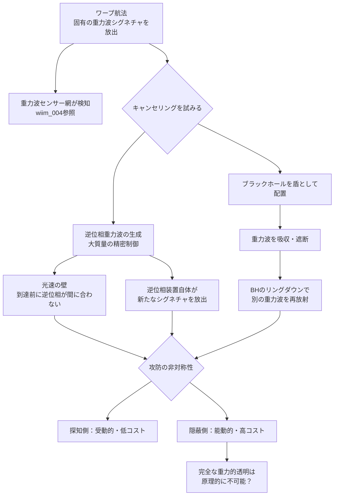

## 概要 (Abstract)

wiim_004では、ワープ航法が固有の重力波スペクトルを残し、それを追跡できる世界を論じた。しかしその世界で逃げる側はただ傍観しているわけではない——重力波そのものを消せるとしたら？

音のノイズキャンセリングヘッドフォンは、マイクで騒音を拾い、逆位相の音波をリアルタイムで出力することで音を打ち消す。同じ発想を重力波に適用できるとしたら——質量を精密に動かして逆位相の重力波を生成し、元の重力波と干渉消去させる「能動重力波キャンセリング」が理論上の出発点になる。

さらに、ブラックホールが重力波を吸収する性質を利用し、BHを「盾」として配置することで重力波を遮蔽する方向も考えられる。この思考実験では、重力波の生成・吸収・消去をめぐる検知側と隠蔽側の終わりなき攻防を描く。

---

## 実現不可能性の根拠 (Infeasibility Rationale)

### 物理的限界

重力波を生成するには質量の**非対称な加速運動**が必要だ。逆位相の重力波を出すためには、打ち消したい重力波の波形を事前に把握し、それとまったく逆のパターンで大質量を動かさなければならない。

問題は伝播速度だ。重力波は光速で進む。観測してから逆位相を生成して間に合わせるには、重力波の到達より早く波形を予測する必要があり、これは原理的に不可能に近い。音のANCは音速（340m/s）が遅いために成立するが、光速相手では情報の伝達が間に合わない。

### 技術的限界

ブラックホールを「盾」として利用する場合、BHの位置と向きを精密に制御する必要がある。現在の技術でBHを人工的に生成・移動・配置する手段は存在しない。また、BHが重力波を吸収してわずかに質量を増す（スピン変化を含む）際、BH自体が新たな重力波を再放射する。吸収体であると同時に放射体でもあるという矛盾が、「完全な盾」の実現を阻む。

### 論理的限界

もし重力波の完全なキャンセリングが可能になれば、エネルギー保存則との整合性が問われる。消去された重力波のエネルギーはどこに行くのか。逆位相波との干渉で「打ち消した」場合、エネルギーは元の波源に反射されるか、別の形に変換されるはずだ。「重力波を消した」ように見えて、実は空間内の別の点にエネルギーが集中している可能性がある。

---

## 実験の設定 (Setup)

以下の3つのシナリオを検討する：

| シナリオ | 手段 | 目的 | 限界 |
|---------|------|------|------|
| 能動キャンセリング | 逆位相重力波の生成 | 自艦のワープ痕跡を消去 | 波形予測が光速制限に引っかかる |
| ブラックホール盾 | BHを特定方向に配置 | 外部からの重力波を遮断・吸収 | BH自体が重力波を再放射する |
| 重力波レンズ偏向 | 巨大質量で重力波を曲げる | 重力波を意図した方向に誘導・集束 | 偏向の精度制御が困難 |

---

## 考察と予測 (Speculation)

### 「光の一歩手前」で成立する可能性

光速相手では間に合わないとはいえ、これが成立しうる条件は一つある——**波源から十分遠い場合**だ。

音のANCが成立するのは、マイクとスピーカーを波源の近くに配置できるからではなく、音速が遅いため「波が来る前に準備できる」からだ。重力波が遠方の恒星系から来るとき、観測地点より手前の中継点で波形を検出し、光速通信で先回りして逆位相源を待機させておく——このような「予め仕掛けておく」構造なら、光速の壁を迂回できるかもしれない。

宇宙船がワープする際の重力波は、出発点が予測できれば波形の特徴も予測可能だ。既知のワープシグネチャに対して「逆位相テンプレート」を事前生成しておく技術が実現すれば、特定の相手のステルスを破るのではなく、**自分の痕跡を消す**方向に利用できる。

### ブラックホールを「投擲」する戦術

BHが重力波を吸収することを逆用した奇妙な戦術が考えられる——重力波センサー網に向けてBHを「投擲」し、センサーをBHの重力的影響下に置くことで一時的に無効化する。センサー自体は壊れないが、BHの強重力場でセンサーの時計が狂い（重力時間膨張）、波形の解析が不能になる。

これは「重力波のジャミング」に相当する。電磁波のジャミングが電磁波を使うように、重力波のジャミングは重力場そのものを使う。

### 攻防の非対称性

重力波をキャンセルする技術は、検知する技術と本質的な非対称性を持つ。

検知は**受動的**——センサーを置いて待つだけでよく、エネルギーをほとんど消費しない。対してキャンセリングは**能動的**——大質量を正確なタイミングで動かし続けなければならず、莫大なエネルギーを継続的に消費する。

この非対称性は、光学ステルスとまったく同じ構造だ。探知はカメラを置くだけだが、ステルスは機体全体を覆う必要がある。重力の世界でも「守り」は常にコストが高く、「攻め」（探知側）は安価に優位に立てるというのが、物理の示す結論かもしれない。

### 逆説——キャンセリング自体が新たなシグネチャになる

最も皮肉な帰結がある。重力波をキャンセルするための逆位相重力波を生成する装置は、それ自体が重力波を放射している。「重力波の存在を消す行為」が「新たな重力波の存在」を生み出す。

完全な重力的透明は、情報理論的に不可能かもしれない——何かが存在するかぎり、それは時空に何らかの歪みを刻む。

---

## 図解 (Diagrams)

---

## 関連記事 (Related)

- [wiim_004](wiim_004.md) — ワープ航法の痕跡を重力波で追跡できる世界（本記事の前提）
- [wiim_003](../physics/wiim_003.md) — 負の質量を持つ粒子による局所的時間加速（時空操作の共通テーマ）
- （未作成）ブラックホールを人工的に生成・制御できるか
- （未作成）重力波通信は電磁波通信を置き換えられるか
- （未作成）事象の地平線の内側では物理法則はどうなっているか
- [wiim_010](../physics/wiim_010.md) — グラビトーペイク——重力波を遮断・散乱させる物質の逆説
- [wiim_020](../physics/wiim_020.md) — アカシックレコードが重力場による自己強化型情報網だったら
- [wiim_021](../physics/wiim_021.md) — 切れないエネルギー紐——完全剛体なしに不変距離を定義する
- [wiim_022](../physics/wiim_022.md) — アンキロン——時空の計量に錨を打つ架空粒子
- [wiim_035](../physics/wiim_035.md) — グラビトーペイクの逆説——遮断した重力波エネルギーはどこへ行くのか

