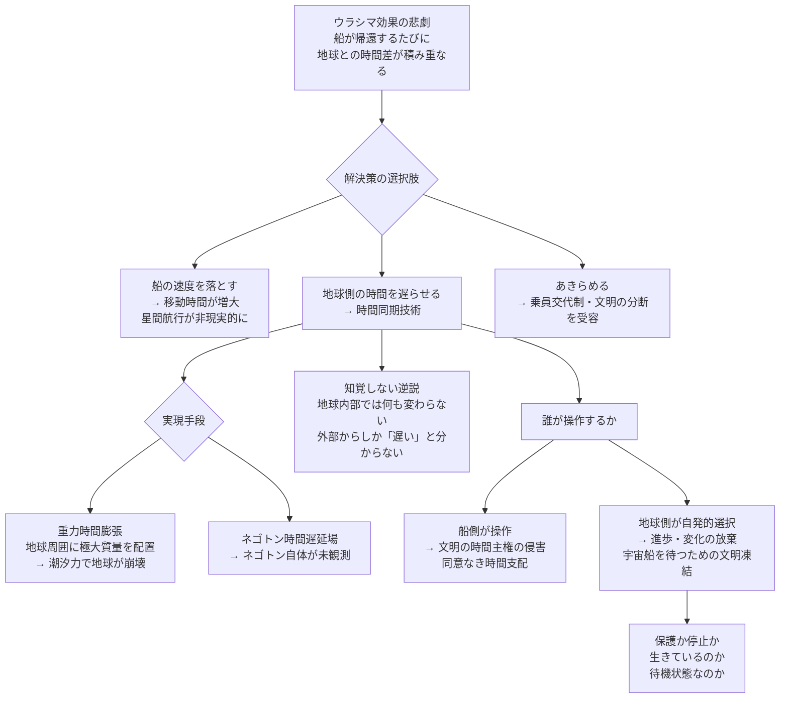

## 概要 (Abstract)

光速の99%で10年間の宇宙旅行をした人間が地球に帰ると、地球では約71年が経過している。旅行者は老いず、地球に残した家族・友人・文明はその間に変貌する。これが「ウラシマ効果」——日本の民話の浦島太郎が竜宮城から帰ると時代が変わっていたように、宇宙飛行士は帰還のたびに「未来の地球」へと着陸する。

この時間的孤立は、星間文明にとって深刻な問題だ。光年単位の往復飛行を繰り返す探検隊は、毎回帰還するたびに地球との共通の歴史を失っていく。世代を超えた知識の蓄積、文化的連続性、愛する者との時間の共有——これら全てが時間差によって侵食される。

ならばこう問う。**地球側にも人工的に同じ時間膨張を適用し、船と地球の時間流を同期させる技術**は可能か。船が遅く歳を取るなら、地球もその間だけ遅く歳を取ればいい——「時間的保護」という発想だ。

---

## 実現不可能性の根拠 (Infeasibility Rationale)

### 物理的限界

物体を移動させずに時間を遅らせる方法は、現在の物理学に二つある。一つは**重力時間膨張**——強い重力場の中では時間が遅れる（一般相対性理論）。ブラックホールの近傍では、外部から見ると時間がほぼ止まる。もう一つは、wiim_003で論じた**ネゴトンによる反重力場の逆作用**——負の実質量を持つ粒子を地球の周囲に配置すれば、理論上は時間の遅延を引き起こす場が作れるかもしれない。

しかし地球を宇宙船と同じ時間膨張率に合わせるには、宇宙船が光速の99%で飛行するとき約7倍の時間遅延が必要になる。これを重力で実現するには、地球の周囲にブラックホール規模の質量密度を配置しなければならない——地球自身が潮汐力で引き裂かれるような強さの重力場だ。

### 技術的限界

仮に時間遅延場を地球規模で生成できたとして、副作用が致命的だ。地球の公転軌道は太陽との重力バランスで決まる。地球周辺の時空を歪めれば公転速度・軌道半径が変化し、気候が激変する。月との引力関係が変われば潮汐が乱れ、地球の自転軸も揺れる。

さらに「時間を遅らせる場」の境界面——通常時間の宇宙と遅延した地球の間の界面——では、光や電磁波の周波数が急激にシフトする。地球に降り注ぐ太陽光のエネルギーが変化し、光合成・気温・放射線環境が根底から変わる。遅延場の内側の地球は、外から見れば「赤みがかったスローモーションの世界」として観測される。

### 論理的限界

最も深い問題は「誰がスイッチを持つか」だ。

時間同期技術を持つのは宇宙船側——地球を離れて光速飛行する側だ。地球の時間を操作する権限を、地球を「去った側」が握ることになる。地球の全人類は、帰還予定の宇宙船の都合で、自分たちの時間を止められるかもしれない——同意を求める通信さえ、時間差で無意味になる。

逆に地球側が主体的に「時間を遅らせる」選択をするとき、それは何を意味するか。「宇宙船が帰るまで、私たちは時を止めて待つ」という決断は、文明が自ら進歩・変化を放棄することに等しい。保護のために止めた時間の中で、地球は「生きている」のか「待機状態」に過ぎないのか——これは保護と停止の境界を問う。

---

## 実験の設定 (Setup)

時間の扱い方によって、星間航行の「悲劇」は異なる形をとる：

| シナリオ | 船の時間 | 地球の時間 | 帰還時の状況 |
|---------|---------|-----------|------------|
| 現在（同期なし） | 遅い（時間膨張） | 普通に経過 | 船員は若く、地球は老いた |
| **時間同期（この記事）** | **遅い** | **同じ比率で遅い** | **両者が同じだけ歳を取る** |
| 逆同期（wiim_002的） | 普通 | 速く経過 | 地球が先に未来に達する |
| 完全停止 | 遅い | 停止 | 地球は変化しないまま待つ |

完全同期が理想だが、地球の時間を止めることの代償は「文明の凍結」だ。船が10年で帰るとき、地球も10年しか老いていないが、地球では10年分の発明・誕生・死が全て起きない。歴史の10年分が消える。

---

## 考察と予測 (Speculation)

### 「知覚しない」逆説

時間が遅くなっても、地球の内部観測者には何も変わらない。

意識・神経信号・化学反応・物理法則——全てが同じ比率で遅れるため、地球人は「遅らされた」ことを原理的に検知できない。1秒が外から見て10秒かかっていても、地球人にとってその1秒は主観的に1秒だ。「保護されている」という事実を知る方法がない。

これは哲学的に奇妙な状態を生む。地球が時間的に「保護」されているとき、地球人はその保護を体験せず、意識もしない。外部から見た「ゆっくりした地球」と、内部から見た「普通の地球」は全く異なる現実を語る。どちらが「本当の」地球の状態か——これはwiim_013（コーラ粒子）の空間超越と似た、観測者依存の現実問題だ。

### 宇宙船を待つ文明

逆の発想も成立する。

地球を出発した宇宙船は、光速に近い速度で飛行する間に時間膨張で「若さを保つ」。地球では数十年が経過するが、宇宙船の乗員は数年しか老いない。これは通常、帰還した乗員の「孤独」として語られる。

しかし地球側の視点で考えると、「宇宙船が帰ってくるまでの数十年を、どう過ごすか」という問いになる。時間同期技術が逆用されるなら——地球側が船の帰還まで時間を意図的に遅らせ、乗員と同じペースで老いることを選ぶ——それは文明が「待つ」という価値観を最高位に置く選択だ。

SF的に言えば、これは「宇宙の冬眠」だ。出発した船員の帰還まで、星全体が時間を遅らせて待機する——それは愛の最大表現か、あるいは文明の自殺的な停滞か。

### 時間的支配——新たな権力構造

時間同期技術が実現した文明では、新しい権力の非対称性が生まれる。

高速宇宙船を保有する側は、技術的には地球（あるいは任意の星系）の時間を操作できる。「あなたたちの時間を止めておいた」という事実は、事後にしか報告できない——止められた側が気づかないまま、時間が操作されている可能性がある。

これはwiim_004（ワープ航法の痕跡追跡）が論じた「技術的優位による非対称な宇宙」の時間版だ。重力波でワープを検知できるように、「外部から時間を遅らされた証拠」を検出する手段はあるか——宇宙文明の時間主権を守るための「時間的外交」という概念が生まれるかもしれない。

---

## 図解 (Diagrams)

---

## 関連記事 (Related)

- [wiim_002](wiim_002.md) — 相対的に時間を進められる空間（対称的な技術。差を広げる vs 差を消す）
- [wiim_003](../physics/wiim_003.md) — 負の質量を持つ粒子による局所的時間加速（ネゴトンによる時間遅延場の逆作用）
- [wiim_004](wiim_004.md) — ワープ航法の痕跡を重力波で追跡（技術的非対称による宇宙の権力構造との共通テーマ）
- [wiim_013](../physics/wiim_013.md) — 空間を超越する粒子・コーラ粒子（観測者依存の現実という共通テーマ）
- [wiim_012](../physics/wiim_012.md) — 近光速回転シールド（時間膨張の別応用との比較）
- （未作成）星間文明における時間的外交——時間主権と時間侵略
- （未作成）冬眠宇宙船と時間の倫理——誰が「待つ」権利を持つか
- （未作成）重力時間膨張を利用したタイムカプセル惑星
