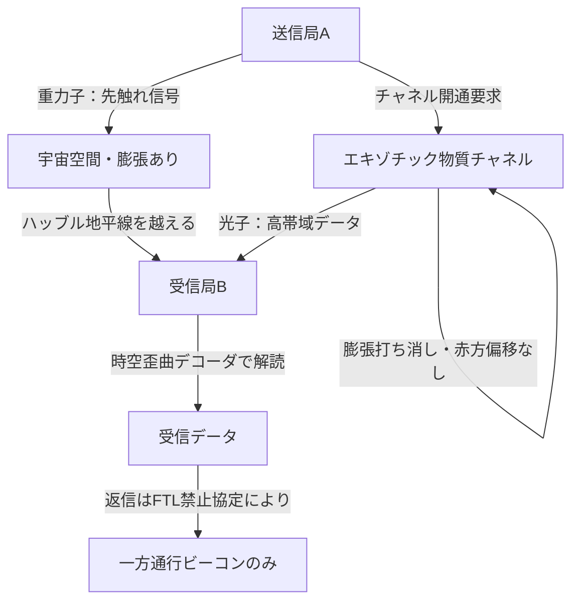

## 1. 概要 (Abstract)

光は宇宙でもっとも速く情報を運ぶ手段だが、宇宙膨張・吸収・散乱という三重の壁がある。重力波（重力子）は何にも吸収されず理論上は無限遠まで届くが、天体スケールの受信機なしに検出できない。

この記事では「エキゾチック物質で構成された管状チャネル」を前提として、二種類の搬送波を役割分担させるFTL通信の構想を問う。

> **前提1:** エキゾチック物質（負エネルギー密度）を巨視的スケールで生成・安定維持できる。
> **前提2:** チャネルの時空歪曲を解釈する「時空歪曲デコーダ」を構築できる。
> **命題:** 「重力子で超長距離をカバーし、光子でチャネル内の情報量をまかなう二重搬送方式は、ハッブル地平線を越えた宇宙際通信を実現できるか？」

---

## 2. 実現不可能性の根拠 (Infeasibility Rationale)

### 物理的限界

エキゾチック物質は実在する——カシミール効果（g009）で二枚の金属板の間に負エネルギー密度が生じることは実証済みだ。しかしその規模は原子核一個分にも満たない。宇宙膨張を局所的に打ち消すチャネルを形成するには、推定で恒星数十個分の質量エネルギーに相当する負エネルギーが必要とされ、現在の物理学には調達手段がない。

また量子不等式（フォード＝ローマン不等式）が「負エネルギーが存在できる時間と強度の積」に上限を課すため、安定した巨視的チャネルの維持は量子力学の根本から制約される。

### 技術的限界

重力子搬送には、LIGOが13億光年先のブラックホール合体を検出するために必要とした干渉計（アーム長4km・レーザー精度10⁻¹⁸m）を大幅に超える受信機が必要だ。宇宙際通信を想定するなら、受信機のアーム長は惑星軌道スケールを要するとも試算される。

光子搬送では「時空歪曲デコーダ」が必要になる。チャネル内を伝播した光子は時空の歪みによって位相・偏光・周波数が複雑に変調されており、これを情報として解読する装置の設計原理すら現在は存在しない。

### 論理的限界（因果律との衝突）

FTL通信は特殊相対性理論と組み合わせると、別の慣性系の観測者にとって「送信より前に受信が起きる」状況を生む（[wiim_001](wiim_001.md)）。エキゾチック物質チャネルがどれほど巧妙に設計されていても、この構造は回避できない——チャネル自体が光速を超えた情報伝達を許す以上、「過去への通信路」と論理的に等価になる。

---

## 3. 実験の設定 (Setup)

- **送信局A（銀河系内）:** エキゾチック物質チャネルの起点。重力波変調装置と光子変調装置の両方を持つ。
- **チャネル:** 負エネルギー密度の管状構造。内部では宇宙膨張が打ち消され、光子は赤方偏移なしに伝播する。
- **中継ノード:** チャネル上の中間点に設置。重力子の減衰補正と光子信号の増幅・デコードを担う。
- **受信局B（ハッブル地平線の外）:** チャネル終端。惑星軌道スケールの重力波干渉計と時空歪曲デコーダを装備。

通信モードは二種類に分かれる：

| モード | 搬送波 | 用途 | 受信機サイズ |
|--------|--------|------|------------|
| 遠距離モード | 重力子 | チャネル外・超長距離の「着信通知」 | 惑星軌道スケール |
| 高帯域モード | 光子 | チャネル内・大容量データ転送 | 小型（フォトダイオード級） |

---

## 4. 考察と予測 (Speculation)

### 二重搬送方式の役割分担

重力子の最大の強みは「何にも止められない」ことだ。チャネルが存在しない宇宙空間を素通りし、ハッブル地平線を越えてなお届く可能性がある。ただし変調（情報の乗せ方）が極めて困難で、実用的なデータレートはごく低い。

光子はその逆で、情報を乗せやすく受信機も小型化できるが、チャネルなしでは膨張宇宙で赤方偏移し消える。エキゾチック物質チャネルが「光の鮮度を保つ真空管」として機能することで、初めて長距離通信の搬送波になれる。

組み合わせると自然な設計が浮かぶ：重力子で「チャネルを見つける」先触れ信号を送り、受信局が位置を確認してからチャネルを開通し、光子で本文を送る。

### チャネルの維持コストという非対称性

チャネルの両端には維持コストが生じる。送信側も受信側も、チャネルが開いている間は莫大なエネルギーを消費し続けなければならない。これはFTL通信が「超文明間の外交条約」に近い規模の合意を必要とすることを示唆する——どちらか一方が維持を止めた瞬間、チャネルは崩壊する。

### 因果律と「返信禁止協定」

FTL通信が過去への通信と等価である以上、受信局が同じFTL手段で返信すると因果律のループが成立する。理論上、文明間の「返信禁止協定」なしにはFTL通信網は自壊する危険がある。一方通行の通信——例えばビーコン信号——にとどめることが、因果律を保護する最小限の運用ルールかもしれない。

### 重力子ビーコンとしての宇宙的意味

観測可能宇宙の外からの重力子信号は、原理的に「宇宙が始まる前」の情報を持つ可能性がある。インフレーション期の原始重力波は、光が届かない時代の宇宙の状態を刻んでいるからだ。エキゾチック物質チャネルを使って「プランク時代の痕跡」を増幅・受信する試みは、宇宙論の最終フロンティアに接続する。

---

## 5. 図解 (Diagrams)

---

## 6. 関連記事 (Related)

- [wiim_001](wiim_001.md) — 光速を超えた場合の因果律（タキオン反電話パラドックス）
- [wiim_023](../physics/wiim_023.md) — カシミールフォージ——エキゾチック物質の量産可能性
- [wiim_027](../physics/wiim_027.md) — ストレンジスター・ワープゲート——固定式時空歪曲点
- [wiim_004](wiim_004.md) — ワープ航法の痕跡を重力波で追跡できる世界
- wiim_??? — 宇宙際通信を受信した文明の倫理的応答（未執筆）
