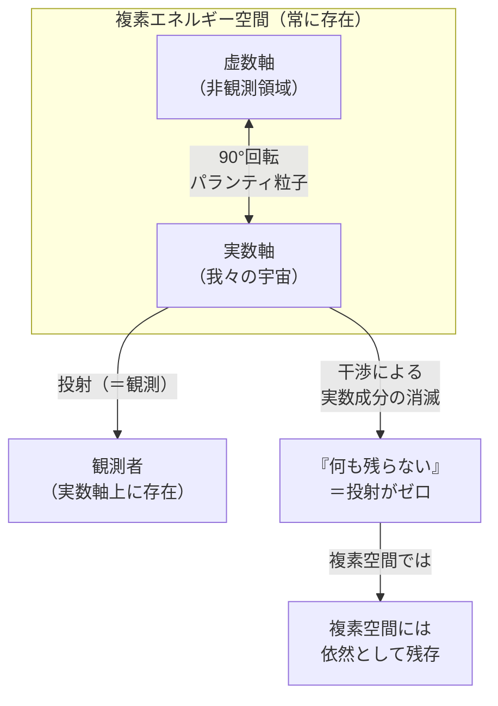
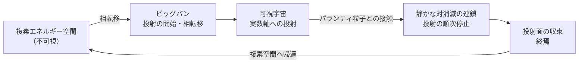
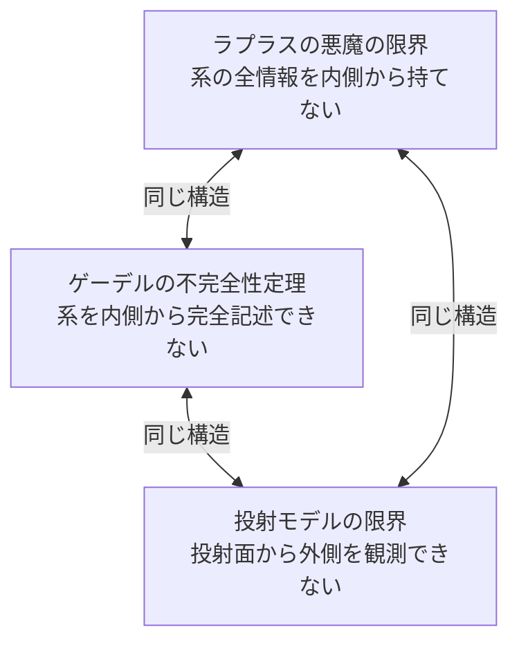

## 1. 概要 (Abstract)

[静かな対消滅（wiim_038）](../physics/wiim_038.md)では、通常粒子とパランティ粒子（g161）が出会うとエネルギー収支がゼロになり「何も残らない」とされる。しかし「何も残らない」とは本当に無が生じることなのか。

本記事では別の解釈を提案する。

> **我々の宇宙は複素エネルギー空間の「投射面」にすぎない。静かな対消滅とはエネルギーの消滅ではなく、その投射が干渉によって停止した状態である。**

エネルギーは複素空間に残存し続けるが、観測とは投射面への射影そのものであるため、投射が止まった状態は原理的に検出できない。この構造を突き詰めると、宇宙の始まりと終わりを一つの循環として描く上位モデルが浮かび上がる——そしてその外側には、私たちが決して立てない場所がある。

---

## 2. 実現不可能性の根拠 (Infeasibility Rationale)

### 物理的限界

観測とは何か。量子力学が示したように、観測とは複素数で記述された波動関数を実数の固有値へと射影する演算である。つまり「見る」という行為そのものが、複素空間から実数軸への投射に他ならない。

投射が停止した領域は、観測という行為の定義域の外にある。検出しようとした瞬間、その装置は実数軸上の存在として動作するため、投射されていない状態には原理的に届かない。これは技術の未熟さではなく、観測の構造的な限界である。

### 技術的限界

仮にどれほど精密な観測装置を作ったとしても、その装置自体が投射された存在である。素粒子で構成され、電磁相互作用で情報を取り出す装置は、実数軸上の物理量しか読み取れない。「投射の外側を見る望遠鏡」を投射面の内側で作ることは、影の中に光源を置こうとするようなものだ。

ノイズキャンセリングヘッドフォンは音を消していない。二つの音波が耳の位置で打ち消し合うよう設計されているだけで、空気中の振動は依然として存在する。静かな対消滅も同じ構造かもしれない——実数軸上での干渉がゼロになるだけで、複素空間の振動は続いている。

### 論理的限界

ゲーデルの不完全性定理は、十分に豊かな公理系は自分自身の完全性を内側から証明できないことを示した。投射モデルでも同じ構造が現れる。投射面の内側にいる存在は、投射面を生み出している上位の複素空間を完全に記述することができない。

記述しようとした時点で、その記述は投射面上の言語で書かれた記述になる。上位空間の影を写した地図にはなり得ても、上位空間そのものにはなれない。

---

## 3. 実験の設定 (Setup)

- **主体:** 観測者（投射面＝実数軸上に存在するあらゆる知性）
- **対象:** 静かな対消滅が発生した領域の事後状態
- **操作:** 対消滅後の空間に対して、あらゆる観測手段を適用する
- **問い:** 「何も残らない」とされた領域に、投射面の外側の痕跡を読み取れるか

対消滅の「痕跡」を探す試みとして考えられるのは、対消滅が起きた場所の分布パターンを統計的に解析することだ。投射が停止した領域は直接見えないが、その周囲の投射面に生じる「影」——真空エネルギー密度の微細な変動や、隣接粒子の振る舞いの非対称性——に間接的な手がかりが残る可能性がある。

しかしこれは、洞窟の壁に映った影から外の世界を推定しようとする試みと同じ構造を持つ。

---

## 4. 考察と予測 (Speculation)

### 宇宙の始まりと終わりを一つの循環として読む

このモデルを宇宙論まで拡張すると、次のような循環構造が示唆される。

ビッグバンとは、複素エネルギー空間の一部が実数軸へと相転移した瞬間——投射が「始まった」瞬間——だったと考えられる。逆に、宇宙の終焉とは投射が順次停止していく過程であり、最終的に複素空間のみが残る状態への収束である。そして複素空間は次の相転移の基盤となる。

始まりが終わりを生み出し、終わりが始まりの素地となる。ウロボロスの蛇が自らの尾を食べながら循環するように、宇宙は可視と不可視の間を往復しているのかもしれない。

### 埒外のラプラスの悪魔

ラプラスの悪魔は、全粒子の位置と運動量を知れば未来を完全に予測できるとされた古典的な思考実験の存在だ。その悪魔は「時間の外」に立つことで因果の全体を俯瞰しようとした。しかし量子力学の不確定性原理がその可能性を閉じた——観測が状態を変えてしまうからだ。

このモデルが示す「投射面の外の観測者」は、ラプラスの悪魔をさらに一段上に置いた存在である。

| | 古典的ラプラスの悪魔 | 投射外の観測者 |
|---|---|---|
| 立つ場所 | 時間・因果の外 | 投射面（可視宇宙）の外 |
| 知り得ること | 全粒子の位置・運動量 | 複素空間の非投射状態 |
| 限界を示したもの | 量子不確定性原理 | 観測＝投射という構造そのもの |
| 残る問い | 量子揺らぎをどう扱うか | 可能かどうかすら定義できない |

古典的悪魔は「原理上は可能だが実現できない」存在だった。投射外の観測者は「可能かどうかを問う言葉自体が投射面の産物である」という意味で、その一段上の不可能性に直面している。

### 三つの限界は同じ構造を持つ

```
ラプラスの悪魔の限界
「系の全情報を持つ存在を系の内側から実現できない」
            ↕
ゲーデルの不完全性定理
「系の内側から系全体を完全に記述できない」
            ↕
投射モデルの限界
「投射面の内側から投射元の複素空間を観測できない」
```

この三つは表現が異なるだけで、同じ構造的障壁を指し示している。**閉じた系はその外側を、内側から完全に把握できない。**

---

## 5. 数式による表現 (Mathematical Notation)

複素エネルギー空間でのエネルギーベクトルを考える。対消滅によって実数軸への投射がゼロになった後、複素空間に残留する成分を虚数軸上の $iE$ と表すと、観測面（実数軸）への射影は：

$$\operatorname{Re}(iE) = 0$$

となり、「何も残らない」という観測結果と一致する。しかし複素空間全体では振幅 $E$ の成分が虚数軸上に保存されている。実数軸への投射がゼロであることと、複素空間での存在がゼロであることは、このモデルでは別の問いである。

---

## 6. 図解 (Diagrams)

### 複素エネルギー空間と投射面



### 宇宙の循環モデル



### 三つの限界の三角関係



---

## 7. 関連記事 (Related)

- [wiim_038 静かな対消滅——パランティ粒子による完全無効化](../physics/wiim_038.md)
- [wiim_001 光速を超えた場合の因果律](../cosmology/wiim_001.md)
- [wiim_002 時間を逆行した場合の情報保存](../cosmology/wiim_002.md)
