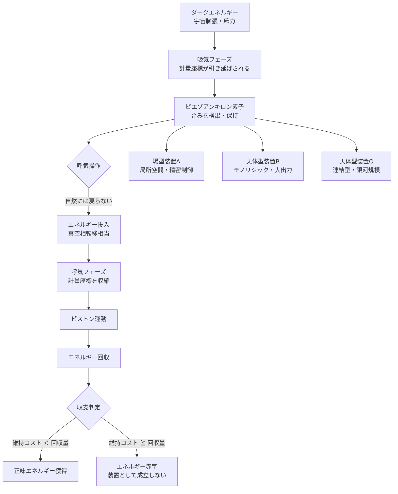

# エクスタイドフロート——宇宙膨張の満ち引きをピエゾアンキロン素子で回収できるか

## 概要

宇宙は今この瞬間も膨張し続けている。その原動力はダークエネルギーと呼ばれる正体不明の斥力であり、銀河間の距離を絶えず押し広げている。この「膨張という巨大な流れ」を潮汐の満ち引きに見立て、そこに浮子（フロート）を投じてエネルギーを回収しようというのが、**エクスタイドフロート**（ExTide Float）という架空装置の発想だ。

装置の核心は **ピエゾアンキロン効果**（仮称）にある。[アンキロン（g128）](../../glossary/terms/g128.md)が持つ「計量テンソルに錨を打つ」性質を応用し、空間膨張が計量座標を引き剥がそうとする歪みをエネルギーに変換する機構だ。圧電効果（ピエゾ効果）が結晶の物理的変形を電気に変えるように、ピエゾアンキロン素子は時空の計量的変形を動力に変えると仮定する。

この思考実験が問うのは一点だ——**宇宙膨張を「動力源」として実際に利用できるか**。

---

## 実現不可能性の根拠

### 物理的限界：膨張は圧力差ではない

宇宙膨張（ハッブル流）は、水が高いところから低いところへ流れる「圧力差」ではない。膨張とは慣性系そのものが分離していく現象であり、隣接する空間との間に「流体の流速差」や「圧力勾配」は生じない。川の流れに水車を置けば水車が回るのは、上流と下流の間に速度差があるからだ。しかし宇宙膨張では、浮子を置いた地点の「上流」も「下流」も等しく膨張しており、装置に力を伝える差分が原理的に存在しない。

ピエゾアンキロン効果が成立するには、計量錨が「膨張に抵抗する点」として機能しなければならない。だが錨が宇宙膨張に抵抗するためには、計量テンソルに継続的に干渉し続けるエネルギーを投入し続ける必要がある。その維持コストが回収エネルギーを超えると考えられ、装置は熱力学的には「ポンプを動かすために発電機を回す」構造に陥る可能性が高い。

### 技術的限界：呼気側のコストが吸気側を食い尽くす

エクスタイドフロートはピストン運動を前提とする。「吸気」は膨張が計量錨を引き延ばす局面であり、自然に進む。しかし「呼気」は引き延ばされた計量座標を元に戻す——すなわち局所的な空間収縮を人工的に起こす——局面だ。

この呼気操作には、真空の相転移に相当するエネルギーが必要と考えられる。真空のエネルギー状態を局所的に書き換えることは、ダークエネルギーの状態方程式（w＝−1）に逆らう行為であり、現行の物理学では具体的な手段が知られていない。さらにピエゾアンキロン素子の維持・更新コストは、素子が天体規模に巨大化するほど指数的に膨らむ。

### 論理的限界：作れる文明には不要、必要な文明には作れない

銀河間空間にエクスタイドフロートを展開し、素子を天体規模で運用するには、[カルダシェフスケール（g002）](../../glossary/terms/g002.md)タイプIII文明——銀河全体のエネルギーを制御する文明——が前提となる。

しかし[カルダシェフスケール（g002）](../../glossary/terms/g002.md)タイプIII文明はすでに恒星のエネルギーを完全に利用できる段階を超えている。宇宙膨張からのエネルギー回収を必要とするほどの需要があるとすれば、それはタイプIVへの移行を目指す局面に限られる。つまり「装置を作れる文明はすでに必要としておらず、本当に必要な文明には作る能力がない」というパラドックスが生じる。

---

## 実験の設定

- **主体**: カルダシェフスケールⅢ達成文明
- **環境**: 銀河間空間（ダークエネルギー密度が相対的に高い膨張領域）
- **操作サイクル**: 膨張（吸気）→ 反転（呼気）を繰り返しピストン運動を生成

### 装置型A：場型（ピエゾアンキロン素子による場の展開）

ピエゾアンキロン素子が局所空間にアンキロン類似の場を展開する。膨張が計量座標を引き剥がそうとする際に生じる歪みを、変換素子が受けてエネルギーとして取り出す。アンキロンが計量テンソルに直接結合する性質を利用するため、物理的な構造体を必要とせず、精密制御に向く。場型は小規模・高精度用途を想定する。

### 装置型B：天体型モノリシック

恒星規模の単一構造体にピエゾアンキロン素子を大量集積し、出力を稼ぐ。構造体自体は宇宙膨張に抵抗する「錨点」として機能する。建造・維持コストは文明規模の事業となるが、単一装置としての出力密度は最大になる。

### 装置型C：天体型連結型

複数のモノリシック構造体を銀河規模で網状に接続する。分散収集と冗長性を持たせることで、単一故障によるネットワーク全体の停止を防ぐ。銀河規模のエネルギーグリッドとして機能する可能性があるが、素子間の同期には光速の壁が立ちはだかる。

---

## 考察と予測

エクスタイドフロートが仮に動作したとして、何が得られ、何が犠牲になるか。

ピエゾアンキロン効果の最大の未知数は「計量テンソルへの干渉コスト」だ。一般相対性理論の枠組みでは、計量を変化させるには質量・エネルギーが必要であり、それは有限だ。錨を「維持する」ためのエネルギーが回収量を下回る条件が存在するかどうかは、現行の理論では答えが出ない。

場型と天体型は用途が異なり、両者の使い分けが現実的だ。場型は精密な計量操作が必要な場面——たとえば[カシミールフォージ（g133）](../../glossary/terms/g133.md)と組み合わせてエキゾチック物質生成に転用する場面——に向き、天体型は純粋な発電規模を求める場面に向く。

連結型の課題は同期遅延だ。銀河の直径はおよそ10万光年であり、端から端への信号伝達だけで10万年かかる。位相を揃えたピストン運動を維持するには、何らかの超光速通信か、完全に独立した非同期動作が必要になる。

長期的な視点では、エクスタイドフロートはカルダシェフⅣ——宇宙全体のエネルギーを活用する文明——への踏み台として位置づけられるかもしれない。宇宙が熱的死に向かう遠い未来、恒星エネルギーが尽きた後もダークエネルギーだけは膨張を続ける。そのとき、膨張エネルギーの部分回収が文明の「最後の火」になり得るという示唆は、思考実験として無視できない重みを持つ。

---

## 図解

---

## 関連記事

- [アンキロンによる計量固定（wiim_022）](../physics/wiim_022.md) — ピエゾアンキロン効果の基礎となる計量錨の概念
- [カシミールフォージ（wiim_023）](../physics/wiim_023.md) — 真空エネルギーを装置として取り出す架空技術との比較
- [アンキロンと重力波（wiim_021）](../physics/wiim_021.md) — アンキロンが計量変化に抵抗する性質の原点
- [wiim_079](wiim_079.md) — ギャラクシードライブ——カルダシェフ4型文明が銀河を乗り物としてハッブル地平線を超えられるか

