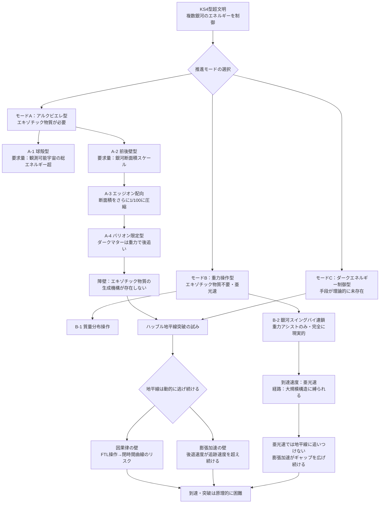

# ギャラクシードライブ——カルダシェフ4型文明が銀河を乗り物としてハッブル地平線を超えられるか

## 概要

宇宙は今この瞬間も膨張し続けており、十分遠い銀河は光速を超える速度で遠ざかっている。その境界が**ハッブル地平線**だ。地平線の外側に出た光は永遠に届かず、因果的なつながりが断ち切られる。では、[カルダシェフスケール（g002）](../../glossary/terms/g002.md)4型以上の超文明——複数銀河に匹敵するエネルギーを制御できる存在——が、銀河そのものを推進体として動かし、その地平線を突き破ることはできるだろうか。

この思考実験を**[ギャラクシードライブ（g321）](../../glossary/terms/g321.md)**と呼ぶ。単なる星間移動ではなく、「宇宙膨張そのものに追いつく、あるいは食い込む」という宇宙論的スケールの移動が問いの中心にある。推進手段は複数の系統に分かれ、それぞれ要求するエキゾチック物質量や速度上限が異なる。最も現実的な下限から最も野心的な上限まで、段階的に検討する。

---

## 実現不可能性の根拠

### 物理的限界：エキゾチック物質の要求量——球殻型から最適化型まで

[アルクビエレ式時空歪曲（g035）](../../glossary/terms/g035.md)のエキゾチック物質は「泡全体」ではなく「泡の壁面」に集中する。この性質を利用すると、銀河全体を球殻で包む代わりに**進行方向の前後2面だけにワープ壁を設置**できる。銀河の側面は「泡の壁のない平坦空間」として残り、銀河の内部はその平坦部を走る。

要求量の段階的見積もりは以下のとおりだ：

- **球殻型（全包囲）**: 銀河を完全に包む場合、要求量は観測可能宇宙の総エネルギーを大きく超えると推定される
- **前後壁型**: 壁面積が銀河の断面積（半径〜5万光年の円盤）に圧縮される。球殻型より大幅に減るが、依然として天文学的規模だ
- **エッジオン配向＋前後壁型**: 銀河を進行方向に対して「縦向き（厚み側が正面）」に配向すると、断面積は直径ベースから厚みベース（約1,000光年）に圧縮され、さらに約100分の1に削減できる
- **バリオン物質のみ対象**: ダークマターハローは電磁力で相互作用せず、重力だけで追随する。バリオン物質（恒星・ガス円盤）だけを壁でカバーし、ハローは後から重力で追いつかせる方式では、要求面積をさらに絞れる

それでも最適化後の要求量は惑星〜恒星質量スケールのエキゾチック物質に相当し、既知の生成機構（カシミール効果など）とは桁違いに大きい。工学的障壁は残る。

### 技術的限界：銀河は「制御信号が届く前に壊れる」

重力操作型の慣性加速を試みる場合、銀河内部の数千億の恒星・銀河間物質・ダークマターハロー全体に整合的な力を加える必要がある。銀河の直径は数万光年に及ぶため、制御信号を端から端に伝えるだけで数万年かかる。

推進力が局所的に加わった瞬間、銀河の各部位は異なるタイミングで加速を受ける。その差分は潮汐力として働き、銀河を推進体として一体的に動かす前に構造を引き裂く可能性が高い。[バーディーン・ペッターソン効果（g320）](../../glossary/terms/g320.md)が示すように、銀河核周辺ですら回転軸のわずかなずれが円盤全体の歪みを引き起こす——銀河スケールではその問題が指数的に拡大する。エッジオン配向はこの潮汐崩壊リスクも緩和する可能性があるが、配向変更自体が別の力学的課題を生む。

### 論理的限界：ハッブル地平線は固定した壁ではなく、逃げ続ける境界線である

ハッブル地平線は固定した場所ではない。ダークエネルギーの加速膨張により、今この瞬間も地平線の向こう側の銀河はさらに速く遠ざかっている。ギャラクシードライブが光速に近い実効速度を達成したとしても、地平線そのものが後退し続けるため「追いつく」ことができない可能性がある。

さらに根本的な問題として、アルクビエレ型のFTL（超光速）に相当する時空操作は、物理的には過去への情報伝達を可能にする**閉時間曲線**を生む可能性がある。因果律の自己無撞着性——「結果が原因より先に来ない」という宇宙の大域的な整合性——が破綻するリスクがあり、物理法則そのものが駆動を禁じる構造になっているかもしれない。

---

## 実験の設定

- **主体**: カルダシェフスケール4型超文明。複数銀河のエネルギーを統合管理し、銀河核（[活動銀河核（g319）](../../glossary/terms/g319.md)に匹敵する出力）を制御できると仮定する

### モードA：アルクビエレ型（時空歪曲系）

エキゾチック物質によるワープ壁を用いる。要求量削減のため段階的に最適化する：

- **A-1（球殻型）**: 銀河全体を時空泡で包む。最大の推進力だが要求量も最大
- **A-2（前後壁型）**: 進行方向の前後2面のみにワープ壁を設置。要求量を大幅削減
- **A-3（エッジオン＋前後壁型）**: 銀河を縦向きに配向してから前後壁を設置。断面積をさらに〜1/100に圧縮
- **A-4（バリオン限定型）**: バリオン物質（恒星・ガス）のみを壁でカバーし、ダークマターハローは重力的後追いに任せる。数億〜数十億年の遅延を許容する

### モードB：重力操作型（純力学系）

エキゾチック物質を使わない重力だけによる加速。速度上限は亜光速：

- **B-1（質量分布操作）**: 銀河の質量分布を非対称に操作し、重力勾配を生成して慣性的に加速する
- **B-2（銀河スイングバイ連鎖）**: 周辺銀河・銀河団の重力を利用した重力アシストを連鎖的に使用する。惑星探査機のスイングバイを銀河スケールに拡張した発想で、エキゾチック物質は一切不要。ただし経路が大規模構造（銀河フィラメント）の分布に縛られ、任意方向への移動は保証されない
- **B-3（重力ダークマタードライブ）**: ダークマターハローは銀河の全重力質量の約85%を占め、体積は可視円盤の約8,000倍に及ぶ。ハロー全体を重力的に誘導できれば、内部のバリオン物質（恒星・ガス）が追随して銀河全体が動く——数千億個の恒星を個別制御する代わりに、ハロー一体を動かすという設計原理。ただしダークマターは電磁相互作用を持たず、重力以外に働きかける手段がない。近傍銀河をトラクターとして使う重力牽引が最も物理的に素直な案だが、ハロー半径（〜25万光年）より十分遠方に質量源を置かないと潮汐力でハローが引き伸ばされるという制約がある。**ハロー自体を均一に加速する具体的機構は未解決であり、現時点では設計原理の提案として留まる。**

### モードC：ダークエネルギー制御型

宇宙膨張を駆動するダークエネルギーを局所的に増幅・抑制し、目標方向への膨張差を推力に変換する。[エクスタイドフロート（wiim_078）](wiim_078.md)の原理を逆用した発想。ダークエネルギーの正体が未解明であるため、最も思弁的なモードだ。

- **目標**: ハッブル地平線（[g155](../../glossary/terms/g155.md)）を突破し、現在因果的に切り離されている宇宙領域への到達または接触

---

## 考察と予測

モードAの最適化系列が示すのは、「不可能性の壁には段差がある」という事実だ。球殻型から前後壁型、エッジオン配向、バリオン限定と進むにつれてエキゾチック物質要求量は劇的に下がる。しかし最終的に残る障壁——エキゾチック物質の生成機構が存在しないこと、因果律の壁——は最適化では越えられない。削減は「不可能の規模を縮小する」だけであり、「不可能を可能にする」ものではない。

モードB-3（重力ダークマタードライブ）は制御コストの削減原理として魅力的だ。バリオン物質を直接操作する代わりにハローを仲介させることで、制御対象を「数千億の恒星」から「一つの拡散構造」に置き換えられる。しかしハロー自体の均一加速機構が未確立であり、近傍銀河トラクターを使う場合はB-2との境界が曖昧になるという課題が残る。

モードB-2（銀河スイングバイ連鎖）は唯一エキゾチック物質を必要としない現実的な下限だ。宇宙の大規模構造——銀河フィラメント、銀河団のネットワーク——は天然の「スリングショットチェーン」として機能しうる。KS4文明にとっての実行可能な第一段階は、このスイングバイによる亜光速加速かもしれない。ただし目的地へ向かう経路上に適切な重力源が存在するかどうかは宇宙の構造に依存し、選択の自由度は低い。

モードB-2が亜光速で「現実的な下限」を与える一方、ハッブル地平線の突破には定義上 FTL に相当する実効速度が必要だ。両者の間には埋まらないギャップがあり、亜光速でいかに加速しても地平線には到達できない——宇宙の加速膨張がその差を広げ続けるからだ。

ハッブル地平線を突破した先に何があるかは、定義上観測不可能だ。宇宙原理（宇宙は大局的に一様等方）が正しければ、そこには私たちの銀河と同じ構造の宇宙が広がっている。しかし加速膨張が永遠に続くならば、地平線の外側の宇宙は熱的死への経路が内側と異なる可能性もある。

---

## 図解

---

## 関連記事

- [wiim_001](wiim_001.md) 光速を超えた場合の因果律
- [wiim_004](wiim_004.md) ワープ航法の痕跡を重力波で追跡できる世界
- [wiim_028](wiim_028.md) 重力子と光子の二重搬送FTL通信——エキゾチック物質チャネルによる宇宙際通信
- [wiim_067](../physics/wiim_067.md) ネゴトンホワイトホール——排除地平線が閉じるとき、反重力天体はビッグバンを起こすか
- [wiim_078](wiim_078.md) エクスタイドフロート——宇宙膨張の満ち引きをピエゾアンキロン素子で回収できるか
- [wiim_080](../physics/wiim_080.md) — ネゴトンホワイトホールワープ——安定維持した排除地平線を推進力に転用できるか
- [wiim_081](../physics/wiim_081.md) — コーラ粒子は事象の地平線を抜けられるか——ブラックホール内外の空間超越と因果律の衝突

