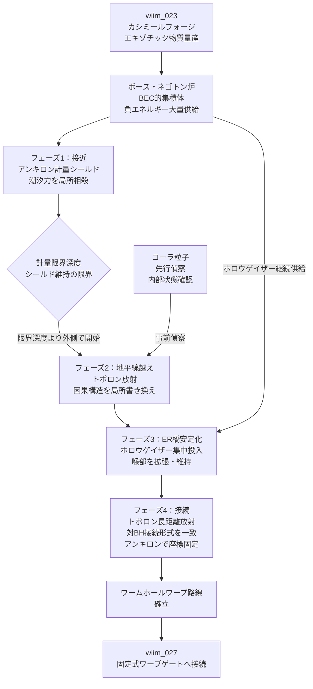

## 概要 (Abstract)

ブラックホールの内部構造として、一般相対性理論は「アインシュタイン＝ローゼン橋（ER橋）」と呼ばれるワームホールの原型を数学的に内包している。通常のシュバルツシルト解ではこの橋は瞬時に閉じてしまうが、十分な負エネルギー密度（エキゾチック物質）で喉部を支えれば通行可能な橋——モリス＝ソーン型ワームホール——への転換が理論上は許される。

問題はその「十分な負エネルギー」をどう確保し、そもそもどうやってブラックホールの内部に届けるか、という工学的な壁だ。事象の地平線に近づくほど潮汐力は激化し、地平線を越えた瞬間から全ての方向が特異点に向かう一方通行になる。

この記事では、カシミールフォージ（wiim_023）で量産したエキゾチック物質を出発点とし、アンキロン（g128）・ボース・ネゴトン（g316）・トポロン（g294）・ホロウゲイザー（g344）・コーラ粒子（g127）という架空粒子群を組み合わせた4フェーズの技術ツリーを考察する。目標は「ブラックホールを宇宙規模のワープ中継点として開通させること」だ。

---

## 実現不可能性の根拠 (Infeasibility Rationale)

### 物理的限界

潮汐力はブラックホール中心からの距離の3乗に反比例して強まり、特異点では無限大に発散する。これを打ち消すアンキロンの計量操作に必要な負エネルギー量も同様に発散するため、完全な相殺は原理的に不可能だ。フォード＝ローマン不等式は負エネルギーの集中量と持続時間にさらに厳格な上限を課しており、理論上許される負エネルギーの「量×持続時間」は非常に限られる。

ER橋の喉部はプランク長さ（約10⁻³⁵ m）スケールの量子揺らぎが支配的な領域にある可能性が高く、古典的な一般相対性理論の計算が破綻する。量子重力効果が橋を瞬時に破壊すると予想されており、安定した喉部が「古典的な計算の通りに存在するかどうか」自体が未解決の問題だ。

### 技術的限界

アルクビエレ型の計量操作は外部から設定する必要があるという根本的な制約を抱える。地平線の内側ではいかなる信号も外部に届かないため、船が地平線を越えた後は外部からの制御が完全に失われる。内部での計量操作は事前に自律動作させるしかなく、予期せぬ状況への対応ができない。

トポロンによる接続形式の書き換えは多様体の大域的な構造に波及する可能性がある。局所的な操作のつもりが遠方のトポロジーを変えてしまったり、意図しない閉じた時間的曲線（CTC）を生成したりするリスクがあり、精密な制御のための理論体系がまだ存在しない。

### 論理的限界

トポロンで地平線内部の因果構造を書き換えれば、過去へ向かう経路——閉じた時間的曲線——が生まれる可能性がある。CTCは「生まれる前の自分に情報を伝える」ような自己矛盾的なシナリオを許容し、因果律の崩壊を招く。ホーキングの「年代順保護仮説」はこのような経路を量子効果が自動的に閉じると主張するが、実証はされていない。

また近年の理論（ER＝EPR仮説）は「ER橋と量子もつれは同一現象の異なる記述」であると示唆する。この解釈が正しければ、ER橋を物理的に通過することは量子もつれを通じた因果的な情報伝達に相当し、量子力学の基本原理と衝突する。橋を「通れる」と「情報が伝わる」が同じことになるとすれば、通過そのものが禁じられている可能性がある。

---

## 実験の設定 (Setup)

対象は超大質量ブラックホール（太陽質量の10億倍程度）とする。地平線上での潮汐力が質量の2乗に反比例して弱まる性質を利用し、地平線到達時点でのシールド負荷を最小化する狙いだ。

### フェーズ1：接近——潮汐力シールド

アンキロンを船体周囲に層状に配置し、ブラックホールが引き起こす時空曲率と逆符号の局所計量を上書きする「計量シールド」を形成する。アンキロンは計量テンソルの変化率に抵抗するという性質上、曲率の増大を緩和する方向に自然に機能する。

負エネルギーの供給源にはボース・ネゴトンのBEC的集積体を用いる。超低温環境で集積されたボース・ネゴトンは単一の集団的量子状態として振る舞い、個別操作では不可能な大量の負エネルギーを安定的に引き出せる。この集積体がアンキロンの計量操作を持続させるエネルギー炉として機能する。

ブラックホールに近づくにつれて潮汐力は強まり、シールドの負荷は増大していく。設計上の限界深度——これ以上近づくとシールドが維持できなくなる境界——を「計量限界深度」と呼ぶ。フェーズ2は必ずこの深度より外側で開始しなければならない。

### フェーズ2：地平線越え——因果構造の局所書き換え

地平線に到達する直前、船体前方にトポロンを集中的に放射する。トポロンは多様体の接続形式を書き換える「操作」として機能し、進行方向の因果構造を一時的に双方向に開く。通常の地平線では「内向きの方向だけ未来に向かい、外向きは過去になる」という非対称な接続が成立しているが、トポロンが書き換えた領域では内外どちらへも向かえる中間状態が生まれると想定される。

この「因果窓」が開いている間に船が通過する。窓の持続時間はトポロンの強度と分散速度で決まり、非常に短い。入射に失敗して因果窓が閉じてしまった場合、船は通常の地平線内部に捕捉される。

コーラ粒子（空間非経由移動粒子）は先行偵察役として事前に射出する。空間的制約の影響を受けないコーラ粒子は地平線内部の状態を先に確認し、その情報を時間の遅延を通じて外部に届ける。これにより因果窓を開くべき最適なタイミングと位置を絞り込む。ただし事象の地平線は空間的でなく因果的な境界であり、「空間を経由しない」という性質だけでは回避を保証できない。コーラ粒子が因果的制約をも回避できるかどうかはWIIM世界観でも未定義であり、この偵察シナリオは前提条件付きの想定として位置づけられる。

### フェーズ3：内部——ER橋の安定化と拡張

地平線内部に入った船はER橋の喉部に向かう。喉部の位置は理論的には特異点よりも浅い場所にあると予測されるが、正確な深さは量子重力効果に依存し不明だ。

喉部を発見し次第、ホロウゲイザーを大量に投入する。ホロウゲイザーはディラックサイフォンの相境界から自然放出される負エネルギー担体であり、超流動的性質で管状の喉部全域に均一に分布する。喉部を閉じようとする時空の正エネルギー的な引力をホロウゲイザーの負エネルギーで相殺し、人が通過できる規模（数メートル）まで拡張・維持する。

ボース・ネゴトン炉からのホロウゲイザー連続供給が喉部の開放状態を維持する。供給が途絶えると喉部は指数関数的に収縮するため、この供給経路の維持がフェーズ3の生命線となる。

### フェーズ4：接続——ワームホール路線の確立

喉部の安定化に成功したら、接続先となる別のブラックホールに向けてトポロンを長距離放射する。トポロンは伝播しながら中間空間の接続形式を変え、2点間のトポロジーを徐々に一致させていく。

同時に、両端のアンキロン配置で入口と出口の計量座標を固定する。ER橋は通常、両端が独立した時空領域に存在するため座標系がずれているが、アンキロンによる計量固定で統一した基準座標を確立できる。アンキロンが計量を固定し、トポロンがその計量上のトポロジーを書き換えるという役割分担だ。

2点間の接続が確立したワームホール路線は、その後は自律的に維持される設計が望まれる。ただしホロウゲイザーの継続供給なしには喉部が収縮するため、「路線の維持コスト」が永続的に発生する。

---

## 考察と予測 (Speculation)

このシナリオで最も根本的な問いは「喉部が安定化できる深さに存在するかどうか」だ。量子重力効果がER橋を瞬時に消し去るなら、フェーズ3は到達する前に詰む。一方でER橋が量子スケールで安定的に揺らいでいるなら、ホロウゲイザーによる拡張は原理的に機能する可能性がある。

技術が完成した場合、ブラックホールは宇宙のインターチェンジとして機能する。既存のストレンジスターワープゲート（wiim_027）が「適した場所に自然にできたゲートを使う」受動的なアプローチであるのに対し、本技術は「任意のブラックホールをゲートに転用する」能動的なアプローチだ。宇宙に数多く存在するブラックホールが全て潜在的なワープ中継点になる。

ER＝EPR仮説が正しい場合、橋を通過した存在は橋の反対側の粒子と量子もつれの関係に入るという解釈が生まれる。「場所を移動した」のか「量子もつれた別の実体として再構成された」のか——通過者自身は区別できないかもしれない。これは同一人物がワープ前後で「同じ人物か」という問いをwiim_042（クローン意識コピー）とは別の角度から提起する。

---

## 図解 (Diagrams)

---

## 関連記事 (Related)

- [wiim_003](../physics/wiim_003.md) — 負の質量による局所的時間加速（ネゴトン・アルクビエレの基礎）
- [wiim_013](../physics/wiim_013.md) — コーラ粒子の仮説（空間超越の起点）
- [wiim_023](../physics/wiim_023.md) — カシミールフォージ（本記事の前提技術）
- [wiim_027](../physics/wiim_027.md) — ストレンジスターワープゲート（固定式の接続先）
- [wiim_042](../philosophy/wiim_042.md) — クローン意識コピー（通過者の同一性問題）
- [wiim_088](../physics/wiim_088.md) — 負のエネルギーを制御できたなら
- [wiim_089_neglaser_er_bridge](../notes/wiim_089_neglaser_er_bridge.md) — ネグレーザーによるER橋安定化——ホロウゲイザーとの役割分担

