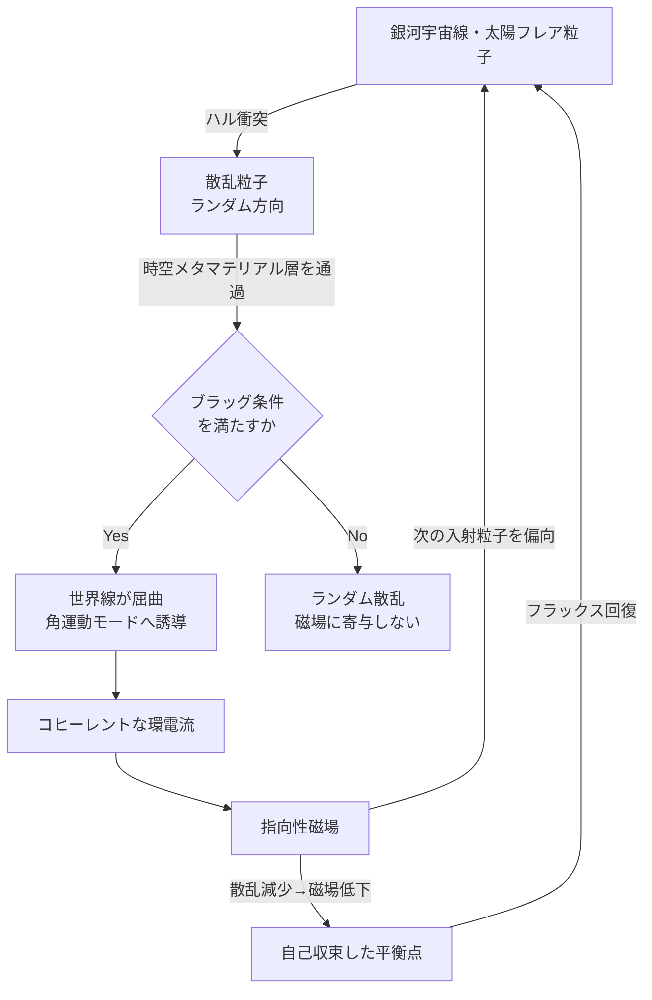
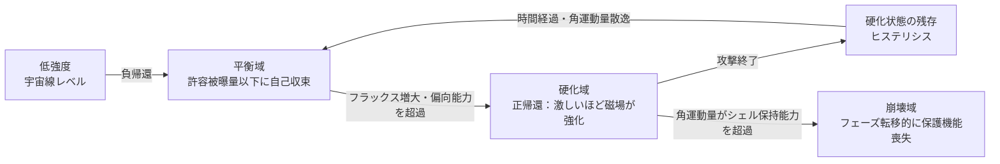

## 概要 (Abstract)

宇宙空間の放射線——太陽フレアの高エネルギー陽子や銀河宇宙線——は宇宙機の電子機器と乗員を脅かす。現行の対策はアルミ・ポリエチレン層による質量遮蔽か軌道選択（ヴァン・アレン帯を避ける）に留まり、超伝導コイルによるアクティブ磁気シールドは重量・冷却の問題で実用化されていない。

この思考実験は**クロノスフィア（wiim_002）の回転光子シェルを時空メタマテリアルとして展開する**という問いを立てる。宇宙機ハルに衝突して散乱した粒子は通常ランダムな方向に飛散し、誘導電流が相殺されて磁場を生まない。しかし時間勾配を周期的にパターン化した時空メタマテリアルの中では、散乱粒子の世界線がブラッグ条件に従って特定の角運動モードへと誘導される——それがコヒーレントな環電流となり指向性磁場を形成し、次の宇宙線を偏向して平衡点へ自己収束する。外部電源を持てない長期深宇宙探査における「散乱粒子を磁場の燃料に変える」自己駆動型防護の思考実験だ。

---

## 実現不可能性の根拠 (Infeasibility Rationale)

### 物理的限界

クロノスフィア（wiim_002）自体が現行物理の枠外だが、さらにその光子シェル上に時間勾配の**空間的周期構造**を形成する必要がある。これは光速で回転する光子の密度分布を亜粒子波長スケール（フェムトメートル以下）で制御することを意味する。

実物理学における時間的メタマテリアル（Temporal Metamaterial）は電磁媒質の時間変調であって、時空曲率・時間勾配の空間変調ではない。「時間勾配テンソルを空間的にパターン化する」には局所的な時空計量を任意に書き換える技術が必要であり、現在の理論にその手段はない。

### 技術的限界

クロノスフィアは光子シェルの閉じ込め機構自体が未解決だ（wiim_002参照）。その上に周期的な時間勾配パターンを「プログラムする」制御系を追加すると未解決問題が積層する。宇宙機ハルとクロノスフィア境界面の物理的インターフェース、および境界面での因果律（g017）の整合性も未定義のままだ。

### 論理的限界

最も根本的な問題は**変換則の未定義性**だ。「時間方向への世界線の伸張」が「空間的な角運動量」に変換されるとき、何の保存則が媒介するか現在の物理理論には答えがない。エネルギー・運動量テンソルの保存は時空の対称性から導かれるが、時間勾配が不均一な領域ではその対称性自体が壊れており、ブラッグ条件に相当する共鳴条件を設計することも原理上できない。

---

## 実験の設定 (Setup)

- **宇宙機ハル**: 従来のアルミ層の外側にクロノスフィア境界面が展開されている
- **時空メタマテリアル層**: 光子シェルの密度・回転速度が空間的に周期変調され、時間勾配テンソルのパターンを形成する。単位セルの空間周期 Λ が設計パラメータ
- **入射粒子**: 太陽フレア陽子（10〜100 MeV）および銀河宇宙線陽子（1 GeV以上）がハルに衝突し散乱粒子を生成する
- **角運動変換**: ブラッグ条件（入射角・エネルギーと周期 Λ の共鳴）を満たす散乱粒子はクロノスフィアの回転軸周りの角運動モードへ誘導される
- **磁場形成**: コヒーレントな環電流が生じ、回転軸方向の指向性磁場が形成され入射粒子を偏向する

---

## 考察と予測 (Speculation)

### 自己収束する平衡系

系は自然に負帰還構造を持つと考えられる。宇宙線フラックスが増えると散乱が増えて磁場が強まり偏向が増す。偏向が増えると散乱の源が減って磁場が弱まりフラックスが戻る。この振動は平衡点に収束し、「許容被曝量以下に維持する動作点」が自動的に定まる。遮蔽が完全になることはなく、一定のフラックスがシステムを維持する「燃料」として残り続ける。

### エネルギー選択性

単位セル周期 Λ によって共鳴エネルギー帯が決まるため、異なる Λ を持つ層を重ねることで太陽フレア帯から銀河宇宙線帯まで広帯域の選択的シールドが原理上設計できると示唆される。全エネルギー帯を質量で受け止める従来の非選択的遮蔽との根本的な違いだ。

### 姿勢制御との連動問題

指向性磁場の軸はクロノスフィアの回転軸に固定される。宇宙機が姿勢変更すると入射方向が変わり、磁場軸との角度がずれて遮蔽効率が低下する。クロノスフィアの回転軸を姿勢制御と連動して再指向する仕組みが別途必要になり、シールドが機体から独立した自由度を持つという設計上の複雑さが生じる。

### 硬化域——攻撃が激しいほど磁場が強くなる逆説

平衡域は負帰還系だが、入射フラックスが磁場の偏向能力を超えた瞬間、系の挙動が反転すると考えられる。偏向しきれなかった粒子がハルに到達して散乱が激増し、角運動変換が加速して磁場がさらに強化される——これは正帰還だ。攻撃強度が増すほどシールドが硬化するという自律強化型の挙動が現れる。

| 入射強度 | 支配的な帰還 | 結果 |
|---|---|---|
| 低（宇宙線レベル） | 負帰還 | 平衡点に自己収束 |
| 中（攻撃域） | 正帰還 | 激しいほど磁場が強化 |
| 高（過負荷域） | 崩壊 | シェル回転が乱れ保護機能を喪失 |

崩壊はフェーズ転移的だ——段階的な劣化ではなく、角運動量がシェルの保持能力を超えた瞬間に一気に時間勾配パターンが崩壊する。

### 履歴効果と戦術的含意

硬化域には履歴効果（ヒステリシス）が生じると示唆される。攻撃終了後も蓄積した角運動量が残存し、しばらくの間シールドが強化状態を保つ。連続攻撃では段階的に強化が積み重なる。

この性質を知る側には逆説的な戦術が有効になる——**硬化閾値を下回る低強度の持続照射**だ。弱い攻撃を継続すれば、シールドは平衡域に留まったまま硬化が起きない。一方でパルス状の強攻撃はシールドを一時的に硬化させるだけで終わる。「激しく攻めるほど相手を強くする」防御の逆説が戦術レベルで機能する。

### 自己駆動型である意義

超伝導コイル型アクティブシールド（実研究段階）は外部電源から磁場を供給する。本設定の優位点は散乱粒子自身を磁場の源にする点——外部電源ゼロの自己駆動だ。太陽光発電が届かない外惑星以遠の深宇宙探査機にとって、この差は理論上の決定的優位になり得ると考えられる。ただしその実現可能性は物理的・論理的限界として挙げた問題群の解決に懸かっている。

---

## 図解 (Diagrams)

---

## 関連記事 (Related)

- [クロノスフィア——相対的に時間を進められる空間](wiim_002.md)（wiim_002）— 本記事の基盤概念
- [アンキロン——時空の計量に錨を打つ粒子](../physics/wiim_022.md)（wiim_022）— 計量固定と計量パターン化の対比
