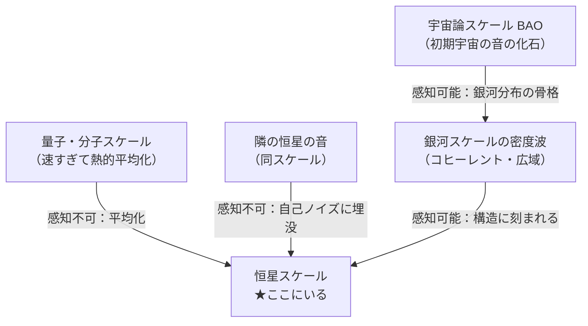
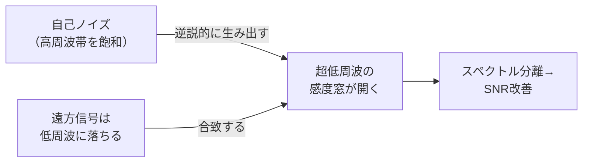

## 概要 (Abstract)

宇宙には無数の「音」が飛び交っている。恒星の内部は常に圧力波で響き、銀河は何億年もかけて密度波を振動させ、宇宙誕生直後の音響振動は今も銀河の大規模分布に化石として刻まれている。

しかし奇妙なことに、隣の恒星が奏でる固有振動を別の恒星が受け取ることは、原理的にほぼ不可能である。一方で銀河スケールの「歌」は個々の恒星の構造・軌道・化学組成に深く刻まれている。同じスケールの音は届かず、遙かに大きなスケールの音は届く——この非対称性は偶然ではなく、創発と繰り込み群が織り成すスケール依存的な感度構造として理解できると考えられる。

## 実現不可能性の根拠 (Infeasibility Rationale)

### 物理的限界：伝播時間と距離

最も近い恒星系プロキシマ・ケンタウリは約4.2光年先にある。太陽と同様の5分周期圧力波（p-mode）がこの恒星から出発したとする。星間物質（ISM）の音速は状態によって大きく異なる——高温電離ガス（コロナルガス）では約100 km/s、星間空間の大部分を占める温暖中性媒質では約10 km/s、冷中性媒質では約1 km/s 程度である。

高温ガスを理想的な伝播路と仮定しても、4.2光年の片道には約1.3万年を要する。より現実的な温暖中性媒質（10 km/s）では約13万年、冷中性媒質（1 km/s）では約130万年となる。いずれも往復すれば26万〜260万年——文明の全歴史を軽く超えるタイムスケールである。

### 技術的限界：位相のランダム化

たとえ時間の問題を無視しても、ISM中の伝播は信号を壊滅的に劣化させる。星間物質は均質ではなく、密度は場所によって10桁以上変動し、磁場・乱流・衝撃波が複雑に絡み合う。1300万年の伝播中に音波の位相は完全にランダム化し、元の振動が持っていたコヒーレントな情報（波形・周期・位相）は失われる。

これはインフラサウンドが大気中を数千キロ伝播するうちに次第に減衰するのとは次元が異なる。ISMは大気より遙かに希薄で不均一であり、音響信号の保存には本質的に不向きな媒質である。

### 論理的限界：自己ノイズへの埋没

最も根本的な障壁は、受信側の恒星が自分自身の内部ノイズで飽和していることである。恒星内部では対流・磁気嵐・核融合のゆらぎが常に大規模な振動を発生させており、これは任意の外部信号を桁違いに上回るノイズ源として機能する。

隣の恒星からの信号が仮に届いたとしても、それは自己雑音の何十桁も下に埋もれる。受信機と送信機が同じ規模であれば、信号を自己雑音から分離することは原理的に不可能に近い。これは「同じスケールにある存在の声は、同じスケールのノイズに消される」という普遍的な構造を示している。

## 実験の設定 (Setup)

思考実験として次の2つの操作を対比させる。

**主体**: 太陽型恒星2つ（距離4光年）
**媒質**: 標準的な温暖中性ISM（密度0.3 atoms/cm³、温度6000 K）

**操作A（同スケール：直接伝播）**
一方の恒星のp-mode（周期5分）を相手に届けようとする。
→ 到達に1300万年、位相は完全にランダム化、受信側のノイズに埋もれる。

**操作B（大スケール：銀河密度波）**
銀河の渦巻き密度波（周期約2億年、波長数千光年）が両恒星を同時に通過する。
→ 両恒星は独立に、しかし同期して密度波の影響を受ける。星形成率の変化・軌道の微小なシフトという形で、「同じ歌の中にいる」状態が実現する。

## 考察と予測 (Speculation)

### スケール依存的な感度構造

この非対称性は物理学の繰り込み群（renormalization group）という枠組みで記述できる現象と共鳴している。物理系を記述する「有効理論」は、注目するスケールとは大きく離れた自由度にしか実質的に結合しない——自分のスケールと同じ自由度は平均化されて消えていく、というのが繰り込み群の直観的な意味である。

### バリオン音響振動——宇宙最大の化石音

宇宙誕生後38万年まで、宇宙全体が音波で満たされていた。光子とバリオン（陽子・中性子）が結合したプラズマを伝播したその音波は、再結合の瞬間に「凍りついた」。その痕跡が約150メガパーセク（約5億光年）という特徴的なスケールとして、現在の銀河分布に刻まれている——これがバリオン音響振動（BAO）である。

現在の宇宙に存在するすべての銀河・恒星は、この宇宙誕生直後の音の「余韻」の上に乗っている。個々の恒星は互いの声を聞けないが、すべての存在が同じ古代の歌の骨格の中に置かれているという意味で、宇宙規模の音響共同体の中にある。

### アルフベン波という磁力線の歌

星間磁力線はアルフベン波を伝播させる。磁力線がギターの弦のように振動するこの横波は、アルフベン速度（磁場強度と流体密度で決まる）で磁力線に沿って伝播する。太陽圏近傍の星間磁場では、この速度はおよそ数十 km/s 程度と推定される。

恒星系間を繋ぐ銀河磁場フィラメントが存在すれば、アルフベン波が「磁力線の電話線」として機能する可能性が示唆される。ただし速度は依然として遅く、4光年を伝播するには数十万年単位の時間が必要と考えられる。また磁気音響波と異なり、アルフベン波は密度変化を伴わないため「聞こえる」というより「揺さぶられる」に近い。

### コズミック・ガイア仮説

この音響的な非対称性が自己調整機構として機能するならば、一つの仮説が浮かびあがる。銀河密度波が恒星系全体を同期して通過することで銀河規模での星形成の波が生じ、超新星爆発のタイミングが揃えられ、次世代の星系に重元素が均等に供給される——という循環である。

これはガイア理論（地球が生命を維持するために自己調整する系という仮説）を銀河スケールに拡張したコズミック・ガイア仮説につながる。ただしガイア理論自体の検証も未完であり、音響結合がその傍証となるかは現時点では仮説の域を出ない。むしろ問いとして残しておく価値がある——「銀河は、自分の内部に住む恒星たちの生存環境を意図せず調整しているのだろうか」と。

### 逆転の命題：自己ノイズは遠方感度の増幅器である

ここまで自己ノイズを「障壁」として論じてきたが、視点を反転させると別の構造が見えてくる。

恒星の自己ノイズは特定の周波数帯（秒〜数百年の周期）に集中している。それより遙かに長い周期——数万年から数億年——には、恒星自身が生み出すノイズはほぼ存在しない。この帯域は本質的に静かな「感度窓」である。

そして遠方からの信号は長距離伝播の過程で短波長成分が散乱・吸収され、低周波成分のみが生き残る。つまり**遠ければ遠いほど、信号はちょうど感度窓に落ちてくる**。

これは確率共鳴の構造と対応している。自己ノイズが高周波帯を飽和させることは、それ以外の帯域——超低周波の感度窓——を本質的に際立たせる。近傍の恒星を「聴けない」のは、その信号が雑音の多い帯域に存在するからであり、銀河スケールの信号が「刻まれる」のは、それが雑音の存在しない帯域に属するからである。

パワースペクトル密度（PSD）の観点では、恒星内部のノイズは赤色雑音的なスペクトルを持ち、低周波側でパワーがゼロに近づく。信号対雑音比は——信号振幅の距離²による減衰と、ノイズPSDの周波数低下による改善が競合するが——適切な距離帯では前者を後者が上回り、遠方信号の検出が近距離信号より有利になりうる。

バリオン音響振動（BAO）が138億年後の現在も銀河分布に明瞭に観測されるのは、この原理の宇宙規模での実証である。局所の恒星・銀河が持つ自己ノイズは、宇宙誕生時の音の周波数帯では事実上ゼロであり、信号は劣化せずに保存されている。

**自己ノイズとは、感度を塞ぐ壁ではなく、遠方への感度を開くフィルターである。** そして遠くなるほど時間スケールは巨視化され、恒星はむしろ鋭く宇宙構造に「触れる」——これは蝸牛有毛細胞が熱ノイズを利用して原子スケールの振動を感知するのと、スケールを超えた同一の原理である。

## 関連記事 (Related)

- [wiim_020](../physics/wiim_020.md) — アカシックレコードが重力場による自己強化型情報網だったら（BAO・ホログラフィック原理との接続）
- [wiim_028](wiim_028.md) — 重力子と光子の二重搬送FTL通信（恒星系間の情報伝達の別アプローチ）
- [wiim_009](wiim_009.md) — 重力波をキャンセルする（波動の宇宙的伝播）
