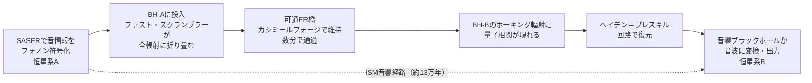

## 概要 (Abstract)

ブラックホールは音を「飲み込んで消す」のではなく、量子スクランブリングによって全てのホーキング輻射に「折り畳んで保存」する超長期アーカイブである。二つのブラックホールがER=EPR対応によってワームホール（ER橋）で接続されているとき、一方に送り込んだ音響情報は原理的に他方から取り出せる可能性がある。

この思考実験は「ワームホールを音響チャネルとして使う」という問いを立てる。通常の星間媒質（ISM）を音速で伝わる場合、最も近い恒星系まで13万年以上かかる音響信号が、ワームホール経路では瞬時に近い時間で届きうる。ただしその実現には可通ワームホールの形成・SASERによる符号化・量子情報の復元という三つの独立した障壁がある。

## 実現不可能性の根拠 (Infeasibility Rationale)

### 物理的限界：可通ワームホールの維持エネルギー

ER橋はデフォルトでは非可通であり、物質も情報も通り抜けられない。これを可通化するにはカシミール効果に類似した負エネルギー密度の供給が必要である。しかしフォード＝ローマン不等式によれば、負エネルギーは量子不等式で厳しく制限されており、集積できる量と持続時間の積は一定値以下に抑えられる。

現在知られているカシミール効果で生成できる負エネルギー密度は、ワームホールの喉部を維持するために必要な量の桁違い以上小さい。喉部を太陽質量のワームホールに維持するために必要な負エネルギーは太陽のエネルギーに匹敵するか上回るという試算があり、あらゆる現実的な方法で用意できる量を遙かに超えると考えられる。この障壁はカシミールフォージ（wiim_023）の能力限界と直結しており、量子不等式を回避する手段がない限り物理的に突破不可能と考えられる。

### 技術的限界：フォノンから量子情報への変換

SASERによってコヒーレントフォノンとして符号化された音響信号をER橋の入口に結合させる技術的手段が確立されていない。SASERは固体格子振動を増幅する装置であり、量子重力的構造であるER橋との結合機構は現在の物理学の射程外にある。

出口側にはさらに困難な問題がある。ブラックホールに落ちた情報は量子スクランブリングによって全ホーキング輻射に分散される。ヘイデン＝プレスキル回路の原理では早期ホーキング輻射という「参照系」があれば情報を復元できるが、太陽質量のブラックホールの場合この参照系を約10⁶⁷年にわたって量子コヒーレントに保持し続けることが条件となる——宇宙年齢を10⁵⁷倍した時間である。

### 論理的限界：クロノロジー保護との境界

ホーキングのクロノロジー保護仮説は、閉じた時間的曲線（CTC）を形成する系は量子重力効果によって自己崩壊すると主張する。ワームホールを「過去への通信路」として使うことは禁じられる可能性が高い。

しかし「未来方向の近道」はこの範囲外である。4光年先へのISM音速経路（13万年）に対してワームホール経路（数分）では情報が「早く届く」が、これは空間的近道であり因果律には触れない。同じ距離を徒歩より飛行機の方が早く移動するのと構造的に同じ——時間を遡るわけではない。この意味での「音を届けること」は論理的には可能である。

## 実験の設定 (Setup)

- **主体**: SASER装置を持つ恒星系Aの文明（送信側）と恒星系Bの文明（受信側）
- **環境**: 二つのブラックホール（BH-A・BH-B）がER=EPR対応で量子もつれしており、カシミールフォージ技術によって可通ER橋が形成・維持されている
- **距離**: 4光年（プロキシマ・ケンタウリ相当）

**操作の連鎖**:
1. SASERでコヒーレントフォノンとして音情報を符号化する
2. 符号化フォノンをBH-Aに投入する → ファスト・スクランブラーとして全ホーキング輻射に折り畳む
3. ER橋（カシミールフォージで可通化済み）を通じてBH-Bの量子状態にBH-A由来の相関が現れる
4. ヘイデン＝プレスキル回路でBH-Bのホーキング輻射から音情報を復元する
5. 音響ブラックホール（ダムホール）を変換器として使い、量子情報を音響波として出力する

## 考察と予測 (Speculation)

### 折り畳みと展開の非対称性

ブラックホールへの情報投入（折り畳み）はファスト・スクランブラーの性質により超高速で完了する。しかし展開（取り出し）はアイランド公式が記述するページ曲線に従い、本来はページタイム以降に情報が出始める。

もしER橋が可通であれば、BH-AとBH-Bが直接の量子チャネルを形成するためページタイムを待たずに情報が転送される可能性がある。この点——可通ワームホールとページタイムの関係——は現在も理論的に活発に研究されており、確定的な答えはない。

### 無毛定理が隠す内部情報

無毛定理によれば、BH-Bの外部から観測可能な性質は質量・電荷・角運動量の3変数のみである。送り込まれた音の情報はこの3変数には反映されない——しかしホーキング輻射のパターンには量子的に符号化されている。「外から見えない、しかし輻射に書いてある」という二重性が音響チャネルとしての本質を成している。

### 古典的音響階層との対比

wiim_101で論じた古典的音響階層（同スケールの星は聞こえないが、銀河スケールの密度波は構造に刻まれる）と対比すると、ブラックホール音響チャネルはまったく異なる論理で動作する：

- **古典チャネル**: スペクトル分離・スケール依存感度 → 巨視的・低コスト・低速
- **量子チャネル**: ER橋・量子もつれ → スケール非依存・莫大な設定コスト・高速

両チャネルが共存するとき、宇宙の音の伝達網は古典的な低速ブロードバンドと量子的な高速専用線の二層構造を持つ。ブラックホールはその専用線の中継器かつアーカイブとして機能する可能性がある。

## 関連記事 (Related)

- [wiim_101](wiim_101.md) — 星は銀河の歌を聞くが、隣の星の歌は聞こえない（古典的音響階層との対比）
- [wiim_089](wiim_089.md) — ブラックホール潜入とワームホール開通（可通ER橋形成の前提条件）
- [wiim_023](../physics/wiim_023.md) — カシミールフォージ（負エネルギー供給の技術的基盤）
- [wiim_028](wiim_028.md) — 重力子と光子の二重搬送FTL通信（他の超光速通信アプローチとの比較）
- [tech_tree_blackhole](../notes/tech_tree_blackhole.md) — tech_tree_blackhole.md

