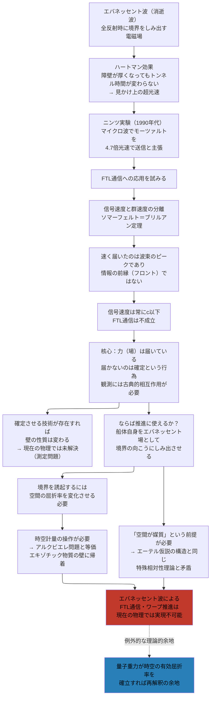

## 概要 (Abstract)

光がガラスから空気へ全反射する瞬間、境界面の向こう側に指数関数的に減衰する電磁場がわずかにしみ出す。これを**エバネッセント波**（消逝波）という。そして1960年代、物理学者トーマス・ハートマンはある奇妙な予測を立てた——このしみ出しを利用した量子トンネルでは、障壁が厚くなっても通り抜けにかかる「時間」が変わらないかもしれない、と。

もし障壁を倍にしても通過時間が同じなら、十分に厚い障壁に対して信号は見かけ上「光速を超えて」届くことになる。この**ハートマン効果**は1990年代に実験で確認され、ギュンター・ニンツはマイクロ波でモーツァルトの交響曲を「4.7倍光速で送信した」と主張した。

本記事はこの現象を出発点に、エバネッセント波がFTL通信の扉を開くかどうかを問い、さらに「しみ出し」を宇宙船スケールに拡張するワープ推進構想へとエスカレートする。

---

## 実現不可能性の根拠 (Infeasibility Rationale)

### 物理的限界——群速度と信号速度は別物である

ニンツ実験が示した「超光速」は、**群速度**（波束のピークが進む速度）の話だ。波には三つの速度がある——波の山が進む位相速度、波束の包絡線が進む群速度、そして情報が届く信号速度（フロント速度）だ。

ソマーフェルト＝ブリルアン定理が示す通り、信号速度は常に光速以下に留まる。エバネッセント波のトンネルで「速く届く」のは波束のピークであって、信号の前縁（フロント）ではない。

なぜこうなるか。エバネッセント波は障壁の中では指数関数的に減衰する。障壁を通り抜けるのは波の「山の位置」という統計的な情報であり、波そのものがトンネルしているわけではない。ニンツのモーツァルト実験は、すでに波束として成形された「音楽の包絡線」をトンネルさせたものであり、その包絡線の到達が早く見えるのは、障壁の手前で波束が前側に「引っ張られる」効果による。情報は発信する前から到着することはできない。

### 技術的限界——通信に使えないなら推進にも使えない

FTL通信の試みが示した構造的な問題は、推進にもそのまま引き継がれる。

エバネッセント波は**媒質の境界**で発生する。地上実験ではプリズムや導波管が媒質として機能した。宇宙空間に「全反射境界」に相当する領域を作るためには、空間の屈折率を局所的に変化させる必要がある。それはすなわち時空の計量を操作することに等しく、エキゾチック物質か極端なエネルギー密度による時空曲率の制御——アルクビエレ型ワープドライブとまったく同じ壁——が必要になる。

「通信の手段」として使えなかった超光速は、「推進の手段」としても同じ理由で機能しない。入口を変えても突き当たる壁は同じだ。

### 論理的限界——「空間が媒質」という前提の問題

エバネッセント波ワープを宇宙スケールで考えると、その前提として宇宙空間に「媒質としての性質」を付与しなければならない。これは19世紀のエーテル仮説に構造的に近い。マイケルソン＝モーリー実験によってエーテルは棄却され、特殊相対性理論が確立した。

現代の量子重力理論（ループ量子重力、スピンフォーム理論）ではプランクスケールで時空が粒状の構造を持つとされるが、これが電磁気学的な「媒質の屈折率」として機能するかどうかは理論的に示されていない。「時空がグレイン状である」ことと「エバネッセント波が発生する媒質境界が存在する」ことは、別の主張だ。

---

## 実験の設定 (Setup)

思考実験を二段階で構成する。

**第一段階：FTL通信の試み**

1. 宇宙船Aが深宇宙の「送信端」に位置し、1光年離れた宇宙船Bが「受信端」になる。
2. 両者の間に巨大な計量場発生装置を配置し、空間に「媒質境界」に相当する屈折率不連続面を誘起する（地上実験のプリズムに相当する仮設的な構造物）。
3. Aがエバネッセント場のトンネル経路で変調信号を送信し、ハートマン効果によって1光年の障壁を「定時間」でBに届けることを試みる。

**第二段階：ワープ推進への拡張**

4. 通信が成立しないことが確認された場合、発想を転換して宇宙船自身がエバネッセント場として「しみ出す」ことを試みる。
5. 船体前方に計量揺らぎを誘起して境界条件を成立させ、船体をエバネッセント場の「減衰尾部」として境界面の向こう側に押し出す。
6. 境界条件を解除し、しみ出した位置を通常空間に固定することでジャンプを完了させる。

---

## 考察と予測 (Speculation)

ハートマン効果は「見かけ上の超光速」として物理学史上まれな事例だ。実験で確認された現象が、信号速度の観点からは超光速ではないと判明するまでに数十年の議論を要した。その意味では、この構想は「超光速に見える現象から何が本当に引き出せるか」を問う好例となっている。

宇宙論的スケールでの類似物として、宇宙膨張によってある領域の「見かけの後退速度」が光速を超えることがある（ハッブル地平線の外側の領域）。この場合も、情報は届かず因果関係は保たれる。ハートマン効果と宇宙膨張の「超光速」は、同じ意味で「見かけ上」だ。

### 届くのは力、届かないのは確定

この問題の核心を別の角度から言い直すと、何が本当に不可能なのかがより鮮明になる。

エバネッセント場はすでに障壁の向こう側に存在している。波動関数は非局所的に広がり、**力（場）としてはすでに届いている**。届いていないのは「粒子」ではなく、より正確には**確定という行為**だ。

| 段階 | 光速の縛り |
|------|----------|
| 力・場の到達（波動関数の広がり） | 縛りなし |
| 確定（観測・波動関数の崩壊） | 古典的相互作用が必要 |
| 情報の読み出し（結果の伝達） | 古典通信が必要（光速以下） |

錨はすでに向こう岸に届いている。しかし「錨が刺さったこと」を確認する行為が、光速以下の通信を必要とする。

量子力学はまだ「確定という行為そのもの」の正体を解き明かしていない——それが測定問題だ。もし観測を古典的な相互作用なしに制御できれば、つまり**力を確定させる技術**が生まれれば、この壁はまったく別の性質を帯びる。

WIIM世界観において、コーラ粒子（wiim_013）やパラドックス粒子（wiim_030）は「確定という行為を操作する」概念として解釈できる余地がここに見える——力が届いた先で、どの状態に崩壊するかを制御する粒子として。

量子重力理論がプランクスケールでの時空の粒状性を実証し、それが電磁場の伝播に対して何らかの「有効屈折率」を持つと判明するなら、エバネッセント波的な現象が宇宙スケールで再解釈される余地はある。ただしその場合でも、信号速度が光速を超えるかどうかは独立した問いとして残る。

### 観測とは力場の相転移である

「確定」という行為を別の角度から見ると、さらに鮮明な表現が得られる。

観測とは、**力場が相転移を起こして私たちが知覚できる状態になること**だ。転移前の量子場はあらゆる可能性が等価に重なった対称な状態にある。観測という摂動が加わると、系は閾値を超えて特定の古典的状態へと「結晶化」する——対称性が破れ、ひとつの結果が選ばれる。

| 相 | 状態 |
|----|------|
| 転移前（量子場） | 多くの可能性が重なった対称な状態。力はすでに届いているが知覚できない |
| 相転移（観測） | 摂動が閾値を超える。人為的デコヒーレンスが発生する |
| 転移後（古典場） | 対称性が破れ、特定の状態に結晶化する。私たちが「見える」のはここだけ |

私たちは常に**転移後の宇宙しか見ていない**。見ようとする行為が転移を起こすため、転移前の力場そのものを知覚する方法が原理的にない。

これはFTL問題の根本に触れる。エバネッセント場が「届いている」のは転移前の量子場としてであり、私たちが「受け取れる」のは転移後の古典場としてだ。その間に相転移という越えられない段差がある。力場検知器官（g459）の構想が意味を持つとすれば、それはこの段差を迂回して転移前の状態を処理できる機構——転移を起こさずに場を読む技術——としてだ。

「空間を引き裂く」でも「空間を引き伸ばす」でもなく、「空間に滲透する」という第三のFTL描像としての思考実験的な意義は残る。

---

## 図解 (Diagrams)

---

## 関連記事 (Related)

- [wiim_001 — 光速を超えた場合の因果律](wiim_001.md)
- [wiim_028 — 重力子と光子の二重搬送FTL通信](wiim_028.md)
- [wiim_023 — カシミールフォージ（エキゾチック物質生成）](../physics/wiim_023.md)
- [wiim_027 — ストレンジスター・ワープゲート](../physics/wiim_027.md)
- [wiim_032 — コーラバブルワープ](../physics/wiim_032.md)
- [wiim_079 — ギャラクシードライブ](wiim_079.md)
- [tech_tree_main](../notes/tech_tree_main.md) — tech_tree_main.md
- [wiim_008_silent_guardian](../notes/wiim_008_silent_guardian.md) — コズミックマイスの静寂な守護——力場検知器官による恒星系防衛の構造

