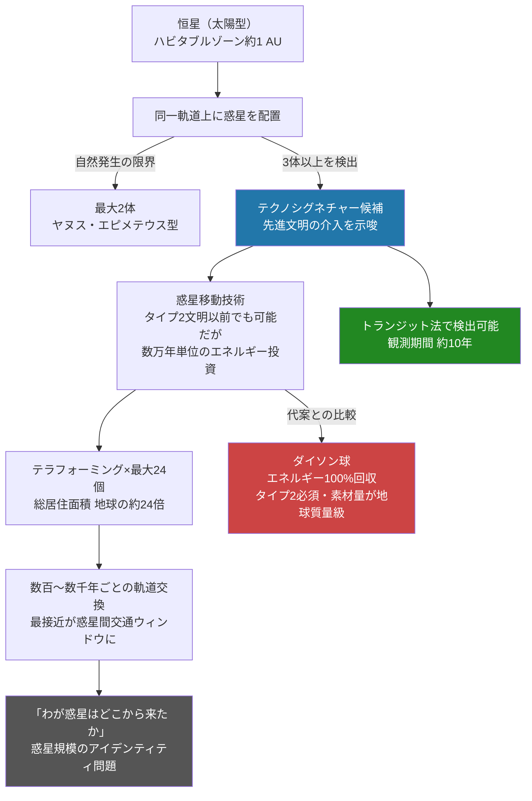

## 1. 概要 (Abstract)

ダイソン球は恒星を完全に包み込んで輻射エネルギーのほぼ100%を回収する構造物だが、必要な素材量は地球質量に匹敵し、カルダシェフ・タイプ2文明でなければ構築できない。

ボルドー大学の天文学者ショーン・レイモンドは2023年に別の構想を提示した。恒星の周囲に複数の惑星を**馬蹄型軌道**で配置することで、ダイソン球より桁違いに少ないリソースで巨大な居住圏を実現できるという。コンピュータシミュレーションでは地球質量の惑星を最大24個、同一軌道上に数十億年にわたって安定配置できることが示された。

> **前提：** 惑星を移動・配置できる技術を持つ文明が存在するとする。  
> **命題：** 「もし一つの恒星の周りに24個の地球型惑星を馬蹄型軌道で並べることができたなら、それはダイソン球よりも持続可能な文明インフラとして機能しうるか？」

自然界の馬蹄型軌道は最大2天体（土星のヤヌスとエピメテウス）しか確認されていない。3体以上の天体が同一軌道を馬蹄型で共有していれば、それは自然発生の可能性が極めて低く、先進文明の痕跡を示す「テクノシグネチャー」として有望な探索ターゲットになりうる。

---

## 2. 実現不可能性の根拠 (Infeasibility Rationale)

- **物理的限界：惑星移動に必要なエネルギー**  
  地球質量（6×10²⁴ kg）の惑星を軌道速度を保ちながら別の軌道へ移動させるには、重力タグボート（大型質量を接近させて重力牽引する手法）またはレーザー推進による継続的な力が必要だ。地球を現在の軌道から約1 AU先に移動させる場合、必要なエネルギーは太陽が数万年かけて放射する総量に匹敵すると見積もられる。カルダシェフ・タイプ2（恒星エネルギーを完全利用できる段階）に達しなければ、惑星一個の移動だけで数十万年単位のプロジェクトになる。

- **技術的限界：24体同時安定配置の精度要件**  
  シミュレーションが安定を示すのは「理想的な初期条件」の下に限られる。馬蹄型軌道の安定性は、各天体の軌道半径の差が数十kmから数百kmという精度で制御されることを前提とする。実際に惑星を移動させる際の誤差、他の惑星の重力摂動、恒星風の影響を考慮すると、24体すべてを許容精度内に収めるための軌道修正は文明規模の継続的な管理業務となる。1体でも軌道が許容範囲を超えると連鎖的な不安定化が起きうる。

- **論理的限界：目的と手段のミスマッチ**  
  ダイソン球の目的は恒星エネルギーの回収だが、馬蹄型軌道文明の目的は居住空間の拡張だ。しかし24個の惑星に生命が住めるようにするには、それぞれで大気・水・温度を地球型に整えるテラフォーミングが別途必要になる。惑星を動かす技術に加えて惑星を作り変える技術も要り、問題は解決されるのではなく積み重なる。

---

## 3. 実験の設定 (Setup)

1. **対象恒星系の選定**  
   太陽型恒星（G型主系列星）の周囲、液体水が存在できるハビタブルゾーン（約1 AU）に同一軌道を設定する。公転周期は約1年となる。

2. **惑星の移動・配置**  
   恒星系内または近傍から地球質量の岩石惑星を24個集め、重力タグボート方式で目標軌道へ順次移動させる。各惑星の軌道半径の差は数百km以内に収める必要がある。

3. **軌道安定化**  
   完全等間隔配置はクレンペラーロゼットと同様の不安定性を持つため、意図的に若干の軌道差を設けて隣接する惑星対が数百〜数千年周期で軌道交換を繰り返す構成にする。シェパード衛星の原理を応用し、少数の大質量天体（主ノード）が系全体の摂動を制御することも考えられる。

4. **テラフォーミング**  
   各惑星の表面を居住可能にする。24個すべてで大気組成・水の供給・磁場の整備を行うことで、総居住面積は地球の約24倍となる。

5. **軌道交換ウィンドウの活用**  
   数百〜数千年ごとに隣接する惑星どうしが最接近する軌道交換イベントが起きる。このとき惑星間距離が一時的に短縮されるため、惑星間交通の窓として活用できる。

---

## 4. 考察と予測 (Speculation)

この構想の最も重要な点は「探索可能性」だ。トランジット法（恒星の手前を惑星が通過する際の光量変化を測定する手法）で約10年間観測すれば、同一軌道上に3体以上の天体がいるかどうかを判定できる。自然界の馬蹄型軌道は最大2体であるため、3体以上の検出は先進文明の介入を強く示唆するテクノシグネチャーになりうる——これがレイモンドの研究の核心的な主張だ。

ダイソン球との本質的な違いは「エネルギー文明か居住圏文明か」という文明観の違いにある。ダイソン球は恒星エネルギーを独占することで計算能力や推進力を極大化する文明（エネルギー志向）を前提とする。馬蹄型軌道文明は恒星の光を直接受けながら多数の惑星で生命を育む（居住空間志向）だ。カルダシェフスケールで言えば、前者はタイプ2の到達形、後者はタイプ2に至る前の「多惑星文明」の延長線上にある。つまり馬蹄型軌道文明はより早い段階で実現しうる——しかしそれは「惑星を動かせる」という条件を満たした上での話だ。

24個の惑星が軌道を交換し続ける系では、数億年のタイムスケールで「どの惑星がどこにいたか」の記録が失われる。文明の歴史に「わが惑星はかつて別の位置にいた」という記述が生まれ、「わたしたちの惑星はどこから来たのか？」は個人のアイデンティティではなく惑星規模の問いになる。馬蹄型軌道文明の住人にとって、「故郷の星」は固定された座標ではなく、軌道上を漂い続ける動く概念になりうる。

---

## 5. 図解 (Diagrams)

---

## 6. 関連記事 (Related)

- [馬蹄型軌道 g474](../../glossary/terms/g474.md) — 本記事の軌道力学的基礎
- [クレンペラーロゼット g471](../../glossary/terms/g471.md) — 等質量等間隔配置の安定性問題
- [シェパード衛星 g473](../../glossary/terms/g473.md) — 主従設計による軌道安定化
- [GEOネックレス（wiim_105）](../physics/wiim_105.md) — 同じ「等間隔配置」の発想を小スケールで論じた記事
- [銀河間重力インフラ（wiim_115）](wiim_115.md) — 同じ文明が銀河間スケールで構築しうる重力インフラ
