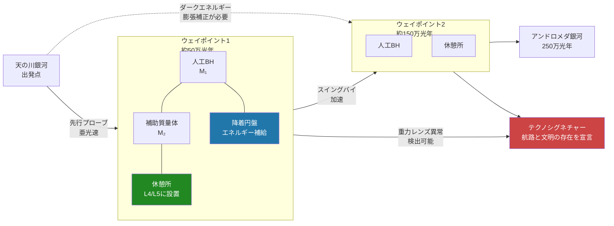

## 1. 概要 (Abstract)

銀河間航行の最大の難問は距離ではなく「途中に何もない」ことだ。アンドロメダ銀河まで約250万光年。その経路上に重力的な足場——休憩点、加速点、エネルギー補給点——が一切存在しない。

前提を一つ変えると問題の性格が変わる。人工的にブラックホールを生成できる技術（クーゲルブリッツ：電磁放射のエネルギーを一点に集中させて生成するBH）があるなら、任意の宇宙空間に重力的なランドマークを「建設」できる。BHを精密な質量で生成し、別の質量体と組み合わせれば、所望の場所にラグランジュ点を作り出すことができる。

> **前提：** クーゲルブリッツ技術により任意質量のBHを任意場所に生成できるとする。  
> **命題：** 「もし銀河間航路上に人工BHを基軸とした重力インフラ——ラグランジュ点休憩所・スイングバイ点・降着円盤補給所——を設置できたなら、銀河間航行は持続可能になるか？」

この構想はwiim_114で論じた馬蹄型軌道文明の発想を逆転させる。あちらは自然の軌道安定性を利用して文明を作る話だったが、こちらは文明がその安定構造そのものを宇宙に書き込む話だ。

---

## 2. 実現不可能性の根拠 (Infeasibility Rationale)

- **物理的限界：クーゲルブリッツ生成に必要なエネルギー**  
  BHを光のエネルギーから生成するには、プランク質量（約2×10⁻⁸ kg）以上のエネルギーを半径プランク長（約1.6×10⁻³⁵ m）以内に集中させる必要がある。必要なエネルギー密度はLHCが達成するエネルギーの約10¹⁵倍に相当する。月質量（≈7×10²² kg）のBHを生成するには E = mc² ≈ 6×10³⁹ J、これは太陽が2000億年かけて放射する総エネルギーに等しい。実用的なインフラ用BHを大量生成することは、現在の物理学が想定する技術の延長線上にない。

- **技術的限界：IGM降着によるμドリフト**  
  銀河間空間（IGM）は空ではない。平均密度は約10⁻²⁷ kg/m³（陽子1個/m³程度）と極めて希薄だが、数百万光年にわたる旅の間に人工BHはIGMを継続的に降着して質量が増大する。精密に設計した質量比μが変化すると、L4/L5の安定条件（μ < 0.0385）が崩れて休憩所が不安定化する。これを防ぐには質量を能動的に排出（BHからはホーキング輻射しか出ない）か、補正用の追加質量を供給し続ける必要があるが、どちらも銀河間スケールでは現実的でない。

- **論理的限界：テクノシグネチャーのパラドックス**  
  銀河間空間に人工的なBH配置が作り出す重力レンズ異常は、バックグラウンドの銀河光を観測することで検出可能だ。ランダムな宇宙論的構造では説明できないBH配列パターンは、それ自体が文明の存在と航路を示すテクノシグネチャーになる。インフラを整備すればするほど「ここを通った」という記録が宇宙に刻まれ、意図の有無にかかわらず所在地と目的地を宣言することになる。これは到達よりも接触のリスクが先に生じるという非対称な状況を生む。

---

## 3. 実験の設定 (Setup)

1. **先行プローブの派遣**  
   先行プローブを亜光速で目標方向へ射出する。プローブはクーゲルブリッツ生成装置と、設計された質量のBHを所定位置に保持するための電磁場制御機構を搭載する。本隊より先に出発し、経路上の各ウェイポイント予定地でBHを生成・設置して待機する。

2. **ウェイポイントの三体系構成**  
   各ウェイポイントでは、先行プローブが運んできた補助質量体（小型人工天体）とBHを組み合わせて三体系を構成する。BH（M₁）と補助質量体（M₂）の質量比を μ < 0.0385 に調整し、M₂の軌道上L4/L5に居住モジュールを設置する。

3. **降着円盤エネルギー補給**  
   BHにガスを意図的に供給し、降着円盤を形成させる。カー（回転）BHの降着効率は質量の最大42%をエネルギーとして解放する。休憩所は反応炉も持ち込む必要がなく、BHへの投入物質の量でエネルギー出力を制御できる。

4. **スイングバイの利用**  
   本隊の航行体をBH重力圏の双曲線軌道で通過させることでΔvを獲得する。天体が自然には存在しない銀河間空間でも、人工BHを中継点として設置することで多段スイングバイが可能になる。BHの近くを通過するほど速度増分は大きいが、降着円盤との干渉や潮汐力の影響が増す。

5. **ダークエネルギー補正**  
   各ウェイポイント間の距離が十分大きい（数万光年以上）場合、宇宙膨張によって隣接するウェイポイント同士が互いに遠ざかる。設置位置は膨張を先読みした予測座標で計算し、先行プローブの出発時点から到着までの宇宙膨張量を組み込む必要がある。

---

## 4. 考察と予測 (Speculation)

この構想が持つ最も根本的な非対称性は「インフラの建設速度と情報の伝達速度の矛盾」だ。先行プローブが光速に近い速度で航行しても、プローブが到達したという情報は光速でしか戻ってこない。本隊が出発するころには、プローブが成功したかどうかを確認することすら不可能になる。銀河間インフラは「信頼して設置し、信頼して使う」盲目的なコミットメントとして構築されなければならない。

エネルギー補給の観点では、この構想は銀河間旅行のカルダシェフ的な要件を根本的に変える。従来の議論では銀河間航行にはタイプ2（恒星エネルギーの完全利用）文明が最低条件とされるが、降着円盤のエネルギー密度を考えると、ルート上に数十箇所のBH補給所があれば実質的なエネルギー予算は大幅に圧縮できる。問題は最初のBH群を生成するための初期コストがタイプ2を要求することであり、インフラそのものは後続の文明が使い回せる。

テクノシグネチャーのパラドックスには逆の読み方もある。もし銀河間空間の重力レンズ観測で人工的なBH配列パターンが発見されれば、それは「誰かがここを通った」という宇宙考古学の証拠になる。宇宙はすでに過去の文明が残したインフラで満ちているかもしれないが、それを検出する感度を私たちがまだ持っていないだけかもしれない——これはwiim_114の馬蹄型軌道テクノシグネチャーと同じ問いの、より大きなスケールでの繰り返しだ。

ひとつの文明が作ったインフラを別の文明が使う可能性も考えられる。ウェイポイントは構造的に「使用者を選ばない」。銀河間旅行が可能な文明にとって、先人が残した重力インフラを継承して使うことは、現代の私たちがローマ街道を舗装し直して使うのと本質的に同じ行為だ。

---

## 5. 図解 (Diagrams)

---

## 6. 関連記事 (Related)

- [ギャラクシードライブ（wiim_079）](wiim_079.md) — 銀河規模の推進技術：本記事のインフラが補完する推進側の問い
- [馬蹄型軌道文明（wiim_114）](wiim_114.md) — 同じ文明が建設しうる恒星スケールの居住インフラ
- [GEOネックレス（wiim_105）](../physics/wiim_105.md) — 同じ主従設計原理の惑星スケール版
- [クレンペラーロゼット g471](../../glossary/terms/g471.md) — 休憩所の軌道構成の基礎
- [シェパード衛星 g473](../../glossary/terms/g473.md) — ウェイポイント安定化の設計原理
- [馬蹄型軌道 g474](../../glossary/terms/g474.md) — スイングバイ設計の軌道力学的基礎
