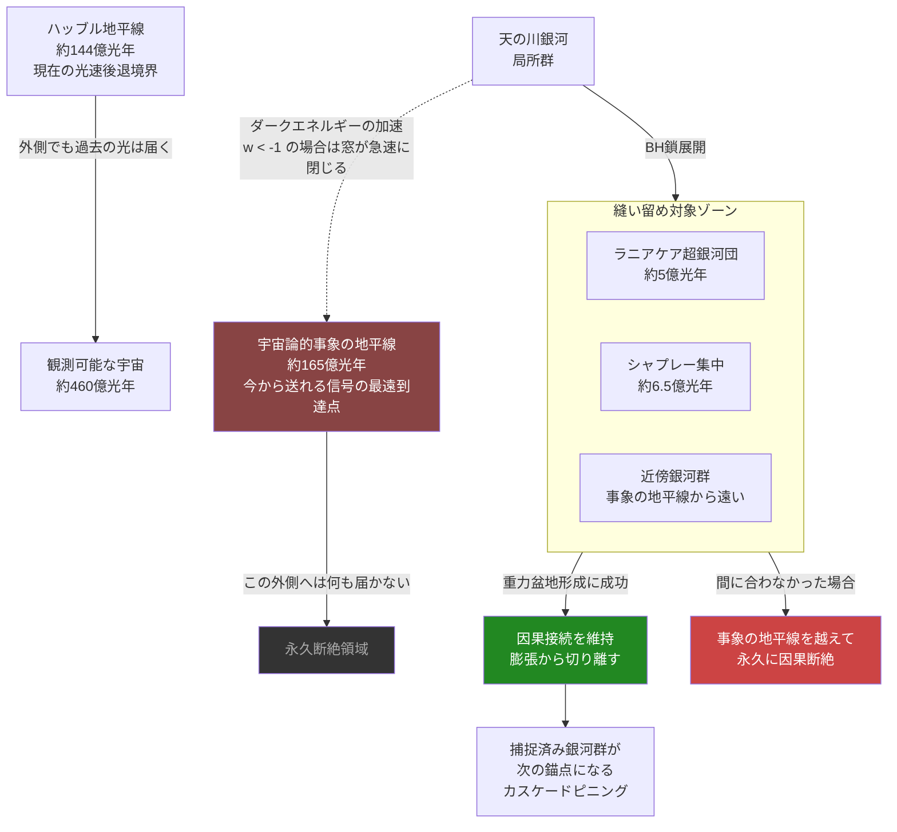

## 1. 概要 (Abstract)

宇宙は膨張している。そして膨張は加速している。遠くの銀河は次々と「事象の地平線」——今から光を送っても永遠に届かなくなる境界——の外側へ消えていく。天の川銀河を含む局所群以外のすべての銀河は、約1000億年後には観測可能な宇宙から消滅する。この孤立は不可逆だ。

まずここで重要な用語の区別をしておく。「ハッブル地平線」（約144億光年）は今この瞬間に光速で後退している境界であり、光の届く範囲の動的な限界だ。一方「宇宙論的事象の地平線」（約165億光年）は、今すぐ光を放っても因果的に接触できる最遠境界を指す。ハッブル地平線の外にある天体でも、宇宙膨張の歴史の経緯で過去に光が届いたことがあるため約460億光年の「観測可能な宇宙」の中にある。問題となるのは事象の地平線だ——この線が絶対的な締め切りとなる。

wiim_115で論じた人工BH重力インフラをこの文脈に転用すると、一つの問いが生まれる。

> **前提：** クーゲルブリッツ技術により、wiim_115の銀河間ウェイポイントを事象の地平線方向へ向けて展開できるとする。  
> **命題：** 「もし事象の地平線に接近しつつある銀河群に向けて重力的錨（BH鎖）を展開し、その銀河群を因果接続圏内に縫い留めることができたなら、宇宙の孤立化を人工的に阻止できるか？」

---

## 2. 実現不可能性の根拠 (Infeasibility Rationale)

- **物理的限界：ダークエネルギーに打ち勝つために必要な質量**  
  ダークエネルギーの密度は約6×10⁻²⁷ kg/m³と極めて小さいが、宇宙論的スケールでの総量は圧倒的だ。ある銀河群（直径数メガパーセク）を重力的に束縛するには、その体積内のダークエネルギーに相当するエネルギーを物質として上回る質量が必要になる。1メガパーセク（約326万光年）の球内で必要な束縛質量は、すでに大規模銀河団（太陽質量の10¹⁴〜10¹⁵倍）に匹敵する。これを事象の地平線付近の複数地点に人工的に配置するには、宇宙の観測可能な総物質量に近い質量の人工BHが必要になる。

- **技術的限界：競争の構造的な非対称性**  
  BHを運ぶプローブは亜光速で動く。事象の地平線は今から約165億光年先にある。プローブが165億光年を移動するには、宇宙の現在年齢（138億年）をはるかに超える時間が必要だ——その間にも宇宙は膨張し続け、目標地点は遠ざかる。さらに根本的な問題として、事象の地平線の「外側」にはそもそも何も送れない。「外側に先手を打つ」ことは定義上不可能であり、「内側のギリギリに打つ」しか選択肢はない。縫い留められるのは、**今まさに地平線に近づいている**銀河群だけだ。

- **論理的限界：ダークエネルギーの不確実性と締め切り計算の崩壊**  
  どの銀河がいつ事象の地平線を越えるかを計算するには、ダークエネルギーの状態方程式（wパラメータ）の将来値が必要だ。もしwが-1より小さい（ファントムダークエネルギー）なら、膨張は「ビッグリップ」として加速度的に増大し、事象の地平線は急速に縮小する。この場合、縫い留め計画を立てた瞬間には締め切りがすでに過ぎている可能性がある。計画の実行可能性そのものが宇宙論的な不確実性に根ざしており、観測精度が有限である以上、「まだ間に合う」という確信を持てない。

---

## 3. 実験の設定 (Setup)

1. **カウントダウン地図の作成**  
   現在の宇宙膨張速度とダークエネルギーのwパラメータを最高精度で測定し、各銀河群が事象の地平線を越えるまでの「残り時間」を一覧化する。おとめ座超銀河団（距離約2億光年）、ラニアケア超銀河団（約5億光年）、シャプレー集中（約6.5億光年）など、重力的な絆がまだ残っている構造がターゲット候補になる。

2. **先行プローブ鎖の展開**  
   wiim_115の銀河間ウェイポイント方式を延長し、各ターゲット銀河群に向けて人工BH鎖を亜光速で打ち込む。鎖の各ノードは前のノードを重力的な中継点として利用し、到達後に大質量BHクラスターを形成して局所的な重力盆地を作る。

3. **銀河群の重力盆地への捕捉**  
   BHクラスターの重力圏がターゲット銀河群の後退速度に打ち勝てる規模に達した時点で、銀河群は「捕捉」される。ハッブルフローからの離脱が起きて、局所的に重力支配の領域が広がる——銀河団が自然に形成する際のメカニズムを人工的に再現することになる。

4. **連鎖捕捉（カスケードピニング）**  
   捕捉した銀河群それ自体が次の錨点となり、さらに遠い銀河群を捕捉するためのBH鎖の起点になる。成功した各ノードが足場となって地平線方向へ順次拡張していく設計だ。ただし各段で必要な質量は増大し、エネルギー要件は指数的に膨れ上がる。

5. **確認の非同期性**  
   プローブが捕捉に成功したかどうかの信号が戻ってくるまで、送信元（天の川銀河）からは数億〜数十億年待つ必要がある。計画全体はリアルタイムのフィードバックなしに、確認なき盲目的コミットメントとして進行する。

---

## 4. 考察と予測 (Speculation)

この構想が示す最も奇妙な含意は、「縫い留め」の行為が「保存」よりも「関係性の選択」に近いという点だ。宇宙の中で重力的に束縛できる銀河群の数は有限であり、すべてを救うことはできない。どの銀河群を優先するかという判断は、技術的問題ではなく文明の価値観の問いになる——遠くの高密度銀河団か、生命が存在しうる中規模銀河か。

ダークエネルギーに打ち勝つのが原理的に困難なら、逆向きの発想も考えられる。wiim_078（エクスタイドフロート）は宇宙膨張のエネルギーを収穫する概念だったが、膨張に逆らうのではなく「膨張のエネルギーを使って膨張を一部相殺する」フィードバックループ設計が可能かもしれない。これは本質的にダークエネルギーを燃料として自分自身の帰結を遅らせる構想であり、工学的には自己矛盾に近い。

もし宇宙のどこかに先行文明が存在し、同じ問題に取り組んでいたとしたら、その痕跡はどこに現れるか。宇宙の大規模構造（コズミックウェブ）は銀河フィラメントと空洞（ボイド）から構成されるが、フィラメントは物質が集中した「糸」だ。その一部が自然の重力収縮ではなく、過去の文明による縫い留めの遺構である可能性を排除する観測的な根拠は、現時点では存在しない。

最終的に残る問いは技術的なものではなく哲学的なものかもしれない。宇宙の孤立化は不可逆的な喪失か、それとも最初から一つの宇宙に接触できることを前提とすべきではなかったのか。宇宙論的な孤独は克服すべき問題なのか、それとも宇宙の設計に最初から書き込まれた条件なのか。

---

## 5. 図解 (Diagrams)

---

## 6. 関連記事 (Related)

- [銀河間重力インフラ（wiim_115）](wiim_115.md) — 本記事が前提とするBH展開技術の基礎
- [ギャラクシードライブ（wiim_079）](wiim_079.md) — 宇宙を縫い留めるのではなく、自分が移動する対比的アプローチ
- [エクスタイドフロート（wiim_078）](wiim_078.md) — ダークエネルギーに逆らうのではなく収穫する方針
