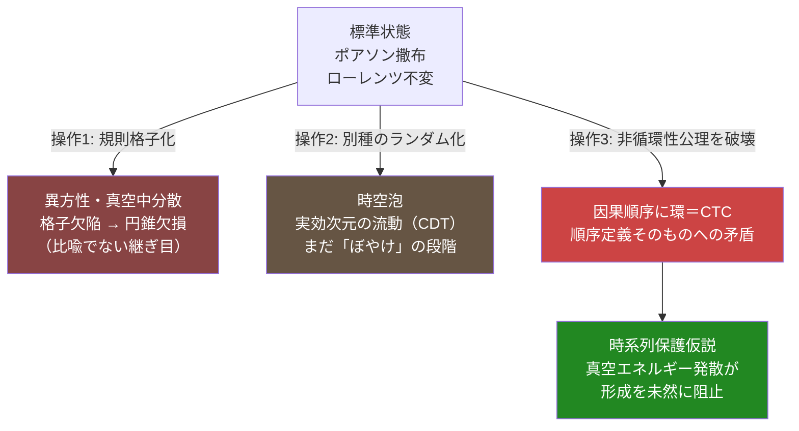

## 1. 概要 (Abstract)

音速を超えた物体はソニックブームという衝撃波を生む。ならば光速を超えた場合も、同じように時空間を"破断"させる何かが起きるのではないか——この直感は自然だが、音と光では「壁」の正体がそもそも違う。音速は空気という媒質が持つ有限の伝播速度であり、光速 $c$ は時空の因果構造そのものに刻まれた上限だ。

> **前提:** 空間を「距離や広がり」ではなく、事象と事象を結ぶ因果的な順序関係の集合として定義しなおす。
> **命題:** 「もし光速を超える速度を出せたら、音速超過がソニックブームを生むように、時空間を"破断"させることができるか？　そしてその"破断"とは、物理的な損傷なのか、それとも別の何かなのか？」

---

## 2. 実現不可能性の根拠 (Infeasibility Rationale)

### 物理的限界

音速は空気という媒質中を伝わる圧力波の速さであり、物体はその媒質との相対運動によって音速を追い越すことができる——追い越した瞬間、前方に波が追いつけなくなり衝撃波（ソニックブーム）が生じる。これは媒質側の現象だ。

一方、真空中の光速 $c$ は「媒質を伝わる波の速さ」ではない。質量を持つ物体を加速するのに必要なエネルギーは $v \to c$ で発散し、有限のエネルギーでは原理的に到達できない。押し切れば突破できる壁ではなく、壁自体が無限遠にある構造だ。

興味深いことに、水やガラスなど光速が $c$ より遅くなる媒質中では、荷電粒子がその媒質中の光速を超えることは実際に起こり、**チェレンコフ放射**という本物の光学的衝撃波（原子炉の青い光として知られる）が生じる。ソニックブームとの類推が正しく成立するのはこの媒質中の現象に限られ、真空中の $c$ には当てはまらない。

### 技術的限界

「時空間を破る」技術を構想するには、破られる対象——空間——が実体的な"モノ"であることが前提になる。しかし1983年以降、国際単位系におけるメートルは「光が真空中を 1/299,792,458 秒間に進む距離」として定義されている。距離という概念自体が、光の因果的な伝播時間から事後的に規定される値なのだ。空間が実体でなく手続き的に定義される量である以上、「破壊すべき対象」を工学的に指定すること自体ができない。

### 論理的限界

ここが最も本質的な問題だ。空間を因果順序として捉えると、二つの事象が「空間的に離れている」とは、積極的な性質ではなく「互いに因果的な影響を及ぼせない」という**消極的な事実**を指すことになる。だとすれば「光速を超えて空間を破断する」という発想は、物理的な損傷の記述ではなく、本来両立しないはずの述語——「空間的に離れている」かつ「因果的に接続している」——を同一の事象対に同時に適用してしまう、定義上の矛盾（カテゴリー錯誤）である可能性が高い。北極点のさらに北を問うのに近い誤りだ。

---

## 3. 実験の設定 (Setup)

1. **モデル化:** 空間を「事象間の因果的順序＋密度」から成る離散的な集合（因果集合）として定義する。連続的な距離や次元は、この順序関係から事後的に復元されるべき二次的な量とする。
2. **標準状態の確認:** 標準的な因果集合は、点をポアソン過程でランダムに撒布することで構成される。この撒き方は分布としてローレンツ不変であり、特定の方向や静止系を持たない。
3. **操作①（規則化）:** ランダムな撒布を、規則正しい格子に置き換える。
4. **操作②（別種のランダム化）:** ポアソン過程の代わりに、相関を持つ別の点過程（クラスター化する分布など）で撒布し直す。
5. **操作③（順序律の破壊）:** 半順序が満たすべき非循環性の公理を破り、因果的順序の中に環（ループ）を作る。

各操作の結果を観察し、それぞれが「時空間の破断」にどこまで近いかを評価する。

---

## 4. 考察と予測 (Speculation)

### ランダムであることは秩序を生まない——むしろ秩序は稀少である

因果集合のノード自体は無秩序（カオス）から秩序を生み出しているわけではない。**クレイトマン＝ロスチャイルドの定理**は、あるノード数から半順序をランダムに一つ選ぶと、その圧倒的多数が三層構造の扁平なポセット（KRポセット）になり、私たちの滑らかな4次元時空のような多様体的秩序をまったく持たないことを示している。時空的な秩序は、可能な因果構造の中でも測度ゼロに近い、きわめて例外的な配置だと考えられる。ノードをただ集めれば自動的に空間が生まれるわけではない。

### 規則性こそが対称性を破り、ランダム性こそがそれを守る

さらに逆説的なのが**ボンベリ＝ヘンソン＝ソーキンの定理**だ。連続時空を規則正しい格子で離散化すると、その格子は必ず特定の方向や静止系を暗黙に選んでしまい、相対論が要求するローレンツ対称性を破る。ところがポアソン過程によるランダムな撒布は、その確率分布自体がローレンツ変換に対して不変になる——**ランダムであることによってのみ、対称性という高次の秩序が保たれる**のだ。直感的には「規則正しさ＝秩序、ランダムさ＝無秩序」と考えがちだが、ここでは規則性の方が対称性を破壊し、ランダム性の方がそれを保護するという、逆転した関係になっている。

### 破断の三段階

以上を踏まえ、実験の設定で挙げた三つの操作を「破断の強度」として順に評価する。

**操作①（規則化）** は、ローレンツ対称性を破り、方向によって光速が微妙に変わる異方性（真空中分散）を生む。ここに格子欠陥を混ぜると、宇宙紐（コズミックストリング）のような**円錐欠損**——その点や線の周りだけ角度が本来より少ない、幾何学的に本当の"継ぎ目"が生じる構造ができる。これは比喩ではなく、局所的に規則秩序が破綻する箇所という意味で、"破断"にもっとも近い実在の物理描像だ。

**操作②（別種のランダム化）** は、近距離での因果順序を曖昧にする"時空泡"（ホイーラーの用語）や、原因動的三角分割（CDT）などの量子重力候補理論で実際に示されている、スケールに応じた実効次元の流動（大スケールでの4次元から、プランクスケール近くでの2次元程度への変化）を引き起こしうる。ただしこれはまだ"ぼやけ"であって、明確な断裂ではない。

**操作③（順序律の破壊）** だけが、本当の意味での破断に相当する。半順序の非循環性を破って因果順序に環を作ることは、一般相対論で言う**閉じた時間的曲線（CTC）**に正確に対応する——幾何学的な歪みではなく、順序という定義そのものへの論理的矛盾だ。ホーキングの**時系列保護仮説**は、CTCが形成されかけると量子場の真空エネルギーが発散し、その経路自体を潰すと予想する。宇宙は自らの因果秩序が矛盾に陥ることを、構造的に許さないのかもしれない。

### 結論

音速との類推が有効なのは、媒質中でチェレンコフ放射が起きる限定的な場面だけだ。真空中の光速超過が引き起こす"破断"は、空気を切り裂くような物理的損傷ではなく、因果順序という空間の定義そのものへの違反として立ち現れる——そしてその違反こそ、宇宙がもっとも強く抵抗する種類の出来事だと考えられる。

---

## 5. 数式による表現 (Mathematical Notation)

時空の不変間隔は次のように書ける。

$$ds^2 = -c^2 dt^2 + dx^2 + dy^2 + dz^2$$

この符号が負なら時間的（因果順序が定義できる）、正なら空間的（因果的に無関係）、ゼロなら光的（光円錐の境界）に分類される。光速 $c$ とは、この分類の境界を定める変換定数にすぎない——「物が動ける最高速度」であることは、この因果的な分類構造から生じる副産物だと捉え直せる。

---

## 6. 図解 (Diagrams)

---

## 7. 関連記事 (Related)

- [宇宙は自分自身の母になれるか（wiim_119）](wiim_119.md) — 本記事の結論（環の混入＝真の破断＝CTC）を宇宙の起源側に適用した出口記事
- [光速を超えた場合の因果律（wiim_001）](wiim_001.md) — タキオンによる情報の逆送りという角度から因果律の崩壊を論じた記事。本記事は空間の定義そのものを問い直す角度から同じ主題に接近する
- [時間遡行は可能か（wiim_049）](../physics/wiim_049.md) — CTCと時系列保護仮説をWIIM粒子による時間遡行工学の文脈で論じた記事。本記事はCTCに空間論・因果集合理論という別の経路からたどり着く
- 用語: ローレンツ不変性 g063
