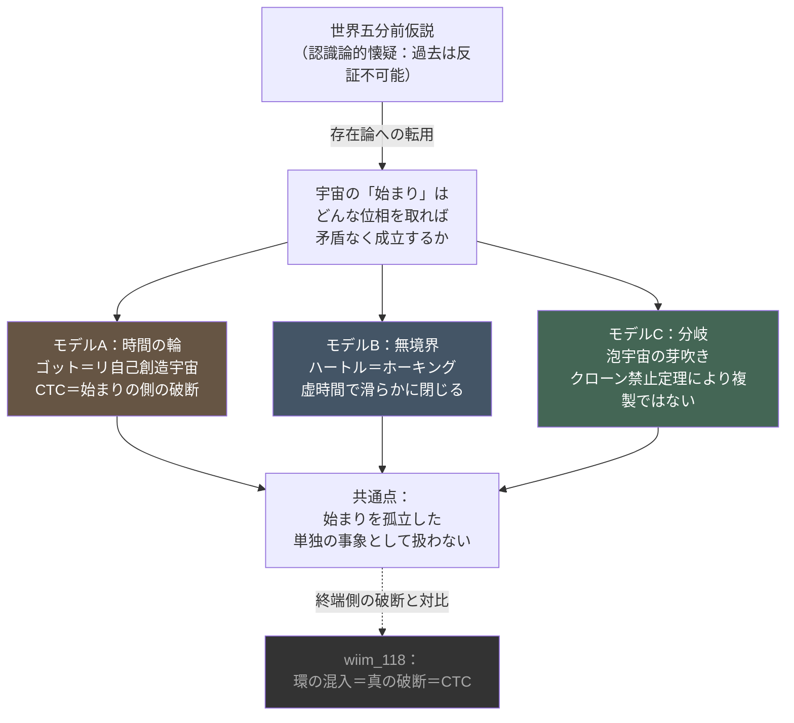

## 1. 概要 (Abstract)

wiim_118は「因果順序に環（ループ）を作ることこそが本物の"時空間の破断"であり、それは一般相対論の閉じた時間的曲線（CTC）に対応する。そして宇宙は自らの因果秩序が矛盾に陥ることを構造的に許さないのかもしれない」と結論した。本記事はこの結論を前提として受け取り、一歩先に進める——**その「環」が、宇宙の終わりではなく"始まり"の側に現れたとしたらどうなるか**、という問いだ。

宇宙は138億年前に無から突如出現したとされる。しかしこの「無からの突如の出現」は、因果順序という観点から見ると、始点を持つ半直線の端——**因果的な先行者を持たない、唯一の例外的事象**——という、それ自体が奇妙な構造を要求する。

> **前提:** wiim_118で確立した「因果順序への環の混入＝破断＝CTC」という等式を受け取り、宇宙の起源にも適用する。
> **命題:** 「もし宇宙の"始まり"自体が、無からの突発ではなく、CTCのような時間の輪、あるいは空間的な分岐（budding）によって生じるのだとしたら、宇宙論的・存在論的に何を意味するか？」

---

## 2. 実現不可能性の根拠 (Infeasibility Rationale)

### 物理的限界

標準ビッグバンモデルでは、時間を過去へ遡ると密度と時空曲率が無限大に発散する初期特異点に至る。一般相対論はこの点で自らの適用限界を超え、記述能力を失う。CTCによる自己創造宇宙も、無境界仮説も、ともに一般相対論と量子力学を接合する量子重力理論の候補の一部であり、現時点では観測的に検証も反証もされていない仮説段階に留まる。

### 技術的限界

哲学者バートランド・ラッセルが提示した**世界五分前仮説**は、「宇宙が全ての記憶・化石・地層・伝播途中の光を伴ったまま5分前に生成された」という可能性を、原理的に反証できないと論じた懐疑論だ。この認識論的限界——過去の実在性は経験的に確かめようがないという事実——は、そのまま「宇宙の起源が輪型か無境界型か分岐型かを観測で判別する手段がない」という技術的限界に横滑りする。どのモデルも、始まりそのものの内部に立ち入って検証することができない。

### 論理的限界

自己創造宇宙モデルは、ノヴィコフの自己無矛盾条件を満たす必要がある——「宇宙が存在するのは、宇宙が存在したという結果それ自体が自分自身の原因になっているから」という、通常の因果的説明とは異なる循環を許容する特殊な論理構造だ。これは祖父パラドックスと同じ形式の循環でありながら、矛盾を持ち込まない自己無矛盾な経路だけが選ばれている、という強い制約を必要とする。この制約がなぜ自然に満たされるのかについて、現在の物理学は説明を持たない。

---

## 3. 実験の設定 (Setup)

1. **問いの転用:** 世界五分前仮説（本来は認識論的懐疑論）を、「因果順序として矛盾なく成り立つには、宇宙の"始まり"はどんな位相を取る必要があるか」という存在論的・構造的な問いに読み替える。
2. **モデルA（輪）:** J.リチャード・ゴットと李立新が1998年に提唱した「自己創造宇宙」——宇宙の起源をCTCとして扱い、宇宙が自分自身の"母"になることで第一原因を不要にする。
3. **モデルB（無境界）:** ジェームズ・ハートルとスティーヴン・ホーキングの無境界仮説——時間軸を虚数時間に転換し、鋭い特異点なしに滑らかに"閉じる"。
4. **モデルC（分岐）:** 永久インフレーションにおける泡宇宙の発生。新しい宇宙領域は独立した複製としてではなく、親の真空構造を部分的に共有したまま生まれる。
5. **比較:** 三モデルがそれぞれ「原因なき最初の事象」という構造的違反をどう回避しているかを評価する。

---

## 4. 考察と予測 (Speculation)

### 認識論から存在論への転用

五分前仮説はもともと「過去は反証不可能だ」という**知ることの限界**を突く議論であり、宇宙が実際にどう始まったかを主張するものではない。本記事の操作は、この知識論的な壁を「では、反証不可能性を免れつつ矛盾なく成立する始まりの構造とは何か」という**存在の側の問い**に転用している点に自覚的であるべきだ。この転用によって、五分前仮説は空虚な懐疑ではなく、宇宙論のモデル選択に対する具体的な制約条件——観測で決着がつかない以上、内部矛盾の有無で選ぶしかない——として機能し始める。

### モデルA：時間の輪としての自己創造

ゴット＝リの自己創造宇宙モデルは、極めて初期の宇宙にCTCを許す領域を置き、そこから通常のインフレーションが始まる筋書きを描く。この場合、宇宙は時間軸に沿った半直線の端を持たない——因果構造はループしており、「最初の事象」を探そうとすると、常にそれより前の（同じループ上の）事象に行き着く。wiim_118の結論と接続すると、これは奇妙な逆説を生む。**宇宙の"始まり"そのものが、因果順序への環の混入＝破断によって成立している**可能性があるのだ。終わりの側の破断（時間順序保護仮説が阻止しようとするもの）と、始まりの側の破断（自己創造を可能にするもの）が、同じ数学的構造の二つの現れだとすれば、宇宙は自らの終端における矛盾は拒むが、起源における同じ構造は許容している、という非対称性を持つことになる。

### モデルB：無境界という滑らかな代替案

輪にする代わりに、ハートル＝ホーキングの提案は時間を虚数化する。

$$t \to -i\tau$$

この置き換え（ウィック回転）によりローレンツ計量はユークリッド計量に変わり、時間の起点は「境界」ではなく「なめらかな一点」——ちょうど地球の緯度線が北極点で特異点を作らず自然に閉じるのと同じ構造——として扱えるようになる。輪（モデルA）と無境界（モデルB）はアプローチとしては対照的だが、動機は共通している。どちらも**「原因を持たない最初の事象」という論理的に居心地の悪い構造を、始まりそのものの位相を変えることで回避しようとしている**。

### モデルC：複製ではなく分岐

空間的な断絶や分離によって新しい宇宙領域が生まれるとしても、それは独立した正確な複製ではありえない。量子力学の**クローン禁止定理**（ウッターズ＝ズレック、1982年）は、未知の量子状態を厳密に複製することを原理的に禁じている。実際の宇宙論に近い現象は永久インフレーションにおける泡宇宙の発生（コールマン＝デルッチアのインスタントン機構）であり、新しい宇宙領域は無から切り離されるのではなく、**親の真空構造とエンタングルメント履歴を部分的に共有したまま芽吹く**。ホログラフィー原理の文脈で提案されている「ER=EPR」仮説（時空の接続性そのものが量子もつれによって支えられているとする考え方）を踏まえると、これはエンタングルメントを断ち切って領域を切り離す操作の逆に近い——切断が"破断"を作るなら、共有を保ったままの分岐は"複製"ではなく"出芽"と呼ぶべき現象になる。

### 三モデルの共通点

輪・無境界・分岐は互いに異なる数学的装置を使うが、いずれも「宇宙は無から真に何もない状態を経て忽然と現れた」という素朴な描像を避け、**何らかの形で自分自身の過去（ループ）・自分自身の対称性（虚時間の滑らかさ）・自分自身の親（真空の共有）と接続したまま生まれる**という点で一致している。五分前仮説が突きつける「反証不可能な始まり」への不安は、物理学的には「始まりを孤立した事象として扱わない」という戦略でしか和らげられないのかもしれない。

余談だが、この二分法——単一の閉じた因果ループの中で矛盾なく完結する物語（モデルAに対応し、フィクションでは『12モンキーズ』『プリデスティネーション』のようなノヴィコフ自己無矛盾型の時間ループ作品に相当する）と、記憶や情報だけを引き継ぎながら世界線が分岐していく物語（モデルCに対応し、『シュタインズ・ゲート』のような作品に相当する）——は、時間ループ創作がほぼ例外なくこの二つの型に収束することの一因かもしれない。多くの作品は「なぜループが起こるのか」という力学的説明を放棄しているが、物理側の枠組みはその空白を埋める語り口を提供してくれる。

---

## 5. 図解 (Diagrams)

---

## 6. 関連記事 (Related)

- [光速突破は時空を"破断"させるか（wiim_118）](wiim_118.md) — 本記事が前提とする入り口記事。因果順序への環の混入が"真の破断"＝CTCに対応するという結論を、本記事は宇宙の起源側に適用する
- [光速を超えた場合の因果律（wiim_001）](wiim_001.md) — タキオンによる因果律崩壊を論じた記事。始まりと終わりの双方における因果構造の脆さという主題で共鳴する
- [時間遡行は可能か（wiim_049）](../physics/wiim_049.md) — CTCと時系列保護仮説を時間遡行工学の文脈で論じた記事。本記事はCTCを宇宙論的起源の文脈で再訪する
- 用語: 世界五分前仮説 g027 / ER=EPR予想 g322 / 永久インフレーション g417
