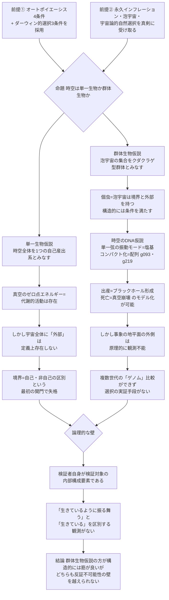

## 1. 概要 (Abstract)

「宇宙全体が一つの生命体である」という主張は、ニューエイジ思想や汎生気論の常套句として繰り返されてきた。本記事はこの主張を字義通りに——比喩としてではなく——検証する。ただし「生物」を情緒的に定義するのではなく、生物学が実際に使う操作的な基準——オートポイエーシス（境界の自己維持・自己産出・組織の再帰的閉包を核とする「自己産出系」の定義）と、ダーウィン的選択の三条件（変異・遺伝・選択）——を、時空そのものに適用する。

この操作を突き詰めると、対立する二つのモデルが浮かび上がる。一つは、時空全体（真空の場・計量）を一つの閉じた自己産出系とみなす**単一生物仮説**。もう一つは、永久インフレーションが生み出す無数の泡宇宙の集合を、クダクラゲのような**群体（コロニー）生物**とみなす**群体生物仮説**——個々の泡宇宙が「個虫（ズーイド）」であり、それらを生み出し続ける母なる偽真空が、群体を貫く共通組織「共肉（そうにく）」に相当する、という類推だ。

> **前提①:** 生物学的な「生物」の判定基準として、オートポイエーシスの4条件とダーウィン的選択の3条件を、比喩ではなく操作的な検査基準として採用する。
> **前提②:** 永久インフレーション（g417）・泡宇宙・真空崩壊（g012）・宇宙論的自然選択（リー・スモーリンが1990年代に提唱した、ブラックホールを介して物理定数が世代を超えて選択されるという仮説）を、現在提案されている形のまま真剣に受け取る。
> **命題:** 「もし時空そのものにこれらの生物学的基準を適用するとしたら、単一生物仮説と群体生物仮説のどちらが——あるいはどちらも——検証に耐えうるか？」

結論を先取りすると、直感に反して単一生物仮説の方が構造的により根本的な壁にぶつかる。「境界」と「外部」を持たないという、生物であるための最初の前提条件を、宇宙全体という対象はそもそも満たせないからだ。

---

## 2. 実現不可能性の根拠 (Infeasibility Rationale)

- **物理的限界:** オートポイエーシスの定義（マトゥラーナ＆ヴァレラ）は、システムが自己の構成要素を絶えず産出しながら、その産出活動によって自らと環境を隔てる境界を維持する、という点を核心に置く。この定義は構造的に「システムの外部」の存在を要求する——境界とは、内部と外部を区切る線だからだ。単一生物仮説が対象とする「宇宙全体」は、定義上あらゆるものを内包しており、原理的に外部を持てない。したがって単一生物仮説は、生物学が要求する境界＝自己／非自己の区別という最初の関門を、対象の定義そのものによって満たせない。一方、群体生物仮説が対象とする個々の泡宇宙は、この点で構造的に有利だ。泡宇宙は偽の真空から真の真空へ相転移した領域であり、境界（真の真空と偽の真空を隔てる壁）と外部（まだ相転移していない周囲の偽真空、あるいは兄弟泡）を明確に持つ。直感的には「全宇宙を一つの生き物とみなす」方が自然に思えるが、構造的にはむしろ部分（泡宇宙）の方が生物の定義に必要な最低条件を満たしやすい、という逆転が生じる。

- **技術的限界:** 群体生物仮説の核心である宇宙論的自然選択は、ブラックホールの特異点を介して新しい泡宇宙が生成され、その際に物理定数がわずかに"変異"して継承される、という機構を仮定する。しかしブラックホールの事象の地平線（g006）は情報を一方向にしか通さない——地平線の内側で何が起きたか、あるいはそこから本当に子宇宙が生まれたかを、外側から確認する手段は存在しない。同様に、永久インフレーションが生成する兄弟泡宇宙は、宇宙論的事象の地平面（[wiim_125](../physics/wiim_125.md)で扱った、将来にわたる到達可能性の限界）の外側に存在するため、直接比較する手段がない。「本当に世代を超えて物理定数が選択されているか」を検証するには、複数世代の宇宙の"ゲノム"（物理定数の値）を比較する必要があるが、そのサンプルは原理的に一つ（この宇宙）しか手に入らない。

- **論理的限界:** 最も根本的な問題は、検証者自身が検証対象の内部構成要素である、という自己言及の構造にある。人類が用いる「生物」という概念そのものが、この宇宙の中で進化した生物学という営みの産物であり、その概念を宇宙全体に適用できるかを、宇宙の外に立って判定する審判は存在しない。これは[wiim_020](../physics/wiim_020.md)で論じたゲーデルの壁——読み出し装置自身が読み出し対象の一部である以上、完全な自己記述は成立しない——と同型の構造だ。さらに、「時空が生きているように振る舞う」ことと「時空が本当に生きている」ことを区別する観測は原理的に存在しない。両者は同じ予測を返す以上、この主張は反証可能性を持たず、科学的仮説というより解釈の選択に留まる。

---

## 3. 実験の設定 (Setup)

1. **判定基準A（オートポイエーシス）:** 境界の自己維持、構成要素の自己産出、組織の再帰的閉包（システムの各過程が他の内部過程によってのみ規定される）、作動的閉包（外部からの入力は摂動としてのみ働き、システムの構造を直接指定しない）の4条件。
2. **判定基準B（ダーウィン的選択の3条件）:** 個体群内に変異が存在すること、その変異が（不完全にでも）継承されること、変異によって繁殖成功度（適応度）に差が生まれること。
3. **主体A（単一生物仮説）:** 時空全体・真空の場・計量テンソルを一つの対象とみなし、判定基準Aを適用する。
4. **主体B（群体生物仮説）:** 永久インフレーションが生成する泡宇宙の集合を対象とし、各泡宇宙を「個虫」、母なる偽真空を「共肉」とみなして判定基準A・Bの両方を適用する。個虫間の"変異"はコールマン＝デ・ルッチアのインスタントン機構による量子トンネル効果のばらつきに、"継承"は親の真空構造（ランドスケープ上の隣接する谷）を部分的に共有したまま生まれることに、"適応度"はスモーリンの仮説に従いブラックホール生成数に対応させる。
5. **検証する仮説:** 主体A・Bのそれぞれが基準A・Bをどこまで満たすかを評価し、両モデルの生物学的地位に優劣がつけられるかを検証する。

---

## 4. 考察と予測 (Speculation)

### 単一生物仮説はなぜ最初の関門で躓くか

真空のゼロ点エネルギーは、ヒッグス場をはじめとするあらゆる量子場が、何もない空間においてすら静止しないことを示す。慣例的に「仮想粒子の生成・消滅」と呼ばれるこの描像は、正確には場の量子的な期待値がたえずゆらいでいる状態を指す比喩的表現であり、物理的実体として粒子が対生成しているわけではない。それでもこの絶え間ない場のゆらぎは、生物の基礎代謝——静止しているように見えて内部では常に分子が入れ替わっている状態——との類比を誘う。単一生物仮説にとって「代謝」に相当する要素は用意されている。

しかし代謝だけでは自己産出系にならない。マトゥラーナ＝ヴァレラの定義が要求するのは、産出活動が境界の維持に**結びつく**ことであり、境界そのものが存在しない対象では、代謝的な活動があってもそれが「自己」を「非自己」から切り出す仕事をしていない。宇宙全体という対象にとって、真空のゆらぎは絶え間ない活動ではあっても、生物学的な意味での代謝——境界を挟んだ物質・エネルギーの出入り——には決してなれない。

### 群体生物仮説——クダクラゲ類推の対応表

クダクラゲは19世紀の生物学に「個体とは何か」という定義問題を突きつけた生物として知られる。遺伝的に同一の個虫が特殊化しながら一つの共肉でつながり、外から見れば単一の生物のように振る舞う——単一でも群体でもある、その境界の曖昧さこそが特徴だ。この曖昧さは、本記事が扱う対象にそのまま重なる。

| クダクラゲ | 宇宙論的対応 |
|---|---|
| 個虫（ズーイド） | 個々の泡宇宙 |
| 共肉（群体を貫く共通組織） | 母なる偽真空（いまだインフレーションを続ける背景） |
| 出芽による無性生殖 | コールマン＝デ・ルッチアのインスタントン機構による泡核形成 |
| クローンでありながら遺伝的に完全に同一ではない | クローン禁止定理により厳密な複製は禁じられ、量子トンネル効果のばらつきが"変異"に相当する（[wiim_119](wiim_119.md)で詳述） |
| 摂食型・生殖型・遊泳型など特殊化した個虫 | ランドスケープ上の異なる谷に落ちた、物理定数の組み合わせが異なる泡宇宙 |

この対応は単なる語呂合わせではない。群体は「一つの個体か、複数の個体の集合か」という質問自体が誤った二分法だという教訓を生物学に残した。泡宇宙の集合もまた、単一生物仮説と群体生物仮説のどちらか一方に収まりきらない対象なのかもしれない。

### 時空のDNA仮説——単一の弦が"配列"するコンパクト化

群体生物仮説が要求する"遺伝"の物理的な担体は何か。超弦理論（g093）を字義通りに受け取るなら、一つの候補が浮かび上がる。この理論が正しいとすれば、あらゆる素粒子——電子もクォークも光子も——は、ただ一種類の一次元的な"弦"が振動する、その振動モードの違いにすぎない。素粒子の"種類"の多様性は弦そのものの多様性ではなく、たった一本の弦が奏でうる無数の"音"の違いに還元される。DNAの4種の塩基が配列の組み合わせだけであらゆるタンパク質を記述するのと、構造としては近い。

しかし本当の"遺伝情報"に相当するのは個々の振動モードではなく、超弦理論が要求する余剰次元がどう折り畳まれているか——コンパクト化の幾何学的形状（カラビヤウ多様体、g219）——の方だ。この形状が、その領域で許される振動モードの集合全体、つまり物理定数一式を決定する。超弦理論の解（真空候補）は10の500乗個以上存在すると見積もられており（いわゆる"風景問題"）、それぞれの解が異なる"ゲノム"を持つ、原理的に別々の物理法則の宇宙に対応する。

ここで前節の群体生物仮説と接続する。コールマン＝デ・ルッチアのインスタントン機構による泡核形成は、親の真空構造を完全に複製せず、部分的に共有しながらランドスケープ上の隣接する解へ量子的にトンネルする、というものだった。これはDNAが複製の際に稀に点変異を起こしながら継承される構造と対応する。単一の弦という"配列の材料"は仮説上のあらゆる泡宇宙で共通していながら、コンパクト化という"配列そのもの"は泡宇宙ごとに異なる——これが時空のDNA仮説の骨子だ。

ただしこの接続は、群体生物仮説がすでに抱える壁を一つも取り除かない。超弦理論自体、実験的に検証された理論ではない。振動モードを直接観測するには理論が予言する弦スケール（プランクスケール近傍）に到達する必要があるが、現在の加速器実験（LHCなど）が到達できるエネルギーは、その15桁以上下にとどまる。加えて超弦理論の10の500乗という解の多さは、風景問題として理論内部でも批判の的になっている——どの解が現実の宇宙に対応するかを選ぶ原理を理論自身が持たないという弱点は、DNAの比喩で言えば「配列は読めるが、どの配列が実際に発現するかを決める仕組みが分からない」状態に近い。時空のDNA仮説は、群体生物仮説に遺伝の"担体"を与える一方、その担体自体がまだ検証手段を持たない仮説の上に乗っている。

### 宇宙論的自然選択とブラックホールの数

リー・スモーリンの宇宙論的自然選択は、ブラックホールの特異点で新しい泡宇宙が生まれる際に物理定数がわずかに変異し、より多くのブラックホールを生成できる定数の組み合わせを持つ泡宇宙ほど、より多くの"子孫"を残す——という仮説だ。この仮説の魅力は、ブラックホール生成に有利な定数の多くが、恒星の核融合による重元素合成、ひいては複雑性や生命の成立にも有利に働くらしいという奇妙な一致にある。もしこれが偶然でないなら、宇宙の物理定数が生命に都合よく見える理由（微調整問題）を、観測者選択効果に頼らずに説明できるかもしれない。

ただし、この仮説には科学的な批判も根強い。変異のメカニズムが具体的にどう物理定数を書き換えるのか、適応度地形（定数空間上でのブラックホール生成数の分布）が局所最適化に必要な滑らかさを持つのか、いずれも理論的に未確立であり、近い将来に検証可能な予測をほとんど生まない。宇宙論の主流というより、生物学的な類推を物理学に持ち込んだ挑発的な思考実験として扱うのが妥当だろう。

### 死と誕生は同じ現象の裏表

[wiim_125](../physics/wiim_125.md)は、真空崩壊が発生した宇宙にとって——泡の内側にいる者にとって——不可逆な終焉であることを論じた。しかし母なる偽真空の側から見れば、同じ相転移は新しい個虫の出芽、すなわち誕生に他ならない。死と誕生を隔てる境界は、視点によって意味が反転する同一の壁であり、しかもその壁は内部の視点からは決して安全に観測できない——これはwiim_125が結論づけた「観測と接触が分離できない」という構造と、そのまま表裏一体をなす。

### wiim_101のコズミック・ガイア仮説との違い

[wiim_101](wiim_101.md)が提示したコズミック・ガイア仮説は、銀河スケールでの創発的な自己調整——密度波が恒星形成のタイミングを揃える——という**機能的な**類推だった。個々の恒星が「生物の一部」になるわけではなく、系全体の振る舞いが自己調整的に**見える**という主張に留まる。本記事の群体生物仮説はこれより一歩踏み込んでいる。オートポイエーシスとダーウィン的選択という、生物学が実際に使う操作的基準を適用し、境界・代謝・生殖・選択という構造的な対応を主張する点で、類推の強度が異なる。ただしこの強度の違いは検証可能性の高さを意味しない——第2節で見た通り、群体生物仮説もまた技術的・論理的な壁の前で足踏みする。

### wiim_119との違い

[wiim_119](wiim_119.md)は「宇宙の始まりがどのような位相を取れば因果的に矛盾なく成立するか」という**起源**の問題を扱った。輪・無境界・分岐という三つのモデルは、いずれも「最初の事象をどう位置づけるか」という一回性の問いに答えるものだった。本記事が扱うのは対照的に、起源が何であれ**現在進行形で**続いている構造——泡が生まれ続け、真空がゆらぎ続けるという定常的なプロセス——を、生物学的分類の対象として扱う。wiim_119のモデルCがすでに"分岐"に言及していたが、それを個体発生の一回性としてではなく、個体群動態（集団のサイズや構成が時間とともにどう変化するか）として捉え直した点が本記事の踏み込みだ。

### 哲学的な問い

もし群体生物仮説が構造的に筋が良いのだとしたら、私たち自身の位置づけも問い直される。私たちは一つの個虫（この宇宙）の内部で進化した、いわば共生生物なのだろうか。それとも、個虫の区別自体が観測者の視点に依存する便宜的な線引きにすぎず、「内側」「外側」という言葉自体がこの思考実験の外では意味を持たないのだろうか。そして——ブラックホール生成に有利な定数が複雑性の成立にも有利であるという一致は、宇宙論的自然選択が正しいことの傍証なのか、それとも私たちが「都合の良い一致」を見つけたがる観測者であることの反映にすぎないのか。この問いに答えを出す手段は、今のところ存在しない。

---

## 5. 数式による表現 (Mathematical Notation)

宇宙論的自然選択を個体群動態として書き下すと、泡宇宙の総数 $N$ の時間変化は次の形で表現できる。

$$
\frac{dN}{dt} = (b - d)\,N
$$

ここで $b$ は単位時間あたりの"出産"率（ブラックホール形成率に比例すると仮定される）、$d$ は"死亡"率（真空崩壊による相転移の発生率）を表す。この式自体は個体群生態学で使われる最も単純な指数成長モデルの借用にすぎず、宇宙論的な変異・選択の詳細——適応度地形の形状や滑らかさ——を何も説明しない。それでも、生物学と宇宙論が同じ数式を共有しうるという事実は、この思考実験が単なる言葉遊びではなく、構造的な類推として一定の厳密さを持ちうることを示している。

---

## 6. 図解 (Diagrams)

---

## 7. 関連記事 (Related)

- [wiim_119](wiim_119.md) — 宇宙は自分自身の母になれるか（起源の位相を扱った前段。本記事は起源ではなく現在進行形の個体群動態として泡宇宙を再訪する）
- [wiim_101](wiim_101.md) — 星は銀河の歌を聞くが、隣の星の歌は聞こえない（コズミック・ガイア仮説＝機能的な自己調整の類推。本記事はオートポイエーシスという操作的基準でより踏み込む）
- [wiim_125](../physics/wiim_125.md) — 真空崩壊を実験できるか（死と誕生が同じ現象の裏表であるという本記事の指摘の物理的基盤）
- [wiim_014](../physics/wiim_014.md) — 宇宙のルート権限を奪取せよ（真空崩壊g012の初出）
- [wiim_020](../physics/wiim_020.md) — アカシックレコードが重力場による自己強化型情報網だったら（ゲーデルの壁という自己言及構造の先行議論）

**関連用語（用語集）**
- 真空崩壊 (g012)
- 永久インフレーション (g417)
- 事象の地平線 (g006)
- 超弦理論 (g093)
- カラビヤウ多様体 (g219)
