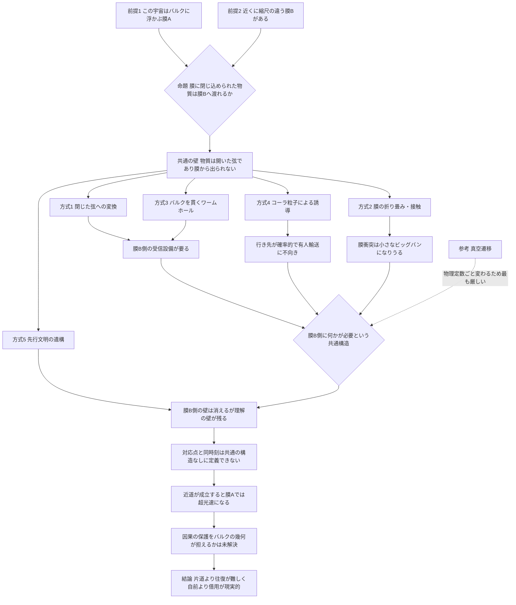

## 1. 概要 (Abstract)

ブレーンワールド理論では、私たちの宇宙は、より高い次元の空間（**バルク**）に浮かぶ3次元の膜（**ブレーン**）だと考える。電子やクォーク、光といった通常の物質とエネルギーは膜に貼りついて離れられず、重力だけが膜の外へ漏れ出せる。この枠組みでは、バルクの中にもう1枚の膜——隣のブレーン宇宙——がごく近くに浮かんでいても矛盾はない。

では、膜に閉じ込められた私たちは、隣の膜へ渡れるだろうか。もし渡れて、しかも隣の膜では空間の縮尺や形が違い、こちらで遠い2点があちらでは近いなら、「一時的に隣の宇宙へ移り、少しだけ進んで戻る」ことで、この宇宙の遥か遠くへ移動できることになる。ゲームのマインクラフトで、ネザーを1ブロック進むと元の世界で8ブロック進んだことになる、あの構造だ。

本記事は、この「ブレーン宇宙の移動」を**入口記事**として扱い、渡る手段を五つの方式で比較する。実現したとして何が変わるか（出口）は別記事に譲る。

> **前提①:** 私たちの宇宙は、バルクに浮かぶブレーンである（ブレーンワールド理論を字義どおりに受け取る）。
> **前提②:** バルクの中の近い距離に、隣のブレーンが存在する。隣のブレーンの空間の縮尺や形は、こちらと異なりうる。
> **命題:** 「膜に閉じ込められた物質を、隣のブレーンへ渡らせる手段はあるか。あるとすれば、どの方式が、どの壁に突き当たるか？」

比較する方式は次の五つと、参考の一つだ。

| # | 方式 | 一言でいうと |
|---|---|---|
| ① | 閉じた弦への変換 | 膜から出られる形に自分を作り変える |
| ② | 膜の折り畳み・接触 | 膜のほうを曲げて隣の膜にくっつける |
| ③ | バルクを貫くワームホール | 膜と膜をトンネルでつなぐ |
| ④ | 余剰次元への誘導 | 膜に縛られない架空粒子に運ばせる |
| ⑤ | 先行文明の遺構の借用 | 誰かが作った渡航機構を使わせてもらう |
| 参考 | 真空遷移 | 膜ではなく、泡宇宙の壁を越える |

---

## 2. 実現不可能性の根拠 (Infeasibility Rationale)

### 物理的限界

ブレーンワールド理論の核心は、「物質は膜から出られない」という閉じ込めそのものにある。超弦理論の言葉でいえば、電子やクォークは両端が膜（D-ブレーン）に固定された**開いた弦**であり、端が膜から離れることはできない。膜の外へ出られるのは、端を持たない輪の形の**閉じた弦**——重力を伝える重力子がその代表——だけだ。つまり「物質のまま隣の膜へ渡る」という行為は、この理論の前提と正面から衝突する。

加えて、余剰次元そのものがまだ見つかっていない。ねじれ秤による精密実験では、数十マイクロメートルの距離まで重力が通常の逆二乗則に従うことが確かめられており、余剰次元が大きく広がっている余地は狭まっている。LHCでも、重力子がバルクへ逃げ出す痕跡（衝突後にエネルギーが行方不明になる事象）は見つかっていない。隣のブレーンが実在するかどうか以前に、バルク自体が仮説の段階にある。

### 技術的限界

どの方式にも、途方もないエネルギーが要る。物質を閉じた弦に作り変えるには弦の性質が表に出るエネルギー（プランクスケール近く、あるいは大きな余剰次元を仮定しても現在の加速器の到達域を超える領域）が必要で、膜を曲げるには膜の張力に逆らう仕事が要る。そのうえ、バルクの中を観測する装置も、隣の膜の位置を測る手段もない。重力以外にバルクと相互作用する手段を持たない以上、行き先の偵察すらできない。

さらに見落とされがちなのが、**帰還**の問題だ。隣の膜に渡る技術があっても、向こう側に同じ技術や受け入れ設備がなければ戻ってこられない。片道の技術と往復の技術は別物と考えられる。

### 論理的限界

最も根本的な壁は、「隣の宇宙のどこへ出るのか」が定義できないことだ。こちらの膜の座標とあちらの膜の座標を対応づけるには、両者を結ぶ共通の構造——バルクの幾何そのもの——を知る必要がある。計算は対応関係を**見つける**手段であって、対応関係を**作る**ことはできない。同じ理由で、「こちらの時刻 t₁ に、あちらの同じ時刻へ渡る」という言い方も、共通の基準なしには意味を持たない。相対論では同じ宇宙の中ですら「同時」は観測者ごとに変わる（同時性の相対性）。

そして、この移動が近道として機能した瞬間、別の論理的矛盾が立ち上がる。この宇宙の中で見れば、光より速く遠方へ到達したことになるからだ。光より速い移動は、別の速度で動く観測者から見ると「到着が出発より前」になる場合を必ず含み、往復すれば自分の過去に戻れてしまう（[wiim_001](wiim_001.md)）。近道が成立すること自体が、因果律を守るための追加の仕組みを要求する。

---

## 3. 実験の設定 (Setup)

1. **主体:** 渡航者（有人船または観測機）。通常の物質でできており、出発時は私たちの膜（膜A）に閉じ込められている。
2. **環境:**
   - 膜A（この宇宙）と、バルクを挟んだ近い距離にある膜B（隣の宇宙）。
   - 膜Bでは空間の縮尺や曲がり方が膜Aと異なり、膜Aで遠い地点Pと地点Qに対応する膜B上の点どうしが近い、と仮定する。
   - バルクには重力だけが伝わる。
3. **操作:** 膜Aの地点Pから膜Bへ移り、膜Bの中を短く移動し、膜Aの地点Qに戻る。移る手段として方式①〜⑤を順に試す。参考として、泡宇宙の壁を越える真空遷移とも比較する。
4. **評価軸:**
   - 到達：膜Bに到達できるか
   - 制御：膜Bのどこに出るかを決められるか
   - 帰還：膜Aの狙った地点に戻れるか
   - 代償：膜A・膜B・バルクのどこに、何のツケが残るか
   - 因果：近道が因果律と衝突しないか

---

## 4. 考察と予測 (Speculation)

### 物理学での出発点——バルクは実際に近道になりうる

この思考実験は荒唐無稽な空想から始まるわけではない。2000年、ダニエル・チョンとキャサリン・フリーズは、膜が余剰次元の方向に曲がっている場合、バルクを横切る信号（重力波など）が、膜に沿って進む光より先に遠方へ届きうることを示した。膜の上の住人から見れば、重力の信号が光を追い越して届くように見える。

ここで重要なのは、バルクの中では光速を超えていないことだ。膜に沿う道が遠回りで、バルクを横切る道が近道だというだけであり、高次元の時空全体として因果律は保たれている。本記事の「隣の膜を経由する近道」は、この発想を、重力の信号から物質の移動へと拡張したものにあたる。

ただし、ここで経由するのは膜Bという**別の膜**であって、バルクそのものではない。重力の信号はバルクを自由に通れるが、物質はそうはいかない——それが以下の五つの方式が乗り越えようとする壁だ。

### 方式①　閉じた弦への変換——膜から出られる形に作り変える

開いた弦は膜から出られないが、閉じた弦は出られる。そして弦理論では、2本の開いた弦の端どうしがつながって閉じた弦になる過程が許されている。ならば、渡航者の物質をすべて閉じた弦に変換してバルクへ送り出し、膜Bで開いた弦に戻して組み直せばよい——これが方式①の発想だ。

この方式は、実質的に**物質を一度すべて重力子の群れに分解し、向こうで組み直す転送**になる。問題は三つある。

- **エネルギー:** 物質の静止質量をすべて閉じた弦のエネルギーに置き換えるうえ、変換そのものに弦の性質が表に出る極端に高いエネルギーが要る。
- **受信:** 重力子は物質とほとんど相互作用しない。膜Bで重力子の群れを捕まえ、元の構造に組み直すには、膜Bの側に受信・再構成の設備が必要になる。送り出す技術だけでは片道の「散逸」にすぎない。
- **同一性:** 分解と再構成を経た渡航者は、元の渡航者と同じ存在だと言えるのか。この問いは転送装置一般が抱える哲学的な問題でもある。

到達はバルクへの放出としてなら可能性があるが、制御と帰還が膜B側の設備に全面的に依存する方式と考えられる。

### 方式②　膜の折り畳み・接触——膜のほうを動かす

渡航者を膜から出せないなら、膜そのものを曲げて膜Bに接触させればよい。膜が局所的に膜Bへ触れた一点では、両者の境目がなくなり、物質が乗り移れるかもしれない。

この方式には、実在の宇宙論が強い警告を与えている。2001年に提唱されたエキピロティック宇宙論では、**2枚の膜の衝突こそがビッグバンだった**とされる。膜どうしがバルクの中で近づき、衝突した運動エネルギーが高温の放射に変わって、私たちの宇宙の熱い始まりになった、というシナリオだ。この描像を受け入れるなら、局所的な膜の接触は「小さなビッグバン」に相当する爆発的なエネルギー解放を引き起こしうる。

加えて、膜を曲げるには膜の張力に逆らう仕事が要り、その仕事の分だけ膜とバルクにエネルギーが蓄えられる。[wiim_130の補遺ノート](../notes/wiim_130_negoton_attraction_routes.md)の経路3（ネゴトン（g126）で膜を押し上げてバルクを介して引き合わせる）が指摘したとおり、膜を押し上げたエネルギーはバルク側のどこかに蓄積される。膜を曲げることは、問題を一次元上に移しているにすぎない。

到達の見込みはあっても、接触点の周囲が安全である保証はなく、兵器と区別できない方式だと言える。

### 方式③　バルクを貫くワームホール——膜と膜をトンネルでつなぐ

膜を曲げずに、膜Aの一点と膜Bの一点を、バルクを貫くトンネルで結ぶ方式だ。これは4次元のワームホール（g036）を、膜と膜の間に張り渡した高次元版にあたる。

制御の面では最も有利な方式に見える。トンネルの両端が固定されていれば、出口の位置は決まっており、同じトンネルを逆にたどれば帰還もできる。しかし、ワームホールの喉を開いたまま保つには、負のエネルギーを持つエキゾチック物質が要る——これは4次元の場合と変わらない。さらに、トンネルの入口は膜Aの上にあるが、出口は膜Bの上にある。**膜Bの側の出口をどう作るのか**という問題は、方式①の受信設備と同じ構造で残る。一度も行ったことのない場所に、トンネルの出口は掘れない。

最初の1本を開くには、何らかの方法で先に膜Bへ到達している必要があり、方式③は「2本目以降」の方式と考えられる。

### 方式④　余剰次元への誘導——膜に縛られない架空粒子に運ばせる

WIIMにはすでに、余剰次元を経路として使う架空粒子がある。コーラ粒子（g127）は「時間は経過するが空間を経由せずに別の場所へ出現する」粒子であり、[wiim_029](../physics/wiim_029.md)では、余剰次元の重力ポテンシャルの谷を宛先として誘導する通信方式が論じられた。

wiim_029自身が指摘しているように、コーラ粒子が膜に閉じ込められる粒子なのか、バルクを通れる粒子なのかは未定義だった。本記事では、コーラ粒子が**バルクを通れる**側に属すると仮定してみる。するとコーラ粒子は、膜Aから膜Bへ向かう唯一の「自然な」運び手になりうる。

しかし二つの壁が残る。第一に、コーラ粒子は出現先が確率的にしか定まらない。wiim_029の重力の谷による誘導は、膜Aの内部での宛先指定だった。膜Bの内部に宛先となる重力の谷があるかどうかは、こちらからは分からない。第二に、コーラ粒子が運べるのは粒子や情報であり、渡航者の身体を丸ごと運べるかは別の問題だ。膨大な数のコーラ粒子に、渡航者の構造を一貫性を保ったまま乗せる技術は、方式①の再構成問題と同じ壁に突き当たる。

方式④は、通信と偵察には向くが、有人の渡航には向かないと考えられる。逆に言えば、方式③の「最初の1本」を開く前の偵察手段として、他の方式を補う役割を担える。

### 方式⑤　先行文明の遺構の借用——誰かが作った機構を使う

ここまでの四つの方式は、どれも「膜Bの側に何かが必要」という同じ壁に突き当たった。受信設備、トンネルの出口、宛先となる重力の谷——いずれも、こちらから一方的には用意できない。

この壁を越える一つのシナリオが、**すでに両側に設備を持つ誰か**の存在だ。[宇宙の階層と文明の階梯](../notes/universe_hierarchy_civilization_ladder.md)の仮案でいえば、宇宙から宇宙へ渡る5型文明が、膜Aと膜Bの両側に渡航の機構を築いており、人類が偶然それを使えるようになる、という筋書きになる。SFでは、フレデリック・ポール『ゲイトウェイ』が、消えた異星種族の宇宙船を行き先も分からないまま使う人類を描いている。

この前提を置くと、不可能性の構造が一本の流れとして変わる。

- 機構が両側に建設済みである
- → 膜B側の設備という最大の技術的な壁が消える
- → 残るのは**理解の壁**になる。機構が内部に持つ対応表（膜Aのどこが膜Bのどこに対応するか）を、人類は試行錯誤で読み解くしかない
- → 因果の壁も、建設者がすでに解決しているなら、人類から見ると**理由の分からない使用制限**として現れるはずだ

到達・制御・帰還のすべてが機構に委ねられる代わりに、機構が止まる、仕様が変わる、そもそも罠である、といった依存の危険を引き受けることになる。技術的には最も「楽」な方式だが、利用者は仕組みを理解しないまま命を預けることになる。

この遺構の正体については、複数の膜をらせん状に巡ってワープと時間の遡行の両方を実現する機構（ブレーンヘリクス、[wiim_142](wiim_142.md)）とみなし、使用制限を「時間の輪を作る順番の封印」と読む一説を、補遺ノート「[ブレーンヘリクス遺構説](../notes/wiim_142_brane_helix_relic.md)」にまとめた。

### 参考　真空遷移——泡宇宙の壁を越える場合

ブレーンとは別の種類の「隣の宇宙」もある。永久インフレーションの描像では、宇宙は膨張し続ける偽の真空の中に浮かぶ泡の一つであり、隣には別の泡宇宙がある。[wiim_125](../physics/wiim_125.md)と[wiim_127](../physics/wiim_127.md)は、この泡の壁の性質を扱った。

真空遷移による移動は、ブレーン移動よりさらに厳しいと考えられる。泡と泡の間は光より速く膨張する偽の真空で隔てられており、つながっていても信号すら届かない。仮に壁を越えられたとしても、隣の泡では真空の状態が違い、物理定数の組み合わせ自体が異なりうる。渡航者の身体を作る原子が、向こう側で原子として成立する保証はない。ブレーン移動が「別の部屋へ移る」話だとすれば、真空遷移は「物理法則ごと別の家へ移る」話であり、同じ比較表に並べると壁の高さの違いがはっきりする。

### 五つの方式の比較

| 方式 | 到達 | 制御 | 帰還 | 主な代償・危険 |
|---|---|---|---|---|
| ① 閉じた弦への変換 | △ 放出は可能性あり | × 膜B側の受信設備に依存 | × 同上 | 静止質量すべてのエネルギー、同一性の問題 |
| ② 膜の折り畳み・接触 | △ | △ 接触点で決まる | △ | 膜衝突による爆発的なエネルギー解放 |
| ③ バルクを貫くワームホール | △ 2本目以降 | ○ 両端が固定 | ○ | エキゾチック物質、膜B側の出口の建設 |
| ④ 余剰次元への誘導 | ○ 粒子なら | × 確率的 | × | 有人の輸送には不向き、偵察向き |
| ⑤ 先行文明の遺構 | ○ | △ 対応表の解読次第 | △ | 理解できない機構への依存 |
| 参考 真空遷移 | × | × | × | 物理定数の違いで渡航者が存続できない |

### 全方式に共通する論点

**「余剰次元に消える」の代償.** どの方式でも、渡航者が膜Aを離れる間、その質量とエネルギーは膜Aから失われ、膜Bに突然現れる。高次元の時空全体ではエネルギーが保存されていても、膜Aの住人にとっては「エネルギーが消えた」ように見える。これはLHCが探している、重力子がバルクへ逃げる事象と同じ形だ。消えたエネルギーはバルクの重力場の乱れや、膜Bへの流入として必ずどこかに記録される。余剰次元へ逃がすことは、問題の完全な回避ではなく、帳尻を別の場所で合わせることにすぎない。

**縮尺の違う膜は、渡航者も作り変える.** 前提②では、膜Bの空間の縮尺が違うことを近道の条件にした。しかしランドール＝サンドラム型のブレーンワールドでは、バルクの曲がり方のせいで、2枚の膜の上では長さやエネルギーの基準そのものが大きく異なる。距離が縮んで見える膜は、そこにある物体の大きさや質量の基準も違う膜かもしれない。近道になるほど縮尺の違う膜は、渡航者の身体がそのままでは成立しない膜である可能性が高い——近道の条件と生存の条件が、同じ原因で衝突すると考えられる。

**時間と空間が揃って縮む限り、近道にならない.** さらに根本的な制約がある。最も単純なランドール＝サンドラム型（膜が平らで静止している場合）では、バルクの中で縮尺が変わるとき、空間だけでなく時間も同じ割合で変わる。前提の連鎖で示すと次のようになる。

- 膜Bでは空間が縮み、道のりが短くなる
- → しかし時間も同じ割合で縮むので、そこを進む光の速さも、膜Aから見て同じ割合で遅くなる
- → 差し引きで得るものがない。これは「ある夜、宇宙のすべてが2倍になっても誰も気付けない」というポアンカレの思考実験と同じ構造で、すべての比が保たれる変換は、物理的には何も変えない
- → さらに、膜Aから出て戻るまでの余剰次元方向の往復の道のりが加わるので、膜Aの上をまっすぐ進むより**遅くなる**

近道が生まれるのは、**空間が時間より大きく縮む**場合に限られる。チョンとフリーズの近道も、時間と空間の歪み方が食い違う「非対称に歪んだ」バルクで成り立つものだった。一般相対性理論では、ふつうの物質のまわりで時間の歪みと空間の歪みは同じ大きさで結びついており、この食い違いは自然には生じにくい。ガオとウォルドは2000年、負のエネルギーを持たないふつうの物質だけでできたある種の時空では、内部を通る経路が境界に沿う経路より早く着くことはないと証明している。近道を一般的に作ろうとすれば、方式③のワームホールと同じく、エキゾチック物質を必要とする方向に話が戻ってくると考えられる。

観測もこの見方と矛盾しない。2017年の中性子星合体GW170817では、約1億3千万光年を旅した重力波とガンマ線がわずか1.7秒差で届いた（ガンマ線の遅れは爆発での放出の遅れと考えられている）。重力波だけがバルクを通って近道していれば、もっと大きく先行したはずだ。少なくとも私たちの近くでは、膜は大きな近道を許すようには曲がっていないことになる。前提②の「縮尺の違う膜B」は、縮尺が違うだけでは足りず、**時間と空間で縮尺の違い方が食い違っている膜**でなければならない。

**多世界の枝は近道にならない.** 「隣の宇宙」と聞くと量子力学の多世界解釈を思い浮かべるかもしれない。しかし多世界の枝は、同じ時空を共有したまま状態だけが分かれたものであり、空間の縮尺が違う別の膜ではない。仮に別の枝へ移れたとしても、同じ場所の別の歴史に出るだけで、空間的な近道にはならない。

### 因果律は膜の外への接続まで制限するか

**公理を変えると定理は崩れる.** ユークリッド幾何学の「三角形の内角の和は180度」は、平行線の公理から導かれる定理だ。19世紀にこの公理を取り替えると、内角の和が180度にならない双曲幾何学や球面幾何学が、矛盾なく成立した。崩れたのは定理であって、定理を導く論理ではない。

相対論で「原因は結果より前にある」を時空全体で保証しているのも、時空についての前提——時間の向きが全体で揃っている、位相が単純である、など——から導かれる定理だと言える。前提を変えれば、この定理も崩れる。実際、一般相対論には光円錐が倒れ込んで一周し、時間の輪ができる解（ゲーデルの回転宇宙など）が存在する。ただし数学と違い、物理学では図の歪み方がそこにある物質とエネルギーで決まるため、光円錐をそこまで倒すにはほとんどの場合エキゾチック物質（[wiim_023](../physics/wiim_023.md)）が要る。図を歪める自由は、エネルギーという代金で買うものだ。

**因果律には三つの層がある.** 膜の外への接続を考えるとき、「因果律」は次の三つに分けて扱う必要がある。

| 層 | 内容 | 膜の外への接続を制限するか |
|---|---|---|
| 幾何学的な因果 | 影響は光円錐の内側にしか伝わらない | 一つの時空の内部の規則。膜Aと膜Bがバルクを通して一つの時空につながっていれば、高次元の光円錐が代わりに制限する。時空として書けない接続には及ばない |
| 熱力学的な時間の矢 | エントロピーが増える向きが「未来」 | 膜ごとに向きが異なりうる |
| 論理的な整合性 | 同じ事象が「起きた」と「起きなかった」を同時に満たせない | 物理法則ではなく論理の要請なので、接続の形に関係なく及ぶ |

チョンとフリーズの近道が因果の矛盾を生まないのは、高次元の時空全体で見れば光速を超えていないからだった。これは幾何学的な因果が消えたのではなく、一段上の時空へ移ったことを意味する。

では接続が時空の経路として書けない場合——方式⑤の遺構が途中の経路なしに「飛ばす」場合——はどうか。このときも、出発という事象と到着という事象の間には「出発が到着の原因である」という関係が必ず生まれる。膜Aの内部の順序、膜Bの内部の順序、機構が作る「出発から到着へ」の矢印をすべてつないだ関係図のどこかに、一周して元に戻る輪ができれば、親殺しのパラドックスが起きる。問題になるのは時空の位相ではなく、この関係図に輪ができるかどうかだ。これは、時空よりも事象の順序関係を根本に置く因果集合理論（[wiim_118](wiim_118.md)）の見方にあたる。

**共通の時刻があれば輪は作れない.** ホーキングは、時空全体で矛盾なく増え続ける時刻（時間関数）を定義できれば、その時空は因果の輪を持たないことを示した（安定因果性）。これを関係図に当てはめれば、膜A・膜B・移動の矢印のすべてに共通の時刻を割り振れ、機構が常にその時刻の未来にしか運ばない限り、膜Aから見て光より速い移動でも往復で自分の過去に戻ることはできない。共通の時刻の候補は、バルクの時間や「膜に対して静止した基準系」だ。代償として、この移動手段は膜Aの物理から見て特別な基準系を持つ、つまりローレンツ不変性を破るものになる。

**ただし、因果は膜ごとに異なりうる.** ここで前提を一つ外す必要がある。各膜の時空の性質は、バルクの中での膜の置かれ方から決まる。膜Bの光速が膜Aと違うかもしれず（非対称に歪んだバルクでは、重力がバルクを伝わる速さと膜の上の光速が食い違いうるという提案がある）、膜Bの時間の矢が膜Aと逆向きかもしれない。私たちが「因果」と呼んでいるものは、膜Aの光円錐と時間の矢に結びついた、膜Aの内部の規則にすぎない。

「前」の意味が膜ごとに違えば、共通の時刻は作れるとは限らない。特に膜Bの時間の向きが逆なら、膜Bへ渡り、膜Bにとっての未来（膜Aから見て過去の向き）へ進んでから戻ると、出発より前に着く経路が生じうる。因果が共通でないことは、制約が外れる自由ではなく、輪ができる経路を増やす危険として働く。そのとき最後まで残るのは論理的な整合性だけであり、機構はノヴィコフの自己無矛盾原理（矛盾しない歴史しか実現しない）か、ドイッチュのモデル（輪が閉じるように見えるとき、実際には別の歴史の枝に到着する）のどちらかの形で整合性を保つしかないと考えられる。

**局所ではいつもふつうの因果.** 球面の上でも、ごく小さな三角形の内角の和はほぼ180度になる。同じように、どれほど歪んだ時空でも、ごく狭い範囲ではふつうの相対論の因果が成り立つ（等価原理）。渡航者の身の回りでは、原因はいつも結果より前に来る。矛盾が現れるのは、膜Aと膜Bを貼り合わせた図の全体を見たときだけだ。渡航者は、自分の周りで何の異常も感じないまま、全体としては因果の輪に巻き込まれうる。

### WIIMの既存の移動方式との位置づけ

| 方式 | 何を操作するか | 経由する空間 |
|---|---|---|
| アルクビエレドライブ（g035） | この宇宙の空間を縮めたり伸ばしたりする | この宇宙 |
| ワームホール（g036） | この宇宙の2点をトンネルで結ぶ | この宇宙の中のトンネル |
| コーラ粒子（g127） | 空間を経由せずに出現する | 経由しない |
| ブレーン移動（本記事） | 別の膜を経由して近道する | 隣の宇宙 |

ブレーン移動の特徴は、「この宇宙の空間には一切手を加えない」点にある。アルクビエレドライブのように空間を歪めるための負のエネルギーも、ワームホールのようにこの宇宙の中にトンネルを保つ負のエネルギーも、原理的には要らない。その代わりに、隣の宇宙という**自分では管理できない空間**に依存する。自前の空間を歪める方式から、他人の空間を借りる方式への転換だと言える。

### 哲学的な問い

もし方式⑤の筋書きのように、宇宙の間を渡る機構がすでにあり、人類がそれを偶然使えるのだとしたら、私たちが夜空に異星文明を見つけられない理由（フェルミのパラドックス、g037）にも別の答えが生まれる。進んだ文明は、この宇宙の空間を光速以下で旅する必要がなく、隣の膜を経由して移動しているため、私たちの空間にはほとんど姿を現さない——という答えだ。宇宙が静かに見えるのは空っぽだからではなく、交通がすべて「上の階」を通っているからなのかもしれない。

---

## 5. 図解 (Diagrams)

---

## 6. 関連記事 (Related)

- [wiim_029](../physics/wiim_029.md) — コーラ粒子通信（余剰次元の重力の谷による誘導。方式④の土台）
- [wiim_013](../physics/wiim_013.md) — コーラ粒子の初出
- [wiim_130の補遺ノート](../notes/wiim_130_negoton_attraction_routes.md) — ネゴトン間引力化の4つの経路（経路3のブレーンワールド膜とバルクへの代償の蓄積）
- [宇宙の階層と文明の階梯](../notes/universe_hierarchy_civilization_ladder.md) — 5型文明と宇宙同士のつながり（方式⑤の土台）
- [wiim_125](../physics/wiim_125.md) — 真空崩壊を実験できるか（参考の真空遷移）
- [wiim_127](../physics/wiim_127.md) — 真空崩壊泡は静止できるか（泡の壁の性質）
- [wiim_027](../physics/wiim_027.md) — ワープゲート（この宇宙の中の近道との比較）
- [wiim_079](wiim_079.md) — ギャラクシードライブ（この宇宙の空間を使う超光速航法との比較）
- [wiim_001](wiim_001.md) — 光速を超えた場合の因果律
- [wiim_118](wiim_118.md) — 光速突破は時空を"破断"させるか
- [wiim_137](wiim_137.md) — 膜の外への避難（本記事の出口記事。真空崩壊からブレーン移動で逃げられるか）
- （未作成）ブレーン移動が実現した世界——上の階を通る交通と、静かな夜空

**関連用語（用語集）**
- 余剰次元 (g255)
- 超弦理論 (g093)
- コーラ粒子 (g127)
- ネゴトン (g126)
- ワームホール (g036)
- ワープドライブ / アルクビエレドライブ (g035)
- FTL航法 (g045)
- パラレルワールド (g142)
- マルチバース (g143)
- 世界線 (g519)
- フェルミのパラドックス (g037)
