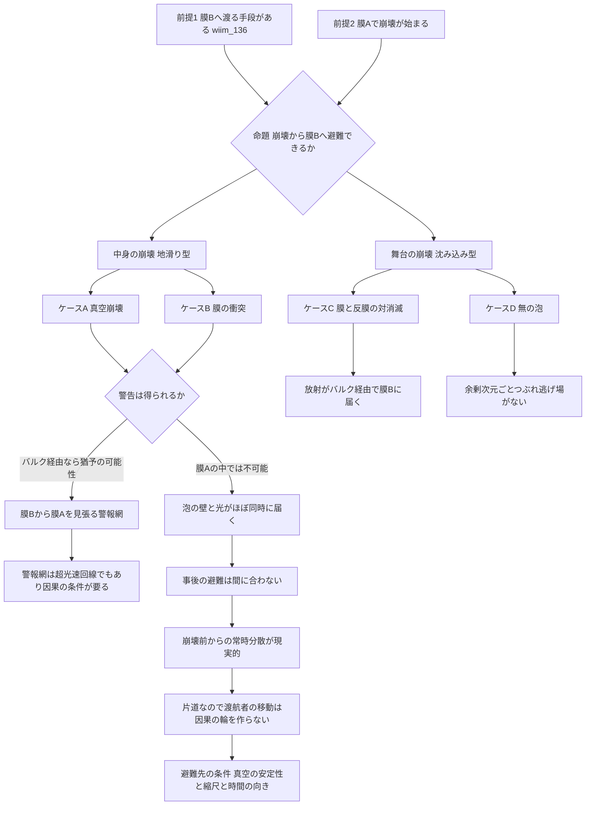

## 1. 概要 (Abstract)

[wiim_136](wiim_136.md)は、私たちの宇宙を高次元空間（バルク）に浮かぶ膜（ブレーン）とみなし、隣の膜を経由して移動できるかを五つの方式で検討した入口記事だった。本記事はその出口にあたる。移動の手段があるとして、それが最も切実に必要とされる場面——**宇宙そのものが崩壊しはじめたとき**——に、膜の外へ避難できるかを問う。

「宇宙の崩壊」という言葉は、実はいくつかの異なる現象をひとまとめにしている。地球にたとえるなら、地滑りで町が埋まってもプレートは残るが、沈み込み帯ではプレートそのものが消えていく。ブレーン宇宙の崩壊も同じように、膜の上の**中身**が壊れる型と、膜という**舞台**ごと壊れる型に分けられる。どちらの型かによって、避難できるかどうかは大きく変わると考えられる。

> **前提①:** wiim_136の方式③（バルクを貫くワームホール）または方式⑤（先行文明の遺構）により、膜Aから膜Bへ渡る手段がある。
> **前提②:** 膜A（この宇宙）のどこかで、宇宙の崩壊が始まった。
> **命題:** 「崩壊に飲まれる前に膜Bへ避難できるか。できるとすれば、どの型の崩壊までなら逃げられるか？」

---

## 2. 実現不可能性の根拠 (Infeasibility Rationale)

### 物理的限界

真空崩壊の泡は、生まれるとすぐに光速近くまで加速して広がると考えられている。泡の誕生を知らせる光は、泡の壁とほぼ同時にしか届かない。つまり膜Aの中にいる限り、**事前の警告は原理的に得られない**。見えたときには、もう飲み込まれている。

さらに、崩壊が膜の上の場だけで起きるのか、余剰次元の大きさそのものを変えてバルクまで巻き込むのかは、崩壊を起こす場がどこに住んでいるかで決まる。前者なら膜Bは無事かもしれないが、後者なら避難先ごと壊れる。私たちはこの区別を判定できるほど、余剰次元の物理を知らない。

### 技術的限界

仮に警告が得られても、避難できる量には限りがある。ワームホールの喉の太さや遺構の処理能力で、文明全体の人口と資産を運びきれるとは考えにくい。そのうえ、wiim_136で見たとおり、縮尺の違う膜Bでは渡航者の身体がそのまま成立しない可能性がある。避難先が「存在する」ことと「住める」ことは別の問題だ。

### 論理的限界

崩壊を検知する装置は、膜Aに置く限り崩壊そのものに飲まれる。観測装置が観測対象に含まれてしまうため、「崩壊を観測してから知らせる」という手順が膜Aの内部では完結しない。

また、警告に意味を持たせるには、泡より先に——つまり膜Aから見て光より先に——届く信号が要る。これは膜Aの中の超光速通信にほかならず、wiim_136で論じた因果律の問題をそのまま抱え込む。

---

## 3. 実験の設定 (Setup)

1. **主体:** 膜Aの文明（避難する側）と、膜B上の避難先。
2. **崩壊の四つのケース:**
   - **ケースA 真空崩壊（地滑り型）:** 膜の上の場が、より安定な状態へ移る。膜は残る。
   - **ケースB 膜の衝突（造山型）:** 膜Aが別の膜と衝突し、中身が高温の状態にリセットされる。膜は残る。
   - **ケースC 膜と反膜の対消滅（沈み込み型）:** 膜そのものが消え、エネルギーがバルクへ放射される。
   - **ケースD 無の泡:** 余剰次元がつぶれ、空間そのものが終わる領域が広がる。
3. **操作:** 崩壊の開始を検知し、膜Bへ移動する。
4. **評価軸:** 警告を受け取れるか、避難が間に合うか、避難先で存続できるか、帰還が必要か。

---

## 4. 考察と予測 (Speculation)

### 崩壊の型——地滑りと沈み込み

ブレーンワールドでは、宇宙を二つの層に分けて考えられる。膜そのもの（**舞台**）と、膜の上の場の状態——真空の種類、物理定数、そこにある物質——（**中身**）だ。

| 地球 | ブレーン宇宙 | 壊れる層 | 膜は残るか |
|---|---|---|---|
| 地滑り・地震 | 真空崩壊（ケースA） | 中身 | 残る |
| プレート同士の衝突・造山運動 | 膜の衝突（ケースB） | 中身がリセットされる | 残る |
| 沈み込み帯でのプレートの消滅 | 膜と反膜の対消滅（ケースC） | 舞台 | 消える |
| 地殻に穴が開き、地面そのものがなくなる | 無の泡（ケースD） | 時空そのもの | 穴の部分で消える |
| 海嶺でのプレートの誕生 | 膜の対生成 | — | 新しく生まれる |

**ケースA.** [wiim_125](../physics/wiim_125.md)や[wiim_014](../physics/wiim_014.md)で扱った真空崩壊は、膜の上の場の状態が書き換わる現象だ。現在の測定値から、ヒッグス場の真空は完全には安定でない（準安定）可能性が指摘されているが、その寿命は宇宙年齢をはるかに超えると見積もられている。物理定数が変わるため住人にとっては世界の終わりだが、膜という舞台は残る。

**ケースB.** エキピロティック宇宙論（g522）やその発展版のサイクリック宇宙論では、2枚の膜が衝突して跳ね返り、再び離れていく。衝突のたびに中身は高温の状態にリセットされ、それが新しいビッグバンにあたる。膜は何度衝突しても存在し続ける。プレートが衝突して山脈をつくりながら、プレートとしては残り続けるのに近い。

**ケースC.** 超弦理論の膜（D-ブレーン、g521）には向きが逆の反膜があり、両者が出会うと対消滅して膜そのものが消えると考えられている。膜が持っていたエネルギーは閉じた弦——重力子などの放射——としてバルクへ散っていく。ブレーンインフレーションと呼ばれる宇宙論のモデルでは、膜と反膜の対消滅が宇宙初期のインフレーションを終わらせたとされ、私たちの膜はその「生き残り」かもしれない。

**ケースD.** 1982年にウィッテンは、余剰次元を持つ時空が「無の泡」（g520）へ崩壊しうることを示した。泡の内側では余剰次元がつぶれ、空間そのものが終わっている。泡は光速近くで広がり、通過したところでは中身だけでなく舞台も消える。

### 避難の可能性はケースによって分かれる

| ケース | 膜Bは無事か | 避難の見込み |
|---|---|---|
| A 真空崩壊 | 崩壊が膜Aの上の場に限られれば無事 | 警告と移動手段があれば見込みがある |
| B 膜の衝突 | 衝突相手が膜Bでなければ無事 | 同上。ただし衝突相手が膜Bなら避難先そのものが衝突の当事者になる |
| C 対消滅 | 放射がバルクを通って膜Bに届く | 膜Bが放射に耐えられるかに依存する |
| D 無の泡 | 余剰次元ごとつぶれるならバルクも膜Bも巻き込まれる | 逃げ場がない可能性が高い |

地滑り型の崩壊からは、膜の外へ逃げられる余地がある。沈み込み型、とくに無の泡からは、膜の外も安全ではない。避難先を「別の膜」に求める発想は、舞台が残る崩壊にしか効かないと考えられる。

### バルク経由の早期警報網

膜Aの中では、崩壊の警告は原理的に得られなかった。しかしwiim_136で見たように、チョンとフリーズは、膜が余剰次元の方向に曲がっていれば、バルクを横切る重力の信号が膜に沿う光より先に届きうることを示している。ここに唯一の抜け道がある。

崩壊の泡が生まれた地点の近くで、その重力的な乱れをバルク経由で送り出せれば、泡の壁が膜に沿って到達するより前に、警告を受け取れるかもしれない。得られる猶予は、膜に沿った道のりとバルクを横切る道のりの差で決まる。

さらに、検知装置の置き場所を変えることで、論理的限界の一つを回避できる。膜Aに置いた装置は崩壊に飲まれるが、**膜Bの側から膜Aを見張る装置**は飲まれない。自分の宇宙の崩壊を、隣の宇宙から観測するという構図だ。

ただし、この警報網は一般的な超光速通信の回線でもある。膜Aから見て光より速く届く信号を自由に送れるなら、往復の組み合わせで因果の輪を閉じる余地が残る。警報網が因果の矛盾を生まないためには、wiim_136で論じた条件——膜をまたぐ共通の時刻があり、信号がその未来にしか届かないこと——が必要になる。

### 片道の避難は因果を救う

一方、避難という用途には、wiim_136の最大の論理的な壁を消す性質がある。前提の変化を一本の連鎖で示すと次のようになる。

- 避難は片道である
- → 戻る先の膜A（少なくともその中身）は、すでに崩壊している
- → 往復が存在しないので、渡航者の移動によって因果の輪を閉じる経路がない
- → 膜Aから見て光より速い移動であっても、避難という用途に限っては、因果の矛盾を心配する必要がない

wiim_136が指摘したとおり、超光速の近道が危険なのは往復できるからだった。帰る場所が消えることで、その危険も一緒に消える。皮肉なことに、宇宙の崩壊こそが、超光速移動を因果的に最も安全に使える場面だということになる。ただしこれは渡航者の移動に限った話であり、上で見た警報網の信号には当てはまらない。

### 避難は事後ではなく、常時の分散になる

警告の猶予がごく短いか、まったく得られない以上、崩壊が始まってから大量に避難することは現実的でない。避難が意味を持つとすれば、それは**崩壊より前から、文明の一部を膜Bに常駐させておく**という形になると考えられる。避難は非常口ではなく、保険としての分散だ。

この考え方は、地球の文明が災害や小惑星の衝突に備えて他の惑星に拠点を持つべきだという議論と同じ構造を持つ。違いは、分散先が同じ宇宙の中の別の惑星ではなく、別の宇宙だという点にある。

### 避難先の因果が違うとき

wiim_136で論じたとおり、因果の規則は膜ごとに異なりうる。膜Bの時間の矢が膜Aと逆向きなら、避難民は向こうで「時間の向きが逆の物質」になる。物理学者シュルマンは、時間の矢が逆向きの二つの系は、相互作用が十分弱い場合に限って共存できると論じた。避難民が膜Bの物質と強く触れ合えば、避難民か周囲のどちらかの時間の矢が崩れる危険がある。避難先の選定には、真空の安定性と縮尺に加えて、時間の向きが揃っていることも条件に入ると考えられる。

### 哲学的な問い

ケースAやBでは、膜という舞台は崩壊後も存続する。しかし中身が総入れ替えされた膜を、「同じ宇宙」と呼べるだろうか。住人にとっての死は、舞台が消える前、中身が書き換わった時点ですでに訪れている。逆に、膜Bへ避難して生き延びた文明は、舞台を失っても自分たちの宇宙の続きを生きていると言えるのか。宇宙の同一性を舞台に置くか中身に置くかで、「宇宙が滅んだ」という言葉の意味そのものが変わる。

---

## 5. 数式による表現 (Mathematical Notation)

バルク経由の早期警報で得られる猶予は、次のように表せる。

$$
\Delta t = \frac{L_{\text{膜}} - L_{\text{バルク}}}{c}
$$

$L_{\text{膜}}$ は崩壊の地点から避難者までの膜に沿った道のり、$L_{\text{バルク}}$ はバルクを横切る道のり、$c$ は光速である（泡の壁は光速近くで進むと近似している）。膜が余剰次元の方向に大きく曲がっていなければ二つの道のりはほぼ等しく、猶予はほとんど得られない。早期警報が役に立つかどうかは、膜の曲がり方という、私たちがまだ測れていない量に委ねられている。

---

## 6. 図解 (Diagrams)

---

## 7. 関連記事 (Related)

- [wiim_136](wiim_136.md) — ブレーン宇宙の移動（本記事の入口記事。移動の五つの方式と因果律の三つの層）
- [wiim_125](../physics/wiim_125.md) — 真空崩壊を実験できるか（ケースAの物理的基盤）
- [wiim_127](../physics/wiim_127.md) — 真空崩壊泡は静止できるか（泡の壁の性質）
- [wiim_014](../physics/wiim_014.md) — 宇宙のルート権限を奪取せよ（真空崩壊の初出）
- [wiim_015](../physics/wiim_015.md) — エントロピーが減少する宇宙（逆向きの時間の矢）
- [wiim_126](wiim_126.md) — 時空は生きているか（泡宇宙の死と誕生は同じ現象の裏表）
- [宇宙の階層と文明の階梯](../notes/universe_hierarchy_civilization_ladder.md) — 宇宙の外へ渡る文明の階梯
- （未作成）ブレーン移動が実現した世界——上の階を通る交通と、静かな夜空

**関連用語（用語集）**
- 真空崩壊 (g012)
- 余剰次元 (g255)
- 無の泡 (g520)
- D-ブレーン (g521)
- エキピロティック宇宙論 (g522)
- 超弦理論 (g093)
- 世界線 (g519)
