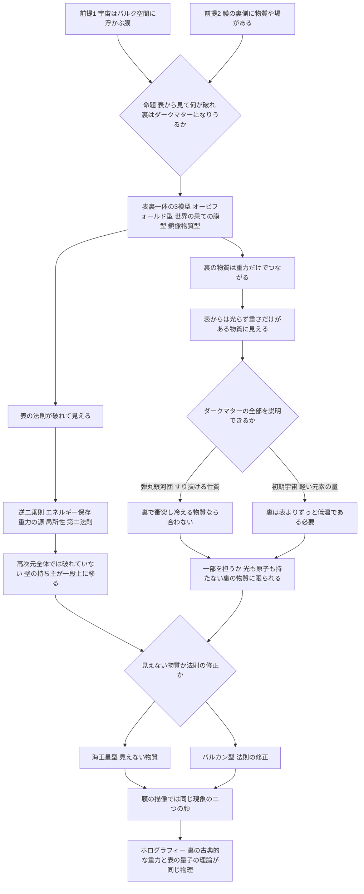

## 1. 概要 (Abstract)

[wiim_136](wiim_136.md)と[wiim_137](wiim_137.md)は、私たちの宇宙を高次元空間（バルク空間、g524）に浮かぶ膜とみなすブレーンワールド（g523）の描像のもとで、隣の膜への移動と、崩壊からの避難を論じた。そこでは膜を「こちら側」と「隣の膜」という二つの場所として扱ってきた。

本記事は視点を一つずらし、膜の**裏側**を問う。膜には表と裏があり、裏側にも何かが存在して、表と重力などを通してわずかに相互作用しているとしたら、表の住人である私たちには何が見えるだろうか。

直感的には、表の住人が表の中だけで組み立てた物理法則——重力の逆二乗則、エネルギー保存、光速の上限、熱力学第二法則——は、裏との相互作用によって「破れて」見えるはずだ。そして、裏側にある物質は光では見えず重さだけを及ぼすため、表からはダークマター（g056）のように見えるかもしれない。

> **前提①:** 私たちの宇宙はバルク空間に浮かぶ膜であり、膜には表と裏がある。
> **前提②:** 裏側には物質や場が存在し、表とは主に重力を通して相互作用する。
> **命題:** 「表の住人から見て、どの物理法則が破れて見えるか。その破れは本当の破れなのか。そして、裏側の世界はダークマターの正体になりうるか？」

---

## 2. 実現不可能性の根拠 (Infeasibility Rationale)

### 物理的限界

裏側の世界が表と重力でしかつながらないなら、電磁気力に頼る私たちの観測装置——望遠鏡も検出器も——は、裏側を直接見ることができない。重力は四つの力のなかで桁違いに弱く、裏側の物質の重力を個別に捉えられるのは、銀河や銀河団のような巨大な集まりになったときだけだ。

さらに、裏側の世界の候補にはすでに観測上の制約がかかっている。裏側に私たちと同じような粒子と光があるなら、その光（裏側の放射）も初期宇宙の膨張の速さに影響し、軽い元素が作られた量の観測と合わなくなる。これを避けるには、裏側の世界が表よりずっと低温で生まれた、などの追加の条件が要る。

### 技術的限界

表から見て法則が破れる兆候は、どれも極端に小さいか、極端に遠い。重力の逆二乗則のずれを探すねじれ秤の実験は、数十マイクロメートルまで逆二乗則が保たれていることを確かめたにとどまる。加速器で重力子がバルク空間へ逃げる事象を探す試みも、まだ痕跡を見つけていない。裏側へ装置を送り込む手段は、[wiim_136](wiim_136.md)で見たとおり一つも確立していない。

### 論理的限界

最も根本的な壁は、表の中だけのデータから「法則が破れている」のか「見えない何かがある」のかを区別できないことだ。同じ観測事実が、隠れた物質の存在としても、法則そのものの修正としても説明できてしまう。これは科学哲学で**過少決定**と呼ばれる問題であり、表の住人は、裏側の存在を仮定しても仮定しなくても、観測と矛盾しない理論を組み立てられる。表だけの記述は、原理的に不完全なまま閉じてしまう可能性がある。

---

## 3. 実験の設定 (Setup)

1. **主体:** 表の住人（私たち）。電磁気力に基づく観測装置と、重力の精密測定の手段を持つ。
2. **環境:** 表と裏を持つ膜。裏側の構造として次の三つの模型を比較する。
   - **模型A オービフォールド型:** 膜の両側のバルク空間が鏡写しとして同一視されている（ランドール＝サンドラム型）。
   - **模型B 世界の果ての膜型:** 高次元空間の両端に2枚の膜があり、片方が表の世界、もう片方が重力でしかつながらない隠れた世界（ホジャヴァ＝ウィッテン模型）。
   - **模型C 鏡像物質型:** 私たちと同じ構造の粒子を持つ裏の世界が、同じ場所に重なっている。
3. **操作:** 表の中だけで物理法則を組み立て、観測と照合する。
4. **検証する項目:** 逆二乗則、エネルギー保存、重力の源、局所性と光速の上限、熱力学第二法則、ダークマターの観測事実。

---

## 4. 考察と予測 (Speculation)

### 物理学にある「表裏一体の膜」

「膜の裏側」は空想だけの概念ではない。

| 模型 | 表と裏の関係 | 裏側にあるもの |
|---|---|---|
| A オービフォールド型 | 膜の両側のバルク空間が鏡写しとして同一視される。文字どおりの表裏一体 | 表と同じバルク空間の鏡像 |
| B 世界の果ての膜型 | 1996年にホジャヴァとウィッテンが示した、11次元の空間の両端に膜が置かれる構造 | 重力でしかつながらない「隠れた世界」 |
| C 鏡像物質型 | 1956年にリーとヤンがパリティ（左右対称性）を回復するために考えた鏡像の粒子。その後、私たちとは主に重力でしか相互作用しないことが指摘された | 私たちと同じ構造の「鏡像の世界」 |

模型Aには、見逃せない副産物がある。膜の両側を鏡写しとして同一視する操作は、膜の上の粒子に「左右の区別」（カイラリティ）を生み出す仕組みとしても使われる。私たちの世界で弱い力が左右非対称であることを、この表裏一体の構造から説明しようとする模型がある。表と裏が一体であることが、表の物理法則の形そのものを決めているのかもしれない。

### 表から見ると破れる法則

表の住人が表の中だけの物理で記述しようとすると、次のような「破れ」が観測されうる。

| 表の法則 | 裏との相互作用で起きること | 現状 |
|---|---|---|
| 重力の逆二乗則 | 余剰次元の大きさより短い距離では、重力が裏側へも広がるため、逆二乗より急に強くなる | ねじれ秤の実験で探索中。数十マイクロメートルまでは破れは見つかっていない |
| エネルギー保存 | 裏やバルク空間へ漏れたエネルギーは、表では「消えた」ように見える | 加速器での探索対象（衝突後にエネルギーが行方不明になる事象） |
| 重力の源は物質である | バルク空間の歪みが、表では物質のない場所に生じるエネルギーのように見える | ブレーン宇宙論の有効方程式に「暗黒放射」と呼ばれる項として実際に現れる |
| 局所性と光速の上限 | 表で遠い2点が、裏を通すと近い | チョンとフリーズによる理論的な提案（wiim_136） |
| 熱力学第二法則 | エントロピーを裏へ流せば、表では減少しているように見える | 裏側で必ずエントロピーが増えており、全体では破れていない |

ここで重要なのは、どの破れも**高次元全体で見ると破れていない**ことだ。エネルギーは裏へ移っただけであり、光速は高次元でも守られ、エントロピーは全体として増えている。余剰次元や裏側へ何かを逃がすことは、問題を消すことではなく、帳尻を裏側で合わせることにあたる。

wiim_136で用いたユークリッド幾何学の類比でいえば、破れるのは表の中だけで導いた「定理」であって、高次元の法則という「公理」の側ではない。表の法則の壁は壊れるのではなく、**壁の持ち主が一段上の次元に移る**だけだと考えられる。

### 裏側の世界は、表からはダークマターに見える

裏側の物質が重力でしか表とつながらないなら、表からは「光らないのに重さだけがある物質」に見える。これはダークマターの観測上の性質そのものだ。

- 銀河の外側の星が、見えている物質から予想されるより速く回っている
- 銀河団の重力レンズが、見えている物質より多くの質量を示す
- 宇宙の大規模構造が、見えている物質だけでは説明できない速さで成長した

裏側に物質の塊があれば、その重力は表の銀河の回転を速め、光を曲げ、構造の成長を助ける。表の天文学者は、それを「見えない物質」として記録するだろう。

ただし、裏側の世界がダークマターのすべてを説明できるかについては、強い制約がある。

- **衝突しない性質:** 2006年に観測された弾丸銀河団では、二つの銀河団が衝突した際、ダークマターはほとんど互いにぶつからずにすり抜けたことが示された。鏡像物質のように裏側で光や原子を持つ世界なら、裏側の物質どうしは衝突し、熱を放って縮み、円盤や裏側の恒星を作るはずだ。これはすり抜けるダークマターの振る舞いと合わない。
- **初期宇宙の制約:** 裏側に光があれば、上で見たように軽い元素の量の観測と合わせるため、裏側の世界は表よりずっと低温でなければならない。

このため、裏側の世界が存在するとしても、ダークマターの全部ではなく一部を担う、あるいは裏側では光や原子を持たない物質だけが重力を及ぼしている、という形に限られると考えられる。

### 海王星とバルカン——見えない物質か、法則の修正か

表の住人が直面する論理的な壁——法則の破れか、見えない物質か——は、天文学がすでに二度経験した問いでもある。

19世紀、天王星の軌道がニュートンの法則の予想からずれていることが分かった。ルヴェリエはこれを未知の惑星の重力と考え、1846年に海王星が予言どおりの位置で発見された。**見えない物質**が正解だった。

同じルヴェリエは、水星の軌道のずれも未知の惑星「バルカン」で説明しようとした。しかしバルカンは見つからず、1915年にアインシュタインの一般相対論が、ニュートンの法則そのものを修正することで水星のずれを説明した。**法則の修正**が正解だった。

ダークマターをめぐる現在の状況は、この二つの間にある。見えない粒子を探す立場と、重力の法則を修正する立場（銀河の外側で重力の振る舞いが変わるとするMONDなど）が並立している。

ブレーンワールドの描像が興味深いのは、この二択を一つに溶かす点だ。裏側の物質は「見えない物質」であり、同時にその影響は「高次元の重力の法則」を通して表に届く。海王星とバルカンの両方が正解でありうる——表から見れば、見えない物質と法則の修正は同じ現象の二つの顔にすぎないのかもしれない。

### 最も深い表裏一体——ホログラフィー

表と裏の関係を最も徹底した形で推し進めたのが、ホログラフィック原理（g151）の具体例であるAdS/CFT対応だ。1997年にマルダセナが提案したこの対応では、次の二つが同じ物理を別の側から記述したものだとされる。

- **裏（内側の高次元時空）:** 重力を含む理論。条件によっては古典的な重力として扱える。
- **表（その境界）:** 重力を含まない、強く相互作用する量子の理論。

裏で古典的な重力の計算をすると、それが表の強い量子効果の答えになる。ブレーンワールドの一種（ランドール＝サンドラム第2模型）も、この対応を使って「4次元の重力と量子の場を組み合わせた理論」と読み替えられることが知られている。さらにER=EPR予想（g322）は、表の量子もつれが、裏ではワームホールのような幾何学的なつながりにあたると主張する。

この見方では、表と裏を行き来する法則は古典物理の壁を「破る」というより、古典（幾何学・重力）と量子（もつれ・場）を互いに翻訳する辞書として働く。表で古典物理の壁に見えるものが、裏では単なる幾何学であり、その逆も成り立つ。

### これまでの議論とのつながり

異なる入口から出発した思考実験が、同じ場所にたどり着く。

- 時間の矢が逆向きの物質は、物理学者シュルマンの議論によれば、通常の物質と強く相互作用すると共存できず、重力だけでつながる形なら存続しうる——その姿はダークマターに似る
- 膜の裏側の物質も、重力だけでつながる——その姿もダークマターに似る
- ブレーン移動の避難先（wiim_137）の条件にも、「表と強く触れ合っても壊れないこと」が含まれていた

「重力だけでつながる何か」は、見えないまま宇宙の質量の大半を占めているダークマターという謎の、有力な候補の型を示しているのかもしれない。

### 哲学的な問い

宇宙の物質の大部分がダークマターであるなら、私たちが望遠鏡で見ている宇宙は、存在するもののごく一部にすぎない。もしその大部分が膜の裏側にあるのだとしたら、私たちは宇宙の「表面」だけを見て、それを宇宙のすべてだと思ってきたことになる。表の住人にとっての物理法則は、表面で観測される限りの規則性であり、宇宙そのものの法則とは区別すべきなのだろうか。そして、裏側にも住人がいるなら、彼らにとっては私たちの世界こそが見えないダークマターなのかもしれない。

---

## 5. 図解 (Diagrams)

---

## 6. 関連記事 (Related)

- [wiim_136](wiim_136.md) — ブレーン宇宙の移動（隣の膜へ渡る5方式と因果律の3層、ユークリッド幾何学の類比）
- [wiim_137](wiim_137.md) — 膜の外への避難（崩壊の類型と、表と強く触れ合っても壊れない避難先の条件）
- [wiim_029](../physics/wiim_029.md) — コーラ粒子通信（余剰次元を経路とする架空粒子）
- [wiim_015](../physics/wiim_015.md) — エントロピーが減少する宇宙（逆向きの時間の矢）
- [wiim_119](wiim_119.md) — 宇宙は自分自身の母になれるか（ER=EPRへの言及）
- [宇宙の階層と文明の階梯](../notes/universe_hierarchy_civilization_ladder.md) — 宇宙はバルクそのものか、バルクの細胞の一つか
- （未作成）裏側の住人から見た私たち——相互にダークマターである二つの世界

**関連用語（用語集）**
- ブレーンワールド (g523)
- バルク空間 (g524)
- D-ブレーン (g521)
- 余剰次元 (g255)
- ダークマター (g056)
- ホログラフィック原理 (g151)
- ER=EPR予想 (g322)
