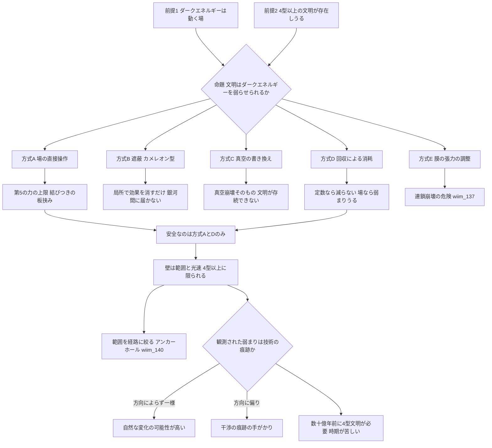

## 1. 概要 (Abstract)

宇宙の膨張は加速している。その原因とされるダークエネルギー（g218）は、宇宙の全エネルギーの約7割を占めながら、正体がわかっていない。長く最有力だったのは、空間そのものが一定のエネルギーを持つという**宇宙定数**の考え方だった。定数であれば、どんな文明にも手の出しようがない。

ところが、大規模な銀河地図の観測計画DESI（暗黒エネルギー分光装置）は2024年と2025年の結果で、ダークエネルギーが一定ではなく、時間とともに弱まってきている可能性を示した。統計的な確かさはまだ発見と呼べる水準に届いていないが、もしこれが本当なら、ダークエネルギーは定数ではなく、宇宙に広がる**動く場**（クインテッセンスと呼ばれる）である可能性が高まる。そして場であれば、他の場と同じように、エネルギーを注いで押したり引いたりする対象になりうる。

本記事は、この前提の連鎖を受け取り、先進文明がダークエネルギーに干渉して弱らせることができるかを問う。さらにその裏返しとして、DESIが捉えた「弱まり」そのものが、どこかの文明による干渉の痕跡——テクノシグネチャー——でありうるかも考える。

> **前提①:** ダークエネルギーは宇宙定数ではなく、時間変化する動く場である。
> **前提②:** 宇宙には、銀河規模以上のエネルギーを扱える先進文明が存在しうる。
> **命題:** 「先進文明はダークエネルギーに干渉して弱らせることができるか。そして観測された弱まりは、文明の干渉の痕跡でありうるか？」

---

## 2. 実現不可能性の根拠 (Infeasibility Rationale)

### 物理的限界

ダークエネルギーの場がふつうの物質と強く結びついていれば、物質を操作することで場を動かせる。しかし結びつきが強ければ、その場は物質の間に新しい力——「第5の力」——として働き、実験室や太陽系の精密測定ですでに見つかっているはずだ。惑星探査機カッシーニによる重力の検証などは、そうした力の強さに非常に厳しい上限を課している。干渉できるほど強く結びついていれば観測で見つかり、見つからないほど弱ければ干渉の手がかりがない——この板挟みが最初の壁になる。

そもそも前提①自体が確定していない。ダークエネルギーが本当に宇宙定数なら、それは空間の性質そのものであり、「弱める」には後述する真空の書き換えしか道がない。

### 技術的限界

ダークエネルギーの密度は、1立方メートルあたり陽子3〜4個分の質量に相当する程度で、局所的には極めて希薄だ。身の回りの空間の値を変えるだけなら、必要なエネルギーは意外に小さいかもしれない。

しかし宇宙の膨張の速さに影響を与えるには、宇宙規模の体積で値を変える必要がある。観測可能な宇宙全体のダークエネルギーの総量は、ざっと10の71乗ジュール程度と見積もられる。天の川銀河のすべての恒星が1秒間に放つエネルギーは10の37乗ジュール程度であり、その約34桁上の量だ。しかも場への干渉は光速を超えて広がらないため、文明が干渉できるのは自分から光が届く範囲に限られる。

### 論理的限界

銀河や銀河団のように重力で束縛された系は、もともとダークエネルギーの影響で膨張していない。したがって、文明が自分の身の回りでダークエネルギーを弱めても、手元の世界には何の変化も起きず、効果を確かめる手段がない。効果が現れるのは銀河と銀河の間の広大な空間だけであり、その変化は数十億年単位でしか観測できない。干渉した文明自身が、干渉の成否を自分の文明の寿命のうちに確認できない可能性がある。

---

## 3. 実験の設定 (Setup)

1. **主体:** カルダシェフスケール（g002）で4型以上、つまり複数の銀河に匹敵するエネルギーを制御できる文明。
2. **環境:** ダークエネルギーが動く場として振る舞う宇宙。文明の周囲には重力で束縛された銀河群があり、その外側では空間が加速膨張している。
3. **操作:** 次の五つの方式で、ダークエネルギーを弱めることを試みる。
   - **方式A 場の直接操作:** 場の値を、エネルギーを注いで押し下げる。
   - **方式B 遮蔽:** 物質の密度によって場の性質が変わる仕組みを使い、局所的に場の効果を消す。
   - **方式C 真空の書き換え:** 宇宙定数そのものを、より低い値の真空へ移す。
   - **方式D 回収による消耗:** 膨張のエネルギーを回収する技術で、場のエネルギーを汲み出す。
   - **方式E 膜の張力の調整:** ブレーンワールドの描像で、膜の張力を調整する。
4. **評価軸:** 実際に弱められるか、効果が及ぶ範囲、文明自身への危険、観測で検証できるか。

---

## 4. 考察と予測 (Speculation)

### なぜ「弱める」ことを考えるのか

加速膨張は、文明を宇宙の中で孤立させていく。遠くの銀河は、今から光を送っても永遠に届かない「事象の地平線」の外へ次々と去っていき、約1000億年後には局所銀河群の外の銀河はすべて見えなくなる。[wiim_116](wiim_116.md)は、人工ブラックホールの質量で銀河群を地平線の内側に縫い留めることを考え、観測可能な宇宙の総物質量に近い質量が必要になるという壁に突き当たった。

質量で膨張に打ち勝つのではなく、膨張の原因そのものを弱める——これが本記事の発想の出発点だ。ダークエネルギーを弱められれば、地平線の後退が遅くなり、到達できる銀河が失われるのを食い止められる。先進文明にとってダークエネルギーの制御は、「宇宙の中で孤立していく未来」を回避する手段になる。

### 前提の連鎖——定数か、場か

前提①がどれほど重要かは、連鎖として書くとはっきりする。

- ダークエネルギーが時間変化する（DESIの示唆）
- → 定数ではなく、動く場である可能性が高まる
- → 場である以上、値を押したり引いたりする方法が原理的に存在する
- → 先進文明は干渉しうる
- → ただし、場が物質とどれだけ強く結びついているか、どれだけの範囲に作用させる必要があるかで、実現性が決まる

逆に、ダークエネルギーが宇宙定数なら、この連鎖は二つ目で途切れる。定数は押しても引いても動かない。

### 五つの方式の検討

**方式A 場の直接操作.** 最も素直な方式だが、第2節の物理的限界——結びつきの板挟み——に直面する。場とふつうの物質の結びつきが第5の力の探索に引っかからないほど弱ければ、物質をどう動かしても場はほとんど応えない。文明が場に直接エネルギーを注ぐ手段を、別途見つける必要がある。

**方式B 遮蔽.** 2004年にクーリーとウェルトマンが提案した「カメレオン場」は、周囲の物質の密度によって性質を変える場だ。密度の高い場所では場が重くなって力の届く距離が縮み、太陽系の精密測定をすり抜ける。この仕組みを使えば、局所的に物質を集めて場の効果を消せるかもしれない。WIIMでは[wiim_123](../physics/wiim_123.md)（カラロン）が同じスカラー・テンソル理論の土俵を扱っている。ただし遮蔽は、効果を**消す**のであって、場そのものを**弱める**わけではない。しかも物質の密度が高い場所——つまり銀河の中——でしか働かず、膨張が問題になる銀河間の空間には届かない。

**方式C 真空の書き換え.** ダークエネルギーが宇宙定数、つまり真空のエネルギーなら、より低いエネルギーの真空へ移ることで弱められる。しかしこれは真空崩壊そのものだ（[wiim_014](../physics/wiim_014.md)・[wiim_125](../physics/wiim_125.md)）。新しい真空の泡は光速近くで広がり、その内側では物理定数ごと書き換わる。弱めた先の宇宙に、文明自身が存続できない。

**方式D 回収による消耗.** [wiim_078](wiim_078.md)のエクスタイドフロートは、宇宙膨張の満ち引きからピエゾアンキロン効果（g317）でエネルギーを回収する構想だった。ここに前提①が効いてくる。ダークエネルギーが宇宙定数なら、いくら汲み出しても密度は減らない。空間が広がれば、同じ密度のエネルギーが湧き続けるからだ。しかし動く場であれば、汲み出したエネルギーの分だけ場は弱まりうる。回収装置が、そのまま弱化装置を兼ねることになる。

**方式E 膜の張力の調整.** ブレーンワールド（g523）の描像では、私たちの宇宙定数は、膜の張力とバルク空間のエネルギーの精密な釣り合いの「わずかな余り」と読める。張力を調整して余りを減らせば、ダークエネルギーを弱められる。しかしこれは[wiim_137](wiim_137.md)で論じた連鎖崩壊の経路1と同じ操作であり、釣り合いを崩せば膜そのものがバルク空間の中で動き出す危険がある。

| 方式 | 弱められるか | 効果の範囲 | 文明への危険 |
|---|---|---|---|
| A 場の直接操作 | 場への注入手段があれば | 光の届く範囲 | 小さい |
| B 遮蔽 | 効果を消すだけで、弱めはしない | 物質の密な局所のみ | 小さい |
| C 真空の書き換え | 弱められる | 泡が広がる範囲すべて | 致命的（真空崩壊） |
| D 回収による消耗 | 動く場なら弱まりうる | 回収装置を配置した範囲 | 小さい |
| E 膜の張力の調整 | 弱められる | 膜全体 | 大きい（膜の移動・連鎖崩壊） |

安全に「弱める」ことが成立しうるのは方式Aと方式Dであり、しかもダークエネルギーが本当に動く場である場合に限られると考えられる。

### 最大の壁は、エネルギーより範囲

第2節で見たとおり、必要なエネルギーの総量は膨大だが、それ以上に厳しいのは**範囲**と**光速**の制約だ。膨張の速さを変えるには銀河間の空間を広く覆う必要があり、干渉はその範囲へ光速以下でしか広がらない。干渉の効果が意味を持つのは、銀河と銀河の間を広範囲に制御する、カルダシェフ4型以上の文明に限られるだろう。WIIMの設定では、ハッブル地平線に挑む4型文明（[wiim_079](wiim_079.md)）と重なる。

この壁を下げる一つの方法は、範囲を宇宙全体ではなく、行きたい経路の上だけに絞ることだ。その発想は、応用記事[wiim_140](wiim_140.md)のダークエネルギーアンカーホール（g526）で扱う。

### 逆転の発想——観測された弱まりは、技術の痕跡か

ここから一つの問いが生まれる。DESIが示唆する「ダークエネルギーの弱まり」そのものが、どこかの先進文明による干渉の痕跡、つまりテクノシグネチャーだという可能性はあるだろうか。

これは原理的に検証できる。

| 自然な変化なら | 文明の干渉なら |
|---|---|
| 宇宙のどの方向でも同じように弱まる | 干渉は起点から光速以下で広がるので、方向や場所によって弱まり方に偏りが出る |
| 変化は宇宙の歴史全体で滑らか | 干渉が始まった時期以降に、特定の領域だけで変化が起きる |

加えて、時期の問題がある。DESIが測っているのは、数十億年前の宇宙におけるダークエネルギーの振る舞いだ。その時代にすでに銀河間の空間を制御する文明が存在していたなら、その文明は宇宙誕生から数十億年のうちに4型に到達していたことになる。地球の生命が誕生から人類に至るまでに約40億年を要したことを考えると、時期としてはかなり苦しい。

現在の観測は、弱まり方に方向による違いを示していない。弱まりが本当に一様なら、一つの文明の干渉としては説明しにくく、自然な変化と考えるほうが筋が通る。逆に将来、方向によって偏った弱まりが見つかれば、それは宇宙論の問題であると同時に、地球外文明探査の問題にもなる。

### 哲学的な問い

もし前提①が正しく、ダークエネルギーが動く場なら、宇宙の遠い未来——永遠に加速し続けるのか、やがて収縮に転じるのか——は、物理法則だけでなく、そこに住む文明の選択にも左右されうることになる。宇宙の運命を決めるのは初期条件と法則だけなのか、それとも宇宙の中で生まれた知性もまた、宇宙論の変数の一つなのか。私たちが観測している「宇宙の歴史」の中に、すでに誰かの意図が紛れ込んでいないと、どうして言い切れるだろうか。

---

## 5. 図解 (Diagrams)

---

## 6. 関連記事 (Related)

- [wiim_140](wiim_140.md) — ダークエネルギーアンカーホール（本記事の応用記事。範囲を経路の管に絞る）
- [wiim_116](wiim_116.md) — ハッブル地平線の縫い留め（質量で膨張に打ち勝つ方式。本記事の動機）
- [wiim_078](wiim_078.md) — エクスタイドフロート（方式Dの回収技術）
- [wiim_079](wiim_079.md) — ギャラクシードライブ（ハッブル地平線に挑む4型文明）
- [wiim_123](../physics/wiim_123.md) — カラロン（方式Bと同じスカラー・テンソル理論の土俵）
- [wiim_014](../physics/wiim_014.md) — 宇宙のルート権限を奪取せよ（方式Cの物理定数書き換え）
- [wiim_125](../physics/wiim_125.md) — 真空崩壊を実験できるか（方式Cの危険）
- [wiim_137](wiim_137.md) — 膜の外への避難（方式Eの連鎖崩壊）
- （未作成）ダークエネルギーが弱まっているなら——加速膨張が止まる宇宙で、地平線に挑む技術はどう変わるか

**関連用語（用語集）**
- ダークエネルギー (g218)
- カルダシェフスケール (g002)
- ピエゾアンキロン効果 (g317)
- ブレーンワールド (g523)
- ダークエネルギーアンカーホール (g526)
- 宇宙の熱的死 (g085)
